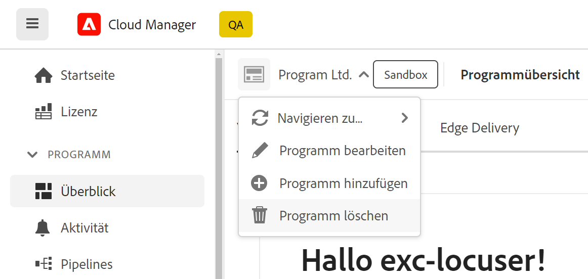

# Löschen eines Sandbox-Programms {#delete-sandbox-program}

Ein Nutzer eines Sandbox-Programms, der die Rolle *Geschäftsinhaber* oder *Implementierungs-Manager* in Cloud Manager hat, kann die über die Cloud Manager-Benutzeroberfläche festgelegte Produktions- und Staging-Umgebung löschen.

>[!NOTE]
>Durch Auswahl der Löschoption für die Produktions- oder Staging-Umgebung wird die jeweils andere Umgebung im Satz auch gelöscht.

Die Option zum Löschen ist auf der Landingpage verfügbar, wie nachfolgend dargestellt:

Alternativ

wählen Sie auf der Seite **Programmübersicht** die Option **Programm löschen** aus, um das Sandbox-Programm zu löschen.

