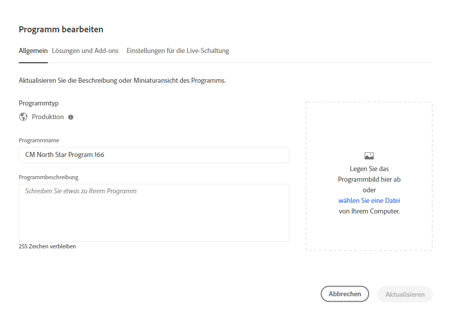
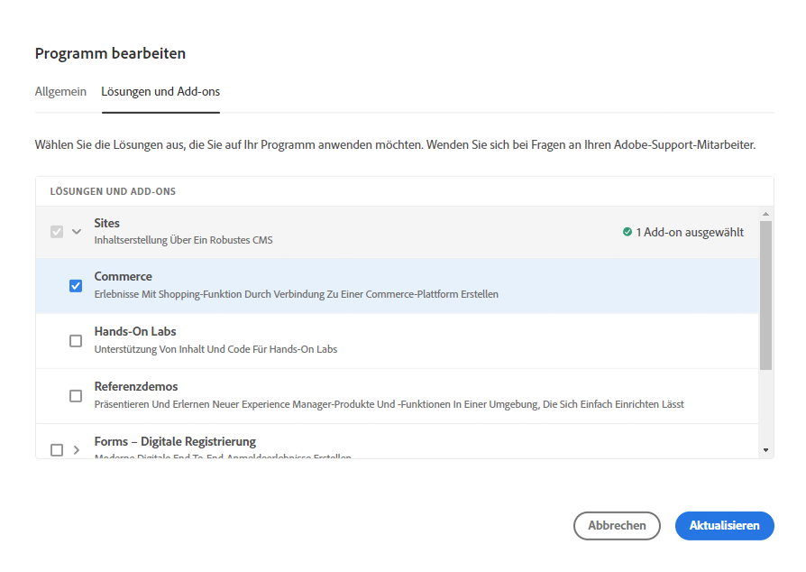

# Bearbeiten von Programmen {#editing-programs}

Benutzer mit den erforderlichen Berechtigungen können [in Ihrer Organisation erstellte Produktionsprogramme](creating-production-programs.md) sowie [Sandbox-Programme, die in Ihrer Organisation erstellt wurden, bearbeiten.](creating-sandbox-programs.md) Durch die Bearbeitung eines Programms haben Sie folgende Möglichkeiten:

* Hinzufügen der Sites-Lösung zu einem vorhandenen Programm mit Assets oder umgekehrt.
* Entfernen von Sites oder Assets aus einem vorhandenen Programm, das sowohl Sites als auch Assets umfasst.
* Hinzufügen einer zweiten, nicht verwendeten Lösungsberechtigung entweder für ein vorhandenes Programm oder als neues Programm.
* Löschen von Sandbox-Programmen.

>[!NOTE]
>
>Sie müssen Mitglied der Rolle **Geschäftsinhaber** sein, um Programme bearbeiten oder Sandbox-Programme löschen zu können.

Führen Sie diese Schritte aus, um ein Programm zu bearbeiten.

1. Melden Sie sich unter [my.cloudmanager.adobe.com](https://my.cloudmanager.adobe.com/) bei Cloud Manager an und wählen Sie die entsprechende Organisation aus.

1. Klicken Sie auf das Programm, das Sie bearbeiten möchten, um dessen Details anzuzeigen.

1. Klicken Sie oben links auf der Seite auf den Namen Ihres Programms und anschließend auf **Programm bearbeiten**.

   

1. Auf der Seite **Programm bearbeiten** werden zwei Registerkarten, **Allgemein** und **Lösungen und Add-ons**, angezeigt. Wählen Sie die Registerkarte **Allgemein** aus, um den Programmnamen und die Beschreibung zu bearbeiten.

   * Für ein Programm muss mindestens eine Lösung ausgewählt sein.

   

1. Wählen Sie die Registerkarte **Lösungen und Add-ons** aus, um die Lösungen für das Programm zu ändern.

   

1. Klicken Sie auf den Pfeil vor dem Lösungsnamen, um optionale Add-ons anzuzeigen, z. B. die Add-on-Option **Commerce** unter **Sites**.

   

1. Klicken Sie auf **Aktualisieren**, um Ihre Änderungen am Programm zu speichern.

Sobald Ihre Aktualisierungen vorgenommen wurden und die ausgewählten Lösungen geändert wurden, werden diese Änderungen nach der nächsten Implementierung wirksam.

## Löschen von Sandbox-Programmen {#delete-sandbox-program}

Durch das Löschen eines Sandbox-Programms werden alle damit verbundenen Umgebungen und Pipelines entfernt.

>[!TIP]
>
>Benutzer mit den Rollen **Geschäftsinhaber** oder **Implementierungs-Manager** können alternativ ihre Produktions- und Staging-Umgebungen anstelle des gesamten Sandbox-Programms löschen.

Führen Sie die folgenden Schritte aus, um ein Sandbox-Programm zu löschen.

1. Melden Sie sich unter [my.cloudmanager.adobe.com](https://my.cloudmanager.adobe.com/) bei Cloud Manager an und wählen Sie die entsprechende Organisation aus.

1. Klicken Sie auf das Programm, das Sie bearbeiten möchten, um dessen Details anzuzeigen.

1. Klicken Sie oben links auf der Seite auf den Namen Ihres Programms und anschließend auf **Programm löschen**.

   

Alternativ können Sie auf der Übersichtsseite von Cloud Manager auf der Karte Ihres Programms auf den Butten mit Auslassungspunkten klicken und anschließend auf **Programm löschen**.

>[!NOTE]
>
>Es können nur Sandbox-Programme gelöscht werden. Produktionsprogramme können nicht gelöscht werden.
