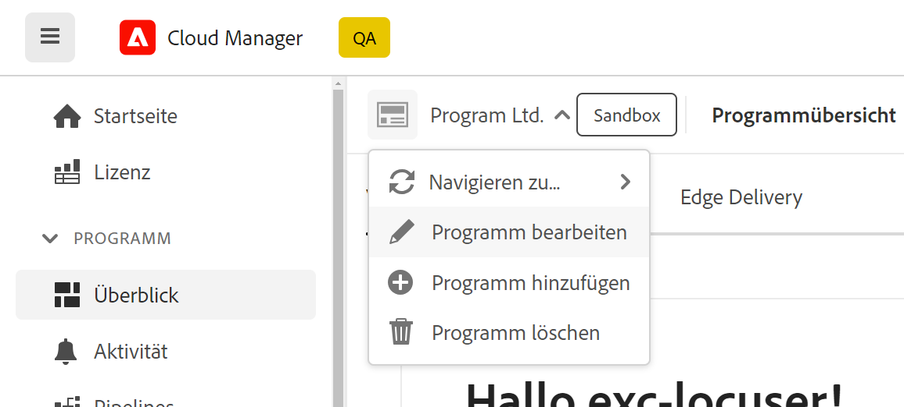

# Bearbeiten von Programmen {#editing-programs}

Benutzer mit den erforderlichen Berechtigungen können [in Ihrer Organisation erstellte Produktionsprogramme](creating-production-programs.md) und [Sandbox-Programme, die in Ihrer Organisation erstellt wurden.](creating-sandbox-programs.md) Durch die Bearbeitung eines Programms haben Sie folgende Möglichkeiten:

* Fügen Sie Sites-Lösungen zu einem vorhandenen Programm mit Assets hinzu und umgekehrt.
* Entfernen von Sites oder Assets aus einem vorhandenen Programm, das sowohl Sites als auch Assets umfasst.
* Fügen Sie einem vorhandenen Programm oder einem neuen Programm eine zweite nicht verwendete Lösungsberechtigung hinzu.
* Löschen von Sandbox-Programmen.

## Berechtigungen {#permissions}

Sie müssen Mitglied der Rolle **Geschäftsinhaber** sein, um Programme bearbeiten oder Sandbox-Programme löschen zu können.

## Bearbeiten von Programmen {#editing}

1. Melden Sie sich unter [my.cloudmanager.adobe.com](https://my.cloudmanager.adobe.com/) bei Cloud Manager an und wählen Sie die entsprechende Organisation aus.

1. Klicken Sie auf das Programm, das Sie bearbeiten möchten, um dessen Details anzuzeigen.

1. Klicken Sie oben links auf der Seite auf den Namen Ihres Programms und wählen Sie **Programm bearbeiten**.

   

1. Die Seite **Programm bearbeiten** wird geöffnet. Wählen Sie die Registerkarte **Allgemein** aus, um den Programmnamen und die Beschreibung zu bearbeiten.

   * Für ein Programm muss mindestens eine Lösung ausgewählt sein.

   

1. Wählen Sie die Registerkarte **Lösungen und Add-ons** aus, um die Lösungen für das Programm zu ändern.

   

1. Klicken Sie auf den Pfeil vor dem Lösungsnamen, um optionale Add-ons anzuzeigen, z. B. die **Handel** Add-On-Option unter **Sites**.

   

1. Auf der Registerkarte **Einstellungen für die Live-Schaltung** können Sie den geplanten Tag der Veröffentlichung für das Programm ändern.

   

   * Dieses Datum ist nur zur informativen Verwendung bestimmt. Dadurch wird das Widget Go Live auf der Programmübersichtsseite Trigger. Im Gegenzug bietet es produktinterne Links zur as a Cloud Service Best-Practice-Dokumentation von Adobe Experience Manager (AEM), um sie an Ihre Journey anzupassen, was zu einem erfolgreichen Go Live-Erlebnis führt.
   * Diese Registerkarte ist nicht für Sandbox-Programme verfügbar.

1. Wenn die erforderlichen Berechtigungen für das Programm verfügbar sind, wird die **Sicherheit** zeigt an, wo Sie die Sicherheitsoptionen für das Programm ändern können.

   

   * HIPAA kann nach [Programmerstellung.](/help/implementing/cloud-manager/getting-access-to-aem-in-cloud/creating-production-programs.md)
      * Hier finden Sie [weitere Informationen](https://www.adobe.com/go/hipaa-ready) zur Implementierung der HIPAA-fähigen Lösung von Adobe.
   * Nach der Aktivierung kann der WAF-DDOS-Schutz konfiguriert werden, indem eine [produktionsfremde Pipeline.](/help/implementing/cloud-manager/configuring-pipelines/configuring-non-production-pipelines.md)

   {{waf-limited-release}}

1. Klicks **Aktualisieren** , um Ihre Änderungen am Programm zu speichern.

Jedes Mal, wenn ein Programm bearbeitet wird, einschließlich Hinzufügen oder Entfernen einer Lösung oder eines Add-ons, werden diese Änderungen nach der nächsten Bereitstellung wirksam.

## Löschen von Sandbox-Programmen {#delete-sandbox-program}

Durch das Löschen eines Sandbox-Programms werden alle damit verbundenen Umgebungen und Pipelines entfernt.

>[!TIP]
>
>Benutzer mit den Rollen **Geschäftsinhaber** oder **Bereitstellungs-Manager** können alternativ ihre Produktions- und Staging-Umgebungen anstelle des gesamten Sandbox-Programms löschen.

Gehen Sie wie folgt vor, um ein Sandbox-Programm zu löschen.

1. Melden Sie sich unter [my.cloudmanager.adobe.com](https://my.cloudmanager.adobe.com/) bei Cloud Manager an und wählen Sie die entsprechende Organisation aus.

1. Klicken Sie auf das Programm, das Sie bearbeiten möchten, um dessen Details anzuzeigen.

1. Klicken Sie links oben auf der Seite auf den Namen Ihres Programms und wählen Sie **Programm löschen**.

   

Alternativ können Sie auf der Übersichtsseite von Cloud Manager auf der Karte Ihres Programms auf den Butten mit Auslassungspunkten klicken und anschließend auf **Programm löschen**.

>[!NOTE]
>
>Es können nur Sandbox-Programme gelöscht werden. Produktionsprogramme können nicht gelöscht werden.
