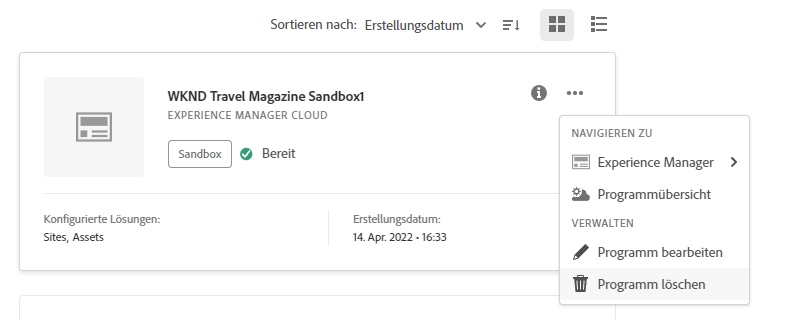

# Verwalten und Bearbeiten von Programmen {#editing-programs}

Die Seite **Meine Programme** bietet einen Überblick über alle Programme, auf die Sie Zugriff haben. Wenn Sie ein einzelnes Programm auswählen, finden Sie auf der Seite **Programmübersicht** Details zu dem Programm auf einen Blick.

Von der **Programmübersicht** aus können Benutzende mit den erforderlichen Berechtigungen [Produktionsprogramme, die in Ihrer Organisation erstellt wurden](creating-production-programs.md) und [Sandbox-Programme, die in Ihrer Organisation erstellt wurden, bearbeiten.](creating-sandbox-programs.md) Durch die Bearbeitung eines Programms haben Sie folgende Möglichkeiten:

* Hinzufügen der Sites-Lösung zu einem vorhandenen Programm mit Assets oder umgekehrt.
* Entfernen von Sites oder Assets aus einem vorhandenen Programm, das sowohl Sites als auch Assets umfasst.
* Hinzufügen einer zweiten, nicht verwendeten Lösungsberechtigung entweder für ein vorhandenes Programm oder als neues Programm.
* Löschen von Sandbox-Programmen.

## Berechtigungen {#permissions}

Sie müssen Mitglied der Rolle **Geschäftsinhaber** sein, um Programme zu bearbeiten oder Sandbox-Programme zu löschen und um auf das Lizenz-Dashboard zuzugreifen.

## Meine Programme {#my-programs}

1. Melden Sie sich unter [my.cloudmanager.adobe.com](https://my.cloudmanager.adobe.com/) bei Cloud Manager an und wählen Sie die entsprechende Organisation aus.

1. Die Seite **Meine Programme** zeigt eine Liste aller Programme, auf die Sie als Kacheln Zugriff haben.

### Aktionsaufruf {#cta}

Oben auf der Seite befindet sich ein Aktionsaufruf, der für den Status Ihres Unternehmens relevant ist. Wenn Sie Ihre Programme erfolgreich eingerichtet haben, können beispielsweise Statistiken über Ihre Aktivitäten in den letzten 90 Tagen angezeigt werden, darunter:

* Anzahl der [Bereitstellungen](/help/implementing/cloud-manager/deploy-code.md)
* Anzahl der identifizierten [Code-Qualitätsprobleme](/help/implementing/cloud-manager/code-quality-testing.md)
* Anzahl der Builds

Oder wenn Sie gerade mit der Einrichtung Ihrer Organisation beginnen, gibt es Tipps zu den nächsten Schritten oder Dokumentationsressourcen.

### Registerkarte „Programme“ {#programs-tab}

Auf der Registerkarte **Programme** finden Sie Karten für jedes Programm, auf das Sie Zugriff haben. Tippen oder klicken Sie auf eine Karte, um die Seite **Programmübersicht** des Programms aufzurufen, auf der Sie Details zum Programm finden.

Verwenden Sie die Sortieroptionen, um das benötigte Programm leichter zu finden.

* Sortieren nach
   * Erstellungsdatum (Standard)
   * Programmname
   * Status
* Aufsteigend (Standard)/Absteigend
* Rasteransicht (Standard)
* Listenansicht

### Registerkarte „Lizenz“ {#license-tab}

Die Registerkarte **Lizenz** bietet Ihnen schnellen Zugriff auf das [Lizenz-Dashboard.](/help/implementing/cloud-manager/license-dashboard.md)

## Programmübersicht {#program-overview}

Sobald Sie ein Programm auf der Seite **[Meine Programme](#my-programs)** ausgewählt haben, öffnet Cloud Manager die Seite **Programmübersicht** für das ausgewählte Programm.

Tippen oder klicken Sie auf den Programmnamen in der linken oberen Ecke der Seite, um schnell zu einem anderen Programm oder zurück auf die Seite **[Meine Programme](#my-programs)** zu wechseln. Sie können auch [das ausgewählte Programm bearbeiten](#editing) oder [ein Programm hinzufügen](/help/implementing/cloud-manager/getting-access-to-aem-in-cloud/creating-production-programs.md).

Der Aktionsaufruf am oberen Rand gibt Ihnen je nach Status Ihres Programms hilfreiche Informationen. Für ein neues Programm werden Ihnen möglicherweise die nächsten Schritte angeboten sowie eine Erinnerung an das Startdatum, [das bei der Programmerstellung festgelegt wurde.](/help/implementing/cloud-manager/getting-access-to-aem-in-cloud/editing-programs.md)

Bei einem Live-Programm den Status Ihrer letzten Bereitstellung mit Links zu Details und zum Beginn einer neuen Bereitstellung.

Die Karten **Umgebungen** und **Pipelines** geben einen schnellen Überblick über beide innerhalb des ausgewählten Programms.

Die Karte **Leistung** gibt einen Überblick über das **[CDN-Dashboard.](/help/implementing/cloud-manager/cdn-performance.md)**

## Bearbeiten von Programmen {#editing}

1. Melden Sie sich unter [my.cloudmanager.adobe.com](https://my.cloudmanager.adobe.com/) bei Cloud Manager an und wählen Sie die entsprechende Organisation aus.

1. Klicken Sie auf der Seite **[Meine Programme](#my-programs)** auf das Programm, das Sie bearbeiten möchten, um seine Details anzuzeigen.

1. Klicken Sie oben links auf der Seite auf den Namen Ihres Programms und anschließend auf **Programm bearbeiten**.

   

1. Die Seite **Programm bearbeiten** öffnet sich auf der Registerkarte **Allgemein**.

   

1. Die zur Bearbeitung des Programms verfügbaren Optionen sind mit denen beim Erstellen des Programms identisch.
   * Einzelheiten zu den einzelnen Optionen finden Sie in den Dokumenten [Erstellen von Produktionsprogrammen](/help/implementing/cloud-manager/getting-access-to-aem-in-cloud/creating-production-programs.md) und [Erstellen von Sandbox-Programmen](/help/implementing/cloud-manager/getting-access-to-aem-in-cloud/creating-sandbox-programs.md).
   * Abhängig von den Ansprüchen Ihrer Organisation können [weitere Optionen](/help/implementing/cloud-manager/getting-access-to-aem-in-cloud/creating-production-programs.md#options) für Ihr Produktionsprogramm verfügbar sein.

1. Klicken Sie auf **Aktualisieren**, um Ihre Änderungen am Programm zu speichern.

Die Änderungen am Programm werden gespeichert.

>[!NOTE]
>
>Jedes Mal, wenn ein Programm bearbeitet wird, einschließlich des Hinzufügens oder Entfernens einer Lösung oder eines Add-ons, werden diese Änderungen erst nach der nächsten Bereitstellung wirksam.

## Löschen von Sandbox-Programmen {#delete-sandbox-program}

Durch das Löschen eines Sandbox-Programms werden alle damit verbundenen Umgebungen und Pipelines entfernt.

>[!TIP]
>
>Benutzende mit den Rollen **Geschäftsinhaber** oder **Bereitstellungs-Manager** können alternativ ihre Produktions- und Staging-Umgebungen anstelle des gesamten Sandbox-Programms löschen.

Gehen Sie wie folgt vor, um ein Sandbox-Programm zu löschen:

1. Melden Sie sich unter [my.cloudmanager.adobe.com](https://my.cloudmanager.adobe.com/) bei Cloud Manager an und wählen Sie die entsprechende Organisation aus.

1. Klicken Sie auf der Seite **[Meine Programme](#my-programs)** auf das Programm, das Sie bearbeiten möchten, um seine Details anzuzeigen.

1. Klicken Sie oben links auf der Seite auf den Namen Ihres Programms und wählen Sie anschließend **Programm löschen** aus.

   

Alternativ können Sie auf der Übersichtsseite von Cloud Manager auf der Karte Ihres Programms auf den Butten mit Auslassungspunkten klicken und anschließend auf **Programm löschen**.

>[!NOTE]
>
>Es können nur Sandbox-Programme gelöscht werden. Produktionsprogramme können nicht gelöscht werden.
