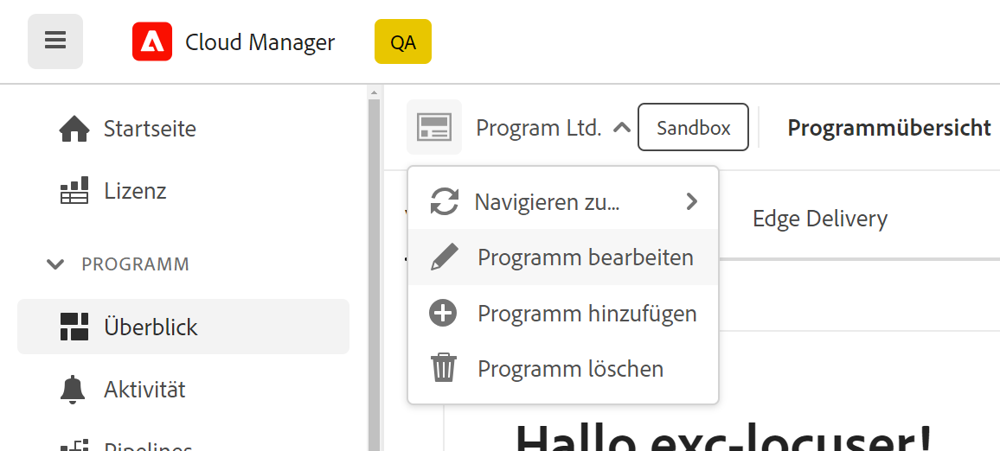
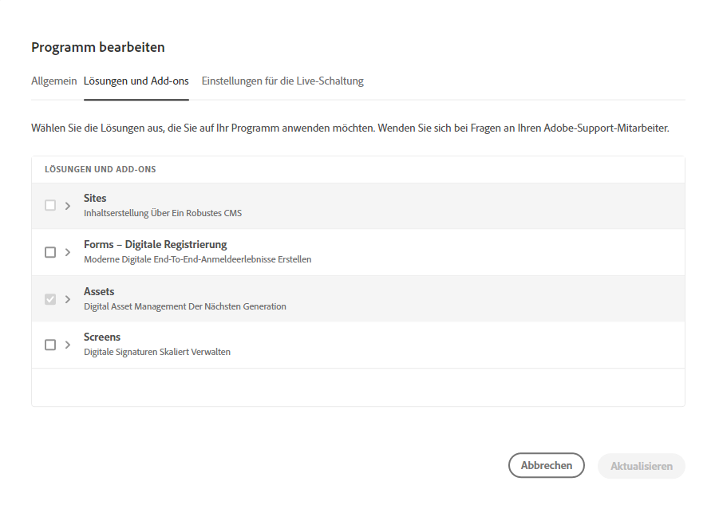

# Bearbeiten eines Sandbox-Programms {#create-sandbox-program}

Benutzer mit entsprechender Berechtigung können jetzt ein Produktionsprogramm bearbeiten, sodass sie Folgendes selbsttätig ausführen können:

* Hinzufügen einer Sites-Lösung zu einem bestehenden Programm mit Assets (oder umgekehrt)
* Entfernen von Sites (oder Assets) aus einem vorhandenen Programm mit sowohl Sites als auch Assets.
* Hinzufügen einer zweiten, nicht verwendeten Lösungsberechtigung entweder für ein vorhandenes Programm oder als neues Programm.

   >[!NOTE]
   >Ein Benutzer in der Rolle „Geschäftsinhaber“ muss angemeldet sein, um das Programm erfolgreich bearbeiten zu können.

Gehen Sie wie folgt vor, um ein Sandbox-Programm zu bearbeiten:

1. Klicken Sie auf die Option **Programm bearbeiten**, von der *Übersichtsseite* des Cloud Managers aus.

   

1. Auf der Seite **Programm bearbeiten** werden zwei Registerkarten, **Allgemein** und **Lösungen und Add-ons** angezeigt.

   Gehen Sie zur Registerkarte **Allgemein**, um die Programmbeschreibung zu bearbeiten.

   

   Auf der Registerkarte **Lösungen und Add-ons** werden zwei Optionen angezeigt, **Sites** und **Assets**, für Produktions- und Sandbox-Programme. Sie können auch die Add-On-Option **Commerce** auswählen, die unter **Sites** verfügbar ist, wie in der folgenden Abbildung dargestellt.

   

   >[!NOTE]
   >Für ein Programm muss mindestens eine Lösung ausgewählt sein, d. h. der Benutzer darf während des Workflows „Programm bearbeiten“ nicht alle Lösungen abwählen.

1. Klicken Sie auf **Update** , um den Workflow des Bearbeitungsprogramms abzuschließen.

## Überlegungen beim Bearbeiten eines Programms {#considerations-editing}

Beim Bearbeiten eines Programms müssen einige Überlegungen angestellt werden:

* Für ein Programm muss mindestens eine Lösung ausgewählt sein, d. h. der Benutzer darf während des Workflows „Programm bearbeiten“ nicht alle Lösungen abwählen.

* Wenn Sie auf die Schaltfläche **Speichern** klicken und die ausgewählten Lösungen geändert wurden, werden Lösungsaktualisierungen an Umgebungen nach der nächsten Bereitstellung wirksam.
