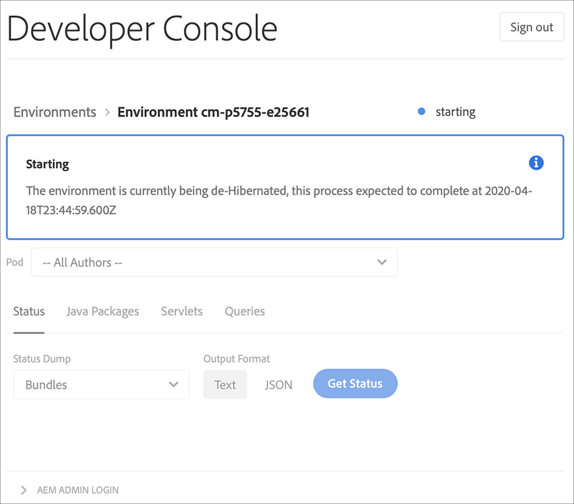

# Aktivieren und Deaktivieren des Ruhezustands von Sandbox-Umgebungen {#hibernating-introduction}

Umgebungen innerhalb eines Sandbox-Programms werden in den Ruhezustand versetzt, wenn acht Stunden lang keine Aktivität festgestellt wird. Den Ruhezustand gibt es nur bei Sandbox-Programmumgebungen. Produktionsprogrammumgebungen können nicht in den Ruhezustand versetzt werden.

## Ruhezustand {#hibernation-introduction}

Der Ruhezustand kann entweder automatisch oder manuell aktiviert werden.

* **Automatisch**: Sandbox-Programmumgebungen werden nach acht Stunden Inaktivität automatisch in den Ruhezustand versetzt. Inaktivität ist definiert als das Fehlen von Anfragen an Autoren-, Vorschau- und Services.
* **Manuell**: Als Benutzende können Sie eine Sandbox-Programmumgebung manuell in den Ruhezustand versetzen. Dies ist nicht unbedingt erforderlich, da der Ruhezustand wie zuvor beschrieben automatisch eintritt.

Es kann einige Minuten dauern, bis Sandbox-Programmumgebungen in den Ruhezustand wechseln. Daten werden im Ruhezustand beibehalten.

### Manuelles Versetzen einer Sandbox-Programmumgebung in den Ruhezustand {#using-manual-hibernation}

Über die Developer Console können Sie Ihr Sandbox-Programm manuell in den Ruhezustand versetzen. Der Zugriff auf die Developer Console für ein Sandbox-Programm steht allen Cloud Manager-Benutzenden zur Verfügung.

**So versetzen Sie eine Sandbox-Programmumgebung manuell in den Ruhezustand:**

1. Melden Sie sich unter [my.cloudmanager.adobe.com](https://my.cloudmanager.adobe.com/) bei Cloud Manager an und wählen Sie die entsprechende Organisation aus.

1. Klicken Sie in der Konsole **[Meine Programme](/help/implementing/cloud-manager/navigation.md#my-programs)** auf ein *Sandbox-Programm*, das in den Ruhezustand versetzt werden soll, um dessen Details anzuzeigen.

1. Klicken Sie auf der Karte **Umgebungen** auf  und dann auf **Entwicklerkonsole**.

   * Siehe [Aufrufen der Developer Console](/help/implementing/cloud-manager/manage-environments.md#accessing-developer-console), um weitere Informationen zur Developer Console zu erhalten.

   

1. Klicken Sie auf der Seite **Entwicklerkonsole** auf **Ruhezustand**.

<!-- UPDATE THESE SCREENSHOTS WHEN NEW AEM DEVELOPER CONSOLE UI IS RELEASED. AS OF OCTOBER 14, 2024, NEW UI IS STILL IN PRIVATE BETA -->

1. Klicken Sie auf **Ruhezustand**, um den Schritt zu bestätigen.

   

Nach erfolgreicher Aktivierung des Ruhezustands wird im Bildschirm **Developer Console** eine Benachrichtigung zur Fertigstellung des Ruhezustands für Ihre Umgebung angezeigt.

Klicken Sie in der Entwicklerkonsole auf den Link **Umgebungen** in den Breadcrumbs oberhalb der Dropdown-Liste **Pod**, um die Umgebungen anzuzeigen, die in den Ruhezustand versetzt werden können.

## Manuelles Aufheben des Ruhezustands eines Sandbox-Programms mithilfe der Developer Console {#de-hibernation-introduction}

Über die Developer Console können Sie Ihr Sandbox-Programm manuell in den Ruhezustand versetzen.

>[!IMPORTANT]
>
>Benutzende mit der Rolle **Entwickler** können den Ruhezustand einer Sandbox-Programmumgebung aufheben.

**So heben Sie den Ruhezustand eines Sandbox-Programms manuell mithilfe der Developer Console auf:**

1. Melden Sie sich unter [my.cloudmanager.adobe.com](https://my.cloudmanager.adobe.com/) bei Cloud Manager an und wählen Sie die entsprechende Organisation aus.

1. Klicken Sie in der Konsole **[Meine Programme](/help/implementing/cloud-manager/navigation.md#my-programs)** auf das Programm, für das der Ruhezustand aufgehoben werden soll, um dessen Details anzuzeigen.

1. Klicken Sie auf der Karte **Umgebungen** auf  und dann auf **Entwicklerkonsole**.

   * Siehe [Aufrufen der Entwicklerkonsole](/help/implementing/cloud-manager/manage-environments.md#accessing-developer-console), um weitere Informationen zur Entwicklerkonsole zu erhalten.

1. Klicken Sie auf **Aus Ruhezustand holen**.

   

1. Klicken Sie auf **Ruhezustand aufheben**, um den Schritt zu bestätigen.

   

1. Sie erhalten eine Benachrichtigung, dass die Aufhebung des Ruhezustands begonnen hat und werden über den Fortschritt informiert.

   

1. Nach Abschluss des Vorgangs ist die Sandbox-Programmumgebung wieder aktiv.

   

Klicken Sie in der Developer Console auf den Link **Umgebungen** in den Breadcrumbs oberhalb der Dropdown-Liste **Pod**, um auf die Umgebungen zuzugreifen, für die der Ruhezustand aufgehoben werden kann.

### Berechtigungen zum Aufheben des Ruhezustands {#permissions-de-hibernate}

Jede Person mit einem Produktprofil, das Zugriff auf AEM as a Cloud Service gewährt, sollte auf die **Entwicklerkonsole** zugreifen und somit die Umgebung reaktivieren können.

## Zugreifen auf eine im Ruhezustand befindliche Umgebung {#accessing-hibernated-environment}

Wenn eine Person eine Browser-Anfrage an den Autoren-, Vorschau- oder Veröffentlichungs-Service einer im Ruhezustand befindlichen Umgebung sendet, wird ihr eine Landingpage angezeigt. Auf dieser Seite wird der Ruhezustand der Umgebung erläutert und ein Link zur Developer Console bereitgestellt, um den Ruhezustand aufzuheben.

## Bereitstellungen und AEM-Updates {#deployments-updates}

In im Ruhezustand befindlichen Umgebungen können weiterhin Bereitstellungen und manuelle AEM-Upgrades vorgenommen werden.

* Benutzende können eine Pipeline verwenden, um benutzerdefinierten Code für im Ruhezustand befindliche Umgebungen bereitzustellen. Die Umgebung verbleibt im Ruhezustand; der neue Code wird in der Umgebung angezeigt, sobald der Ruhezustand aufgehoben wurde.

* AEM-Upgrades können auf im Ruhezustand befindliche Umgebungen angewendet werden. Sie können in Cloud Manager von Kundinnen und Kunden manuell ausgelöst werden. Die Umgebung verbleibt im Ruhezustand; die neue Version wird in der Umgebung angezeigt, sobald der Ruhezustand aufgehoben wurde.

## Ruhezustand und Löschung {#hibernation-deletion}

* Umgebungen in einem Sandbox-Programm werden nach acht Stunden Inaktivität automatisch in den Ruhezustand versetzt.
   * Inaktivität ist definiert als das Fehlen von Anfragen an Autoren-, Vorschau- und Services.
   * Sobald sie sich im Ruhezustand befinden, kann der [Ruhezustand manuell aufgehoben werden](#de-hibernation-introduction).
* Sandbox-Programme werden nach sechs Monaten, nachdem sie sich im kontinuierlichen Ruhezustand befinden, gelöscht. Danach können sie neu erstellt werden.

>[!NOTE]
>
>Nur Sandbox-Umgebungen werden nach sechsmonatigem kontinuierlichen Ruhezustand automatisch gelöscht. Das Sandbox-Programm mit seinem Repository und Code bleibt erhalten.
