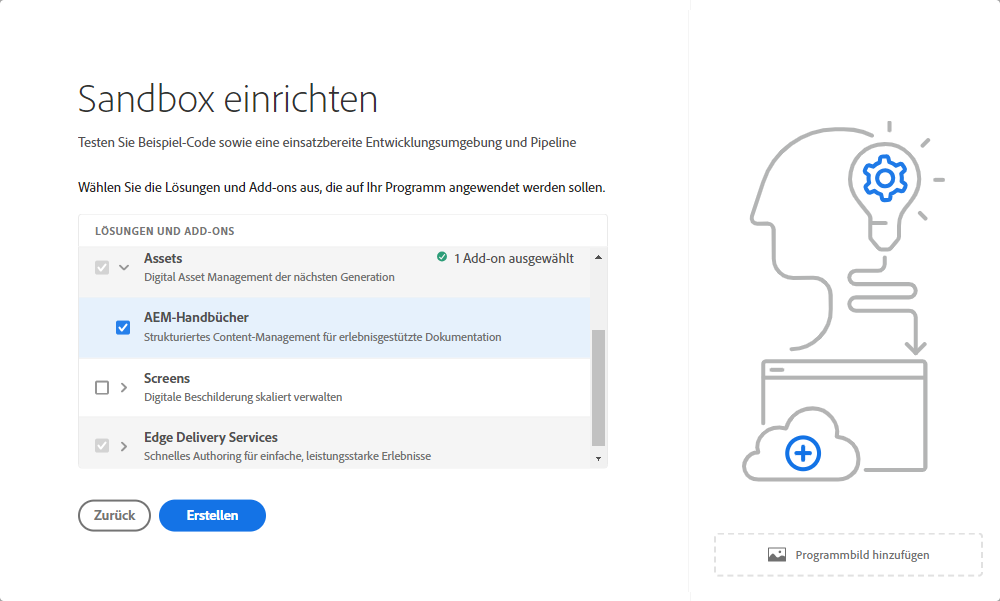

# Einführung in Sandbox-Programme {#sandbox-programs}

Erfahren Sie, was Sandbox-Programme sind und inwiefern sie sich von Produktionsprogrammen unterscheiden.

## Einführung {#introduction}

Ein Sandbox-Programm wird normalerweise für Schulungen, Ausführungen von Demos, Aktivierungen oder Proof of Concepts (POCs) erstellt und ist daher nicht für Live-Traffic vorgesehen.

Ein Sandbox-Programm ist einer von zwei Programmtypen, die in AEM as a Cloud Service verfügbar sind. Der andere ist das [Produktionsprogramm](introduction-production-programs.md). Weitere Informationen zu Programmtypen finden Sie unter [Grundlegendes zu Programmen und Programmtypen](/help/implementing/cloud-manager/getting-access-to-aem-in-cloud/program-types.md).

## Automatische Erstellung {#auto-creation}

Sandbox-Programme ermöglichen eine automatische Erstellung. Bei der [Erstellung eines Sandbox-Programms](/help/implementing/cloud-manager/getting-access-to-aem-in-cloud/creating-sandbox-programs.md) führt Cloud Manager Folgendes automatisch aus:

* Fügt AEM Sites, Assets und Edge Delivery Services als Standardlösungen zu Ihrem Programm hinzu.

  

* Initialisiert ein Projekt-Git-Repository mit einem Beispielprojekt, das auf dem [AEM-Projektarchetyp&rbrace; &#x200B;](https://experienceleague.adobe.com/de/docs/experience-manager-core-components/using/developing/archetype/overview).
* Eine Entwicklungsumgebung wird erstellt.
* Eine Nicht-Produktions-Pipeline, die in der Entwicklungsumgebung bereitgestellt wird, wird erstellt.

Ein Sandbox-Programm ist auf eine Entwicklungsumgebung beschränkt.

## Nutzungsbeschränkungen und -bedingungen {#usage-notes-conditions}

Da Sandbox-Programme nicht für Live-Traffic vorgesehen sind, haben sie bestimmte Einschränkungen und Bedingungen für ihre Verwendung, was sie von Produktionsprogrammen unterscheidet.

| Einschränkung/Bedingung | Beschreibung |
| --- | --- |
| Kein Live-Traffic | Sandbox-Programme sind nicht dafür vorgesehen, Live-Traffic zu verarbeiten, und unterliegen daher nicht den [AEM as a Cloud Service-Verpflichtungen](https://www.adobe.com/legal/service-commitments.html). |
| Keine automatische Skalierung | Die in einer Sandbox erstellten Umgebungen sind nicht für automatische Skalierung konfiguriert. Daher sind diese Umgebungen nicht für Leistungs- oder Belastungstests geeignet. |
| Keine benutzerdefinierten Domains oder IP-Zulassungslisten | [Benutzerdefinierte Domains](/help/implementing/cloud-manager/custom-domain-names/introduction.md) und [IP-Zulassungslisten](/help/implementing/cloud-manager/ip-allow-lists/introduction.md) sind in Sandbox-Programmen nicht verfügbar. |
| Keine zusätzlichen Veröffentlichungsregionen | [Zusätzliche Veröffentlichungsregionen](/help/operations/additional-publish-regions.md) sind in Sandbox-Programmen nicht verfügbar. |
| Kein SLA von 99,99 % | Das [SLA von 99,99 %](/help/implementing/cloud-manager/getting-access-to-aem-in-cloud/creating-production-programs.md#sla) gilt nicht für Sandbox-Programme. |
| Keine erweiterten Netzwerkfunktionen | [Erweiterte Netzwerkfunktionen](/help/security/configuring-advanced-networking.md) (z. B. Self-Service-Bereitstellung von VPN, nicht standardmäßigen Ports und dedizierten Ausgangs-IP-Adressen) sind in Sandbox-Programmen nicht verfügbar. |
| Keine automatischen AEM-Updates | AEM-Updates werden nicht automatisch an Sandbox-Programme gesendet, können aber manuell auf die Umgebungen in Ihrem Sandbox-Programm angewendet werden. ・ Ein manuelles Update kann nur ausgeführt werden, wenn die Zielumgebung über eine ordnungsgemäß konfigurierte Pipeline verfügt. ・ Ein manuelles Update einer Produktions- oder Staging-Umgebung aktualisiert automatisch die andere. Der Satz aus Produktions- und Staging-Umgebung muss sich in derselben AEM-Version befinden. Weitere Informationen finden Sie unter [AEM-Versionsaktualisierungen](/help/implementing/deploying/aem-version-updates.md). Informationen zum Aktualisieren einer Umgebung finden Sie unter [Aktualisieren von Umgebungen](/help/implementing/cloud-manager/manage-environments.md#updating-dev-environment). |
| Kein technischer Support | Da Sandbox-Programme normalerweise für Schulungen, Demos, Aktivierungen oder Machbarkeitsnachweise (Proof of Concepts, POCs) erstellt werden, steht kein technischer Support für Probleme mit Sandbox-Programmen zur Verfügung. Wenn beim Erstellen und Verwalten von Sandbox-Programmen Probleme auftreten, ist dies durch den technischen Support abgedeckt. |
| Ruhezustand und Löschung | Umgebungen in einem Sandbox-Programm werden nach acht Stunden Inaktivität automatisch in den Ruhezustand versetzt. Sandbox-Umgebungen werden nach sechsmonatigem kontinuierlichem Ruhezustand gelöscht. Weitere Informationen zum Deaktivieren des Ruhezustands von Umgebungen und zum automatischen Löschen von Sandboxes finden Sie unter [Aktivieren und Deaktivieren des Ruhezustands von Sandbox-Umgebungen](/help/implementing/cloud-manager/getting-access-to-aem-in-cloud/hibernating-environments.md). |
