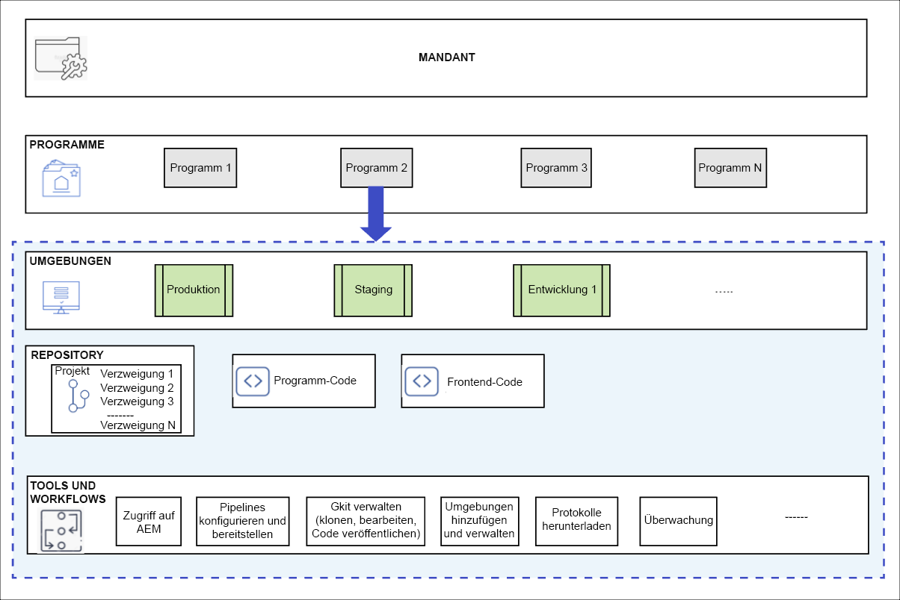

# Programme und Programmtypen {#understanding-programs}

Cloud Manager basiert auf einer Hierarchie von Entitäten. Die Details dazu sind für Ihre alltägliche Arbeit in Cloud Manager nicht entscheidend. Ein Überblick darüber hilft Ihnen jedoch, Programme zu verstehen und Ihre eigenen einzurichten.



* **MANDANTEN** - Dies ist der Anfang der Hierarchie. Jeder Kunde hat einen Mandanten.
* **PROGRAMME** - Jeder Mandant verfügt über ein oder mehrere Programme, [die häufig die lizenzierten Lösungen des Kunden widerspiegeln.](introduction-production-programs.md)
* **UMGEBUNGEN** - Jedes Programm verfügt über mehrere Umgebungen, wie z. B. die Produktion für Live-Inhalte, eine für Staging- und eine für Entwicklungszwecke.
   * Jedes Programm kann nur eine Produktionsumgebung, aber mehrere Nicht-Produktionsumgebungen haben.
* **REPOSITORY** - Programme verfügen über Git-Repositorys, in denen Anwendung und Frontend-Code für die Umgebungen gepflegt werden.
* **TOOLS UND WORKFLOWS** - Pipelines verwalten die Bereitstellung von Code aus den Repositorys in die Umgebungen, während andere Tools den Zugriff auf Protokolle, Überwachung und Umgebungsverwaltung ermöglichen.

Ein Beispiel ist oft hilfreich, um diese Hierarchie zu kontextualisieren.

* WKND Travel and Adventure Enterprises könnte ein **Mandant** , das sich auf die Medien zum Thema Reisen konzentriert.
* Der Mieter von WKND Travel and Adventure Enterprises könnte über zwei **Programme**: ein Sites-Programm für WKND Magazine und ein Assets-Programm für WKND Media.
* Die WKND Magazine- und WKND-Medienprogramme hätten beide Entwicklungs-, Staging- und Produktionsprogramme **Umgebungen**.

## Quell-Code-Repository {#source-code-repository}

Ein Cloud Manager-Programm wird automatisch mit einem eigenen Git-Repository bereitgestellt.

Um auf das Git-Repository von Cloud Manager zugreifen zu können, müssen Benutzer einen Git-Client mit einem Befehlszeilen-Tool, einem eigenständigen visuellen Git-Client oder der IDE der Wahl des Benutzers wie Eclipse, IntelliJ oder NetBeans verwenden.

Nachdem ein Git-Client eingerichtet wurde, können Sie Ihr Git-Repository über die Cloud Manager-Benutzeroberfläche verwalten. Informationen zum Verwalten von Git mithilfe der Cloud Manager-Benutzeroberfläche finden Sie im Dokument . [Zugriff auf Git.](/help/implementing/cloud-manager/managing-code/accessing-repos.md)

Um mit der Entwicklung der AEM Cloud-Anwendung zu beginnen, muss eine lokale Kopie des Anwendungs-Codes erstellt werden, indem Sie ihn aus dem Cloud Manager-Repository an einen Speicherort auf Ihrem lokalen Computer auschecken.

```java
$ git clone {URL}
```

Der Workflow ist somit ein standardmäßiger Git-Workflow.

1. Ein Benutzer klont eine lokale Kopie des Git-Repositorys.
1. Der Benutzer nimmt Änderungen am lokalen Code-Repository vor.
1. Wenn die Änderungen fertig sind, sendet der Benutzer sie zurück zum Remote-Git-Repository.

Der einzige Unterschied besteht darin, dass das Remote-Git-Repository Teil von Cloud Manager ist, der für Entwickler transparent ist.

## Programmtypen {#program-types}

Ein Benutzer kann eine **production** oder **Sandbox** Programm.

* A **Produktionsprogramm** wird erstellt, um den Live-Traffic für Ihre Site zu aktivieren.
   * Weitere Informationen finden Sie im Dokument . [Einführung in Produktionsprogramme](/help/implementing/cloud-manager/getting-access-to-aem-in-cloud/introduction-production-programs.md) für weitere Details.
* A **Sandbox-Programm** wird normalerweise für Schulungen, laufende Demos, Aktivierungen, POCs oder Dokumentationen erstellt.
   * Eine Sandbox-Umgebung ist nicht für die Übertragung von Live-Traffic vorgesehen und hat Einschränkungen, die ein Produktionsprogramm nicht hat.
   * Sie umfasst Sites und Assets und wird automatisch mit einer Git-Verzweigung bereitgestellt, die Beispielcode, eine Entwicklungsumgebung und eine Nicht-Produktions-Pipeline enthält.
   * Weitere Informationen finden Sie im Dokument . [Einführung in Sandbox-Programme](/help/implementing/cloud-manager/getting-access-to-aem-in-cloud/introduction-sandbox-programs.md) für weitere Details.
