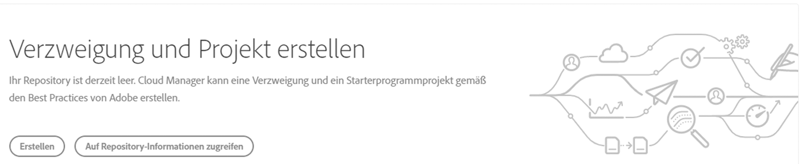
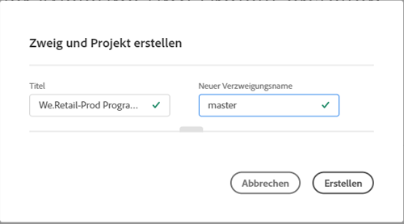
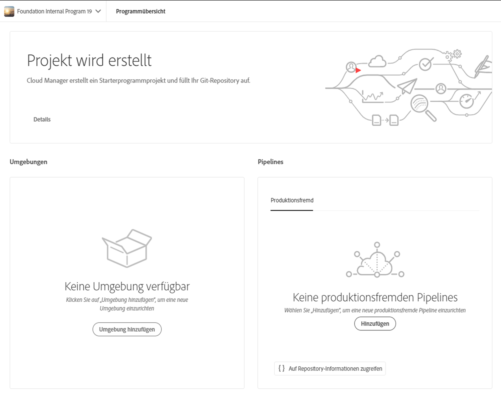
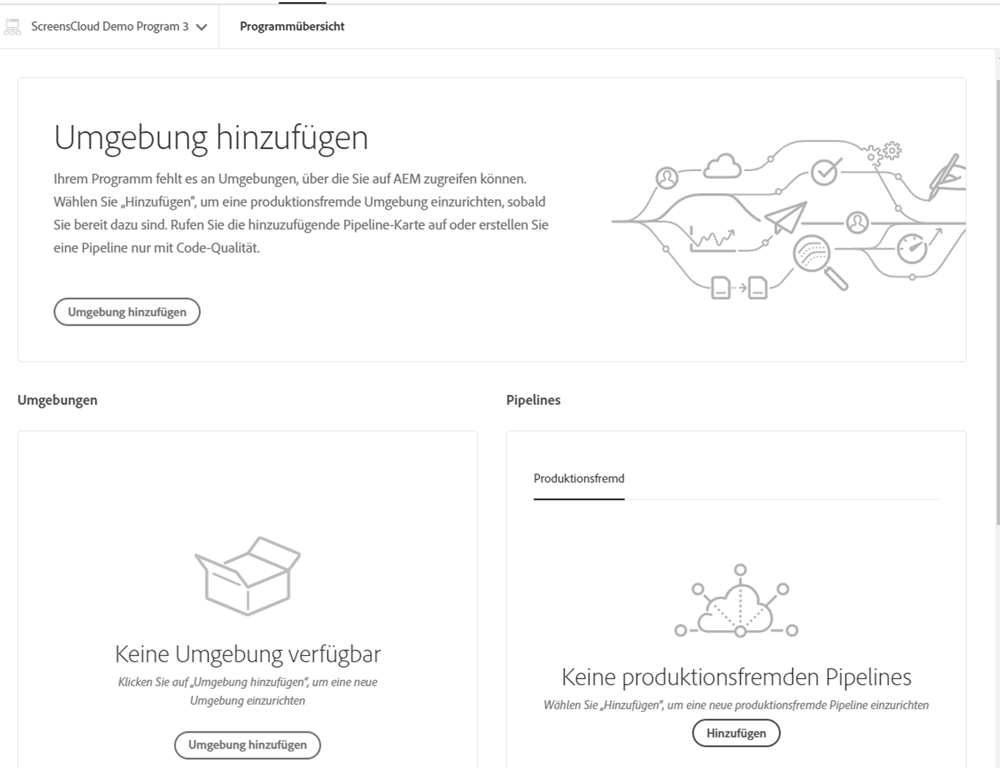

# Assistent zur Projekterstellung {#project-creation-wizard}

Nachdem Sie Ihr Produktionsprogramm erstellt haben, bietet Cloud Manger einen Assistenten zum Erstellen eines minimalen AEM-Projekts auf der Grundlage des [AEM-Projektarchetyps](https://experienceleague.adobe.com/docs/experience-manager-core-components/using/developing/archetype/overview.html?lang=de), damit Sie umgehend beginnen können.

Gehen Sie wie folgt vor, um mit dem Assistenten ein AEM-Anwendungsprojekt in Cloud Manager zu erstellen.

1. Erstellen Sie ein Produktionsprogramm, indem Sie die im Dokument [Erstellen von Produktionsprogrammen](creating-production-programs.md) beschriebenen Schritte befolgen

1. Sobald die Einrichtung des Programms abgeschlossen ist, rufen Sie den Bildschirm **Übersicht** Ihres Programms auf, und Sie sehen oben die Karte **Verzweigung und Projekt erstellen** mit dem Aktionsaufruf.

   

1. Klicken Sie auf **Erstellen**, um den Assistenten zu starten und bestätigen Sie den **Titel** und den **neuen Verzweigungsnamen** im Fenster **Verzweigung und Projekt erstellen**.

   

1. Optional können Sie auf die Trennlinie klicken, um die zusätzlichen Parameter Ihres Projekts anzuzeigen. Die Standardwerte werden vom AEM-Projektarchetyp bereitgestellt und müssen im Allgemeinen nicht geändert werden.

   

1. Klicken Sie auf **Erstellen**, um den Projekterstellungsprozess zu starten.

Eine Karte **Projekterstellung in Bearbeitung** ersetzt jetzt die Aktionsaufrufs-Karte **Verzweigung und Projekt erstellen** am oberen Rand des Bildschirms **Programmübersicht**.

Sobald die Programmerstellung abgeschlossen ist, ersetzt eine Karte **Umgebung hinzufügen** die Karte **Projekterstellung läuft** oben auf dem Bildschirm **Programmübersicht**.

Sie haben jetzt ein AEM-Projekt auf der Grundlage des AEM-Archetyps zu Ihrem Git-Repository hinzugefügt, das als Grundlage für die Entwicklung Ihres eigenen Projekts dient. Als Nächstes können Sie Ihre Umgebungen erstellen, in denen Sie den Projekt-Code bereitstellen können.

Informationen zum Hinzufügen und Verwalten von Umgebungen finden Sie unter [Verwalten von Umgebungen](/help/implementing/cloud-manager/manage-environments.md).

>[!NOTE]
>
>Der Assistent ist nur für Produktionsprogramme verfügbar. Da [Sandbox-Programme](introduction-sandbox-programs.md#auto-creation) eine automatische Projekterstellung beinhalten, ist der Assistent nicht notwendig.