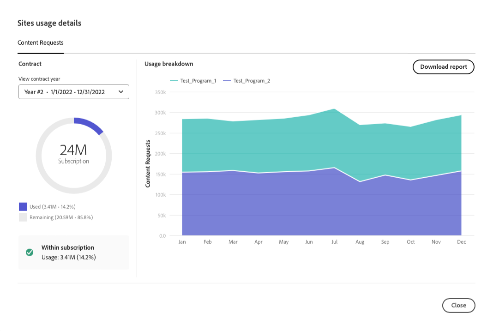

# Lizenz-Dashboard {#license-dashboard}

Cloud Manager bietet ein Dashboard, über das Sie die AEMaaCS-Produktberechtigungen, die für Ihre Organisation oder Ihren Mandanten verfügbar sind, einfach einsehen können.

>[!IMPORTANT]
>
>Das Lizenz-Dashboard gilt nur für die AEM as a Cloud Service-Programme. [AMS-Programme](https://experienceleague.adobe.com/de/docs/experience-manager-cloud-manager/content/introduction) sind nicht im Lizenz-Dashboard enthalten.
>
>Zum Ermitteln des Diensttyps Ihres Programms (AMS oder AEMaaCS) lesen Sie [Navigation durch die Cloud Manager-Benutzeroberfläche](/help/implementing/cloud-manager/navigation.md#program-cards).

## Überblick {#overview}

Das Cloud Manager License Dashboard bietet einfachen Zugriff auf Lösungsberechtigungen, die für alle Ihre Programme verfügbar sind, einschließlich der verwendeten und verfügbaren Elemente. Außerdem werden die Konsummetriken für Inhaltsanforderungen pro Monat für die Sites-Lösung angezeigt.

## Zugriff auf das Lizenz-Dashboard {#using-dashboard}

>[!NOTE]
>
>Ein Benutzer mit der Rolle **Business Owner** muss angemeldet sein, um das Lizenz-Dashboard anzuzeigen.

1. Melden Sie sich unter [my.cloudmanager.adobe.com](https://my.cloudmanager.adobe.com/ ) bei Cloud Manager an und wählen Sie die entsprechende Organisation aus.
1. Klicken Sie in der Konsole **[Meine Programme](/help/implementing/cloud-manager/navigation.md#my-programs)** auf  in der Kopfzeile [Cloud Manager](/help/implementing/cloud-manager/navigation.md#cloud-manager-header). Durch diese Aktion werden die Registerkarten angezeigt.
1. Klicken Sie auf der Registerkarte auf die Option **Lizenz**.

Das Dashboard ist in drei Abschnitte unterteilt, die Ihnen Folgendes zeigen:

* **Lösungen** - Welche Lösungen haben Sie lizenziert?
* **Add-ons** - Welche Add-ons zu Ihren lizenzierten Lösungen, die Sie verfügbar haben.
* **Sonstige Berechtigungen** - Welche Sandbox- und Entwicklungsumgebung und andere Berechtigungen können in Ihrem Mandanten genutzt werden.

In jedem Abschnitt wird zusammengefasst, welche Produkte bzw. Umgebungen verfügbar sind und wie sie verwendet werden. Derzeit werden nur Sites- und Asset-Lösungen angezeigt, selbst wenn im Mandanten andere Lösungen vorhanden sind.

* In der Spalte **Status** wird die Anzahl der nicht verwendeten Berechtigungen im Vergleich zur Gesamtanzahl angezeigt, die für den Mandanten verfügbar sind.
* Die Spalte **Konfiguriert in** gibt die Programme an, auf die die Lösungsberechtigungen angewendet wurden.
   * Eine Berechtigung gilt nur als verwendet, wenn eine Produktionsumgebung erstellt wird. Oder wenn eine existiert, wenn eine Update-Pipeline darauf ausgeführt wurde.
   * Es wird nur eine begrenzte Anzahl von Programmen einzeln in der Spalte aufgeführt, der Rest wird durch einen Eintrag `+x` repräsentiert.
   * Bewegen Sie den Mauszeiger über den Eintrag &quot;`+x`&quot;, um ein Popup mit Details zu allen Programmen anzuzeigen.
* In der Spalte **Nutzung** wird die Schaltfläche **[Nutzungsdetails anzeigen](#view-usage-details)** angezeigt, um Nutzungsstatistiken für die Lösung anzuzeigen.

>[!TIP]
>
>Informationen zum Verwalten Ihrer Adobe-Berechtigungen in Ihrem gesamten Unternehmen über die Admin Console finden Sie im [Überblick über die Admin Console](https://helpx.adobe.com/de/enterprise/using/admin-console.html).

## Nutzungsdetails anzeigen {#view-usage-details}

<!--
The **View usage details** button gives access to the chosen solution's **Usage Details** window. This window gives a detailed breakdown including charts to show your solution's usage. How that usage is measured depends on the chosen solution. -->

Die Schaltfläche **Nutzungsdetails anzeigen** im Lizenzbereich von Cloud Manager bietet eine detaillierte Aufschlüsselung Ihrer aktuellen Ressourcennutzung. Wenn Sie darauf klicken, wird ein Bericht oder Dashboard geöffnet, in dem wichtige Metriken zu Ihrer Lizenz angezeigt werden. <!-- ADD THIS SENTENCE IF ASSETS USAGE DETAILS GETS REINSTATED ", such as the number of users, storage consumption, or bandwidth usage, depending on the type of services you're using." --> Diese Funktion hilft Ihnen, die Einhaltung Ihrer vertraglichen Verpflichtungen zu überwachen und sicherzustellen, und bietet gleichzeitig Einblicke in eine bessere Ressourcenplanung und -optimierung.

### Details zur Site-Nutzung {#sites-usage-details}

Das Fenster **Sites-Nutzungsdetails** enthält Diagramme, die einen Überblick über die Verwendung Ihrer Sites-Lizenzen auf der Grundlage von [Inhaltsanforderungen](#what-is-a-content-request) geben.

Die linke Seite des Fensters zeigt ein Tortendiagramm mit der Aufschlüsselung des Vertrags für das im Dropdown-Menü **Vertragsjahr anzeigen** ausgewählte Vertragsjahr.

Auf der rechten Seite des Fensters befindet sich ein Flächendiagramm, in dem die Nutzung für das ausgewählte Vertragsjahr nach Programm aufgeschlüsselt dargestellt wird. Wenn Sie den Mauszeiger darüber bewegen, wird ein Popup mit Details pro Programm für den ausgewählten Zeitpunkt angezeigt.

<!-- REMOVED AS PER CQDOC-21983
### Assets usage details {#assets-usage-details}

The **Assets usage details** window, presents graphs giving an overview of the usage of your Assets licenses based on [storage](#storage) and [standard users](#standard-users). Select the appropriate tab to toggle between the views.

For both storage and standard users views, you can use the **Environment Type** dropdown to toggle the view between production, stage, and development environments.

#### Storage {#storage}

The left side of the window presents a pie chart showing the contract breakdown for the contract year selected in the **View contract year** dropdown.

The right side of the window presents an area chart showing the usage broken down by program over time for the selected contract year. A hover reveals a popup with details per program for the selected point in time.

#### Standard Users {#standard-users}

The left side of the window presents a pie chart showing the contract breakdown for the contract year selected in the **View contract year** dropdown.

The right side of the window presents an area chart showing the usage broken down by program over time for the selected contract year. A hover reveals a popup with details per program for the selected point in time. -->

## Häufig gestellte Fragen {#faq}

+++**Was ist eine Inhaltsanforderung?** {#what-is-a-content-request}

Bei einer Inhaltsanfrage handelt es sich um eine an AEM Sites oder ein vom Kunden bereitgestelltes Caching-System, wie z. B. ein Netzwerk zur Inhaltsbereitstellung. Es ruft Inhalte oder Daten im HTML-Format für Seitenansichten ab. Oder im JSON-Format für API-Aufrufe.

Für jeden Seitenaufruf oder für jeweils fünf API-Aufrufe wird 1 Inhaltsanfrage gezählt, gemessen am Eingang des ersten Caching-Systems, das eine Inhaltsanfrage erhält. Inhaltsanfragen werden nur für Produktionsumgebungen gezählt.

Inhaltsanfragen schließen Anfragen oder Aktivitäten aus, die von oder für Adobe allein zum Zweck der Bereitstellung von Produkten und Dienstleistungen initiiert wurden. Auch der von Adobe identifizierte Benutzeragenten-Traffic von Bots, Crawlern und Spidern im Zusammenhang mit gängigen Suchmaschinen und Social-Media-Services ist ausgeschlossen.

Siehe auch [Grundlegendes zu Cloud Service-Inhaltsanfragen](/help/implementing/cloud-manager/content-requests.md).
+++

+++**Wie misst Adobe Experience Manager Inhaltsanforderungen?** {#how-are-content-requests-measured}

Inhaltsanfragen werden auf den Edge-Servern von AEM as a Cloud Service erfasst. Der Ursprungs-Traffic zählt nicht für Inhaltsanfragen. Das in AEM as a Cloud Service integrierte CDN verfolgt gültige HTML- und JSON-Anfragen.

AEM verfügt auch über Regeln, um bekannte Bots auszuschließen, einschließlich bekannter Services, die die Site regelmäßig besuchen, um ihren Suchindex oder -Service zu aktualisieren.

Siehe auch [Grundlegendes zu Cloud Service-Inhaltsanfragen](/help/implementing/cloud-manager/content-requests.md).
+++

+++**Warum zeigt mein Analytics-Bericht andere Ergebnisse als die AEM Inhaltsanforderungen an?** {#why-are-reports-different}

Inhaltsanfragen weisen Abweichungen von den Analytics-Reporting-Tools eines Unternehmens auf. Weitere Informationen finden Sie unter [Grundlegendes zu Cloud Service-Inhaltsanfragen](/help/implementing/cloud-manager/content-requests.md).
+++

+++**Was ist, wenn ich mehr über mein Inhaltsanforderungsvolumen erfahren möchte?** {#current-request-volumes}

Wenn Sie zusätzliche Einblicke in das im Lizenz-Dashboard angezeigte Anforderungsvolumen erhalten möchten, kann Ihr Adobe-Team einen Bericht bereitstellen, der die wichtigsten Treiber für Inhaltsanforderungen anzeigt. Wenden Sie sich an Ihr Adobe-Team oder an den Adobe-Kunden-Support, um einen Bericht über die hauptsächliche Nutzung anzufordern.
+++

+++**Was passiert, wenn ich mein eigenes CDN verwende?** {#using-own-cdn}

Das Lizenz-Dashboard zeigt nur Daten an, die vom Cloud Service-CDN verfolgt werden. Wenn Sie sich für ein eigenes CDN (BYOCDN) entscheiden, melden Sie das in Ihrem Vertrag festgelegte Inhaltsanfragevolumen einmal jährlich an Adobe.
+++

