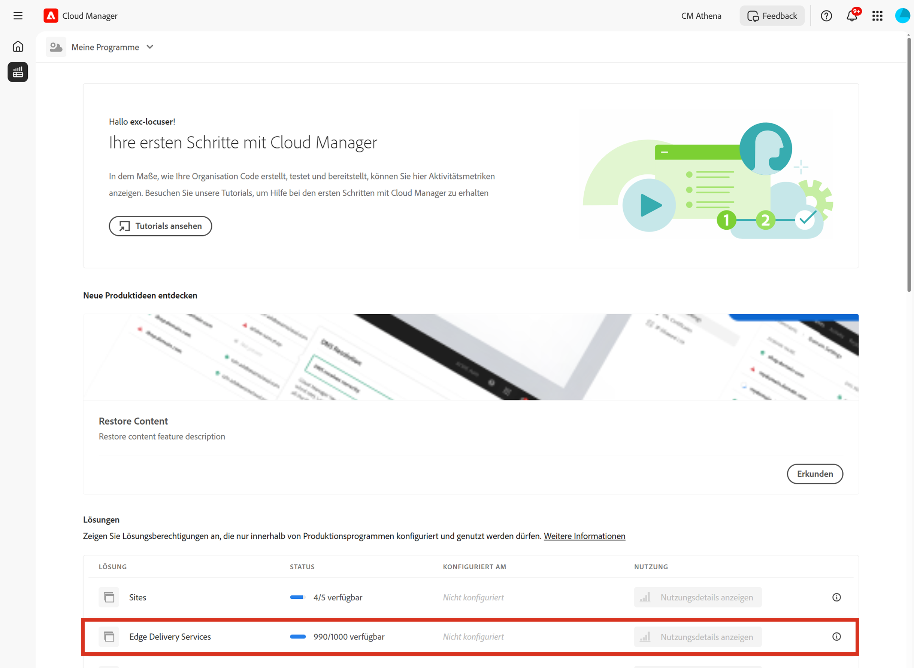

# Lizenz-Dashboard {#license-dashboard}

Cloud Manager bietet ein Dashboard, über das Sie die AEMaaCS-Produktberechtigungen, die für Ihre Organisation oder Ihren Mandanten verfügbar sind, einfach einsehen können.

## Übersicht {#overview}

Das Lizenz-Dashboard von Cloud Manager bietet einfachen Zugriff auf folgende Informationen:

1. Berechtigungen für Lösungen, die Ihnen für alle Ihre Programme zur Verfügung stehen, einschließlich verwendeter und verfügbarer Lösungen
1. Verbrauchsmetriken für Inhaltsanfragen mit einer Darstellung der Entwicklung nach Monaten für die Sites-Lösung

## Verwenden des Lizenz-Dashboards {#using-dashboard}

Gehen Sie wie folgt vor, um auf Ihr Lizenz-Dashboard zuzugreifen.

>[!NOTE]
>
>Ein Benutzender mit der Rolle **Geschäftsinhaber** muss angemeldet sein, damit das Lizenz-Dashboard angezeigt wird.

1. Melden Sie sich unter [my.cloudmanager.adobe.com](https://my.cloudmanager.adobe.com/) bei Cloud Manager an und wählen Sie die entsprechende Organisation aus.

1. Wechseln Sie auf der Seite „Produktübersicht“ zur Registerkarte **Lizenz**.

Das Dashboard ist in drei Abschnitte unterteilt, die Ihnen Folgendes zeigen:

* **Lösungen**: In diesem Abschnitt werden die von Ihnen lizenzierten Lösungen wie Sites oder Assets zusammengefasst.
* **Add-ons**: In diesem Abschnitt werden die Add-ons zu Ihren lizenzierten Lösungen zusammengefasst, die für Sie verfügbar sind.
* **Sandbox- und Entwicklungsumgebungen**: In diesem Abschnitt werden die Umgebungen zusammengefasst, die für Sie verfügbar sind.

In jedem Abschnitt wird zusammengefasst, welche Produkte bzw. Umgebungen verfügbar sind und wie sie aktuell verwendet werden. Derzeit werden nur Sites-Lösungen angezeigt, selbst wenn im Mandanten andere Lösungen vorhanden sind.

* Im **Status** wird die Anzahl der nicht verwendeten Berechtigungen im Vergleich zur Gesamtanzahl angezeigt, die für den Mandanten verfügbar sind.
* Die Spalte **Konfiguriert in** gibt die Programme an, auf die die Lösungsberechtigungen angewendet wurden.
   * Eine Berechtigung gilt nur dann als verwendet, wenn eine Produktionsumgebung erstellt wurde oder, falls bereits eine existiert, wenn eine Update-Pipeline dafür ausgeführt wurde.
* In der Spalte **Nutzung** werden die Inhaltsanfragen der letzten 12 Monate als Diagramm angezeigt, wenn Sie darauf klicken.

>[!TIP]
>
>Siehe [Übersicht über die Admin Console](https://helpx.adobe.com/de/enterprise/using/admin-console.html) , um zu erfahren, wie Sie Ihre Berechtigung für Adoben in Ihrem gesamten Unternehmen von der Admin Console aus verwalten.

## Häufig gestellte Fragen {#faq}

### Was ist eine Inhaltsanfrage? {#what-is-a-content-request}

Bei einer Inhaltsanfrage handelt es sich um eine Anfrage, die an AEM Sites oder ein vom Kunden bereitgestelltes Caching-System wie ein Content Delivery Network (CDN) gesendet wird, um Inhalte oder Daten entweder im HTML-Format als Seitenansicht oder im JSON-Format als API-Aufruf bereitzustellen.

Für jeden Seitenaufruf oder für jeweils fünf API-Aufrufe wird 1 Inhaltsanfrage gezählt, gemessen am Eingang des ersten Caching-Systems, das eine Inhaltsanfrage erhält. Inhaltsanfragen werden nur für Produktionsumgebungen gezählt.

Inhaltsanfragen schließen Anfragen oder Aktivitäten aus, die von oder für Adobe allein zum Zweck der Bereitstellung von Produkten und Dienstleistungen initiiert wurden. Auch der von Adobe identifizierte Benutzeragenten-Traffic von Bots, Crawlern und Spidern im Zusammenhang mit gängigen Suchmaschinen und Social-Media-Services ist ausgeschlossen.

### Wie misst Adobe Experience Manager Inhaltsanfragen? {#how-are-content-requests-measured}

Inhaltsanfragen werden auf den Edge-Servern von AEM as a Cloud Service erfasst. Der Ursprungs-Traffic zählt nicht für Inhaltsanfragen. Das in AEM as a Cloud Service integrierte CDN verfolgt gültige HTML- und JSON-Anfragen.

AEM verfügt auch über Regeln, um bekannte Bots auszuschließen, einschließlich bekannter Services, die die Site regelmäßig besuchen, um ihren Suchindex oder -Service zu aktualisieren.

### Warum zeigt mein Analytics-Bericht andere Ergebnisse als die AEM-Inhaltsanfragen an? {#why-are-reports-different}

Inhaltsanfragen weisen Abweichungen von den Analytics-Reporting-Tools einer Organisation auf, die in dieser Tabelle zusammengefasst sind.

| Grund für die Abweichung | Erklärung |
|---|---|
| Tagging | Alle Seiten, die als AEM-Inhaltsanfragen verfolgt werden, können zum Analytics-Tracking getaggt werden oder auch nicht. Alle API-Aufrufe, die als AEM-Inhaltsanfragen verfolgt werden, werden vom Analytics-Tool einer Organisation nicht getaggt. Seiten oder API-Aufrufe können so getaggt werden, dass Aktionen oder einfach Einzelseitenansichten anstelle von allen Ansichten verfolgt werden. |
| Tag-Management-Regeln | Die Einstellungen von Tag-Management-Regeln können auf einer Seite eine Vielzahl von Datenerfassungskonfigurationen zur Folge haben, was zu einigen Diskrepanzen beim Tracking von Inhaltsanfragen führt. |
| Bots | Unbekannte Bots, die nicht vorab identifiziert und von AEM entfernt wurden, können zu Tracking-Diskrepanzen führen. |
| Report Suites | Seiten, die Teil derselben AEM-Instanz und -Domain sind, können Daten an verschiedene Analytics Report Suites senden. |
| Überwachungs- und Sicherheits-Tools von Drittanbietern | Überwachungs- und Sicherheitsüberprüfungs-Tools können Inhaltsanfragen für AEM generieren, die in Analytics-Berichten nicht erfasst werden. |
| Vorheriges Abrufen von Anfragen | Die Verwendung eines Vorabruf-Services zum Vorladen von Seiten, um die Geschwindigkeit zu erhöhen, kann zu erheblichen Traffic-Zunahmen bei Inhaltsanfragen führen. |
| DDOS | Adobe unternimmt alle Anstrengungen, um Traffic automatisch aus DDOS-Angriffen zu erkennen und herauszufiltern. Es gibt jedoch keine Garantie dafür, dass alle möglichen DDOS-Angriffe erkannt werden |
| Traffic-Blocker | Die Verwendung eines Tracker-Blockers in einem Browser kann die Nachverfolgung mancher Anfragen verhindern. |
| Firewalls | Firewalls können das Analytics-Tracking blockieren. Dies ist bei Unternehmens-Firewalls häufiger der Fall. |

### Wie erfahre ich mehr über mein Inhaltsanfragevolumen? {#current-request-volumes}

Wenn Sie zusätzliche Einblicke in das Inhaltsanfragevolumen erhalten möchten, das im Lizenz-Dashboard angezeigt wird, kann Ihnen Ihr Adobe-Team einen Bericht bereitstellen, der die wichtigsten Treiber von Inhaltsanfragen aufzeigt. Wenden Sie sich an Ihr Adobe-Team oder an die Adobe-Kundenunterstützung, um einen Bericht zur Topnutzung anzufordern.

### Was passiert, wenn ich mein eigenes CDN verwende? {#using-own-cdn}

Das Lizenz-Dashboard zeigt nur Daten an, die vom Cloud Service-CDN verfolgt werden.  Wenn Sie sich für ein eigenes CDN (BYOCDN) entscheiden, melden Sie das in Ihrem Vertrag festgelegte Inhaltsanfragevolumen einmal jährlich an Adobe.
