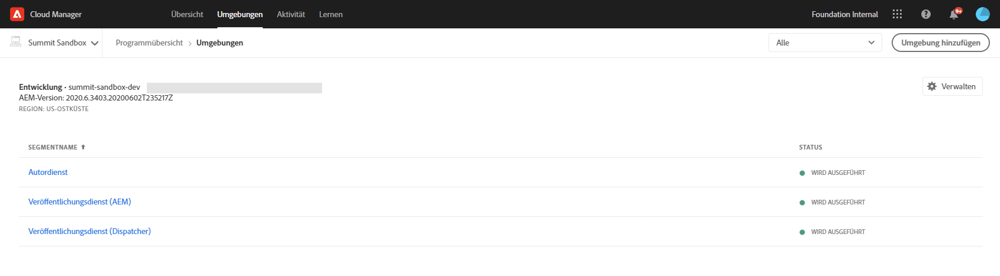
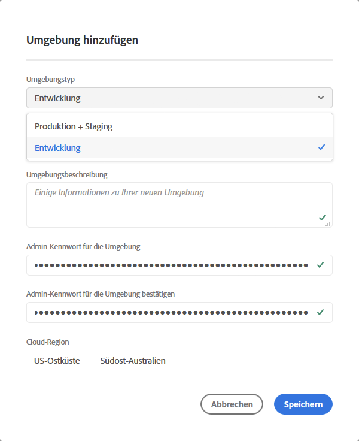
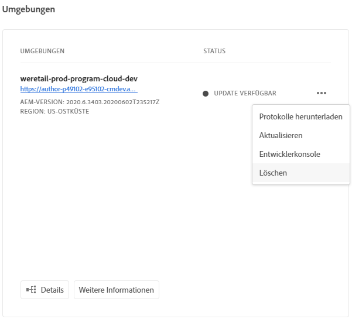
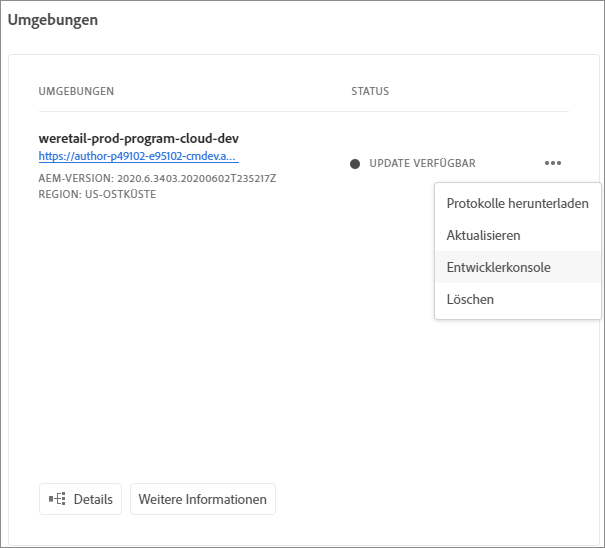

# Verwalten von Umgebungen {#manage-environments}

Im folgenden Abschnitt werden die Umgebungstypen beschrieben, die ein Benutzer erstellen kann, sowie die Möglichkeiten zum Erstellen von Umgebungen durch den Benutzer.

## Umgebungstypen {#environment-types}

Ein Benutzer mit den erforderlichen Berechtigungen kann die folgenden Umgebungstypen erstellen (im Rahmen der dem jeweiligen Mandanten zur Verfügung stehenden Möglichkeiten).

* **Produktions- und Staging-Umgebung**:
Die Produktions- und Staging-Umgebung ist in kombinierter Form verfügbar und wird zu Test- und Produktionszwecken genutzt.

* **Entwicklungsumgebung**: Die Entwicklungsumgebung kann zu Entwicklungs- und Testzwecken erstellt werden und wird ausschließlich produktionsfremden Pipelines zugeordnet.

   >[!NOTE]
   >Automatisch in einem Sandbox-Programm erstellte Entwicklungsumgebungen werden so konfiguriert, dass sie AEM Sites- und AEM Assets-Lösungen einschließen.

   In der folgenden Tabelle sind die Umgebungstypen und ihre Attribute zusammengefasst:

   | Name | AEM Author-Ebene | AEM Publish-Ebene | Benutzer kann erstellen | Benutzer kann löschen | Pipeline, die der Umgebung zugeordnet werden kann |
   |--- |--- |--- |--- |---|---|
   | Produktion | Ja | Ja, wenn Sites eingeschlossen ist | Ja | Nein | Produktions-Pipeline |
   | Staging | Ja | Ja, wenn Sites eingeschlossen ist | Ja | Nein | Produktions-Pipeline |
   | Entwicklung | Ja | Ja, wenn Sites eingeschlossen ist | Ja | Ja | Produktionsfremde Pipeline |

   >[!NOTE]
   >
Die Produktions- und Staging-Umgebung ist in kombinierter Form verfügbar und wird zu Test- und Produktionszwecken genutzt. Benutzer haben nicht die Möglichkeit, Produktions- und Staging-Umgebungen einzeln zu erstellen.

## Hinzufügen einer Umgebung {#adding-environments}

1. Klicken Sie auf **Hinzufügen Umgebung** , um eine Umgebung hinzuzufügen. Auf diese Schaltfläche kann über den Bildschirm &quot; **Umgebung** &quot;zugegriffen werden.
   

   Die Option **Hinzufügen Umgebung** ist auch auf der Karte &quot; **Umgebung** &quot;verfügbar, wenn das Programm keine Umgebung enthält.

   

   >[!NOTE]
   >Die Option **Hinzufügen Umgebung** wird aufgrund fehlender Berechtigungen oder vertraglicher Verpflichtungen deaktiviert.

1. Daraufhin erscheint das Dialogfeld **Umgebung hinzufügen**. Dort muss der Benutzer die Felder **Umgebungstyp**, **Umgebungsname** und **Umgebungsbeschreibung** ausfüllen (je nach Ziel des Benutzers bei der Erstellung der Umgebung im Rahmen der dem jeweiligen Mandanten zur Verfügung stehenden Möglichkeiten).

   

   >[!NOTE]
   >Beim Erstellen einer Umgebung werden eine oder mehrere *Integrationen* in Adobe I/O erstellt. Diese sind für Kunden sichtbar, die Zugriff auf die Adobe I/O Console haben, und dürfen nicht gelöscht werden. Dies wird in der Beschreibung der Adobe I/O Console ausgeschlossen.

   

1. Klicken Sie auf **Speichern**, um eine Umgebung mit den ausgefüllten Kriterien hinzuzufügen. Jetzt wird auf dem Bildschirm *Übersicht* die Karte angezeigt, über die Sie Ihre Pipeline einrichten können.

   >[!NOTE]
   >Falls Sie noch keine produktionsfremde Pipeline eingerichtet haben, wird im Bildschirm *Übersicht* die Karte angezeigt, von der aus Sie Ihre produktionsfremde Pipeline erstellen können.

## Aktualisieren einer Umgebung {#updating-dev-environment}

Aktualisierungen der Staging- und Produktionsumgebungen werden automatisch von Adobe verwaltet.

Aktualisierungen der Entwicklungsumgebungen werden von den Benutzern des Programms verwaltet. Wenn in einer Umgebung nicht die neueste öffentlich verfügbare AEM-Version ausgeführt wird, lautet der Status für die Umgebungskarte auf dem Startbildschirm **UPDATE VERFÜGBAR**.

Die **Option &quot;Aktualisieren** &quot;ist im Dropdown-Menü auf der **Umgebung** -Karte verfügbar.
Diese Option steht auch über die Schaltfläche **Verwalten** zur Verfügung, wenn Sie auf der Karte &quot; **Umgebung** &quot;auf **Details** klicken.

Durch Auswahl dieser Option aus dem Dropdown-Menü kann ein Bereitstellungs-Manager die dieser Umgebung zugeordnete Pipeline auf die neueste Version aktualisieren und die Pipeline dann ausführen.

Wenn die Pipeline bereits aktualisiert ist, wird der Benutzer aufgefordert, die Pipeline auszuführen.

## Löschen der Umgebung {#deleting-environment}

Benutzer mit den erforderlichen Berechtigungen können eine Entwicklungs-Umgebung löschen.

Die Option &quot; **Löschen** &quot;ist im Dropdown-Menü auf der **Umgebung** -Karte verfügbar.
Diese Option steht auch über die Schaltfläche **Verwalten** zur Verfügung, wenn Sie auf der Karte &quot; **Umgebung** &quot;auf **Details** klicken.

>[!NOTE]
Diese Funktion steht nicht für Produktions-/Stage-Umgebung zur Verfügung, die in einem für Produktionszwecke eingerichteten regulären Programm festgelegt sind. Die Funktion ist jedoch für Produktions-/Stage-Umgebung in einem Sandbox-Programm verfügbar.

## Zugriff auf die Developer Console {#accessing-developer-console}

Wählen Sie **Developer Console** aus dem Dropdown-Menü in der **Umgebung** Card. Dadurch wird eine neue Registerkarte in Ihrem Browser mit der Anmeldeseite in der **Developer Console** geöffnet.

Nur Benutzer mit der Rolle &quot;Entwickler&quot;haben Zugriff auf die **Developer Console**. Die Ausnahme gilt für Sandbox-Programm, bei denen alle Benutzer mit Zugriff auf das Cloud Manager Sandbox-Programm Zugriff auf die **Developer Console** haben.

Weitere Informationen finden Sie unter [Hibernating and De-Hibernating Sandbox-Umgebung](https://docs.adobe.com/content/help/en/experience-manager-cloud-service/onboarding/getting-access/cloud-service-programs/sandbox-programs.html#hibernating-introduction) .

Sie können diese Option auch über die Schaltfläche &quot; **Verwalten** &quot;auswählen, wenn Sie auf der Karte &quot; **Umgebung** &quot;auf &quot; **Details** &quot;klicken.

