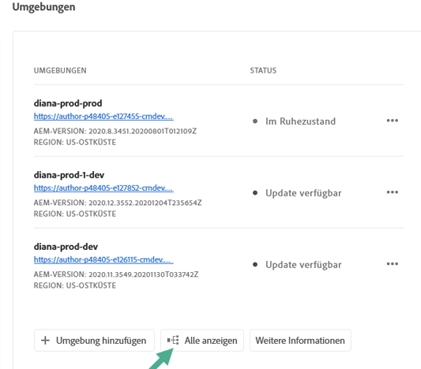
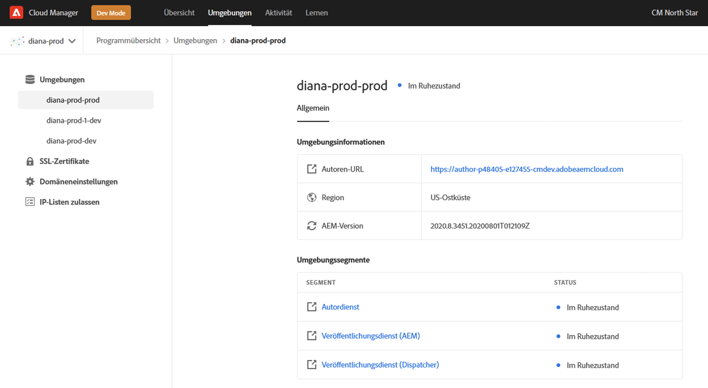

# Verwalten von Umgebungen {#manage-environments}

Im folgenden Abschnitt werden die Umgebungstypen beschrieben, die ein Benutzer erstellen kann, sowie die Möglichkeiten zum Erstellen von Umgebungen durch den Benutzer.

## Umgebungstypen {#environment-types}

Ein Benutzer mit den erforderlichen Berechtigungen kann die folgenden Umgebungstypen erstellen (im Rahmen der dem jeweiligen Mandanten zur Verfügung stehenden Möglichkeiten).

* **Produktions- und Staging-Umgebung**:
Die Produktions- und Staging-Umgebung ist in kombinierter Form verfügbar und wird zu Test- und Produktionszwecken genutzt.

* **Entwicklungsumgebung**: Die Entwicklungsumgebung kann zu Entwicklungs- und Testzwecken erstellt werden und wird ausschließlich produktionsfremden Pipelines zugeordnet.

   >[!NOTE]
   >Automatisch in einem Sandbox-Programm erstellte Entwicklungsumgebungen werden so konfiguriert, dass sie AEM Sites- und AEM Assets-Lösungen einschließen.

   In der folgenden Tabelle sind die Umgebungstypen und ihre Attribute zusammengefasst:

   | Name | Autorenebene | AEM Publish-Ebene | Benutzer kann erstellen | Benutzer kann löschen | Pipeline, die der Umgebung zugeordnet werden kann |
   |--- |--- |--- |--- |---|---|
   | Produktion | Ja | Ja, wenn Sites eingeschlossen ist | Ja | Nein | Produktions-Pipeline |
   | Staging | Ja | Ja, wenn Sites eingeschlossen ist | Ja | Nein | Produktions-Pipeline |
   | Entwicklung | Ja | Ja, wenn Sites eingeschlossen ist | Ja | Ja | Produktionsfremde Pipeline |

   >[!NOTE]
   >Die Produktions- und Staging-Umgebung ist in kombinierter Form verfügbar und wird zu Test- und Produktionszwecken genutzt.  Benutzer haben nicht die Möglichkeit, Produktions- und Staging-Umgebungen einzeln zu erstellen.

## Hinzufügen der Umgebung {#adding-environments}

1. Klicken Sie auf **Umgebung hinzufügen**, um eine Umgebung hinzuzufügen. Auf diese Schaltfläche kann über den Bildschirm **Umgebungen** zugegriffen werden.
   

   Die Option **Umgebung hinzufügen** ist auch auf der Karte **Umgebungen** verfügbar, wenn das Programm keine Umgebung enthält.

   

   >[!NOTE]
   >Die Option **Umgebung hinzufügen** wird aufgrund fehlender Berechtigungen oder vertraglicher Verpflichtungen deaktiviert.

1. Daraufhin erscheint das Dialogfeld **Umgebung hinzufügen**. Dort muss der Benutzer die Felder **Umgebungstyp**, **Umgebungsname** und **Umgebungsbeschreibung** ausfüllen (je nach Ziel des Benutzers bei der Erstellung der Umgebung im Rahmen der dem jeweiligen Mandanten zur Verfügung stehenden Möglichkeiten).

   

   >[!NOTE]
   >Beim Erstellen einer Umgebung werden eine oder mehrere *Integrationen* in Adobe I/O erstellt. Diese sind für Kunden sichtbar, die Zugriff auf die Adobe I/O Console haben, und dürfen nicht gelöscht werden. Dies wird in der Beschreibung der Adobe I/O Console ausgeschlossen.

   

1. Klicken Sie auf **Speichern**, um eine Umgebung mit den ausgefüllten Kriterien hinzuzufügen.  Jetzt wird auf dem Bildschirm *Übersicht* die Karte angezeigt, über die Sie Ihre Pipeline einrichten können.

   >[!NOTE]
   >Falls Sie noch keine produktionsfremde Pipeline eingerichtet haben, wird im Bildschirm *Übersicht* die Karte angezeigt, von der aus Sie Ihre produktionsfremde Pipeline erstellen können.

## Anzeigen der Umgebung {#viewing-environment}

Die Karte **Umgebung** auf der Seite &quot;Überblick&quot;Liste bis zu drei Umgebung.

1. Klicken Sie auf die Schaltfläche **Alle anzeigen**, um zur Zusammenfassungsseite **Umgebung** zu navigieren, um eine Tabelle mit einer vollständigen Liste der Umgebung Ansicht.

   

1. Auf der Seite **Umgebung** wird die Liste aller vorhandenen Umgebung angezeigt.

   

1. Wählen Sie eine der Umgebung aus der Liste aus, um die Details zur Umgebung Ansicht.

   

## Aktualisieren einer Umgebung {#updating-dev-environment}

Aktualisierungen der Staging- und Produktionsumgebungen werden automatisch von Adobe verwaltet.

Aktualisierungen der Entwicklungsumgebungen werden von den Benutzern des Programms verwaltet. Wenn in einer Umgebung nicht die neueste öffentlich verfügbare AEM-Version ausgeführt wird, lautet der Status für die Umgebungskarte auf dem Startbildschirm **UPDATE VERFÜGBAR**.

Die Option **Aktualisieren** ist auf der Karte **Umgebungen** verfügbar.
Diese Option steht auch zur Verfügung, wenn Sie auf der Karte **Umgebungen** auf **Details** klicken. Die Seite **Umgebungen** wird geöffnet. Wenn Sie die Umgebung „Entwicklung“ ausgewählt haben, klicken Sie auf **...** und wählen Sie **Aktualisieren**, wie in der folgenden Abbildung dargestellt:

Durch Auswahl dieser Option kann ein Implementierung-Manager die dieser Umgebung zugeordnete Pipeline auf die neueste Version aktualisieren und die Pipeline dann ausführen.

Wenn die Pipeline bereits aktualisiert ist, wird der Benutzer aufgefordert, die Pipeline auszuführen.

## Löschen einer Umgebung {#deleting-environment}

Benutzer mit den erforderlichen Berechtigungen können eine Entwicklungsumgebung löschen.

Die Option **Löschen** ist im Dropdown-Menü auf der Karte **Umgebungen** verfügbar. Klicken Sie auf **...** für eine Entwicklungsumgebung, die Sie löschen möchten.

Die Option „Löschen“ ist auch verfügbar, wenn Sie auf der Karte **Umgebungen** auf **Details** klicken. Die Seite **Umgebungen** wird geöffnet. Wenn Sie die Umgebung „Entwicklung“ ausgewählt haben, klicken Sie auf **...** und wählen Sie **Löschen**, wie in der folgenden Abbildung dargestellt:

>[!NOTE]
>
>Diese Funktion steht nicht für Produktions-/Staging-Umgebungen zur Verfügung, die in einem für Produktionszwecke eingerichteten regulären Programm festgelegt sind. Die Funktion ist jedoch für Produktions-/Staging-Umgebungen in einem Sandbox-Programm verfügbar.

## Zugriffsverwaltung {#managing-access}

Wählen Sie **Zugriff verwalten** aus dem Dropdown-Menü auf der Karte **Umgebungen** aus. Sie können direkt zur Autoreninstanz navigieren und den Zugriff für Ihre Umgebung verwalten.

Weitere Informationen finden Sie unter [Zugriffsverwaltung für Autoreninstanz](/help/onboarding/getting-access-to-aem-in-cloud/navigation.md#manage-access-aem).

## Aufrufen der Entwicklerkonsole {#accessing-developer-console}

Wählen Sie **Entwicklerkonsole** aus dem Dropdown-Menü auf der Karte **Umgebungen** aus. Dadurch wird eine neue Registerkarte in Ihrem Browser mit der Anmeldeseite von **Entwicklerkonsole** geöffnet.

Nur Benutzer mit der Rolle „Entwickler“ haben Zugriff auf die **Entwicklerkonsole**. Die Ausnahme bilden Sandbox-Programme, bei denen jeder Benutzer mit Zugriff auf das Cloud Manager-Sandbox-Programm Zugriff auf die **Entwicklerkonsole** hat.

Weitere Informationen finden Sie unter [Versetzen von Sandbox-Umgebungen in den Ruhezustand und Aufheben des Ruhezustandes](https://docs.adobe.com/content/help/de-DE/experience-manager-cloud-service/onboarding/getting-access/cloud-service-programs/sandbox-programs.html#hibernating-introduction).

Diese Option steht auch zur Verfügung, wenn Sie auf der Karte **Umgebungen** auf **Details** klicken. Die Seite **Umgebungen** wird geöffnet. Wenn Sie eine Umgebung ausgewählt haben, klicken Sie auf **...** und wählen Sie **Entwicklerkonsole**.

## Lokal anmelden {#login-locally}

Wählen Sie **Lokale Anmeldung** aus dem Dropdown-Menü in **Umgebung** Karte, um sich lokal bei Adobe Experience Manager anzumelden.

Zusätzlich können Sie sich lokal über die Zusammenfassungsseite **Umgebung** anmelden.

## Verwalten von benutzerdefinierten Domänennamen {#manage-cdn}

Navigieren Sie zur Detailseite **Umgebung** auf der Seite &quot;Umgebung - Zusammenfassung&quot;.

Die folgenden Aktionen können wie unten beschrieben für Ihre Umgebung im Veröffentlichungsdienst ausgeführt werden:

1. **Hinzufügen eines benutzerspezifischen**
DomänennamensWeitere Informationen zum  [Hinzufügen eines benutzerspezifischen Domänennamens](/help/implementing/cloud-manager/custom-domain-names/add-custom-domain-name.md)

1. **Anzeigen und Aktualisieren von benutzerdefinierten Domänennamen und SSL-**
ZertifikatenWeitere Informationen finden Sie unter
   * [Anzeigen und Aktualisieren von benutzerdefinierten Domänennamen](/help/implementing/cloud-manager/custom-domain-names/view-update-replace-custom-domain-name.md)
   * [Anzeigen und Aktualisieren von SSL-Zertifikaten](/help/implementing/cloud-manager/managing-ssl-certifications/view-update-replace-ssl-certificate.md)

1. **Löschen von benutzerdefinierten Domänennamen und SSL-**
ZertifikatenSiehe
   * [Löschen von benutzerdefinierten Domänennamen](/help/implementing/cloud-manager/custom-domain-names/delete-custom-domain-name.md)
   * [SSL-Zertifikate](/help/implementing/cloud-manager/custom-domain-names/delete-custom-domain-name.md)

## Verwalten von IP-Zulassungslisten {#manage-ip-allow-lists}

Navigieren Sie auf der Seite &quot;Umgebung - Zusammenfassung&quot;zur Detailseite &quot;Umgebung&quot;. Hier können Sie die folgenden Aktionen für den/die Veröffentlichungs- und/oder Autor-Dienst/Dienste für Ihre Umgebung durchführen.

### Anwenden einer IP-Zulassungsliste {#apply-ip-allow-list}

Beim Anwenden einer IP-Zulassungsliste werden alle in der Allow-List-Definition enthaltenen IP-Bereiche mit einem Autor- oder Veröffentlichungsdienst in einer Umgebung verknüpft. Ein Benutzer, der sich in der Rolle &quot;Geschäftsinhaber&quot;oder &quot;Deployment Manager&quot;befindet, muss angemeldet sein, um eine IP-Zulassungsliste anwenden zu können.

>[!NOTE]
>Die IP-Zulassungsliste muss in Cloud Manager vorhanden sein, damit sie auf einen Umgebung-Service angewendet werden kann. Weitere Informationen zu IP-Listen mit Zugriffsrechten in Cloud Manager finden Sie unter [Einführung in IP-Listen mit Zugriffsrechten unter Konnektivitäts-Manager](/help/implementing/cloud-manager/ip-allow-lists/introduction.md).

Führen Sie dazu folgende Schritte durch:

1. Navigieren Sie auf dem Bildschirm &quot;Umgebung&quot;zur Seite &quot;Details der jeweiligen Umgebung&quot;und navigieren Sie zur Tabelle &quot;IP-Zulassungsliste&quot;.
1. Verwenden Sie die Eingabefelder oben in der Tabelle der IP-Zulassungsliste, um die IP-Zulassungsliste und den Autor- oder Veröffentlichungsdienst auszuwählen, auf den Sie sie anwenden möchten.
1. Wählen Sie dann Übernehmen und bestätigen Sie Ihre Übermittlung.

### Aufheben der Anwendung einer IP-Allow-List {#unapply-ip-allow-list}

Das Aufheben der Anwendung einer IP-Zulassungsliste ist der Vorgang, bei dem alle IP-Bereiche, die in der Allow-List-Definition enthalten sind, von einem Autor-/Publisher-Dienst in einer Umgebung getrennt werden.  Ein Benutzer, der sich in der Rolle &quot;Geschäftsinhaber&quot;oder &quot;Deployment Manager&quot;befindet, muss angemeldet sein, um eine IP-Zulassungsliste aufheben zu können.

Führen Sie dazu folgende Schritte durch:

1. Navigieren Sie auf dem Bildschirm &quot;Umgebung&quot;zur Seite &quot;Details der jeweiligen Umgebung&quot;und navigieren Sie zur Tabelle &quot;IP-Zulassungsliste&quot;.
1. Identifizieren Sie die Zeile, in der die IP-Zulassungsliste, die Sie aufheben möchten, aufgeführt ist.
1. Wählen Sie **...**-Menü am äußersten rechten Ende der Zeile.
1. Wählen Sie die Option &quot;Anwendung aufheben&quot;und bestätigen Sie Ihre Übermittlung.

