# Verwalten von Umgebungen {#managing-environments}

Erfahren Sie mehr über die Arten von Umgebungen, die Sie erstellen können, und wie Sie sie für ein Cloud Manager-Projekt erstellen.

## Umgebungstypen {#environment-types}

Benutzende mit den erforderlichen Berechtigungen können die folgenden Umgebungstypen erstellen (im Rahmen der dem jeweiligen Mandanten zur Verfügung stehenden Möglichkeiten):

| Umgebungstyp | Beschreibung |
| --- | --- |
| **Produktion + Staging** | Die Produktions- und Staging-Umgebungen sind gemeinsam verfügbar und werden für Produktions- bzw. Testzwecke verwendet. Führen Sie Leistungs- und Sicherheitstests in der Staging-Umgebung durch. Sie hat dieselbe Größe wie die Produktion. |
| **Entwicklung** | Die Entwicklungsumgebung kann zu Entwicklungs- und Testzwecken erstellt werden und wird ausschließlich produktionsfremden Pipelines zugeordnet. Entwicklungsumgebungen haben nicht dieselbe Größe wie Staging- und Produktionsumgebungen und sollten nicht für Leistungs- und Sicherheitstests verwendet werden. |
| **Schnelle Entwicklung** | Mit einer schnellen Entwicklungsumgebung (Rapid Development Environment, RDE) können Entwickelnde Änderungen schnell bereitstellen und überprüfen. Dadurch wird der Zeitaufwand für das Testen von Funktionen reduziert, die bereits in einer lokalen Entwicklungsumgebung validiert wurden. Details zur Verwendung einer RDE finden Sie in der [Dokumentation zu schnellen Entwicklungsumgebungen](/help/implementing/developing/introduction/rapid-development-environments.md). |
| **Spezialisierte Testumgebung** | Spezialisierte Testumgebungen bieten einen dedizierten Raum für die Validierung von Funktionen unter produktionsnahen Bedingungen, ideal für Belastungstests und erweiterte Prüfungen vor der Bereitstellung. Siehe [Hinzufügen einer speziellen Testumgebung](/help/implementing/cloud-manager/specialized-test-environment.md) |

<!-- 
>[!NOTE]
>
>The **Specialized Testing Environment** feature is currently available only through the private beta program. To sign up for the private beta, see [Specialized Testing Environment](/help/implementing/cloud-manager/release-notes/current.md#specialized-test-environment).
-->

Die Fähigkeiten der einzelnen Umgebungen hängen von den Lösungen ab, die im [Programm](/help/implementing/cloud-manager/getting-access-to-aem-in-cloud/program-types.md) der Umgebung aktiviert wurden.

* [Sites](/help/overview/introduction.md)
* [Assets](/help/assets/overview.md)
* [Formulare](/help/forms/home.md)
* [Screens](/help/screens-cloud/introduction/introduction.md)

>[!NOTE]
>
>Die Produktions- und Staging-Umgebung werden nur als Paar erstellt. Sie können keine reine Produktions- oder Staging-Umgebung erstellen.

## Hinzufügen einer Umgebung {#adding-environments}

Um eine Umgebung hinzufügen oder bearbeiten zu können, muss eine Benutzerin bzw. ein Benutzer Mitglied der Rolle **Geschäftsinhaber** sein.

**So fügen Sie eine Umgebung hinzu:**

1. Melden Sie sich unter [my.cloudmanager.adobe.com](https://my.cloudmanager.adobe.com/) bei Cloud Manager an und wählen Sie die entsprechende Organisation aus.

1. Klicken Sie in der Konsole **[Meine Programme](/help/implementing/cloud-manager/navigation.md#my-programs)** auf das Programm, für das eine Umgebung hinzugefügt werden soll.

1. Führen Sie einen der folgenden Schritte aus:

   Wenn die Option **Umgebung hinzufügen** abgeblendet (deaktiviert) ist, kann dies auf fehlende Berechtigungen oder eine Abhängigkeit von den lizenzierten Ressourcen zurückzuführen sein.

   * Klicken Sie in der Konsole **[Meine Programme](/help/implementing/cloud-manager/navigation.md#my-programs)** auf der Karte **Umgebungen** auf **Umgebung hinzufügen**.

   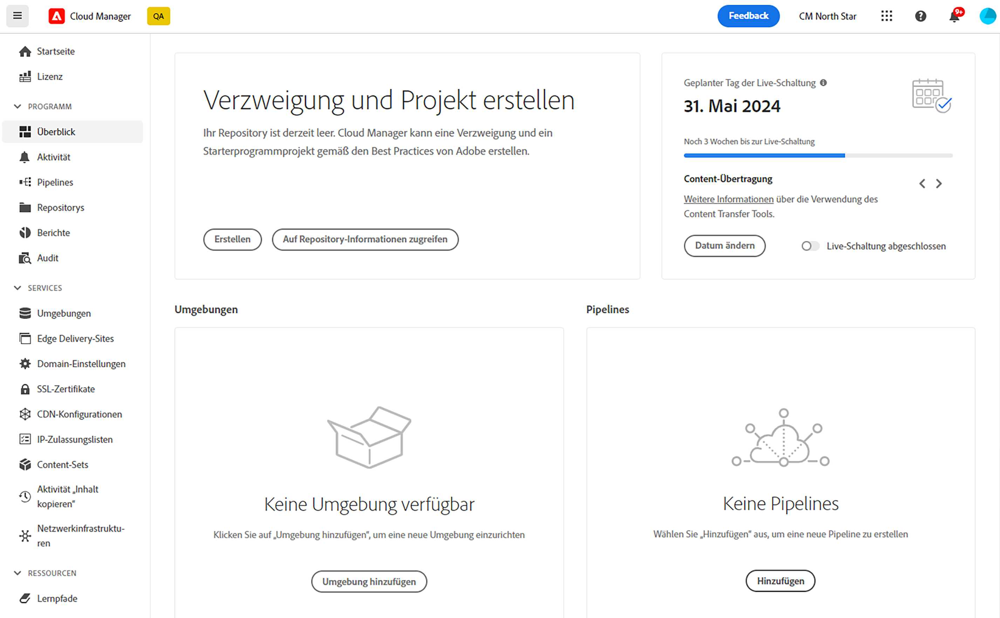

   * Klicken Sie links im seitlichen Bedienfeld auf  **Umgebungen** und dann oben rechts auf der Seite „Umgebungen“ auf **Umgebung hinzufügen**.

     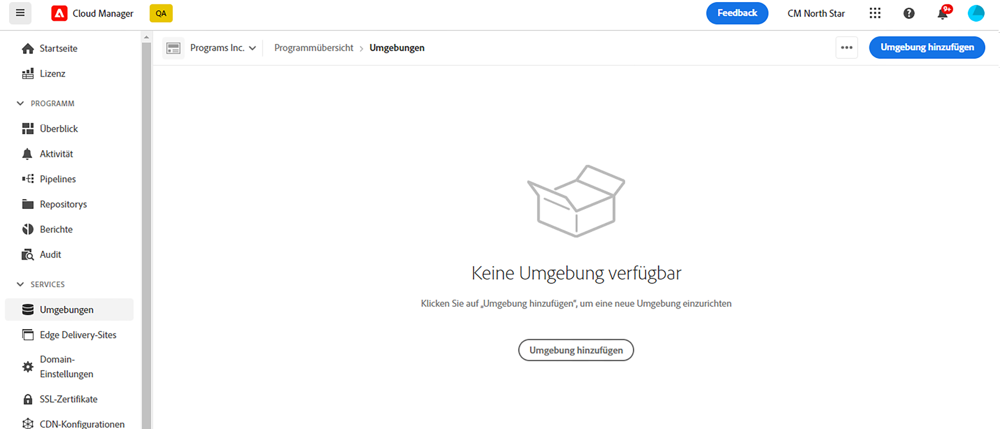

1. Gehen Sie im Dialogfeld **Umgebung hinzufügen** wie folgt vor:

   * Wählen Sie einen [**Umgebungstyp**](#environment-types) aus. Die Anzahl der verfügbaren/verwendeten Umgebungen wird in Klammern hinter dem Namen des Umgebungstyps angezeigt.
   * Geben Sie einen **Namen** für die Umgebung an. Der Umgebungsname kann nach der Erstellung der Umgebung nicht mehr geändert werden.
   * Geben Sie eine optionale **Beschreibung** für die Umgebung an.
   * Wenn Sie eine Umgebung für **Produktion + Staging** hinzufügen, müssen Sie einen Umgebungsnamen und eine Beschreibung sowohl für die Produktions- als auch für die Staging-Umgebung angeben.
   * Wählen Sie in der Dropdown-Liste eine **primäre Region** aus. Die primäre Region kann nach der Erstellung nicht mehr geändert werden. Je nach den verfügbaren Berechtigungen können Sie auch [mehrere Regionen](#multiple-regions) konfigurieren.

   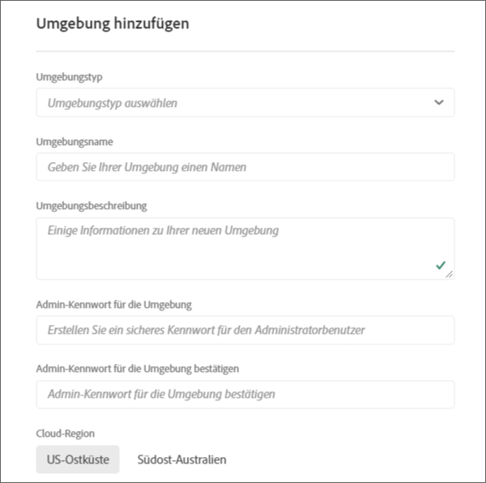

1. Klicken Sie auf **Speichern**.

Die Seite **Überblick** zeigt nun auf der Karte **Umgebungen** Ihre neue Umgebung an. Sie können jetzt Pipelines für Ihre neue Umgebung einrichten.

## Mehrere Veröffentlichungsregionen {#multiple-regions}

Benutzende mit der **Geschäftsinhaber**-Rolle können Produktions- und Staging-Umgebungen so konfigurieren, dass neben der primären Region bis zu drei weitere Veröffentlichungsregionen einbezogen werden. Zusätzliche Veröffentlichungsregionen können die Verfügbarkeit verbessern. Weitere Details finden Sie in der [Zusätzlichen Dokumentation zu Veröffentlichungsregionen](/help/operations/additional-publish-regions.md).

>[!TIP]
>
>Sie können die [Cloud Manager API](https://developer.adobe.com/experience-cloud/cloud-manager/guides/api-usage/creating-programs-and-environments/#creating-aem-cloud-service-environments) verwenden, um eine aktuelle Liste der verfügbaren Regionen abzufragen.

### Hinzufügen mehrerer Veröffentlichungsregionen zu einer neuen Umgebung {#add-regions}

Wenn Sie eine Umgebung hinzufügen, können Sie zusätzlich zur primären Region weitere Regionen konfigurieren.

1. Wählen Sie die **primäre Region**.
   * Die primäre Region kann nach der Erstellung der Umgebung nicht mehr geändert werden.
1. Wenn Sie die Option **Zusätzliche Veröffentlichungsregionen hinzufügen** wählen, wird eine neue Dropdown-Option **Zusätzliche Veröffentlichungsregionen** angezeigt.
1. Wählen Sie in der Dropdown-Liste **Zusätzliche Veröffentlichungsregionen** eine zusätzliche Region aus.
1. Die ausgewählte Region wird unter der Dropdown-Liste hinzugefügt, um ihre Auswahl anzugeben.
   * Wählen Sie das `X` neben der ausgewählten Region aus, um sie wieder abzuwählen.
1. Wählen Sie eine andere Region aus der Dropdown-Liste **Zusätzliche Veröffentlichungsregionen**, um eine weitere Region hinzuzufügen.
1. Wählen Sie **Speichern** aus, wenn Sie bereit sind, Ihre Umgebung zu erstellen.

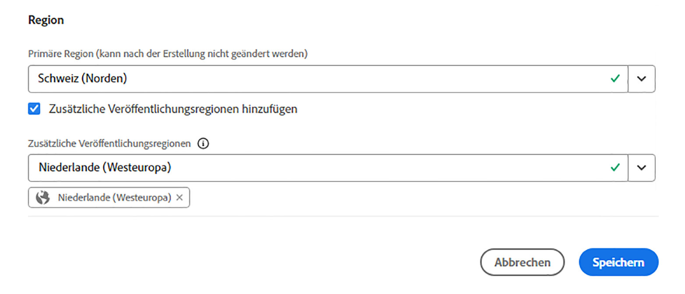

Die ausgewählten Regionen gelten sowohl für Produktions- als auch für Staging-Umgebungen.

Wenn Sie keine zusätzlichen Regionen angeben, [können Sie dies auch später tun, nachdem die Umgebungen erstellt wurden](#edit-regions).

Wenn Sie [erweiterte Netzwerkfunktionen](/help/security/configuring-advanced-networking.md) für das Programm bereitstellen möchten, wird empfohlen, diese Bereitstellung vor dem Hinzufügen zusätzlicher Veröffentlichungsregionen zu den Umgebungen mithilfe der Cloud Manager-API durchzuführen. Andernfalls wird der Traffic der zusätzlichen Veröffentlichungsregionen über den Proxy der primären Region geleitet.

### Bearbeiten mehrerer Veröffentlichungsregionen {#edit-regions}

Wenn Sie anfangs keine weiteren Regionen angegeben haben, können Sie dies auch nach der Erstellung der Umgebung noch tun, sofern Sie über die erforderlichen Berechtigungen verfügen.

Sie können auch zusätzliche Veröffentlichungsregionen entfernen. Sie können jedoch in einer Transaktion Regionen nur entweder hinzufügen oder entfernen. Wenn Sie eine Region hinzufügen und eine andere Region entfernen müssen, fügen Sie zuerst eine hinzu, speichern Ihre Änderung und entfernen dann die andere (oder umgekehrt).

1. Klicken Sie in der Konsole „Programmübersicht“ Ihres Programms auf  für Ihre Produktionsumgebung und wählen Sie im Menü die Option **Bearbeiten** aus.

   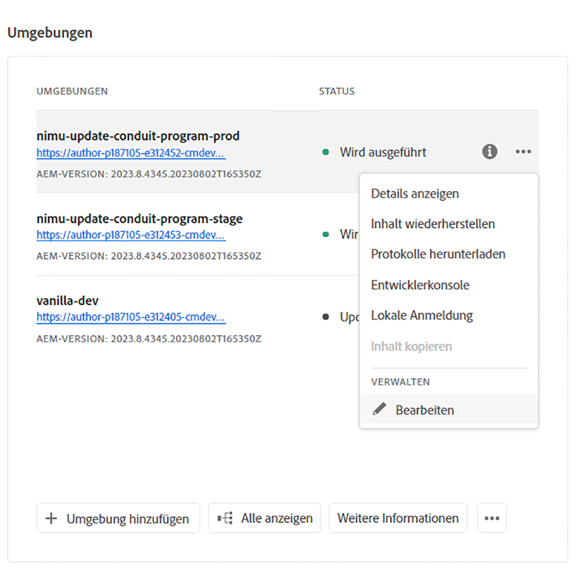

1. Nehmen Sie im Dialog **Produktionsumgebung bearbeiten** die erforderlichen Änderungen an den zusätzlichen Veröffentlichungsregionen vor.
   * Verwenden Sie die Dropdown-Liste **Zusätzliche Veröffentlichungsregionen**, um weitere Regionen auszuwählen.
   * Klicken Sie auf das X neben den ausgewählten zusätzlichen Veröffentlichungsregionen, um deren Auswahl aufzuheben.

   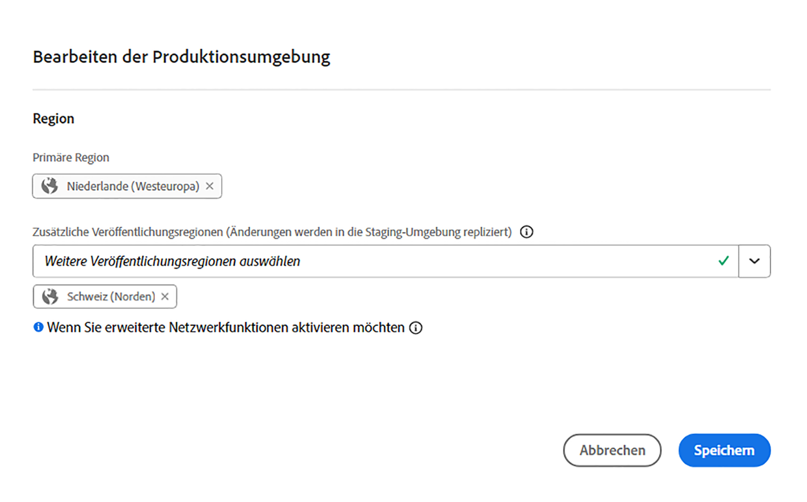

1. Wählen Sie **Speichern** aus, um die Änderungen zu speichern.

Änderungen an der Produktionsumgebung gelten sowohl für die Produktions- als auch für die Staging-Umgebung. Änderungen an mehreren Veröffentlichungsregionen können nur in der Produktionsumgebung bearbeitet werden.

Wenn Sie [erweiterte Netzwerkfunktionen](/help/security/configuring-advanced-networking.md) für das Programm bereitstellen möchten, wird empfohlen, diese Bereitstellung vor dem Hinzufügen zusätzlicher Veröffentlichungsregionen zu den Umgebungen durchzuführen. Andernfalls wird der Traffic der zusätzlichen Veröffentlichungsregionen über den Proxy der primären Region geleitet.

## Anzeigen von Details einer Umgebung {#viewing-environment}

1. Melden Sie sich unter [my.cloudmanager.adobe.com](https://my.cloudmanager.adobe.com/) bei Cloud Manager an und wählen Sie die entsprechende Organisation aus.

1. Klicken Sie in der Konsole **[Meine Programme](/help/implementing/cloud-manager/navigation.md#my-programs)** auf das Programm, für das Sie Umgebungsdetails anzeigen möchten.

1. Führen Sie einen der folgenden Schritte aus, um alle Umgebungen für das Programm aufzulisten:

   * Klicken Sie im linken Seitenmenü unter **Services** auf  **Umgebungen**.

   

   * Klicken Sie im linken Seitenmenü unter **Programm** auf **Überblick** und dann auf der Karte **Umgebungen** auf  **Alle anzeigen**.

     

   >[!NOTE]
   >
   >Die Karte **Umgebungen** listet nur drei Umgebungen auf. Klicken Sie auf der Karte auf **Alle anzeigen**, um *alle* Umgebungen des Programms anzuzeigen.

1. Führen Sie auf der Seite „Umgebungen“ eine der folgenden Schritte aus:

   * Klicken Sie auf eine Umgebung in der Liste, um deren Details anzuzeigen.

   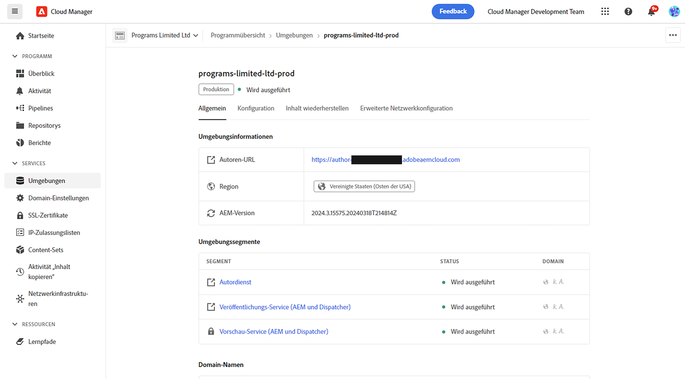

   * Klicken Sie auf  für die gewünschte Umgebung und dann auf **Details anzeigen**.

   

## Wiederherstellen von Inhalten einer Umgebung {#restore-environment}

Siehe [Wiederherstellen von Inhalten in AEM as a Cloud Service](/help/operations/restore.md).

## Wiederherstellen von zuvor bereitgestelltem Code {#restore-previous-code-deployed}

Siehe [Wiederherstellen des vorherigen in AEM as a Cloud Service bereitgestellten Codes](/help/operations/restore-previous-code-deployed.md).

### Zugriff auf den Vorschau-Service {#access-preview-service}

Cloud Manager bietet für jede AEM as a Cloud Service-Umgebung einen Vorschau-Service (bereitgestellt als zusätzlicher Publishing-Service).

Mithilfe des Service können Sie eine Vorschau des endgültigen Erlebnisses einer Website anzeigen, bevor diese die tatsächliche Publishing-Umgebung erreicht und öffentlich verfügbar wird.

Bei der Erstellung wird auf den Vorschau-Service eine standardmäßige IP-Zulassungsliste mit der Bezeichnung `Preview Default [<envId>]` angewendet, wodurch der gesamte Traffic zum Vorschau-Service blockiert wird. Heben Sie die Anwendung der standardmäßigen IP-Zulassungsliste im Vorschau-Service auf, damit Sie den Zugriff aktivieren können.

Benutzende mit den erforderlichen Berechtigungen müssen die folgenden Schritte ausführen, bevor sie die Vorschau-Service-URL freigeben können, damit der Zugriff darauf möglich ist.

1. Erstellen Sie eine entsprechende IP-Zulassungsliste, wenden Sie sie auf den Vorschau-Service an und heben Sie direkt danach die Anwendung der `Preview Default [<envId>]`-Zulassungsliste wieder auf.

   Weitere Details finden Sie unter [Anwenden und Aufheben der Anwendung von IP-Zulassungslisten](/help/implementing/cloud-manager/ip-allow-lists/apply-allow-list.md).

1. Verwenden Sie den Workflow zum Aktualisieren von **IP-Zulassungslisten**, um die standardmäßige IP-Adresse zu entfernen und die erforderlichen IP-Adressen hinzuzufügen. Weitere Informationen finden Sie unter [Verwalten von IP-Zulassungslisten](/help/implementing/cloud-manager/ip-allow-lists/managing-ip-allow-lists.md).

Nachdem der Zugriff auf den Vorschau-Service entsperrt wurde, wird das Sperrsymbol nicht mehr vor dem Namen des Vorschau-Service angezeigt.

Nach der Aktivierung können Sie Inhalte im Vorschau-Service veröffentlichen, indem Sie die Benutzeroberfläche **`Manage Publication`** in AEM verwenden. Weitere Details finden Sie unter [Vorschau von Inhalten](/help/sites-cloud/authoring/sites-console/previewing-content.md).

>[!NOTE]
>
>Ihre Umgebung muss auf AEM Version `2021.05.5368.20210529T101701Z` oder höher ausgeführt werden, um den Vorschau-Service nutzen zu können. Vergewissern Sie sich, dass in Ihrer Umgebung eine Aktualisierungs-Pipeline erfolgreich ausgeführt wurde, damit Sie den Vorschau-Service verwenden können.

### Status zusätzlicher Veröffentlichungsregionen {#additional-region-status}

Wenn Sie zusätzliche Veröffentlichungsregionen aktiviert haben, können Sie den Status dieser Regionen über die Karte **Umgebungen** überprüfen.

1. Suchen Sie auf der Seite **Übersicht** die Karte **Umgebungen**.

1. Auf der Karte **Umgebungen** gibt die Spalte **Status** an, ob es Probleme mit den konfigurierten zusätzlichen Veröffentlichungsregionen gibt. Klicken Sie auf das Symbol **Info**, um Details zu den Regionen zu erhalten.

   

Alternativ können Sie auf die gleichen Informationen über die Registerkarte **Umgebungen** zugreifen.

1. Klicken Sie auf der Seite **Überblick** auf  **Umgebungen**.

1. Wählen Sie auf der Seite **Umgebungen** im linken Seitenmenü die Umgebung aus, die abgefragt werden soll.

1. Nach Auswahl einer Umgebung:

   * Die Tabelle **Umgebungsinformationen** zeigt an, welche Regionen für die ausgewählte Umgebung konfiguriert sind.
   * Die Spalte **Status** der Tabelle **Umgebungssegmente** gibt an, ob es Probleme mit den konfigurierten zusätzlichen Veröffentlichungsregionen gibt. Bewegen Sie den Mauszeiger über den Status, um Details zu Problemen zu erhalten.

   

Haben Sie Geduld, wenn Probleme mit zusätzlichen Veröffentlichungsregionen gemeldet werden. Cloud Manager versucht immer wieder, die Region wiederherzustellen. Sie kann jederzeit wieder verfügbar werden. Wenn das Problem nach mehreren Stunden weiterhin besteht, können Sie den zusätzlichen Veröffentlichungsbereich entfernen und ihn erneut hinzufügen (entweder dieselbe Region oder eine andere Region), um eine vollständige Bereitstellung auszulösen.

Wie lange Sie darauf warten sollten, dass sich das System von selbst erholt, bevor Sie zusätzliche Maßnahmen ergreifen, hängt von den Auswirkungen ab, die der Ausfall dieser Region auf Ihre Systeme hat.

Ungeachtet dessen wird [Traffic immer in die nächstgelegene Region weitergeleitet, die online ist](/help/operations/additional-publish-regions.md). Wenn weiterhin Probleme auftreten, wenden Sie sich an die Adobe-Kundenunterstützung.

## Aktualisieren von Umgebungen {#updating-dev-environment}

Als Cloud-nativer Service verwaltet Adobe automatisch die Aktualisierungen Ihrer Entwicklungs-, Staging- und Produktionsumgebungen innerhalb der Produktionsprogramme.

Aktualisierungen von Umgebungen in Sandbox-Programmen werden jedoch innerhalb der Programme verwaltet. Wenn in einer solchen Umgebung nicht die neueste öffentlich verfügbare AEM-Version ausgeführt wird, zeigt der Status auf der Karte **Umgebungen** auf dem Bildschirm **Überblick** des Programms **Aktualisierung verfügbar** an.

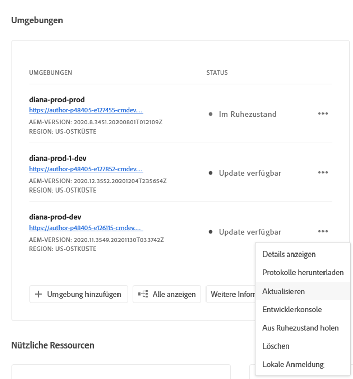

### Updates und Pipelines {#updates-pipelines}

Pipelines sind der einzige Weg, [Code in den Umgebungen von AEM as a Cloud Service bereitzustellen](deploy-code.md). Aus diesem Grund ist jede Pipeline mit einer bestimmten AEM-Version verknüpft.

Wenn Cloud Manager erkennt, dass eine neuere AEM-Version verfügbar ist als die, die zuletzt mit der Pipeline bereitgestellt wurde, wird der Status **Update verfügbar** für die Umgebung angezeigt.

Der Prozess der Aktualisierung erfolgt also in zwei Schritten:

1. Aktualisieren der Pipeline mit der neuesten AEM-Version
1. Ausführen der Pipeline zum Bereitstellen der neuen Version von AEM in einer Umgebung

### Aktualisieren von Umgebungen {#updating-your-environments}

>[!NOTE]
> Seit 2024 werden Entwicklungsinstanzen und einige Sandbox-Programme bereits automatisch aktualisiert, sodass Aktualisierungen für sie nicht manuell verwaltet werden müssen. Aufgrund dieses Übergangs ist die Option zur manuellen Aktualisierung der Umgebung für Entwicklungsinstanzen möglicherweise für _einige_ Ihrer Programme nicht verfügbar.

Die Option **Aktualisieren** ist auf der Karte **Umgebungen** für bestimmte Entwicklungs- und Sandbox-Umgebungen verfügbar. Klicken Sie neben der Umgebung auf , um auf **Aktualisieren** zuzugreifen.

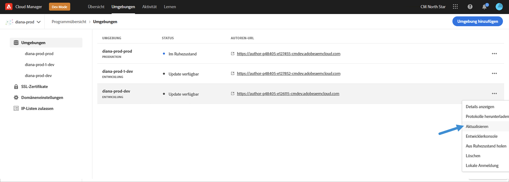

Diese Option ist auch verfügbar, indem Sie auf die Registerkarte **Umgebungen** des Programms und anschließend auf  für die Umgebung klicken.

Eine Benutzerin bzw. ein Benutzer mit der Rolle **Bereitstellungs-Manager** oder **Geschäftsinhaber** kann diese Option verwenden, um die mit dieser Umgebung verknüpfte Pipeline auf die neueste AEM-Version zu aktualisieren.

Nachdem die Pipeline-Version auf die neueste öffentlich verfügbare AEM-Version aktualisiert wurde, wird die Benutzerin bzw. der Benutzer aufgefordert, die zugehörige Pipeline auszuführen, um die neueste Version in der Umgebung bereitzustellen.

Das Verhalten der Option **Aktualisieren** hängt von der Konfiguration und dem aktuellen Status des Programms ab.

| Status | Verhalten der Option „Aktualisieren“ |
| --- | --- |
| Die Pipeline wurde bereits aktualisiert. | Fordert Benutzende auf, die Pipeline auszuführen. |
| Die Pipeline wird bereits aktualisiert. | Informiert Benutzende, dass bereits eine Aktualisierung ausgeführt wird. |
| Die Pipeline ist nicht vorhanden. | Fordert Benutzende auf, eine Pipeline zu erstellen. |

## Löschen von Entwicklungsumgebungen {#deleting-environment}

Eine Benutzerin bzw. ein Benutzer mit der Rolle **Bereitstellungs-Manager** oder **Geschäftsinhaber** kann eine Entwicklungsumgebung löschen.

Klicken Sie im Bildschirm **Überblick** des Programms auf der Karte **Umgebungen** auf  für die Entwicklungsumgebung, die gelöscht werden soll.

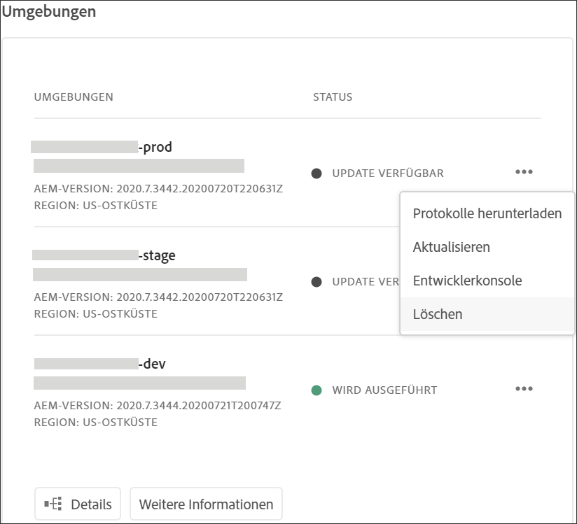

Die Option **Löschen** ist auch über die Registerkarte **Umgebungen** des Fensters **Überblick** des Programms verfügbar. Klicken Sie auf  für die Umgebung und wählen Sie anschließend **Löschen** aus.

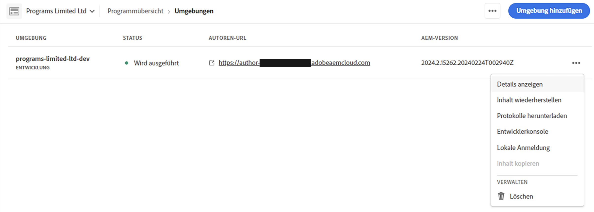

>[!NOTE]
>
>* In einem Produktionsprogramm erstellte Produktions- und Staging-Umgebungen können nicht gelöscht werden.
>* Produktions- und Staging-Umgebungen in einem Sandbox-Programm können gelöscht werden.

## Verwalten des Zugriffs {#managing-access}

Wählen Sie aus dem Menü mit den Auslassungspunkten der Umgebung auf der Karte **Umgebungen** die Option **Zugriff verwalten** aus. Sie können direkt zur Autoreninstanz gehen und den Zugriff für Ihre Umgebung verwalten.

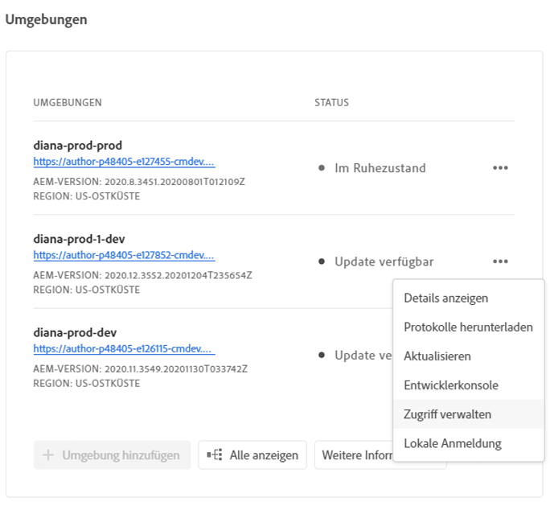

>[!TIP]
>
>Unter [AEM as a Cloud Service – Team- und Produktprofile](/help/onboarding/aem-cs-team-product-profiles.md) erfahren Sie, wie Sie mit Team- und Produktprofilen in AEM as a Cloud Service den Zugriff auf Ihre lizenzierten Adobe-Lösungen gewähren oder einschränken können.

## Zugriff auf die Entwicklerkonsole {#accessing-developer-console}

1. Klicken Sie auf der Karte **Umgebungen** auf  und dann auf **Entwicklerkonsole**.

In Ihrem Browser wird eine neue Registerkarte mit der Anmeldeseite für die **Developer Console** geöffnet.

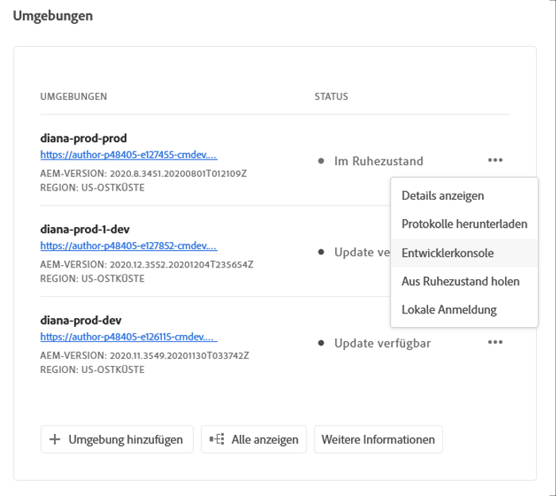

Nur eine Benutzerin bzw. ein Benutzer mit der Rolle **Entwickler** hat Zugriff auf die **Developer Console**. Für Sandbox-Programme hat jedoch jede Person mit Zugriff auf das Sandbox-Programm auch Zugriff auf die **Developer Console**.

Weitere Details finden Sie unter [Aktivieren und Deaktivieren des Ruhezustands von Sandbox-Umgebungen](https://experienceleague.adobe.com/de/docs/experience-manager-cloud-service/content/implementing/using-cloud-manager/programs/introduction-sandbox-programs#hibernation).

Diese Option ist auch über die Registerkarte **Umgebung** des Fensters **Überblick** beim Klicken auf  für eine einzelne Umgebung verfügbar.

## Lokale Anmeldung {#login-locally}

1. Führen Sie einen der folgenden Schritte aus:

   * Klicken Sie auf der Karte **Umgebungen** auf  und dann auf **Lokale Anmeldung**.

     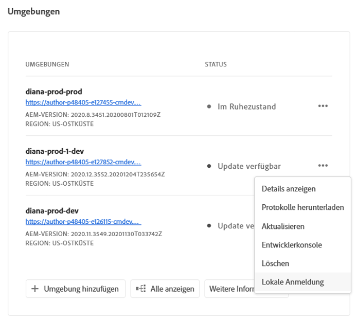

   * Klicken Sie links im seitlichen Bedienfeld auf  **Umgebungen**. Klicken Sie auf der Seite **Umgebungen** auf  und dann auf **Lokale Anmeldung**.

     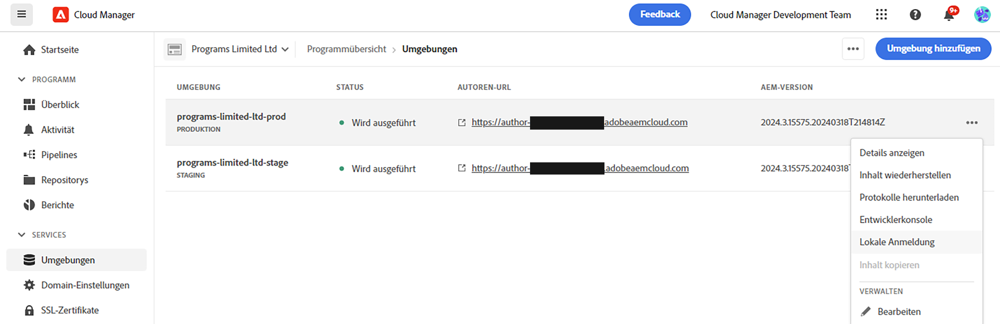

## Verwalten von benutzerdefinierten Domain-Namen {#manage-cdn}

Benutzerdefinierte Domain-Namen werden in Programmen von Cloud Manager for Sites sowohl für Veröffentlichungs- als auch für Vorschau-Services unterstützt.

>[!TIP]
>
>Weitere Informationen finden Sie in der [Einführung in benutzerdefinierte Domain-Namen](/help/implementing/cloud-manager/custom-domain-names/introduction.md).

## Verwalten von IP-Zulassungslisten {#manage-ip-allow-lists}

IP-Zulassungslisten werden in Cloud Manager für Autoren-, Veröffentlichtungs- und Vorschau-Services für Sites-Programme unterstützt.

Um IP-Zulassungslisten zu verwalten, navigieren Sie zur Seite  **Umgebungen** der Seite **Überblick** Ihres Programms. Klicken Sie auf eine einzelne Umgebung, damit Sie deren Details verwalten können.

### Übernehmen einer IP-Zulassungsliste {#apply-ip-allow-list}

Beim Anwenden einer IP-Zulassungsliste werden alle definierten IP-Bereiche mit einem Autoren- oder Veröffentlichungs-Service in der Umgebung verknüpft.

>[!TIP]
>
>Weitere Informationen finden Sie in der [Einführung in IP-Zulassungslisten](/help/implementing/cloud-manager/ip-allow-lists/introduction.md).
