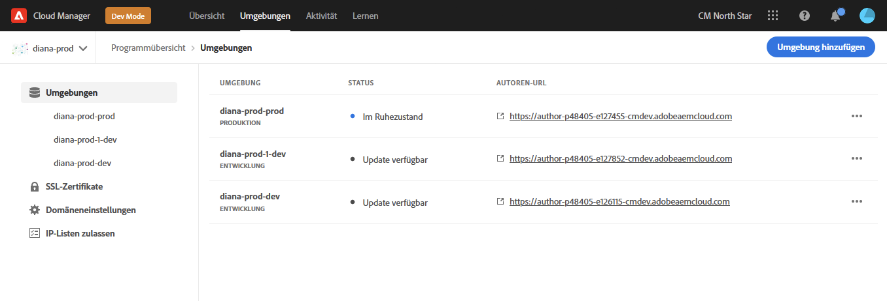

# Verwalten von Umgebungen {#managing-environments}

Erfahren Sie mehr über die Typen von Umgebungen, die Sie erstellen können, und wie Sie sie für Ihr Cloud Manager-Projekt erstellen.

## Umgebungstypen {#environment-types}

Ein Benutzer mit den erforderlichen Berechtigungen kann die folgenden Umgebungstypen erstellen (im Rahmen der dem jeweiligen Mandanten zur Verfügung stehenden Möglichkeiten).

* **Produktion und Staging** - Die Produktions- und Staging-Umgebungen sind als Paar verfügbar und werden für Produktions- bzw. Testzwecke verwendet.

* **Entwicklung** - Eine Entwicklungsumgebung kann sowohl für Entwicklungs- als auch für Testzwecke erstellt werden und kann nur produktionsfremden Pipelines zugeordnet werden.

Die Funktionen einzelner Umgebungen hängen von den Lösungen ab, die im Container aktiviert sind [Programm.](/help/implementing/cloud-manager/getting-access-to-aem-in-cloud/program-types.md)

* [Sites](/help/sites-cloud/home.md)
* [Assets](/help/assets/home.md)
* [Formulare](/help/forms/home.md)
* [Screens](/help/screens-cloud/home.md)

>[!NOTE]
>
>Produktions- und Staging-Umgebungen werden nur als Paar erstellt. Sie können nicht nur eine Staging- oder eine Produktionsumgebung erstellen.

## Hinzufügen einer Umgebung {#adding-environments}

1. Melden Sie sich bei Cloud Manager an unter [my.cloudmanager.adobe.com](https://my.cloudmanager.adobe.com/) und wählen Sie die entsprechende Organisation aus.

1. Klicken Sie auf das Programm, für das Sie eine Umgebung hinzufügen möchten.

1. Aus dem **Programmübersicht** Seite, klicken Sie auf **Umgebung hinzufügen** auf **Umgebungen** -Karte, um eine Umgebung hinzuzufügen.

   

   * Die **Umgebung hinzufügen** ist auch auf der **Umgebungen** Registerkarte.

      

   * Die **Umgebung hinzufügen** kann aufgrund fehlender Berechtigungen oder abhängig von den lizenzierten Ressourcen deaktiviert werden.

1. Im **Umgebung hinzufügen** wird angezeigt:

   * Wählen Sie eine **Umgebungstyp**.
      * Die Anzahl der verfügbaren/verwendeten Umgebungen wird in Klammern hinter dem Umgebungstyp &quot;Entwicklung&quot;angezeigt.
   * Stellen Sie eine **Umgebungsname**.
   * Stellen Sie eine **Umgebungsbeschreibung**.
   * Wählen Sie eine **Cloud-Region**.

   

1. Klicken **Speichern** , um die angegebene Umgebung hinzuzufügen.

Die **Übersicht** Auf dem Bildschirm wird nun Ihre neue Umgebung im **Umgebungen** Karte. Sie können jetzt Pipelines für Ihre neue Umgebung einrichten.

## Umgebungsdetails {#viewing-environment}

Sie können die **Umgebungen** -Karte auf der Übersichtsseite angezeigt, um auf zwei Arten auf Details zu Umgebungen zuzugreifen.

1. Aus dem **Übersicht** Seite, klicken Sie auf die **Umgebungen** oben im Bildschirm.

   

   * Alternativ können Sie auf die **Alle anzeigen** Schaltfläche auf der **Umgebungen** -Karte, um direkt zum **Umgebungen** Registerkarte.

      

1. Die **Umgebungen** öffnet und listet alle Umgebungen für das Programm auf.

   

1. Klicken Sie auf eine Umgebung in der Liste, um deren Details anzuzeigen.

   

Alternativ können Sie auf die Suchschaltfläche der gewünschten Umgebung klicken und dann **Details anzeigen**.

>[!NOTE]
>
>Die **Umgebungen** -Karte listet nur drei Umgebungen auf. Klicken Sie auf **Alle anzeigen** wie zuvor beschrieben, um alle Umgebungen des Programms anzuzeigen.

### Zugriff auf den Vorschaudienst {#access-preview-service}

Cloud Manager bietet für jede AEM as a Cloud Service Umgebung einen Vorschaudienst (bereitgestellt als zusätzlicher Veröffentlichungsdienst).

Mithilfe des Dienstes können Sie eine Vorschau des endgültigen Erlebnisses einer Website anzeigen, bevor diese die tatsächliche Veröffentlichungsumgebung erreicht und öffentlich verfügbar ist.

Bei der Erstellung wird dem Vorschaudienst eine standardmäßige IP-Zulassungsliste mit der Bezeichnung `Preview Default [<envId>]`, wodurch der gesamte Traffic an den Vorschaudienst blockiert wird. Sie müssen die Anwendung der standardmäßigen IP-Zulassungsliste aktiv vom Vorschaudienst deaktivieren, um den Zugriff zu aktivieren.

Ein Benutzer mit den erforderlichen Berechtigungen muss die folgenden Optionen ausführen, bevor er die Vorschau-Dienst-URL an eines Ihrer Teams weitergibt, um den Zugriff auf die Vorschau-URL sicherzustellen.

1. Erstellen Sie eine entsprechende IP-Zulassungsliste, wenden Sie sie auf den Vorschaudienst an und machen Sie die Anwendung sofort rückgängig. `Preview Default [<envId>]` Zulassungsliste.

   * Siehe [Aufheben der Anwendung einer IP-Zulassungsliste](/help/implementing/cloud-manager/ip-allow-lists/unapply-ip-allow-list.md) für weitere Details.

1. Update verwenden **IP-Zulassungsliste** -Workflow, um die standardmäßige IP-Adresse zu entfernen und entsprechend IP-Adressen hinzuzufügen. Weitere Informationen finden Sie unter [Anzeigen und Aktualisieren einer IP-Zulassungsliste](/help/implementing/cloud-manager/ip-allow-lists/view-update-ip-allow-list.md).

Sobald der Zugriff auf den Vorschaudienst entsperrt ist, wird das Sperrsymbol vor dem Vorschaudienstnamen nicht mehr angezeigt.

Nach der Aktivierung können Sie Inhalte über die Benutzeroberfläche Veröffentlichung verwalten in AEM für den Vorschaudienst veröffentlichen. Weitere Informationen finden Sie im Dokument . [Vorschau des Inhalts](/help/sites-cloud/authoring/fundamentals/previewing-content.md) für weitere Details.

>[!NOTE]
>
>Ihre Umgebung muss sich in AEM Version befinden `2021.05.5368.20210529T101701Z` oder neuer. Vergewissern Sie sich, dass in Ihrer Umgebung eine Update-Pipeline erfolgreich ausgeführt wurde.

## Aktualisieren von Umgebungen {#updating-dev-environment}

Als Cloud-nativer Dienst werden Aktualisierungen Ihrer Staging- und Produktionsumgebungen innerhalb von Produktionsprogrammen automatisch von Adobe verwaltet.

Aktualisierungen von Entwicklungsumgebungen sowie Umgebungen in Sandbox-Programmen werden jedoch innerhalb der Programme verwaltet. Wenn in einer solchen Umgebung nicht die neueste öffentlich verfügbare AEM ausgeführt wird, wird der Status auf der **Umgebungen** auf der Karte **Übersicht** Bildschirm des Programms wird angezeigt **Verfügbare Aktualisierung**.

### Updates und Pipelines {#updates-pipelines}

Pipelines sind der einzige Weg [Bereitstellung von Code in den Umgebungen AEM as a Cloud Service.](deploy-code.md) Aus diesem Grund ist jede Pipeline mit einer bestimmten AEM verknüpft.

Wenn Cloud Manager erkennt, dass eine neuere Version von AEM verfügbar ist als die, die zuletzt mit der Pipeline bereitgestellt wurde, wird die **Verfügbare Aktualisierung** Status für die Umgebung.

Die Aktualisierung erfolgt also in zwei Schritten:

1. Aktualisieren der Pipeline mit der neuesten AEM
1. Ausführen der Pipeline zum Bereitstellen der neuen Version der AEM in einer Umgebung

### Aktualisieren Ihrer Umgebungen {#updating-your-environments}

Die **Aktualisieren** -Option verfügbar über **Umgebungen** Karte für Entwicklungsumgebungen und -umgebungen in Sandbox-Programmen durch Klicken auf die Suchschaltfläche der Umgebung.

Diese Option ist auch verfügbar, indem Sie auf die **Umgebungen** und wählen Sie dann die Suchschaltfläche der Umgebung aus.

Ein Benutzer mit der **Bereitstellungsmanager** Rolle kann diese Option verwenden, um die mit dieser Umgebung verknüpfte Pipeline auf die neueste AEM zu aktualisieren.

Nachdem die Pipeline-Version auf die neueste öffentlich verfügbare AEM Version aktualisiert wurde, wird der Benutzer aufgefordert, die zugehörige Pipeline auszuführen, um die neueste Version in der Umgebung bereitzustellen.

Die **Aktualisieren** Das Verhalten der Option hängt von der Konfiguration und dem aktuellen Status des Programms ab.

* Wenn die Pipeline bereits aktualisiert wurde, wird die **Aktualisieren** fordert den Benutzer auf, die Pipeline auszuführen.
* Wenn die Pipeline bereits aktualisiert wird, wird die **Aktualisieren** informiert den Benutzer darüber, dass bereits eine Aktualisierung ausgeführt wird.
* Wenn eine geeignete Pipeline nicht beendet wird, wird die **Aktualisieren** fordert den Benutzer auf, eine zu erstellen.

## Löschen von Entwicklungsumgebungen {#deleting-environment}

Benutzer mit den erforderlichen Berechtigungen können eine Entwicklungsumgebung löschen.

Aus dem **Übersicht** Bildschirm des Programms auf der **Umgebungen** und klicken Sie auf die Suchschaltfläche der Entwicklungsumgebung, die Sie löschen möchten.

Die Löschoption ist auch über die **Umgebungen** des **Übersicht** des Programms. Klicken Sie auf die Suchschaltfläche der Umgebung und wählen Sie **Löschen**.

>[!NOTE]
>
>* In einem Produktionsprogramm erstellte Produktions- und Staging-Umgebungen können nicht gelöscht werden.
>* Produktions- und Staging-Umgebungen in einem Sandbox-Programm können gelöscht werden.

## Zugriffsverwaltung {#managing-access}

Auswählen **Zugriff verwalten** aus dem Suchmenü der Umgebung auf **Umgebungen** Karte. Sie können direkt zur Autoreninstanz navigieren und den Zugriff für Ihre Umgebung verwalten.

## Zugriff auf die Developer Console {#accessing-developer-console}

Auswählen **Entwicklerkonsole** aus dem Suchmenü der Umgebung auf **Umgebungen** Karte. Dadurch wird eine neue Registerkarte in Ihrem Browser mit der Anmeldeseite zum **Entwicklerkonsole**.

Nur Benutzer mit der **Entwickler** Die Rolle hat Zugriff auf die **Entwicklerkonsole**. Für Sandbox-Programme hat jedoch jeder Benutzer mit Zugriff auf das Sandbox-Programm Zugriff auf **Entwicklerkonsole**.

Weitere Informationen finden Sie im Dokument . [Ruhezustand und Deaktivieren des Ruhezustands von Sandbox-Umgebungen](https://experienceleague.adobe.com/docs/experience-manager-cloud-service/onboarding/getting-access/cloud-service-programs/sandbox-programs.html?lang=de#hibernating-introduction) für weitere Details.

Diese Option ist auch über die **Umgebung** des **Übersicht** beim Klicken auf das Auslassungsmenü einer einzelnen Umgebung.

## Lokale Anmeldung {#login-locally}

Auswählen **Lokale Anmeldung** aus dem Suchmenü der Umgebung im **Umgebungen** Karte, um sich lokal bei Adobe Experience Manager anzumelden.

Darüber hinaus können Sie sich lokal über die **Umgebungen** des **Übersicht** Seite.

## Verwalten von benutzerdefinierten Domain-Namen {#manage-cdn}

Benutzerdefinierte Domänennamen werden in Cloud Manager für Sites-Programme sowohl für Veröffentlichungs- als auch für Vorschaudienste unterstützt. Jede Cloud Manager-Umgebung kann bis zu 250 benutzerdefinierte Domänen hosten.

Um benutzerdefinierte Domänennamen zu konfigurieren, navigieren Sie zum **Umgebungen** und klicken Sie auf eine Umgebung, um die Details der Umgebung anzuzeigen.

Die folgenden Aktionen können für den Veröffentlichungsdienst für Ihre Umgebung ausgeführt werden.

* [Hinzufügen eines benutzerdefinierten Domain-Namens](/help/implementing/cloud-manager/custom-domain-names/add-custom-domain-name.md)

* [Verwalten von benutzerdefinierten Domain-Namen](/help/implementing/cloud-manager/custom-domain-names/managing-custom-domain-names.md)

* [Überprüfen des Status des benutzerdefinierten Domain-Namens](/help/implementing/cloud-manager/custom-domain-names/check-domain-name-status.md#pre-existing-cdn) oder eines [SSL-Zertifikats](/help/implementing/cloud-manager/managing-ssl-certifications/managing-certificates.md#pre-existing-cdn).

* [Überprüfen des Status einer IP-Zulassungsliste](/help/implementing/cloud-manager/ip-allow-lists/check-ip-allow-list-status.md#pre-existing-cdn)

## Verwalten von IP-Zulassungslisten {#manage-ip-allow-lists}

IP-Zulassungslisten werden in Cloud Manager für Autoren-, Veröffentlichungs- und Vorschaudienste für Sites-Programme unterstützt.

Um IP-Zulassungslisten zu verwalten, navigieren Sie zum **Umgebungen** des **Übersicht** Seite Ihres Programms. Klicken Sie auf eine einzelne Umgebung, um deren Details zu verwalten.

### Anwenden einer IP-Zulassungsliste {#apply-ip-allow-list}

Beim Anwenden einer IP-Zulassungsliste werden alle in der Definition der Zulassungsliste enthaltenen IP-Bereiche mit einem Autoren- oder Veröffentlichungsdienst in einer Umgebung verknüpft. Ein Benutzer im **Business Owner** oder **Bereitstellungsmanager** -Rolle muss angemeldet sein, um eine IP-Zulassungsliste anwenden zu können.

Die IP-Zulassungsliste muss in Cloud Manager vorhanden sein, damit sie auf eine Umgebung angewendet werden kann. Weitere Informationen zu IP-Zulassungslisten in Cloud Manager finden Sie im Dokument .[Einführung in IP-Zulassungslisten in Cloud Manager.](/help/implementing/cloud-manager/ip-allow-lists/introduction.md)

Gehen Sie wie folgt vor, um eine IP-Zulassungsliste anzuwenden.

1. Navigieren Sie von der **Umgebungen** Programmregisterkarte **Übersicht** und navigieren Sie zum **IP-Zulassungslisten** Tabelle.
1. Verwenden Sie die Eingabefelder oben in der Tabelle der IP-Zulassungsliste, um die IP-Zulassungsliste und den Autoren- oder Veröffentlichungsdienst auszuwählen, auf den Sie sie anwenden möchten.
1. Klicken Sie auf **Übernehmen** und bestätigen Sie Ihre Übermittlung.

### Aufheben der Anwendung einer IP-Zulassungsliste {#unapply-ip-allow-list}

Durch das Rückgängigmachen der Anwendung einer IP-Zulassungsliste werden alle in der Definition der Zulassungsliste enthaltenen IP-Bereiche von einem Autoren- oder Publisher-Dienst in einer Umgebung getrennt. Ein Benutzer im **Business Owner** oder **Bereitstellungsmanager** -Rolle muss angemeldet sein, damit die Anwendung einer IP-Zulassungsliste rückgängig gemacht werden kann.

Führen Sie die folgenden Schritte aus, um die Anwendung einer IP-Zulassungsliste aufzuheben.

1. Navigieren Sie von der **Umgebungen** Programmregisterkarte **Übersicht** und navigieren Sie zum **IP-Zulassungslisten** Tabelle.
1. Identifizieren Sie die Zeile, in der die IP-Zulassungsliste-Regel, deren Anwendung Sie aufheben möchten, aufgeführt ist.
1. Wählen Sie die Suchschaltfläche am Ende der Zeile aus.
1. Auswählen **Nicht anwenden** und bestätigen Sie Ihre Übermittlung.
