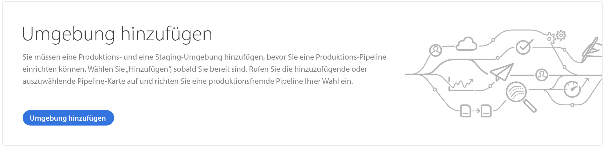

# Verwalten von Umgebungen {#manage-environments}

Im folgenden Abschnitt werden die Umgebung beschrieben, die ein Benutzer erstellen kann, sowie die Möglichkeiten zum Erstellen einer Umgebung.

## Umgebung {#environment-types}

Ein Benutzer mit den erforderlichen Berechtigungen kann die folgenden Umgebung erstellen (innerhalb der Grenzen dessen, was dem jeweiligen Mandanten zur Verfügung steht).

* **Produktions- und Stage-Umgebung**:
Die Produktions- und Produktionsstufe ist als Duo verfügbar und wird für Test- und Produktionszwecke verwendet.

* **Entwicklung**: Eine Entwicklungs-Umgebung kann zu Entwicklungs- und Testzwecken erstellt werden und wird nur mit Nicht-Produktionsleitungen in Verbindung gebracht.

   >[!NOTE]
   >Eine Entwicklungs-Umgebung, die automatisch in einem Sandbox-Programm erstellt wird, wird so konfiguriert, dass sie Sites- und Asset-Lösungen enthält.

   Die folgende Tabelle fasst die Umgebung und ihre Attribute zusammen:

   | Name | Autorenebene | Veröffentlichungsstufe | Benutzer kann | Benutzer kann | Pipeline, die mit der Umgebung verknüpft werden kann |
   |--- |--- |--- |--- |---|---|
   | Produktion | Ja | Ja, wenn Sites enthalten sind | Ja | Nein | Produktionsleitung |
   | Bühne | Ja | Ja, wenn Sites enthalten sind | Ja | Nein | Produktionsleitung |
   | Entwicklung | Ja | Ja, wenn Sites enthalten sind | Ja | Ja | Produktionsfremde Pipeline |

   >[!NOTE]
   >Die Produktions- und Produktionsstufe ist als Duo verfügbar und wird für Test- und Produktionszwecke verwendet.  Benutzer können nicht nur eine Stage- oder Produktions-Umgebung erstellen.

## Hinzufügen einer Umgebung {#adding-environments}

1. Der Benutzer klickt auf die Schaltfläche **Umgebung hinzufügen**, um eine Umgebung hinzuzufügen.

   >[!NOTE]
   >Auf diese Schaltfläche kann auch von der Seite &quot;Umgebung&quot;oder von der Karte &quot;Umgebung&quot;aus zugegriffen werden. Als Benutzer wird diese Option nur angezeigt, wenn Sie über die erforderliche Berechtigung verfügen. Wenden Sie sich bei Fragen an Ihren Adobe-Kundenbetreuer.

   

1. Das Dialogfeld **Umgebung hinzufügen** wird angezeigt. Der Benutzer muss Details wie **Umgebungstyp**, **Umgebungsname** und **Umgebungsbeschreibung** übermitteln (je nach Ziel des Benutzers, die Umgebung innerhalb der Grenzen des für den jeweiligen Mandanten verfügbaren Bereichs zu erstellen).

   

   >[!NOTE]
   >Beim Erstellen einer Umgebung werden eine oder mehrere *Integrationen* in Adobe I/O erstellt. Diese sind für Kunden sichtbar, die Zugriff auf die Adobe-E/A-Konsole haben, und dürfen nicht gelöscht werden. Dies wird in der Beschreibung in der Adobe-E/A-Konsole nicht berücksichtigt.

   

1. Klicken Sie auf **Speichern** , um eine Umgebung mit den ausgefüllten Kriterien hinzuzufügen.  Jetzt wird im Bildschirm &quot; *Übersicht* &quot;die Karte angezeigt, von der aus Sie Ihre Pipeline einrichten können.

   >[!NOTE]
   >Falls Sie noch keine Pipeline für die Nicht-Produktion eingerichtet haben, wird im Bildschirm &quot; *Übersicht* &quot;die Karte angezeigt, von der aus Sie Ihre Nicht-Produktionspipeline erstellen können.

## Aktualisieren der Umgebung {#updating-dev-environment}

Updates der Stage- und Production-Umgebung werden automatisch von Adobe verwaltet.

Updates der Entwicklungs-Umgebung werden von den Benutzern des Programms verwaltet. Wenn eine Umgebung nicht die neueste öffentlich verfügbare AEM-Version ausführt, zeigt der Status auf der Umgebung-Karte auf dem Startbildschirm die **AKTUALISIERUNG** an.

)

Wenn dieser Status angezeigt wird, ist die Option **Aktualisieren** im Dropdownmenü sowohl auf der Umgebungskarte als auch im Menü **Verwalten** verfügbar, wenn Sie auf **Details** auf der Karte **UMGEBUNGEN** klicken.

Durch Auswahl dieser Option aus dem Dropdown-Menü kann ein Deployment Manager die mit dieser Umgebung verknüpfte Pipeline auf die neueste Version aktualisieren und dann die Pipeline ausführen.

Wenn die Pipeline bereits aktualisiert wurde, wird der Benutzer aufgefordert, die Pipeline auszuführen.
