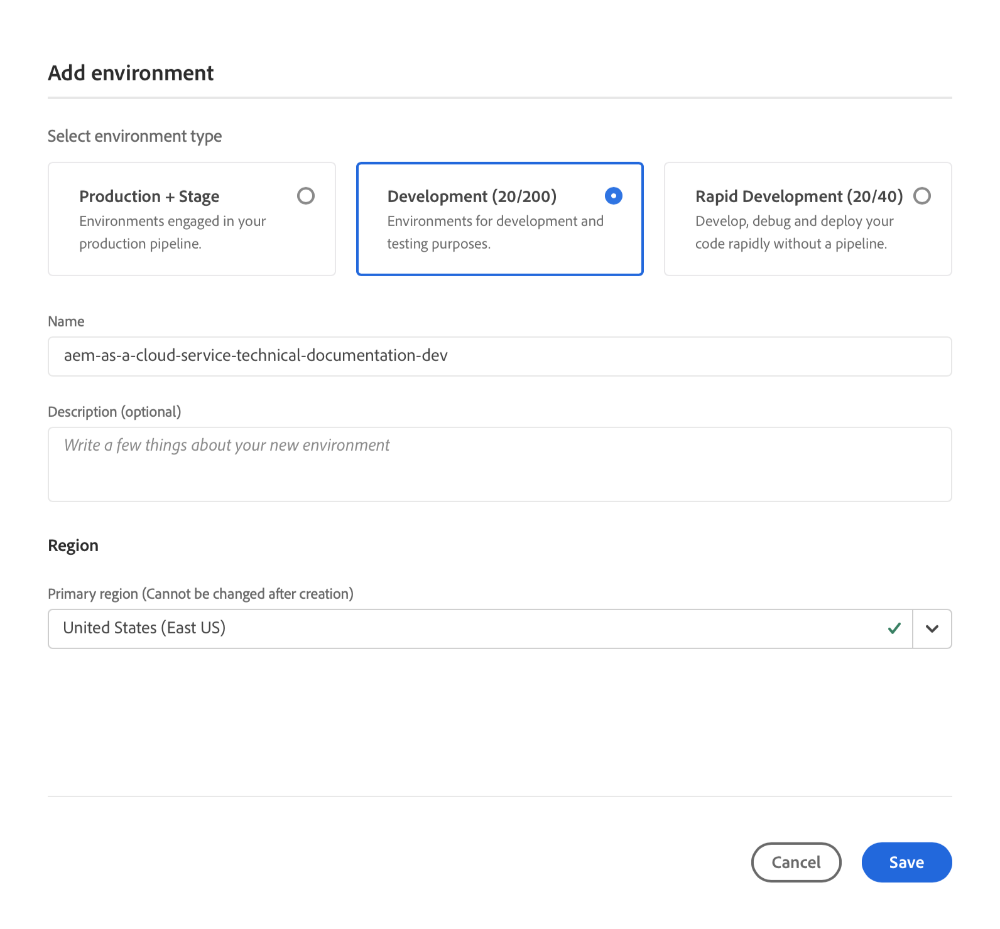

# Verwalten von Umgebungen {#manage-environments}

Im folgenden Abschnitt werden die Umgebungstypen beschrieben, die ein Benutzer erstellen kann, sowie die Möglichkeiten zum Erstellen von Umgebungen durch den Benutzer.

## Umgebungstypen {#environment-types}

Ein Benutzer mit den erforderlichen Berechtigungen kann die folgenden Umgebungstypen erstellen (im Rahmen der dem jeweiligen Mandanten zur Verfügung stehenden Möglichkeiten).

* **Produktions- und Staging-Umgebung**:
Die Produktions- und Staging-Umgebung ist in kombinierter Form verfügbar und wird zu Test- und Produktionszwecken genutzt.

* **Entwicklungsumgebung**: Die Entwicklungsumgebung kann zu Entwicklungs- und Testzwecken erstellt werden und wird ausschließlich produktionsfremden Pipelines zugeordnet.

   >[!NOTE]
   >Automatisch in einem Sandbox-Programm erstellte Entwicklungsumgebungen werden so konfiguriert, dass sie AEM Sites- und AEM Assets-Lösungen einschließen.

   In der folgenden Tabelle sind die Umgebungstypen und ihre Attribute zusammengefasst:

   | Name | Autorenebene | AEM Publish-Ebene | Benutzer kann erstellen | Benutzer kann löschen | Pipeline, die der Umgebung zugeordnet werden kann |
   |--- |--- |--- |--- |---|---|
   | Produktion | Ja | Ja, wenn Sites eingeschlossen ist | Ja | Nein | Produktions-Pipeline |
   | Staging | Ja | Ja, wenn Sites eingeschlossen ist | Ja | Nein | Produktions-Pipeline |
   | Entwicklung | Ja | Ja, wenn Sites eingeschlossen ist | Ja | Ja | Produktionsfremde Pipeline |

   >[!NOTE]
   >Die Produktions- und Staging-Umgebung ist in kombinierter Form verfügbar und wird zu Test- und Produktionszwecken genutzt.  Benutzer haben nicht die Möglichkeit, Produktions- und Staging-Umgebungen einzeln zu erstellen.

## Hinzufügen von Umgebungen {#adding-environments}

1. Klicken Sie auf **Umgebung hinzufügen**, um eine Umgebung hinzuzufügen. Auf diese Schaltfläche kann über den Bildschirm **Umgebungen** zugegriffen werden.
   

   Die Option **Umgebung hinzufügen** ist auch auf der Karte **Umgebungen** verfügbar, wenn das Programm keine Umgebung enthält.

   

   >[!NOTE]
   >Die Option **Umgebung hinzufügen** wird aufgrund fehlender Berechtigungen oder vertraglicher Verpflichtungen deaktiviert.

1. Daraufhin erscheint das Dialogfeld **Umgebung hinzufügen**. Dort muss der Benutzer die Felder **Umgebungstyp**, **Umgebungsname** und **Umgebungsbeschreibung** ausfüllen (je nach Ziel des Benutzers bei der Erstellung der Umgebung im Rahmen der dem jeweiligen Mandanten zur Verfügung stehenden Möglichkeiten).

   

   >[!NOTE]
   >Beim Erstellen einer Umgebung werden eine oder mehrere *Integrationen* in Adobe I/O erstellt. Diese sind für Kunden sichtbar, die Zugriff auf die Adobe I/O Console haben, und dürfen nicht gelöscht werden. Dies wird in der Beschreibung der Adobe I/O Console ausgeschlossen.

   

1. Klicken Sie auf **Speichern**, um eine Umgebung mit den ausgefüllten Kriterien hinzuzufügen.  Jetzt wird auf dem Bildschirm *Übersicht* die Karte angezeigt, über die Sie Ihre Pipeline einrichten können.

   >[!NOTE]
   >Falls Sie noch keine produktionsfremde Pipeline eingerichtet haben, wird im Bildschirm *Übersicht* die Karte angezeigt, von der aus Sie Ihre produktionsfremde Pipeline erstellen können.

## Umgebungsdetails {#viewing-environment}

Die **Umgebungskarte** auf der Übersichtsseite führt nun bis zu drei Umgebungen auf.

1. Klicken oder tippen Sie auf die Schaltfläche **Alles anzeigen**, um zur Zusammenfassungsseite der **Umgebung** zu navigieren und eine Tabelle mit einer vollständigen Liste von Umgebungen anzuzeigen.

   

1. Auf der Seite **Umgebungen** wird die Liste aller vorhandenen Umgebung angezeigt.

   

1. Wählen Sie eine der Umgebung aus der Liste aus, um die Details zur Umgebung anzuzeigen.

   >[!NOTE]
   >Der Vorschaudienst wird fortlaufend für alle Programme bereitgestellt. Kunden werden im Produkt benachrichtigt, wenn ihr Programm für den Vorschaudienst aktiviert ist. Weitere Informationen finden Sie im Abschnitt [Zugriff auf den Vorschaudienst](#access-preview-service) .

   

### Zugriff auf den Vorschaudienst {#access-preview-service}

Die Funktion &quot;Vorschaufunktion&quot;bietet für jede AEM als Cloud Service-Umgebung über Cloud Manager einen zusätzlichen Vorschau-(Veröffentlichungs-)Dienst.

Zeigen Sie eine Vorschau des endgültigen Erlebnisses einer Website an, bevor diese die Veröffentlichungsumgebung erreicht und öffentlich verfügbar ist. Einige Hinweise, bevor Sie den Vorschaudienst anzeigen und verwenden können:

1. **AEM Version**: Ihre Umgebung muss AEM Version  `2021.5.5343.20210542T070738Z` oder höher sein. Stellen Sie sicher, dass in Ihrer Umgebung eine Update-Pipeline erfolgreich ausgeführt wurde.

1. **Standard-IP-Zulassungsliste sperren**: Bei der ersten Erstellung müssen Sie die Anwendung der standardmäßigen IP-Zulassungsliste im Vorschaudienst in Ihrer Umgebung aktiv aufheben, um den Zugriff zu ermöglichen.

1. **Inhalt zur Vorschau veröffentlichen**: Sie können Inhalte im Vorschaudienst veröffentlichen, indem Sie die Benutzeroberfläche Veröffentlichung verwalten in AEM verwenden. Weitere Informationen finden Sie unter [Vorschau von Inhalten](https://experienceleague.adobe.com/docs/experience-manager-cloud-service/sites/authoring/fundamentals/previewing-content.html?lang=en) .

Ein Benutzer mit den erforderlichen Berechtigungen muss einen der folgenden Schritte ausführen, um *den Zugriff auf den Vorschaudienst zu entsperren und den gewünschten Zugriff bereitzustellen:*

1. Erstellen Sie eine entsprechende IP-Zulassungsliste und wenden Sie sie auf den Vorschaudienst an. Befolgen Sie dies sofort, indem Sie die Anwendung von `Preview Default [Env ID] IP Allow List` im Vorschaudienst aufheben.

   ODER,

1. Verwenden Sie den Workflow IP-Zulassungsliste-Update , um die standardmäßige IP-Adresse zu entfernen und die entsprechenden IP-Adressen hinzuzufügen. Weitere Informationen finden Sie unter [Anzeigen und Aktualisieren einer IP-Zulassungsliste](/help/implementing/cloud-manager/ip-allow-lists/view-update-ip-allow-list.md).

   >[!NOTE]
   >Die oben genannten Schritte müssen vor der Freigabe der Vorschau-Dienst-URL für ein Team durchgeführt werden, um sicherzustellen, dass die entsprechenden Mitglieder Ihres Teams auf die Vorschau-URL zugreifen können.

   Sobald der Zugriff auf den Vorschaudienst entsperrt ist, wird das Sperrsymbol nicht mehr angezeigt.

## Aktualisieren einer Umgebung {#updating-dev-environment}

Aktualisierungen der Staging- und Produktionsumgebungen werden automatisch von Adobe verwaltet.

Aktualisierungen der Entwicklungsumgebungen werden von den Benutzern des Programms verwaltet. Wenn in einer Umgebung nicht die neueste öffentlich verfügbare AEM-Version ausgeführt wird, lautet der Status für die Umgebungskarte auf dem Startbildschirm **UPDATE VERFÜGBAR**.

Die Option **Aktualisieren** ist auf der Karte **Umgebungen** verfügbar.
Diese Option steht auch zur Verfügung, wenn Sie auf der Karte **Umgebungen** auf **Details** klicken. Die Seite **Umgebungen** wird geöffnet. Wenn Sie die Umgebung „Entwicklung“ ausgewählt haben, klicken Sie auf **...** und wählen Sie **Aktualisieren**, wie in der folgenden Abbildung dargestellt:

Durch Auswahl dieser Option kann ein Implementierung-Manager die dieser Umgebung zugeordnete Pipeline auf die neueste Version aktualisieren und die Pipeline dann ausführen.

Wenn die Pipeline bereits aktualisiert ist, wird der Benutzer aufgefordert, die Pipeline auszuführen.

## Löschen einer Umgebung {#deleting-environment}

Benutzer mit den erforderlichen Berechtigungen können eine Entwicklungsumgebung löschen.

Die Option **Löschen** ist im Dropdown-Menü auf der Karte **Umgebungen** verfügbar. Klicken Sie auf **...** für eine Entwicklungsumgebung, die Sie löschen möchten.

Die Option „Löschen“ ist auch verfügbar, wenn Sie auf der Karte **Umgebungen** auf **Details** klicken. Die Seite **Umgebungen** wird geöffnet. Wenn Sie die Umgebung „Entwicklung“ ausgewählt haben, klicken Sie auf **...** und wählen Sie **Löschen**, wie in der folgenden Abbildung dargestellt:

>[!NOTE]
>Diese Funktion steht nicht für Produktions-/Staging-Umgebungen zur Verfügung, die in einem für Produktionszwecke eingerichteten Produktionsprogramm festgelegt sind. Die Funktion ist jedoch für Produktions-/Staging-Umgebungen in einem Sandbox-Programm verfügbar.

## Zugriffsverwaltung {#managing-access}

Wählen Sie **Zugriff verwalten** aus dem Dropdown-Menü auf der Karte **Umgebungen** aus. Sie können direkt zur Autoreninstanz navigieren und den Zugriff für Ihre Umgebung verwalten.

Weitere Informationen finden Sie unter [Zugriffsverwaltung für Autoreninstanz](/help/onboarding/what-is-required/accessing-aem-instance.md).

## Aufrufen der Developer Console {#accessing-developer-console}

Wählen Sie **Developer Console** aus dem Dropdown-Menü auf der Karte **Umgebungen** aus. Dadurch wird eine neue Registerkarte in Ihrem Browser mit der Anmeldeseite der **Developer Console** geöffnet.

Nur Benutzer mit der Rolle „Entwickler“ haben Zugriff auf die **Developer Console**. Die Ausnahme bilden Sandbox-Programme, bei denen jeder Benutzer mit Zugriff auf das Cloud Manager-Sandbox-Programm Zugriff auf die **Developer Console** hat.

Weitere Informationen finden Sie unter [Versetzen von Sandbox-Umgebungen in den Ruhezustand und Aufheben des Ruhezustandes](https://experienceleague.adobe.com/docs/experience-manager-cloud-service/onboarding/getting-access/cloud-service-programs/sandbox-programs.html#hibernating-introduction).

Diese Option steht auch zur Verfügung, wenn Sie auf der Karte **Umgebungen** auf **Details** klicken. Die Seite **Umgebungen** wird geöffnet. Wenn Sie eine Umgebung ausgewählt haben, klicken Sie auf **...** und wählen Sie **Developer Console**.

## Lokale Anmeldung {#login-locally}

Wählen Sie **Lokale Anmeldung** aus dem Dropdown-Menü in der **Umgebungskarte** aus, um sich lokal bei Adobe Experience Manager anzumelden.

Zusätzlich können Sie sich lokal über die Zusammenfassungsseite für die **Umgebungen** anmelden.

## Verwalten von benutzerdefinierten Domain-Namen {#manage-cdn}

Navigieren Sie von der Zusammenfassungsseite für die Umgebungen zur Detailseite **Umgebungen**.

>[!NOTE]
>Benutzerdefinierte Domänennamen werden jetzt in Cloud Manager für Sites-Programme sowohl für Veröffentlichungs- als auch für Vorschaudienste unterstützt. Jede Cloud Manager-Umgebung kann bis zu 250 benutzerdefinierte Domains pro Umgebung hosten.

Die folgenden Aktionen können wie unten beschrieben für Ihre Umgebung im Publish-Service ausgeführt werden:

1. [Hinzufügen eines benutzerdefinierten Domain-Namens](/help/implementing/cloud-manager/custom-domain-names/add-custom-domain-name.md)

1. [Anzeigen und Aktualisieren eines benutzerdefinierten Domain-Namens](/help/implementing/cloud-manager/custom-domain-names/view-update-replace-custom-domain-name.md)

1. [Löschen eines benutzerderdefinierten Domain-Namens](/help/implementing/cloud-manager/custom-domain-names/delete-custom-domain-name.md)

1. [Überprüfen des Status des benutzerdefinierten Domain-Namens](/help/implementing/cloud-manager/custom-domain-names/check-domain-name-status.md#pre-existing-cdn) oder eines [SSL-Zertifikats](/help/implementing/cloud-manager/managing-ssl-certifications/check-status-ssl-certificate.md#pre-existing-cdn).

1. [Überprüfen des Status einer IP-Zulassungsliste](/help/implementing/cloud-manager/ip-allow-lists/check-ip-allow-list-status.md#pre-existing-cdn)

## Verwalten von IP-Zulassungslisten {#manage-ip-allow-lists}

Navigieren Sie auf der Zusammenfassungsseite für die Umgebungen zur Seite „Umgebungsdetails“. Hier können Sie die folgenden Aktionen für den Publish- und/oder Author-Service für Ihre Umgebung durchführen.

>[!NOTE]
>Die Funktion &quot;IP-Zulassungsliste&quot;wird jetzt in Cloud Manager für Autoren-, Veröffentlichungs- und Vorschaudienste unterstützt (verfügbar in Sites-Programmen).

### Anwenden einer IP-Zulassungsliste {#apply-ip-allow-list}

Beim Übernehmen einer IP-Zulassungsliste werden alle in der Definition der Zulassungsliste enthaltenen IP-Bereiche mit einem Author- oder Publish-Service in einer Umgebung verknüpft. Um eine IP-Zulassungsliste anwenden zu können, muss der betreffende Anwender die Rolle „Geschäftsinhaber“ oder „Bereitstellungs-Manager“ innehaben und angemeldet sein.

>[!NOTE]
>Die IP-Zulassungsliste muss in Cloud Manager vorhanden sein, damit sie für einen Umgebungs-Service übernommen werden kann. Weitere Informationen zu IP-Zulassungslisten in Cloud Manager finden Sie unter [Einführung in IP-Zulassungslisten in Cloud Manager](/help/implementing/cloud-manager/ip-allow-lists/introduction.md).

Gehen Sie folgendermaßen vor, um eine IP-Zulassungsliste zu übernehmen:

1. Navigieren Sie zur gewünschten Umgebung auf der Seite **Umgebungsdetails** und navigieren Sie zur Tabelle **IP-Zulassungslisten**.
1. Verwenden Sie die Eingabefelder oben in der Tabelle der IP-Zulassungsliste, um die IP-Zulassungsliste und den Author- oder Publish-Service auszuwählen, für den Sie sie übernehmen möchten.
1. Klicken Sie auf **Übernehmen** und bestätigen Sie Ihre Übermittlung.

### Aufheben der Anwendung einer IP-Zulassungsliste {#unapply-ip-allow-list}

Das Aufheben der Anwendung einer IP-Zulassungsliste ist der Prozess, bei dem alle in der Definition der Zulassungsliste enthaltenen IP-Bereiche von einem Author- und/oder Publish-Service einer Umgebung getrennt werden. Ein Benutzer mit der Rolle „Business Owner“ oder „Deployment Manager“ muss angemeldet sein, um die Anwendung einer IP-Zulassungsliste aufzuheben.

Gehen Sie wie folgt vor, um die Anwendung einer IP-Zulassungsliste aufzuheben:

1. Navigieren Sie im Bildschirm **Umgebungen** zur Seite mit den Umgebungsdetails und gehen Sie zur Tabelle **IP-Zulassungsliste**.
1. Identifizieren die Zeile, in der die Regel der IP-Zulassungsliste aufgeführt ist, deren Anwendung Sie aufheben möchten.
1. Wählen Sie das Menü **...** ganz rechts in der Zeile aus.
1. Wählen Sie die Option **Anwendung aufheben** aus und bestätigen Sie Ihre Übermittlung.
