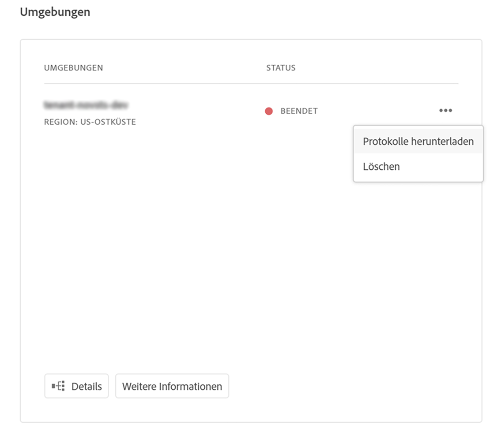

# Zugreifen auf und Verwalten von Protokollen {#manage-logs}

Benutzer können über die Umgebungskarte auf eine Liste der verfügbaren Protokolldateien für die ausgewählte Umgebung zugreifen. Benutzer können auf eine Liste der verfügbaren Protokolldateien für die ausgewählte Umgebung zugreifen.

Diese Dateien können über die Benutzeroberfläche heruntergeladen werden. Dies kann über die Seite **Übersicht** erfolgen:



Oder über die Seite **Umgebungen**:


>[!NHinweis]
>Unabhängig davon, wo es geöffnet wird, erscheint dasselbe Dialogfeld und ermöglicht das Herunterladen einer jeweiligen Protokolldatei.


## Protokolle über API {#logs-thorugh-api}

Abgesehen vom Herunterladen von Protokollen über die Benutzeroberfläche sind die Protokolle auch über die API und die Befehlszeilenschnittstelle verfügbar.

Für das Herunterladen der Protokolldateien für eine bestimmte Umgebung würde der Befehl ungefähr folgendermaßen aussehen:

```java
$ aio cloudmanager:download-logs --programId 5 1884 author aemerror
```

Der folgende Befehl ermöglicht das Tailing von Protokollen:

```java
$ aio cloudmanager:tail-log --programId 5 1884 author aemerror
```

Um die Umgebungs-ID (in diesem Fall „1884“) und die verfügbaren Dienst- oder Protokollnamenoptionen abzurufen, können Sie den folgenden Befehl verwenden:

```java
$ aio cloudmanager:list-environments
Environment Id Name                     Type  Description                          
1884           FoundationInternal_dev   dev   Foundation Internal Dev environment  
1884           FoundationInternal_stage stage Foundation Internal STAGE environment
1884           FoundationInternal_prod  prod  Foundation Internal Prod environment
 
 
$ aio cloudmanager:list-available-log-options 1884
Environment Id Service    Name         
1884           author     aemerror     
1884           author     aemrequest   
1884           author     aemaccess    
1884           publish    aemerror     
1884           publish    aemrequest   
1884           publish    aemaccess    
1884           dispatcher httpderror   
1884           dispatcher aemdispatcher
1884           dispatcher httpdaccess
```

>[!NHinweis]
>Während **Protokoll-Downloads** sowohl über die Benutzeroberfläche als auch über die API möglich sind, ist das **Protokoll-Tailing** nur über APIs/die Befehlszeilenschnittstelle möglich.

### Zusätzliche Ressourcen {#resources}

Weitere Informationen zur Cloud Manager-API und zur Adobe I/O-CLI finden Sie in den folgenden zusätzlichen Ressourcen:

* [Dokumentation für Cloud Manager-API](https://www.adobe.io/apis/experiencecloud/cloud-manager/docs.html)
* [Adobe I/O-CLI](https://github.com/adobe/aio-cli-plugin-cloudmanager)