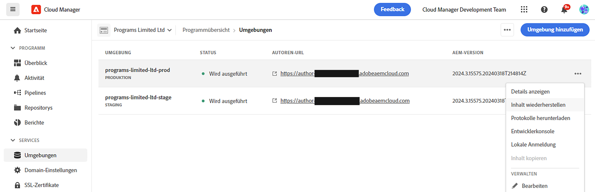

# Zugreifen auf und Verwalten von Protokollen {#manage-logs}

Erfahren Sie, wie Sie auf Protokolle zugreifen und diese verwalten können, um Ihren Entwicklungsprozess in AEM as a Cloud Service zu unterstützen.

Sie können über die Karte **Umgebungen** auf der Seite **Überblick** oder der Seite „Umgebungsdetails“ auf eine Liste der verfügbaren Protokolldateien für die ausgewählte Umgebung zugreifen.

## Herunterladen von Protokollen {#download-logs}

Gehen Sie wie folgt vor, um Protokolle herunterzuladen.

1. Melden Sie sich unter [my.cloudmanager.adobe.com](https://my.cloudmanager.adobe.com/) bei Cloud Manager an und wählen Sie die entsprechende Organisation und das entsprechende Programm aus.

1. Navigieren Sie von der Seite **Überblick** zur Karte **Umgebungen**.

1. Wählen Sie **Protokolle herunterladen** aus dem Menü mit den Auslassungspunkten.

   

1. Wählen Sie im Dialog **Protokolle herunterladen** den entsprechenden **Service** aus dem Dropdown-Menü aus

   

1. Nachdem Sie Ihren Service ausgewählt haben, klicken Sie auf das Download-Symbol neben dem Protokoll, das Sie abrufen möchten.

Sie können Ihre Protokolle auch über die Seite **Umgebungen** aufrufen.



## Protokolle über API {#logs-through-api}

Abgesehen vom Herunterladen von Protokollen über die Benutzeroberfläche sind die Protokolle auch über die API und die Befehlszeilenschnittstelle verfügbar.

Um die Protokolldateien für eine bestimmte Umgebung herunterzuladen, ähnelt der Befehl dem folgenden.

```shell
$ aio cloudmanager:download-logs --programId 5 1884 author aemerror
```

Außerdem können Sie Protokolle über die Befehlszeilenschnittstelle verfolgen.

```shell
$ aio cloudmanager:tail-log --programId 5 1884 author aemerror
```

Um die Umgebungs-ID (in diesem Fall „1884“) und die verfügbaren Service- oder Protokollnamenoptionen abzurufen, können Sie die folgenden Befehle verwenden.

```shell
$ aio cloudmanager:list-environments
Environment Id Name                     Type  Description                          
1884           FoundationInternal_dev   dev   Foundation Internal Dev environment  
1884           FoundationInternal_stage stage Foundation Internal STAGE environment
1884           FoundationInternal_prod  prod  Foundation Internal Prod environment
 
 
$ aio cloudmanager:list-available-log-options 1884
Environment Id Service    Name         
1884           author     aemerror     
1884           author     aemrequest   
1884           author     aemaccess    
1884           publish    aemerror     
1884           publish    aemrequest   
1884           publish    aemaccess    
1884           dispatcher httpderror   
1884           dispatcher aemdispatcher
1884           dispatcher httpdaccess
```

### Zusätzliche Ressourcen {#resources}

Weitere Informationen zur Cloud Manager-API und zur Adobe I/O-CLI finden Sie in den folgenden zusätzlichen Ressourcen:

* [Dokumentation für Cloud Manager-API](https://developer.adobe.com/experience-cloud/cloud-manager/)
* [Adobe I/O-CLI](https://github.com/adobe/aio-cli-plugin-cloudmanager)
