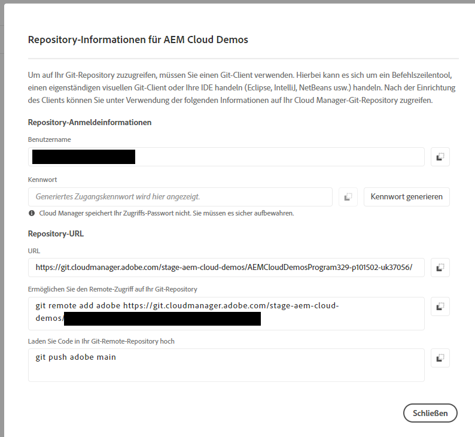
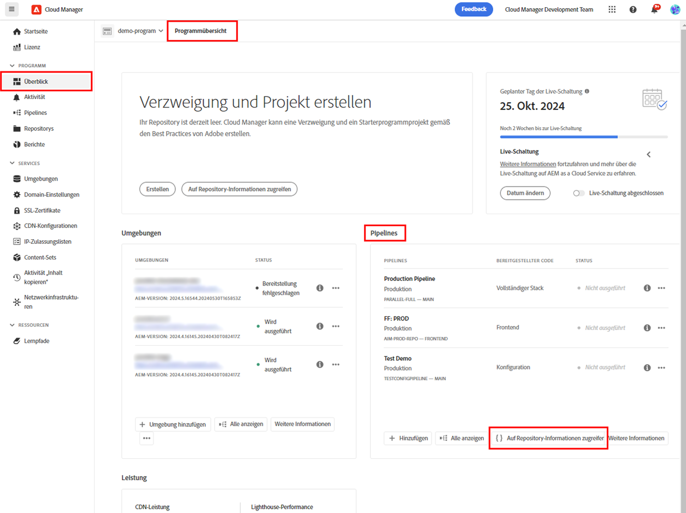
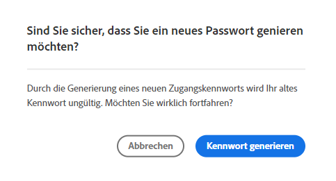

# Repository-Zugriffsinformationen {#accessing-repos}

Erfahren Sie, wie Sie mithilfe der Self-Service-Verwaltung der Git-Repositorys über Cloud Manager auf Ihre von Adobe verwalteten Git-Repositorys zugreifen und diese verwalten können.

## Zugreifen auf Repository-Informationen von der Übersichtsseite aus {#overview-page}

Cloud Manager macht es Ihnen leicht, Ihre Repository-Zugriffsinformationen für von Adobe verwaltete Repositorys abzurufen, indem Sie auf der Karte **Pipelines** die Option **Auf Repository-Informationen zugreifen** verwenden.

Das Dialogfeld **Repository-Informationen** zeigt Ihnen die folgenden Zugriffsinformationen für von Adobe verwaltete Repositorys:

* Den Git-Benutzernamen.
* Das Git-Kennwort.
* Die URL zum Git-Repository von Cloud Manager.
* Vordefinierte Git-Befehle zum schnellen Hinzufügen einer Remote-Verbindung zu Ihrem Git-Repository und Push-Code.

Zugriffsinformationen über [private Repositorys](private-repositories.md) sind in Cloud Manager nicht verfügbar.

Die Funktion **Auf Repository-Informationen zugreifen** ist für Benutzende mit der Rolle **Entwickler** oder **Bereitstellungs-Manager** sichtbar.

**So greifen Sie von der Übersichtsseite aus auf Repository-Informationen zu:**

1. Melden Sie sich unter [my.cloudmanager.adobe.com](https://my.cloudmanager.adobe.com/) bei Cloud Manager an und wählen Sie die entsprechende Organisation sowie das entsprechende Programm aus.

1. Klicken Sie auf der Seite **Programmübersicht** unter der Karte **Pipelines** auf **Auf Repository-Informationen zugreifen**.

   

1. Um auf das Kennwort zugreifen zu können, muss ein neues Kennwort generiert werden. Wählen Sie im Dialogfeld **Repository-Informationen** die Option **Kennwort generieren**.

1. Klicken Sie im Bestätigungsdialogfeld auf **Kennwort generieren**.

   

1. Klicken Sie rechts neben dem Feld **Kennwort** auf das Symbol , um das Kennwort in die Zwischenablage zu kopieren.

   * Durch das Generieren eines Kennworts wird das vorherige Kennwort ungültig.
   * Cloud Manager speichert das Kennwort nicht. Es liegt in Ihrer Verantwortung, das Kennwort sicher zu speichern.
   * Da Cloud Manager das Kennwort nicht speichert, müssen Sie ein neues Kennwort generieren, wenn Sie Ihr Kennwort verlieren.

   

Mithilfe dieser Anmeldeinformationen können Sie eine lokale Kopie des Repositorys klonen, Änderungen an diesem lokalen Repository vornehmen und etwaige Code-Änderungen wieder in das Remote-Code-Repository in Cloud Manager übertragen.

## Zugriff auf Repository-Informationen von der Seite „Repositorys“ aus {#repositories-window}

Die Funktion **Auf Repository-Informationen zugreifen** ist auch von der Seite [**Repositorys**](managing-repositories.md) aus verfügbar. Es werden dieselben Informationen zum Zugriff auf von Adobe verwaltete Repositorys angezeigt.

## Widerrufen eines Zugangskennworts {#revoke-password}

Sie können jederzeit ein Zugangskennwort sperren lassen.

[Erstellen Sie hierzu für diese Anfrage ein entsprechendes Support-Ticket](https://experienceleague.adobe.com/de?lang=de&support-solution=Experience+Manager&support-tab=home#support). Das Ticket wird mit hoher Priorität behandelt und die Sperrung erfolgt normalerweise innerhalb eines Tages.
