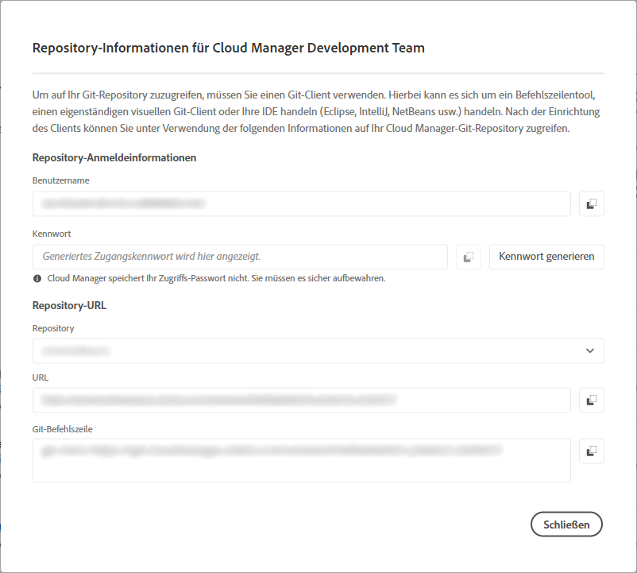

# Zugriffsinformationen für Repository {#accessing-repos}

Erfahren Sie, wie Sie mithilfe der Self-Service-Git-Kontoverwaltung von Cloud Manager auf Ihre von Adobe verwalteten Git-Repositorys zugreifen und diese verwalten können.

## Zugriff auf Repository-Informationen über die Übersichtsseite {#overview-page}

Cloud Manager erleichtert das Abrufen Ihrer Repository-Zugriffsinformationen für Adobe-verwaltete Repositorys mithilfe der **Zugriff auf Repo Info** auf der Pipeline-Karte verfügbar.

1. Melden Sie sich unter [my.cloudmanager.adobe.com](https://my.cloudmanager.adobe.com/) bei Cloud Manager an und wählen Sie die entsprechende Organisation sowie das entsprechende Programm aus.

1. Gehen Sie von Ihrer Seite **Programmübersicht** aus zur Karte **Pipelines**.

   

1. Tippen oder klicken Sie auf **Zugriff auf Repo Info** Schaltfläche zum Öffnen **Repository-Informationen** Dialogfeld und Ansicht:

   * Der Git-Benutzername.
   * Das Git-Kennwort.
   * Die URL zum Git-Repository von Cloud Manager.
   * Vordefinierte Git-Befehle zum schnellen Hinzufügen einer Remote-Verbindung zu Ihrem Git-Repo- und Push-Code.

   

1. Um auf das Kennwort zugreifen zu können, muss ein neues Kennwort generiert werden. Tippen oder klicken Sie dazu auf das **Kennwort generieren** Schaltfläche.

1. Kennworterstellung im **Seid ihr euch sicher?** Dialogfeld durch Tippen oder Klicken **Kennwort generieren**.

   

1. Das Kennwort wird generiert und ist für das Kopieren im **Passwort** -Feld.

   * Durch das Generieren eines Kennworts wird das vorherige Kennwort ungültig.
   * Cloud Manager speichert das Kennwort nicht. Es liegt in Ihrer Verantwortung, dieses Kennwort sicher zu speichern.
   * Da Cloud Manager das Kennwort nicht speichert, müssen Sie ein neues Kennwort neu generieren, wenn Sie das Kennwort verlieren.

   

Mithilfe dieser Anmeldeinformationen können Sie eine lokale Kopie des Repositorys klonen, Änderungen an diesem lokalen Repository vornehmen und Code-Änderungen nach Bedarf wieder in das Remote-Code-Repository in Cloud Manager übertragen.

>[!NOTE]
>
>* Die Option **Zugriff auf Repo-Info** ist für Benutzende mit der Rolle **Entwickler** oder **Bereitstellungs-Manager** sichtbar.
>* Die **Zugriff auf Repo Info** -Schaltfläche zeigt nur die Repository-Zugriffsinformationen für von Adobe verwaltete Repositorys an. Zugriffsinformationen über [private Repositorys](private-repositories.md) ist nicht in Cloud Manager verfügbar.

## Zugriff auf Repository-Informationen über das Fenster &quot;Repositorys&quot; {#repositories-window}

Ein **Zugriff auf Repo Info** ist auch in der Symbolleiste der [**Repositorys** Fenster.](managing-repositories.md) Es werden dieselben Informationen zum Zugriff auf von Adobe verwaltete Repositorys angezeigt.

## Sperren eines Zugangskennworts {#revoke-password}

Sie können jederzeit ein Zugangskennwort sperren lassen. [Erstellen Sie für diese Anfrage ein entsprechendes Support-Ticket.](https://experienceleague.adobe.com/?lang=de?support-solution=Experience+Manager&amp;support-tab=home#support)

Das Ticket wird mit hoher Priorität behandelt und die Sperrung sollte innerhalb eines Tages erfolgen.
