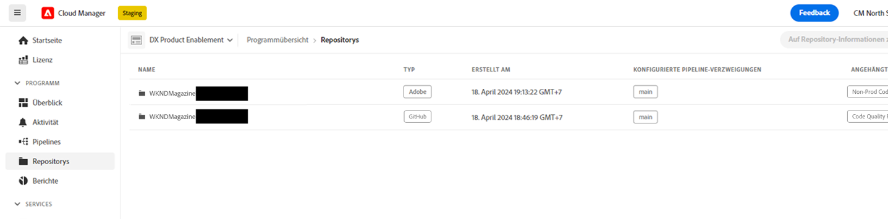
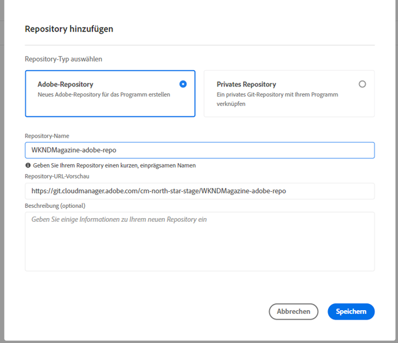

# Hinzufügen eines Adobe-Repositorys in Cloud Manager {#adobe-repositories}

Erfahren Sie, wie Sie in Cloud Manager ein von Adobe verwaltetes Repository hinzufügen.

Auf der Seite **Repositorys** können Sie ganz einfach zusätzliche von Adobe verwaltete Repositorys zu einem ausgewählten Programm hinzufügen.

**So fügen Sie in Cloud Manager ein Adobe-Repository hinzu:**

1. Melden Sie sich unter [my.cloudmanager.adobe.com](https://my.cloudmanager.adobe.com/) bei Cloud Manager an und wählen Sie die entsprechende Organisation und das Programm aus, zu dem Sie ein von Adobe verwaltetes Repository hinzufügen möchten.

1. Klicken Sie auf der Seite **Programmübersicht** im Seitenmenü auf die Registerkarte  **Repositorys** .

1. Klicken Sie auf der Seite **Repositorys** oben rechts auf **Repository hinzufügen**.

   

1. Stellen Sie im Dialogfeld **Repository hinzufügen** sicher, dass **Adobe-Repository** als Repository-Typ ausgewählt ist.

1. Geben Sie in die entsprechenden Textfelder Folgendes ein:

   * **Repository-Name** – Ein aussagekräftiger Name für Ihr neues Repository.
   * **Repository-URL-Vorschau** – Sie brauchen weder einen URL-Pfad einzugeben noch den vorhandenen Pfad zu bearbeiten, da die Repository-Infrastruktur bereits vorhanden ist und vollständig von Adobe integriert und verwaltet wird.
   * **Beschreibung (optional)** – Eine längere Beschreibung des Repositorys.

   

1. Klicken Sie auf **Speichern**.
Ihr neues Repository wird in der Tabelle auf der Seite **Repositorys** angezeigt.

Sie können nun eine [CI/CD-Pipeline](/help/implementing/cloud-manager/configuring-pipelines/introduction-ci-cd-pipelines.md) damit verbinden oder es im Fenster [**Repositorys** verwalten](managing-repositories.md).

>[!TIP]
>
>Sie können auch GitHub-Repositorys hinzufügen, die Sie selbst als [private Repositorys](private-repositories.md) verwalten.
