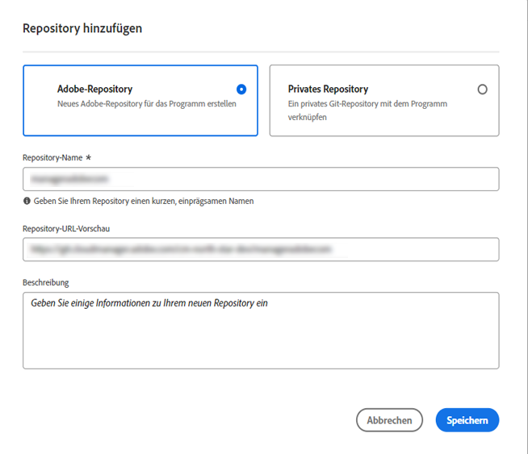

# Hinzufügen von Adobe-Repositorys in Cloud Manager {#adobe-repositories}

Erfahren Sie, wie Sie in Cloud Manager Adobe-verwaltete Repositorys erstellen.

## Hinzufügen eines Adobe-verwalteten Repositorys {#add-adobe-repository}

Die **Repositorys** -Fenster erleichtern das Hinzufügen zusätzlicher Adobe-verwalteter Repositorys für Ihr Programm.

1. Melden Sie sich unter [my.cloudmanager.adobe.com](https://my.cloudmanager.adobe.com/) bei Cloud Manager an und wählen Sie die entsprechende Organisation und das entsprechende Programm aus.

1. Wählen Sie auf der Seite **Programmübersicht** die Registerkarte **Repositorys** und wechseln Sie zu der Seite **Repositorys**.

1. Klicks **Repository hinzufügen** in der Symbolleiste.

   

1. Geben Sie den Namen und die Beschreibung wie verlangt ein, und klicken Sie auf **Speichern**.

   

Wenn der Assistent geschlossen wird, wird Ihr neues Repository in der Tabelle im **Repositorys** Fenster. Sie können jetzt eine [CI/CD-Pipeline](/help/implementing/cloud-manager/configuring-pipelines/introduction-ci-cd-pipelines.md) mit , oder verwalten Sie sie innerhalb der [**Repositorys** Fenster.](managing-repositories.md)

>[!TIP]
>
>Sie können auch GitHub-Repositorys hinzufügen, die Sie selbst als [private Repositorys.](private-repositories.md)
