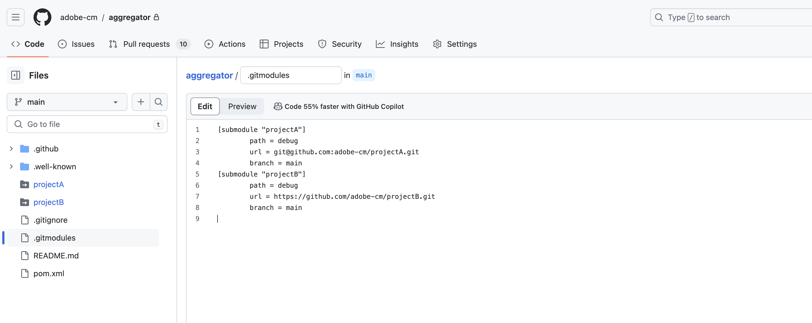

# Unterstützung von Git-Untermodulen für Adobe-Repositorys {#git-submodule-support}

Git-Untermodule können verwendet werden, um zum Build-Zeitpunkt den Inhalt mehrerer Verzweigungen über Git-Repositorys hinweg zusammenzuführen.

Wenn der Build-Prozess von Cloud Manager ausgeführt wird, klont er das Repository der Pipeline und prüft dann die Verzweigung. Wenn eine `.gitmodules`-Datei im Stammverzeichnis der Verzweigung vorhanden ist, wird der entsprechende Befehl ausgeführt.

Mit dem folgenden Befehl wird jedes Untermodul in das entsprechende Verzeichnis ausgecheckt.

```
$ git submodule update --init
```

Diese Technik bietet eine Alternative zu der in [Arbeiten mit mehreren Quellen-Git-Repositorys](/help/implementing/cloud-manager/managing-code/working-with-multiple-source-git-repositories.md) beschriebenen Lösung. Sie eignet sich ideal für Unternehmen, die mit Git-Submodulen vertraut sind und es vorziehen, keinen externen Zusammenführungsprozess zu verwalten.

Nehmen wir beispielsweise an, dass es drei Repositorys gibt. Jedes Repository enthält eine einzelne Verzweigung mit dem Namen `main`. Im primären Repository, d. h. dem in den Pipelines konfigurierten, verfügt die Verzweigung `main` über eine Datei `pom.xml`, in der die in den beiden anderen Repositorys enthaltenen Projekte deklariert werden.

```xml
<?xml version="1.0" encoding="UTF-8"?>
<project xmlns="https://maven.apache.org/POM/4.0.0" xmlns:xsi="https://www.w3.org/2001/XMLSchema-instance"
    xsi:schemaLocation="https://maven.apache.org/POM/4.0.0 https://maven.apache.org/maven-v4_0_0.xsd">
    <modelVersion>4.0.0</modelVersion>
   
    <groupId>customer.group.id</groupId>
    <artifactId>customer-reactor</artifactId>
    <version>0.0.1-SNAPSHOT</version>
    <packaging>pom</packaging>
   
    <modules>
        <module>project-a</module>
        <module>project-b</module>
    </modules>
   
</project>
```

Anschließend würden Sie Untermodule für die beiden anderen Repositorys hinzufügen:

```shell
$ git submodule add -b main https://git.cloudmanager.adobe.com/ProgramName/projectA/ project-a
$ git submodule add -b main https://git.cloudmanager.adobe.com/ProgramName/projectB/ project-b
```

Dies führt zu einer `.gitmodules`-Datei ähnlich der Folgenden:

```text
[submodule "project-a"]
    path = project-a
    url = https://git.cloudmanager.adobe.com/ProgramName/projectA/
    branch = main
[submodule "project-b"]
    path = project-b
    url = https://git.cloudmanager.adobe.com/ProgramName/projectB/
    branch = main
```

Weitere Informationen zu Git-Untermodulen finden Sie auch im [Git-Referenzhandbuch](https://git-scm.com/book/de/v2/Git-Tools-Submodules) .

## Einschränkungen und Empfehlungen {#limitations-recommendations}

Beachten Sie beim Verwenden von Git-Untermodulen mit von Adobe verwalteten Repositorys die folgenden Einschränkungen.

* Die Git-URL muss genau die im vorherigen Abschnitt beschriebene Syntax haben.
* Es werden nur Untermodule im Stammverzeichnis der Verzweigung unterstützt.
* Betten Sie aus Sicherheitsgründen keine Anmeldeinformationen in Git-URLs ein.
* Sofern nicht anders erforderlich, empfiehlt Adobe die Verwendung von flachen Untermodulen, indem Sie Folgendes ausführen:
  `git config -f .gitmodules submodule.<submodule path>.shallow true` für jedes Untermodul.
* Für bestimmte Git-Commits werden Git-Untermodulverweise gespeichert. Wenn also Änderungen am Untermodul-Repository vorgenommen werden, muss der referenzierte Commit aktualisiert werden.
Verwenden Sie beispielsweise Folgendes:

  `git submodule update --remote`

## Unterstützung von Git-Untermodulen für private Repositorys {#private-repositories}

Die Unterstützung für Git-Untermodule in [privaten Repositorys](private-repositories.md) ist weitgehend dieselbe wie bei Verwendung von Adobe-Repositorys.

Nachdem Sie Ihre Datei `pom.xml` eingerichtet haben und die `git submodule`-Befehle ausgeführt werden, müssen Sie jedoch eine `.gitmodules`-Datei zum Stammverzeichnis des Aggregations-Repositorys hinzufügen, damit Cloud Manager die Konfiguration des Untermoduls erkennt.




### Einschränkungen und Empfehlungen {#limitations-recommendations-private-repos}

Beachten Sie bei der Verwendung von Git-Untermodulen mit privaten Repositorys die folgenden Einschränkungen:

* Git-URLs von Untermodulen können im HTTPS- oder SSH-Format vorliegen, müssen aber auf ein GitHub.com-Repository verweisen. Das Hinzufügen eines Adobe-Repository-Untermoduls zu einem GitHub-Aggregator-Repository oder umgekehrt wird nicht unterstützt.
* Die GitHub-Untermodule müssen für die Adobe-GitHub-App zugänglich sein.
* [Die Einschränkungen bei der Verwendung von Git-Untermodulen mit von Adobe verwalteten Repositorys](#limitations-recommendations) gelten ebenfalls.
