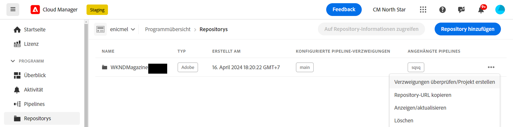
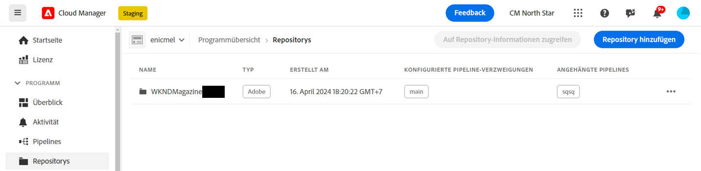
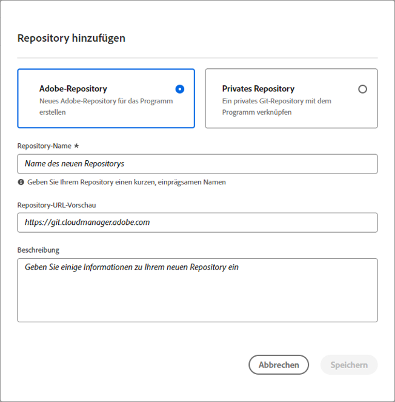
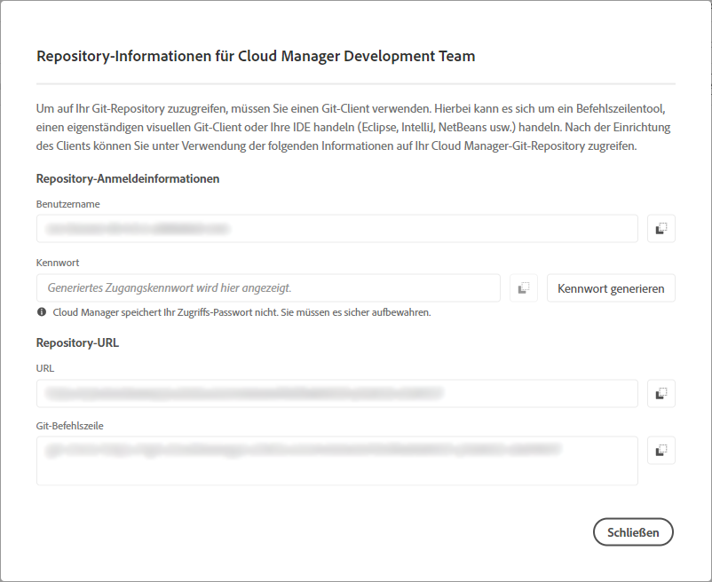
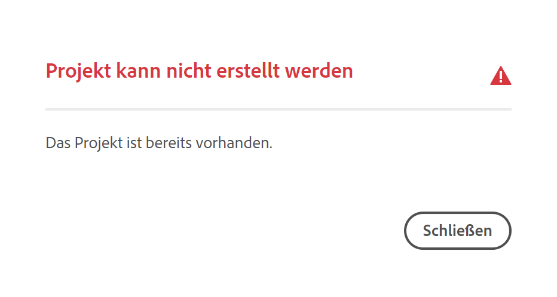
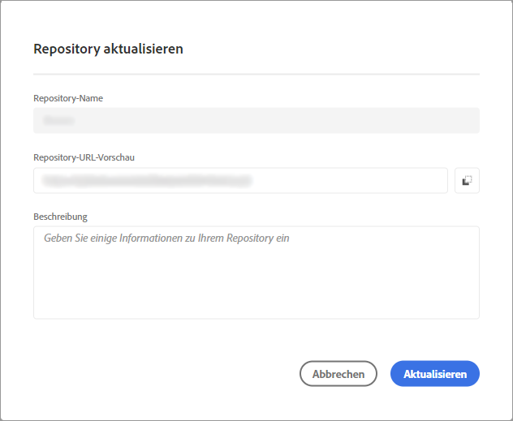
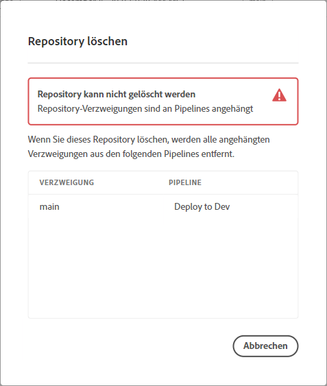

# Verwalten von Repositorys in Cloud Manager {#managing-repos}

Erfahren Sie, wie Sie in Cloud Manager Ihre Git-Repositorys hinzufügen, anzeigen und löschen können.

## Über Repositorys in Cloud Manager {#overview}

Repositorys werden in Cloud Manager zum Speichern und Verwalten Ihres Projekt-Codes mithilfe von Git verwendet. Für jedes von Ihnen hinzugefügte *Programm* wird automatisch ein von Adobe verwaltetes Repository erstellt.

Darüber hinaus haben Sie die Möglichkeit, weitere von Adobe verwaltete Repositorys zu erstellen oder eigene private Repositorys hinzuzufügen. Alle mit Ihrem Programm verlinkten Repositorys können auf der Seite **Repositorys** eingesehen werden.

In Cloud Manager erstellte Repositorys können auch beim Hinzufügen oder Bearbeiten von Pipelines ausgewählt werden. Weitere Informationen zum Konfigurieren von Pipelines finden Sie unter [CI/CD-Pipelines](/help/implementing/cloud-manager/configuring-pipelines/introduction-ci-cd-pipelines.md).

Jede Pipeline ist mit einem primären Repository oder einer primären Verzweigung verknüpft. Mit der [Unterstützung von Git-Untermodulen](git-submodules.md) können jedoch zum Zeitpunkt der Erstellung mehrere sekundäre Verzweigungen einbezogen werden.

## Anzeigen der Seite „Repositorys“ {#repositories-window}

Die Seite **Repositorys** zeigt Details zum ausgewählten Repository an. Diese Informationen umfassen den Typ des verwendeten Repositorys. Wenn das Repository als **Adobe** gekennzeichnet ist, bedeutet dies, dass es sich um ein von Adobe verwaltetes Repository handelt. Wenn es als **GitHub** gekennzeichnet ist, bezieht es sich auf ein privates GitHub-Repository, das Sie verwalten. Darüber hinaus enthält die Seite Details wie den Zeitpunkt der Erstellung des Repositorys und die damit verbundenen Pipelines.

Um eine Aktion auf ein ausgewähltes Repository anzuwenden, können Sie auf das Repository klicken und das Symbol  verwenden, um ein Dropdown-Menü zu öffnen. Für von Adobe verwaltete Repositorys können Sie **[Verzweigungen überprüfen/Projekt erstellen](#check-branches)**.

*Dropdown-Menü auf der Seite „Repositorys“.*

Weitere verfügbare Aktionen im Dropdown-Menü sind **[Repository-URL kopieren](#copy-url)**, **[Anzeigen/aktualisieren](#view-update)** und **[Löschen](#delete)** des Repositorys.

**So zeigen Sie die Seite „Repositorys“ an:**

1. Melden Sie sich unter [my.cloudmanager.adobe.com](https://my.cloudmanager.adobe.com/) bei Cloud Manager an und wählen Sie die entsprechende Organisation sowie das entsprechende Programm aus.

1. Klicken Sie auf der Seite **Programmübersicht** im Seitenmenü auf  **Repositorys**.

1. Auf der Seite **Repositorys** werden alle Repositorys angezeigt, die mit Ihrem gewählten Programm verknüpft sind.

   
   *Die Seite „Repositorys“ in Cloud Manager.*

## Hinzufügen eines Repositorys {#adding-repositories}

Benutzende müssen die Rolle **Bereitstellungs-Manager** oder **Geschäftsinhaber** innehaben, um ein Repository hinzufügen zu können.

Klicken Sie auf der Seite **Repositorys** oben rechts auf **Repository hinzufügen**.

*Dialogfeld „Repository hinzufügen“.*

Cloud Manager unterstützt zwei Typen von Repositorys: von Adobe verwaltete Repositorys (**Adobe-Repository**) und selbstverwaltete Repositorys (**Privates Repository**). Die Pflichtfelder für das Setup unterscheiden sich je nach dem Repository-Typ, den Sie hinzufügen möchten. Weitere Informationen finden Sie in den folgenden Themen:

* [Hinzufügen von Adobe-Repositorys in Cloud Manager](adobe-repositories.md)
* [Hinzufügen von privaten Repositorys in Cloud Manager](private-repositories.md)

Für jedes Unternehmen oder eine IMS-Organisation gibt es eine Grenze von 300 Repositorys über alle Programme hinweg.

## Zugriff auf Repository-Informationen {#repo-info}

Wenn Sie sich Ihre Repositorys im Fenster **Repositorys** ansehen, können Sie die Details zum programmgesteuerten Zugriff auf die von Adobe verwalteten Repositorys anzeigen, indem Sie in der Symbolleiste auf die Schaltfläche **Auf Repository-Informationen zugreifen** klicken.

Das Fenster **Repository-Informationen** mit den Details wird geöffnet. Weitere Informationen zum Zugreifen auf Repository-Informationen finden Sie unter [Zugriff auf Repository-Informationen](/help/implementing/cloud-manager/managing-code/accessing-repos.md).

## Verzweigungen überprüfen/Projekt erstellen {#check-branches}

In **AEM Cloud Manager** dient die Aktion **Verzweigungen überprüfen/Projekt erstellen** je nach dem aktuellen Status des Repositorys zwei Zwecken.

* Wenn das Repository neu erstellt wurde, generiert die Aktion basierend auf dem [AEM-Projektarchetyp](https://experienceleague.adobe.com/de/docs/experience-manager-core-components/using/developing/archetype/overview) ein Beispielprojekt.
* Wenn das Beispielprojekt bereits im Repository erstellt wurde, prüft die Aktion den Status des Repositorys und seiner Verzweigungen und gibt Feedback dazu, ob das Beispielprojekt bereits vorhanden ist.

  

## Repository-URL kopieren {#copy-url}

Die Aktion **Repository-URL kopieren** kopiert die URL des auf der Seite **Repositorys** ausgewählten Repositorys in die Zwischenablage, um sie an anderer Stelle zu verwenden.

## Anzeigen und Aktualisieren eines Repositorys {#view-update}

Mit der Aktion **Anzeigen/aktualisieren** wird das Dialogfeld **Repository aktualisieren** geöffnet, in dem Sie den **Namen** des Repositorys und die **Repository-URL-Vorschau** anzeigen können. Außerdem können Sie damit die **Beschreibung** des Repositorys aktualisieren.

## Löschen eines Repositorys {#delete}

Die Aktion **Löschen** entfernt das Repository aus Ihrem Projekt. Ein Repository kann nicht gelöscht werden, wenn es mit einer Pipeline verknüpft ist.

Nach dem Löschen eines Repositorys kann sein Name nicht mehr für zukünftig neu erstellte Repositorys verwendet werden. Wenn Sie versuchen, ein Repository mit demselben Namen wie ein gelöschtes Repository hinzuzufügen, wird die folgende Fehlermeldung angezeigt:

`Repository name should be unique within organization.`

Darüber hinaus ist das gelöschte Repository nicht mehr in Cloud Manager verfügbar und kann nicht mit Pipelines verknüpft werden.

