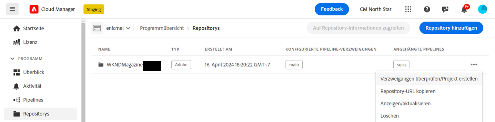
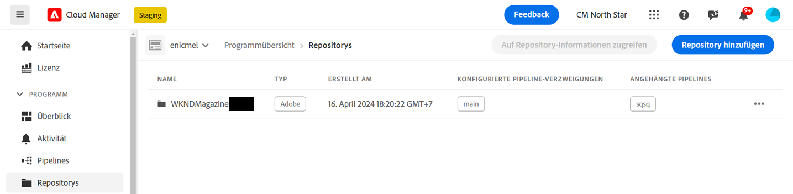
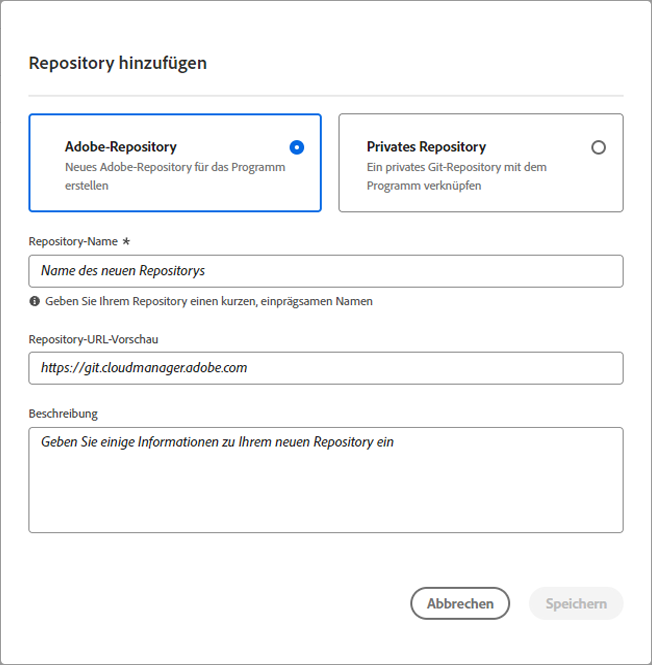
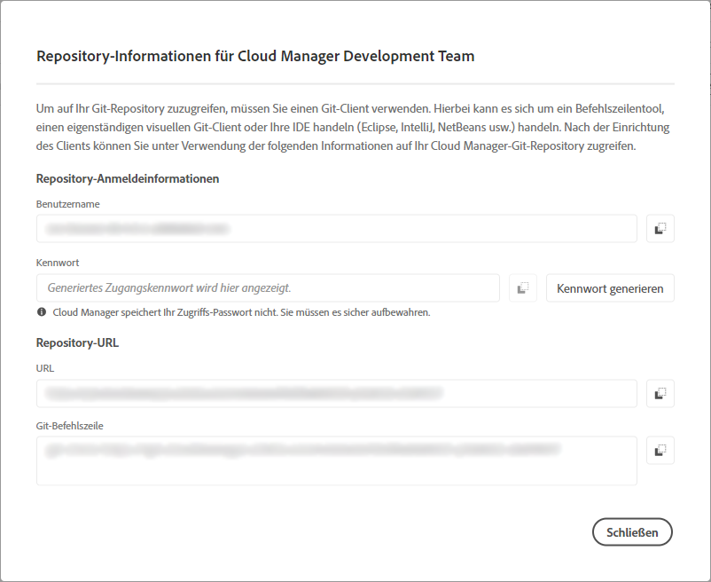
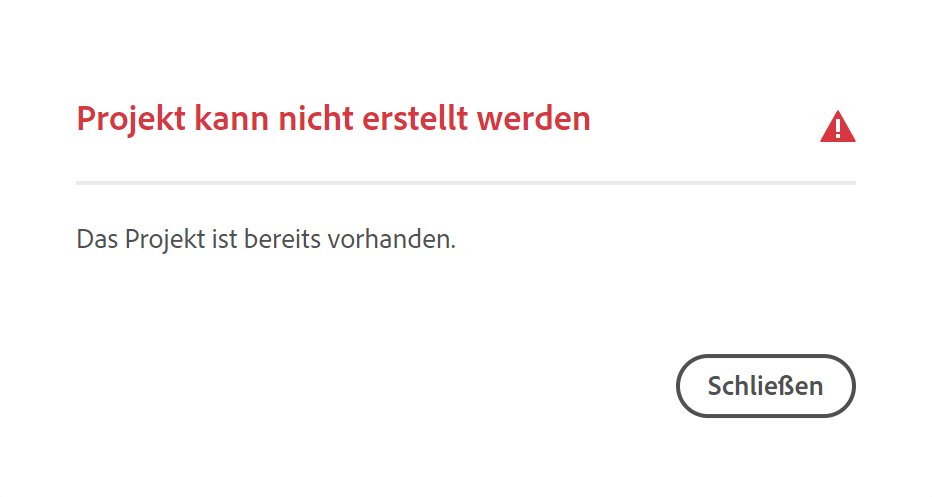
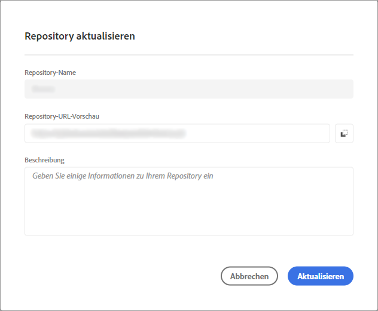
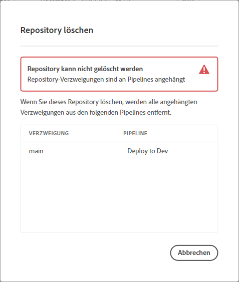

# Verwalten von Repositorys in Cloud Manager {#managing-repos}

Erfahren Sie, wie Sie in Cloud Manager Ihre Git-Repositorys hinzufügen, anzeigen und löschen können.

## Über Repositorys in Cloud Manager {#overview}

Repositorys werden in Cloud Manager zum Speichern und Verwalten Ihres Projekt-Codes mithilfe von Git verwendet. Für jedes von Ihnen hinzugefügte *Programm* wird automatisch ein von Adobe verwaltetes Repository erstellt.

Darüber hinaus haben Sie die Möglichkeit, weitere von Adobe verwaltete Repositorys oder Ihre eigenen selbst verwalteten Repositorys zu erstellen, die von einem externen Git-Anbieter gehostet werden. Bei selbst verwalteten Repositorys unterscheiden sich die Onboarding-Schritte je nachdem, wo Ihr Code gehostet wird. Repositorys auf `github.com` verwenden die Adobe-GitHub-App, während selbst gehostete und andere externe Repositorys ein persönliches Zugriffstoken und einen Webhook verwenden. Alle mit Ihrem Programm verlinkten Repositorys können auf der Seite **Repositorys** eingesehen werden.

In Cloud Manager erstellte Repositorys können auch beim Hinzufügen oder Bearbeiten von Pipelines ausgewählt werden. Weitere Informationen zum Konfigurieren von Pipelines finden Sie unter [CI/CD-Pipelines](/help/implementing/cloud-manager/configuring-pipelines/introduction-ci-cd-pipelines.md).

Jede Pipeline ist mit einem primären Repository oder einer primären Verzweigung verknüpft. Mit der [Unterstützung von Git-Untermodulen](git-submodules.md) können jedoch zum Zeitpunkt der Erstellung mehrere sekundäre Verzweigungen einbezogen werden.

## Anzeigen der Seite „Repositorys“ {#repositories-window}

Die Seite **Repositorys** zeigt Details zum ausgewählten Repository an. Diese Informationen umfassen den Typ des verwendeten Repositorys. Wenn das Repository als **Adobe** gekennzeichnet ist, bedeutet dies, dass es sich um ein von Adobe verwaltetes Repository handelt. Wenn es als **GitHub** gekennzeichnet ist, bezieht es sich auf ein privates GitHub-Repository, das Sie verwalten. Darüber hinaus enthält die Seite Details wie den Zeitpunkt der Erstellung des Repositorys und die damit verbundenen Pipelines.

Um ein ausgewähltes Repository zu verwalten, klicken Sie auf das Repository und verwenden Sie Symbol, um ein Dropdown-Menü zu öffnen. Für von Adobe verwaltete Repositorys können Sie **[Verzweigungen überprüfen/Projekt erstellen](#check-branches)**.

*Dropdown-Menü auf der Seite „Repositorys“.*

Weitere verfügbare Aktionen im Dropdown-Menü sind **[Repository-URL kopieren](#copy-url)**, **[Anzeigen/aktualisieren](#view-update)** und **[Löschen](#delete)** des Repositorys.

**So zeigen Sie die Seite „Repositorys“ an:**

1. Melden Sie sich unter [my.cloudmanager.adobe.com](https://my.cloudmanager.adobe.com/) bei Cloud Manager an und wählen Sie die entsprechende Organisation sowie das entsprechende Programm aus.

1. Klicken Sie auf der Seite **Programmübersicht** im Seitenmenü auf  **Repositorys**.

1. Auf der Seite **Repositorys** werden alle Repositorys angezeigt, die mit Ihrem gewählten Programm verknüpft sind.

   
   *Die Seite „Repositorys“ in Cloud Manager.*

## Adobe-Repository hinzufügen {#adding-repositories}

Benutzende müssen die Rolle **Bereitstellungs-Manager** oder **Geschäftsinhaber** innehaben, um ein Repository hinzufügen zu können.

Hilfe bei der Auswahl zwischen der privaten und der externen Repository-Methode finden Sie unter [Hinzufügen eines Nicht-Adobe-Repositorys](#add-non-adobe-repositories).

1. Klicken Sie auf der Seite **Repositorys** oben rechts auf **Repository hinzufügen**.

   
   *Dialogfeld „Repository hinzufügen“*

1. Klicken Sie auf **Adobe-Repository**. Siehe [Hinzufügen von Adobe-Repositorys in Cloud Manager](adobe-repositories.md).

   Für jedes Unternehmen oder eine IMS-Organisation gibt es eine Grenze von 300 Repositorys über alle Programme hinweg.

### Hinzufügen eines Nicht-Adobe-Repositorys {#add-non-adobe-repositories}

Wenn Sie Ihren Code außerhalb von Adobe hosten, hängen sowohl die Anleitungsseite als auch die Methode zur Eigentümervalidierung davon ab, wo das Repository gehostet wird. Verwenden Sie die folgende Tabelle, um die richtige Option auszuwählen.

| Wo Ihr Repository gehostet wird | Validierungsmethode | Seite mit den zu verwendenden Anweisungen |
| --- | --- | --- |
| `github.com` (alle GitHub-Pläne wie Free, Pro, Team oder Enterprise Cloud) | Adobe GitHub-App und eine Geheimdatei. Kein Webhook erforderlich. | [Ein privates GitHub-Repository in Cloud Manager hinzufügen](/help/implementing/cloud-manager/managing-code/private-repositories.md) |
| GitHub Enterprise Server (selbst gehostet) | Persönliches Zugriffstoken und Webhook | [Hinzufügen externer Repositorys in Cloud Manager](/help/implementing/cloud-manager/managing-code/external-repositories.md) |
| GitLab, Bitbucket oder Azure DevOps | Persönliches Zugriffstoken und Webhook | [Hinzufügen externer Repositorys in Cloud Manager](https://experienceleague.adobe.com/de/docs/experience-manager-cloud-service/content/implementing/using-cloud-manager/managing-code/external-repositories) |

## Zugriff auf Repository-Informationen {#repo-info}

Wenn Sie sich Ihre Repositorys im Fenster **Repositorys** ansehen, können Sie die Details zum programmgesteuerten Zugriff auf die von Adobe verwalteten Repositorys anzeigen, indem Sie in der Symbolleiste auf die Schaltfläche **Auf Repository-Informationen zugreifen** klicken.

Das Fenster **Repository-Informationen** mit den Details wird geöffnet. Weitere Informationen zum Zugreifen auf Repository-Informationen finden Sie unter [Zugriff auf Repository-Informationen](/help/implementing/cloud-manager/managing-code/accessing-repos.md).

## Verzweigungen überprüfen/Projekt erstellen {#check-branches}

In **AEM Cloud Manager** dient die Aktion **Verzweigungen überprüfen/Projekt erstellen** je nach dem aktuellen Status des Repositorys zwei Zwecken.

* Wenn das Repository neu erstellt wurde, generiert die Aktion basierend auf dem [AEM-Projektarchetyp](https://experienceleague.adobe.com/de/docs/experience-manager-core-components/using/developing/archetype/overview) ein Beispielprojekt.
* Wenn das Beispielprojekt bereits im Repository erstellt wurde, prüft die Aktion den Status des Repositorys und seiner Verzweigungen und gibt Feedback dazu, ob das Beispielprojekt bereits vorhanden ist.

  

## Repository-URL kopieren {#copy-url}

Die Aktion **Repository-URL kopieren** kopiert die URL des auf der Seite **Repositorys** ausgewählten Repositorys in die Zwischenablage, um sie an anderer Stelle zu verwenden.

## Repository anzeigen und aktualisieren {#view-update}

Mit der Aktion **Anzeigen/aktualisieren** wird das Dialogfeld **Repository aktualisieren** geöffnet, in dem Sie den **Namen** des Repositorys und die **Repository-URL-Vorschau** anzeigen können. Außerdem können Sie damit die **Beschreibung** des Repositorys aktualisieren.

## Löschen eines Repositorys {#delete}

Die Aktion **Löschen** entfernt das Repository aus Ihrem Projekt. Ein Repository kann nicht gelöscht werden, wenn es mit einer Pipeline verknüpft ist.

Durch das Löschen eines Repositorys wird verhindert, dass sein Name für neue Repositorys verwendet wird, die in Zukunft erstellt werden. Wenn Sie versuchen, ein Repository mit demselben Namen wie ein gelöschtes Repository hinzuzufügen, wird die folgende Fehlermeldung angezeigt:

`Repository name should be unique within organization.`

Darüber hinaus ist das gelöschte Repository nicht mehr in Cloud Manager verfügbar und kann nicht mit Pipelines verknüpft werden.

