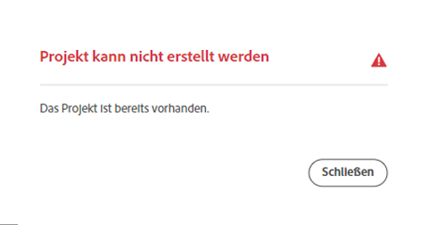

# Verwalten von Repositorys in Cloud Manager {#managing-repos}

Erstellen, Anzeigen und Löschen von Git-Repositorys in Cloud Manager.

## Überblick {#overview}

Repositorys werden zum Speichern und Verwalten des Projekt-Codes mithilfe von Git verwendet. Für jedes Programm, das Sie in Cloud Manager erstellen, wird ein von Adobe verwaltetes Repository erstellt.

Sie können zusätzliche von Adobe verwaltete Repositorys erstellen und auch eigene private Repositorys hinzufügen. Alle mit Ihrem Programm verknüpften Repositorys können im Fenster **Repositorys** eingesehen werden.

In Cloud Manager erstellte Repositorys stehen Ihnen auch beim Hinzufügen oder Bearbeiten von Pipelines zur Verfügung. Weitere Informationen finden Sie unter [CI/CD-Pipelines](/help/implementing/cloud-manager/configuring-pipelines/introduction-ci-cd-pipelines.md).

Für jede Pipeline gibt es ein einzelnes primäres Repository oder eine Verzweigung. Mit der [Unterstützung von Git-Untermodulen](git-submodules.md) können zum Zeitpunkt der Erstellung viele sekundäre Verzweigungen einbezogen werden.

## Fenster „Repositorys“ {#repositories-window}

1. Melden Sie sich unter [my.cloudmanager.adobe.com](https://my.cloudmanager.adobe.com/) bei Cloud Manager an und wählen Sie die entsprechende Organisation sowie das entsprechende Programm aus.

1. Wählen Sie auf der Seite **Programmübersicht** die Registerkarte **Repositorys** und wechseln Sie zu der Seite **Repositorys**.

1. Im Fenster **Repositorys** werden alle Repositorys angezeigt, die mit Ihrem Programm verknüpft sind.

   

Das Fenster **Repositorys** zeigt Details zu den Repositorys:

* Der Repository-Typ
   * **Adobe** zeigt von Adobe verwaltete Repositorys an
   * **GitHub** zeigt private, von Ihnen verwaltete GitHub-Repositorys an
* Zeitpunkt der Erstellung
* Pipelines, die mit dem Repository verknüpft sind

Sie können das Repository im Fenster auswählen und auf die Schaltfläche mit den Auslassungspunkten klicken, um das ausgewählte Repository zu bearbeiten.

* **[Verzweigungen prüfen/Projekt erstellen](#check-branches)** (nur für Adobe-Repositorys verfügbar)
* **[Repository-URL kopieren](#copy-url)**
* **[Anzeigen und aktualisieren](#view-update)**
* **[Löschen](#delete)**

## Hinzufügen von Repositorys {#adding-repositories}

Tippen oder klicken Sie im Fenster **Repositorys** auf **Repository hinzufügen**, um den Assistenten **Repository hinzufügen** zu starten.

Cloud Manager unterstützt beide Typen von Repositorys, nämlich die, die von Adobe verwaltet werden (**Adobe-Repository**), sowie Ihre eigenen, selbst verwalteten Repositorys (**privates Repository**). Die erforderlichen Felder unterscheiden sich je nach Typ des Repositorys, das Sie hinzufügen möchten. Weitere Informationen finden Sie in den folgenden Dokumenten:

* [Hinzufügen von Adobe-Repositorys in Cloud Manager](adobe-repositories.md)
* [Hinzufügen von privaten Repositorys in Cloud Manager](private-repositories.md)

>[!NOTE]
>
>* Eine Person muss über die Rolle **Bereitstellungs-Manager** oder **Geschäftsinhaber** verfügen, um ein Repository hinzufügen zu können.
>* Für jedes Unternehmen oder IMS-Organisation gibt es eine Grenze von 300 Repositorys über alle Programme hinweg.

## Auf Repository-Informationen zugreifen {#repo-info}

Wenn Sie Ihre Repositorys im Fenster **Repositorys** anzeigen, können Sie die Details zum programmgesteuerten Zugriff auf die von Adobe verwalteten Repositorys anzeigen, indem Sie in der Symbolleiste auf die Schaltfläche **Repo Info aufrufen** klicken.

Das Fenster **Repository-Informationen** mit den Details wird geöffnet. Weitere Informationen zum Zugriff auf Repository-Informationen finden Sie im Dokument [Zugriff auf Repository-Informationen](accessing-repos.md).

## Verzweigungen überprüfen/Projekt erstellen {#check-branches}

Mit der Aktion **Verzweigungen überprüfen/Projekt erstellen** werden je nach dem Status des Repositorys zwei Funktionen ausgeführt.

* Wenn das Repository neu erstellt wurde, erstellt die Aktion ein Beispielprojekt basierend auf dem [AEM-Projektarchetyp](https://experienceleague.adobe.com/de/docs/experience-manager-core-components/using/developing/archetype/overview).
* Wenn im Repository bereits ein Beispielprojekt erstellt wurde, prüft es den Status des Repositorys und seiner Verzweigungen und gibt zurück, dass bereits ein Beispielprojekt vorhanden ist.

## Repository-URL kopieren {#copy-url}

Die Aktion **Repository-URL kopieren** kopiert die URL des im Fenster **Repositorys** ausgewählten Repositorys in die Zwischenablage, damit sie an anderer Stelle verwendet werden kann.

## Anzeigen und aktualisieren {#view-update}

Die Aktion **Anzeigen/Aktualisieren** öffnet das Dialogfeld **Repository aktualisieren**. Dort können Sie den **Namen** und die **Repository-URL-Vorschau** anzeigen sowie die **Beschreibung** des Repositorys aktualisieren.

## Löschen {#delete}

Die Aktion **Löschen** entfernt das Repository aus Ihrem Projekt. Ein Repository kann nicht gelöscht werden, wenn es mit einer Pipeline verknüpft ist.

Das Löschen eines Repositorys führt dazu, dass:

* der Name des gelöschten Repositorys für neue Repositorys, die in Zukunft erstellt werden, unbrauchbar gemacht wird.
   * In solchen Fällen wird die Fehlermeldung `Repository name should be unique within organization.` angezeigt.
* Stellen Sie sicher, dass das gelöschte Repository nicht in Cloud Manager verfügbar ist und daher nicht mit einer Pipeline verknüpft werden kann.
