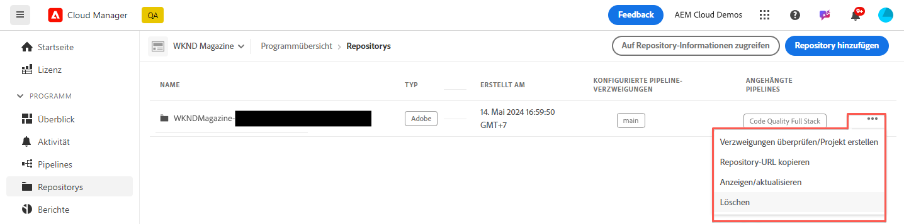

# Verwalten von Repositorys in Cloud Manager {#managing-repos}

Erfahren Sie, wie Sie Ihre Git-Repositorys in Cloud Manager erstellen, anzeigen und löschen.

## Überblick {#overview}

Repositorys werden zum Speichern und Verwalten des Projektcodes mithilfe von Git verwendet. Für jedes Programm, das Sie in Cloud Manager erstellen, wird ein von Adobe verwaltetes Repository erstellt.

Sie können zusätzliche Adobe-verwaltete Repositorys erstellen und auch eigene private Repositorys hinzufügen. Alle mit Ihrem Programm verknüpften Repositorys können im **Repositorys** Fenster.

In Cloud Manager erstellte Repositorys stehen Ihnen auch beim Hinzufügen oder Bearbeiten von Pipelines zur Verfügung. Weitere Informationen finden Sie unter [CI/CD-Pipelines](/help/implementing/cloud-manager/configuring-pipelines/introduction-ci-cd-pipelines.md).

Für jede Pipeline gibt es ein einzelnes primäres Repository oder eine Verzweigung. Mit [Unterstützung von Git-Untermodulen,](git-submodules.md) viele sekundäre Verzweigungen können zur Build-Zeit eingeschlossen werden.

## Repository-Fenster {#repositories-window}

1. Melden Sie sich unter [my.cloudmanager.adobe.com](https://my.cloudmanager.adobe.com/) bei Cloud Manager an und wählen Sie die entsprechende Organisation und das entsprechende Programm aus.

1. Wählen Sie auf der Seite **Programmübersicht** die Registerkarte **Repositorys** und wechseln Sie zu der Seite **Repositorys**.

1. Die **Repositorys** zeigt alle Repositorys an, die mit Ihrem Programm verknüpft sind.

   

Die **Repositorys** liefert Details zu Repositorys:

* Der Repository-Typ
   * **Adobe** zeigt Adobe-verwaltete Repositorys an
   * **GitHub** zeigt private GitHub-Repositorys an, die Sie verwalten
* Zeitpunkt der Erstellung
* Pipelines, die mit dem Repository verknüpft sind

Sie können das Repository im Fenster auswählen und auf die Suchschaltfläche klicken, um das ausgewählte Repository zu bearbeiten.

* **[Verzweigungen prüfen/Projekt erstellen](#check-branches)** (nur für Adobe-Repositorys verfügbar)
* **[Repository-URL kopieren](#copy-url)**
* **[Anzeigen und Aktualisieren](#view-update)**
* **[Löschen](#delete)**

## Hinzufügen von Repositorys {#adding-repositories}

Tippen oder klicken Sie auf **Repository hinzufügen** im **Repositorys** -Fenster, um den **Repository hinzufügen** Assistent.

Cloud Manager unterstützt beide Repositorys, die von Adobe verwaltet werden (**Adobe-Repository**) sowie Ihre eigenen, selbst verwalteten Repositorys (**Privates Repository**). Die erforderlichen Felder unterscheiden sich je nach Repository-Typ, den Sie hinzufügen möchten. Weitere Informationen finden Sie in den folgenden Dokumenten.

* [Hinzufügen von Adobe-Repositorys in Cloud Manager](adobe-repositories.md)
* [Hinzufügen privater Repositorys in Cloud Manager](private-repositories.md)

>[!NOTE]
>
>* Ein Benutzer muss die Rolle **Bereitstellungs-Manager** oder **Geschäftsinhaber** haben, um ein Repository hinzufügen zu können.
>* Für jedes Unternehmen oder IMS-Organisation gibt es eine Grenze von 300 Repositorys über alle Programme hinweg.

## Auf Repository-Informationen zugreifen {#repo-info}

Wenn Sie Ihre Repositorys im **Repositorys** -Fenster können Sie die Details zum programmgesteuerten Zugriff auf die von Adobe verwalteten Repositorys anzeigen, indem Sie auf die **Zugriff auf Repo Info** in der Symbolleiste.

Die **Repository-Informationen** wird mit den Details geöffnet. Weitere Informationen zum Zugriff auf Repository-Informationen finden Sie im Dokument . [Zugriff auf Repository-Informationen.](accessing-repos.md)

## Verzweigungen überprüfen/Projekt erstellen {#check-branches}

Die **Verzweigungen prüfen/Projekt erstellen** -Aktion führt je nach dem Status des Repositorys zwei Funktionen aus.

* Wenn das Repository neu erstellt wurde, erstellt die Aktion ein Beispielprojekt basierend auf [den AEM Projektarchetyp.](https://experienceleague.adobe.com/de/docs/experience-manager-core-components/using/developing/archetype/overview)
* Wenn das Beispielprojekt bereits im Repository erstellt wurde, prüft es den Status des Repositorys und seiner Verzweigungen und erstellt Berichte zurück, wenn das Beispielprojekt bereits vorhanden ist.

## Repository-URL kopieren {#copy-url}

Die **Repository-URL kopieren** Aktion kopiert die URL des im **Repositorys** in die Zwischenablage, um sie an anderer Stelle zu verwenden.

## Anzeigen und aktualisieren {#view-update}

Die **Anzeigen und Aktualisieren** -Aktion öffnet die **Repository aktualisieren** angezeigt. Sie können die **Name** und **Vorschau der Repository-URL** und aktualisieren Sie die **Beschreibung** des Repositorys.

## Löschen {#delete}

Die **Löschen** -Aktion entfernt das Repository aus Ihrem Projekt. Ein Repository kann nicht gelöscht werden, wenn es mit einer Pipeline verknüpft ist.

Das Löschen eines Repositorys führt dazu, dass:

* der Name des gelöschten Repositorys für neue Repositorys, die in Zukunft erstellt werden, unbrauchbar gemacht wird.
   * In solchen Fällen wird die Fehlermeldung `Repository name should be unique within organization.` angezeigt.
* Stellen Sie sicher, dass das gelöschte Repository nicht in Cloud Manager verfügbar ist und daher nicht mit einer Pipeline verknüpft werden kann.
