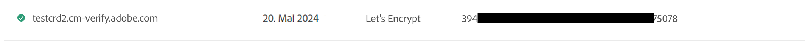
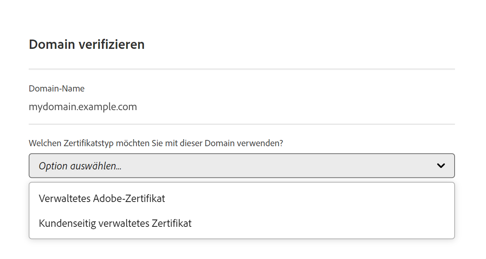
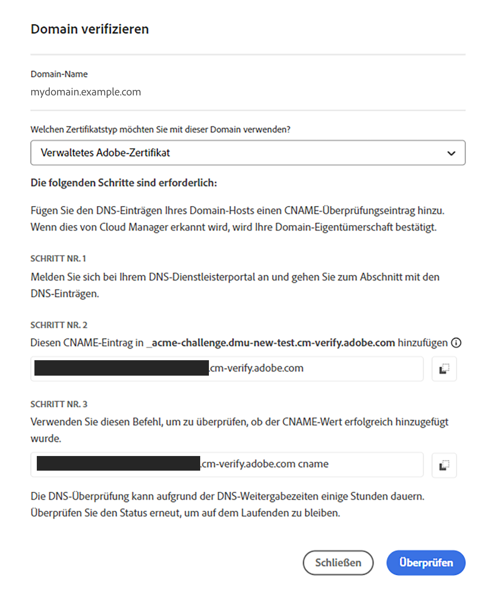
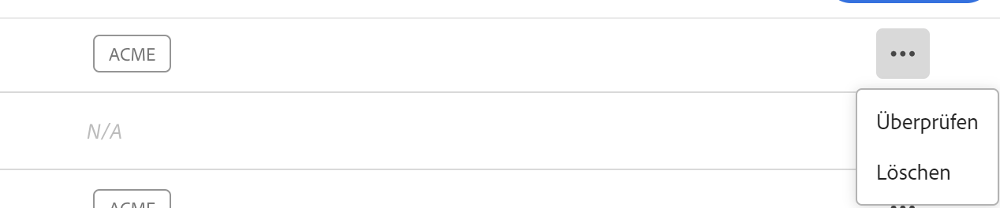

# Hinzufügen eines SSL-Zertifikats

Erfahren Sie, wie Sie mithilfe der Self-Service-Tools von Cloud Manager ein kundenverwaltetes SSL-Zertifikat oder ein von der Adobe generiertes und verwaltetes DV-Zertifikat (Domain Validation) hinzufügen.


## Hinzufügen eines SSL- oder DV-Zertifikats {#adding-an-ssl-certificate}

Die Bereitstellung eines Zertifikats kann einige Tage dauern. Daher empfiehlt Adobe, das Zertifikat rechtzeitig vor Ablauf einer Frist oder einem Live-Datum bereitzustellen.

Überprüfen Sie die **Zertifikatanforderungen** in der [Einführung in das Verwalten von SSL-Zertifikaten](/help/implementing/cloud-manager/managing-ssl-certifications/introduction.md#requirements), um sicherzustellen, dass AEM as a Cloud Service das Zertifikat unterstützt, das Sie hinzufügen möchten.

Ein Benutzer muss Mitglied der Rolle **Business Owner** oder **Deployment Manager** sein, um diese Aufgabe abzuschließen.

>[!NOTE]
>
>Kunden dürfen keine DV-Zertifikate (Domain Validation) hochladen.

**Hinzufügen eines SSL- oder DV-Zertifikats:**

1. Melden Sie sich unter [my.cloudmanager.adobe.com](https://my.cloudmanager.adobe.com/) bei Cloud Manager an und wählen Sie die entsprechende Organisation aus.

1. Wählen Sie in der Konsole **[Meine Programme](/help/implementing/cloud-manager/navigation.md#my-programs)** das Programm aus.

1. Navigieren Sie auf der Seite **Übersicht** zum Bildschirm **Umgebungen**.

1. Klicken Sie im linken Navigationsbereich unter **Dienste** auf **SSL-Zertifikate**. Wenn das linke Navigationsfenster nicht wie im folgenden Bild dargestellt angezeigt wird, müssen Sie möglicherweise auf das Hamburger-Symbol in der oberen linken Ecke klicken.

   

1. Klicken Sie in der rechten oberen Ecke der Seite auf **SSL-Zertifikat hinzufügen**.

1. Führen Sie im Dialogfeld **SSL-Zertifikat hinzufügen** je nach Anwendungsfall einen der folgenden Schritte aus:

   | Anwendungsfall | Schritte |
   | --- | --- |
   | **Hinzufügen eines von Adobe verwalteten Zertifikats (DV)** | **Hinzufügen eines von Adobe verwalteten Zertifikats (DV):**<br> a. Wählen Sie den Zertifikatstyp **Adobe managed (DV)** aus.<br><br>b. Wählen Sie in der Dropdownliste **Domänen auswählen** eine oder mehrere Domänen aus, die dem DV-Zertifikat zugeordnet werden sollen.<br>Keine Domänen zur Auswahl? Ist dies der Fall, müssen Sie eine benutzerdefinierte Domäne hinzufügen. Siehe [Hinzufügen einer benutzerdefinierten Domäne](#add-custom-domain). Wenn Sie mit dem Hinzufügen eines benutzerdefinierten Domänennamens fertig sind, kehren Sie zu diesem Thema zurück und beginnen Sie erneut mit Schritt 1.<br>d. Fahren Sie mit Schritt 7 fort. |
   | **Hinzufügen eines kundenverwalteten Zertifikats (OV/EV)** | **Hinzufügen eines kundenverwalteten Zertifikats (OV/EV):**<br> a. Wählen Sie den Zertifikatstyp &quot;**Vom Kunden verwaltet (OV/EV)**&quot;.<br>b. Geben Sie im Feld **Zertifikatname** einen Namen für Ihr Zertifikat ein. Dieses Feld dient nur zu Informationszwecken und der Name kann so gewählt werden, dass Sie Ihr Zertifikat leicht finden können.<br>c. Fügen Sie in die Felder **Zertifikat**, **Privater Schlüssel** und **Zertifikatskette** die erforderlichen Werte in die entsprechenden Felder ein.<br><br>Alle erkannten Fehler in Werten werden angezeigt. Bevor Sie Ihr Zertifikat speichern können, müssen Sie alle Fehler beheben. Weitere Informationen zur Fehlerbehebung bei häufigen Fehlern finden Sie unter [Zertifikatfehler](#certificate-errors) .<br>d. Fahren Sie mit Schritt 7 fort. |

<!--
    **Add an SSL certificate:**
    1. Select the certificate type **Customer managed (OV/EV)**.
    1. In **Certificate name** field, enter a name for your certificate. This field is for informational purposes only and can be any name that helps you reference your certificate easily.
    1. In the **Certificate**, **Private key**, and **Certificate chain** fields, paste the required values into their respective fields.

        
  
    Any detected errors in values are displayed. Before you can save your certificate, you must address all errors. See [Certificate errors](#certificate-errors) to learn more about troubleshooting common errors.

    **Add a DV certificate:**
    1. Select the certificate type **Adobe managed (DV)**.

        

    1. In the **Select domains** drop-down list, select one or more domains that you want associated with the DV certificate.

        No domains to select? If so, it means that you must add a custom domain. See [Add a custom domain](#add-custom-domain). When you are finished, resume the steps from the beginning again. -->

1. Klicken Sie in der rechten unteren Ecke des Dialogfelds auf **Speichern**.

   Nachdem das Zertifikat erfolgreich ausgestellt wurde, wird ein grünes Häkchen angezeigt, wie in der Abbildung oben dargestellt

   

### Benutzerdefinierte Domäne hinzufügen {#add-custom-domain}

Bevor Sie ein von einer Adobe generiertes und verwaltetes DV-Zertifikat (Domain Validated) hinzufügen können, müssen Sie zunächst eine benutzerdefinierte Domäne hinzufügen. Der Prozess hierfür entspricht fast dem in [Einführung in benutzerdefinierte Domänennamen](/help/implementing/cloud-manager/custom-domain-names/introduction.md) und [Hinzufügen eines benutzerdefinierten Domänennamen](/help/implementing/cloud-manager/custom-domain-names/add-custom-domain-name.md) beschriebenen Verfahren. Diese Funktion wurde jedoch, wie unten beschrieben, jetzt geringfügig erweitert.

1. Wählen Sie beim Hinzufügen eines benutzerdefinierten Domänennamens im Dialogfeld **Domäne überprüfen** ein von **Adobe verwaltetes Zertifikat** aus.

   

1. Fügen Sie im Dialogfeld **Verify domain** einen CNAME-Überprüfungsdatensatz zu Ihrem DNS hinzu.

   

1. Nachdem die Domäne erstellt wurde, klicken Sie auf die Suchschaltfläche in der Liste der Domänen und wählen Sie **Verify** aus, um die Domäne zu überprüfen.

   

1. Setzen Sie die Aufgabe &quot;[DV-Zertifikat hinzufügen](#adding-an-ssl-certificate)&quot;fort.

### Fehlerbehebung bei Zertifikatfehlern {#certificate-errors}

Bestimmte Fehler können auftreten, wenn ein Zertifikat nicht ordnungsgemäß installiert ist oder die Anforderungen von Cloud Manager nicht erfüllt.

+++

* **Richtige Zertifikatreihenfolge**

  Der häufigste Grund für das Fehlschlagen einer Zertifikatbereitstellung ist, dass die Zwischen- oder Kettenzertifikate nicht in der richtigen Reihenfolge vorliegen.

  Zwischenzertifikatdateien müssen mit dem Stammzertifikat oder dem Zertifikat enden, das am nächsten am Stammzertifikat liegt. Sie müssen in absteigender Reihenfolge vom `main/server`-Zertifikat zum Stammzertifikat vorliegen.

  Sie können die Reihenfolge der Zwischenzertifikatdateien mithilfe des folgenden Befehls festlegen.

  ```shell
  openssl crl2pkcs7 -nocrl -certfile $CERT_FILE | openssl pkcs7 -print_certs -noout
  ```

  Sie können mithilfe der folgenden Befehle überprüfen, ob der private Schlüssel und das `main/server`-Zertifikat übereinstimmen.

  ```shell
  openssl x509 -noout -modulus -in certificate.pem | openssl md5
  ```

  ```shell
  openssl rsa -noout -modulus -in ssl.key | openssl md5
  ```

  >[!NOTE]
  >
  >Die Ausgabe dieser beiden Befehle muss genau gleich sein. Wenn Sie keinen passenden privaten Schlüssel zu Ihrem `main/server`-Zertifikat finden können, müssen Sie das Zertifikat neu verschlüsseln, indem Sie eine neue Zertifikatsignaturanforderung (CSR) generieren und/oder ein aktualisiertes Zertifikat von Ihrem SSL-Anbieter anfordern.

+++

+++

* **Entfernen von Clientzertifikaten**

  Wenn Sie beim Hinzufügen eines Zertifikats einen Fehler wie den folgenden erhalten:

  ```text
  The Subject of an intermediate certificate must match the issuer in the previous certificate. The SKI of an intermediate certificate must match the AKI of the previous certificate.
  ```

  Wahrscheinlich haben Sie das Client-Zertifikat in die Zertifikatskette aufgenommen. Vergewissern Sie sich, dass die Kette nicht das Client-Zertifikat enthält, und versuchen Sie es erneut.

+++

+++

* **Zertifikatrichtlinie**

  Wenn der folgende Fehler angezeigt wird, überprüfen Sie die Richtlinie Ihres Zertifikats.

  ```text
  Certificate policy must conform with EV or OV, and not DV policy.
  ```

  Eingebettete OID-Werte identifizieren normalerweise Zertifikatrichtlinien. Wenn Sie ein Zertifikat als Text ausgeben und nach der OID suchen, wird die Richtlinie des Zertifikats angezeigt.

  Sie können Ihre Zertifikatdetails als Text ausgeben, indem Sie das folgende Beispiel als Anleitung verwenden.

  ```text
  openssl x509 -in 9178c0f58cb8fccc.pem -text
  certificate:
      Data:
         Version: 3 (0x2)
         Serial Number:
             91:78:c0:f5:8c:b8:fc:cc
         Signature Algorithm: sha256WithRSAEncryption
         Issuer: C = US, ST = Arizona, L = Scottsdale, O = "GoDaddy.com, Inc.", OU = http://certs.godaddy.com/repository/, CN = Go Daddy Secure Certificate Authority - G2
          Validity
              Not Before: Nov 10 22:55:36 2021 GMT
              Not After : Dec  6 15:35:06 2022 GMT
          Subject: C = US, ST = Colorado, L = Denver, O = Alexandra Alwin, CN = adobedigitalimpact.com
          Subject Public Key Info:
  ...
  ```

  Das OID-Muster im Text definiert den Richtlinientyp des Zertifikats.

  | Muster | Richtlinie | In Cloud Manager akzeptabel |
  |---|---|---|
  | `2.23.140.1.1` | EV | Ja |
  | `2.23.140.1.2.2` | OV | Ja |
  | `2.23.140.1.2.1` | DV | Nein |

  Indem Sie nach den OID-Mustern im ausgegebenen Zertifikatstext `grep` suchen, können Sie Ihre Zertifikatsrichtlinie bestätigen.

  ```shell
  # "EV Policy"
  openssl x509 -in certificate.pem -text grep "Policy: 2.23.140.1.1" -B5
  
  # "OV Policy"
  openssl x509 -in certificate.pem -text grep "Policy: 2.23.140.1.2.2" -B5
  
  # "DV Policy - Not Accepted"
  openssl x509 -in certificate.pem -text grep "Policy: 2.23.140.1.2.1" -B5
  ```

+++

+++

* **Zertifikatgültigkeitsdaten**

  Cloud Manager erwartet, dass das SSL-Zertifikat ab dem aktuellen Datum mindestens 90 Tage gültig ist. Überprüfen Sie die Gültigkeit der Zertifikatskette.

+++

## Nächste Schritte {#next-steps}

Sie haben jetzt ein funktionierendes SSL-Zertifikat für Ihr Projekt hinzugefügt. Dieser Schritt ist oft der erste, um einen benutzerdefinierten Domain-Namen einzurichten.

* Informationen zum Einrichten eines benutzerdefinierten Domänennamens finden Sie unter [Hinzufügen eines benutzerdefinierten Domänennamens](/help/implementing/cloud-manager/custom-domain-names/add-custom-domain-name.md).
* Informationen zum Aktualisieren und Verwalten Ihrer SSL-Zertifikate in Cloud Manager finden Sie unter [Verwalten von SSL-Zertifikaten](/help/implementing/cloud-manager/managing-ssl-certifications/managing-certificates.md).
