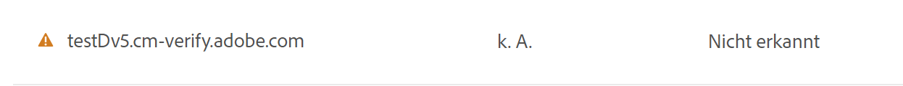
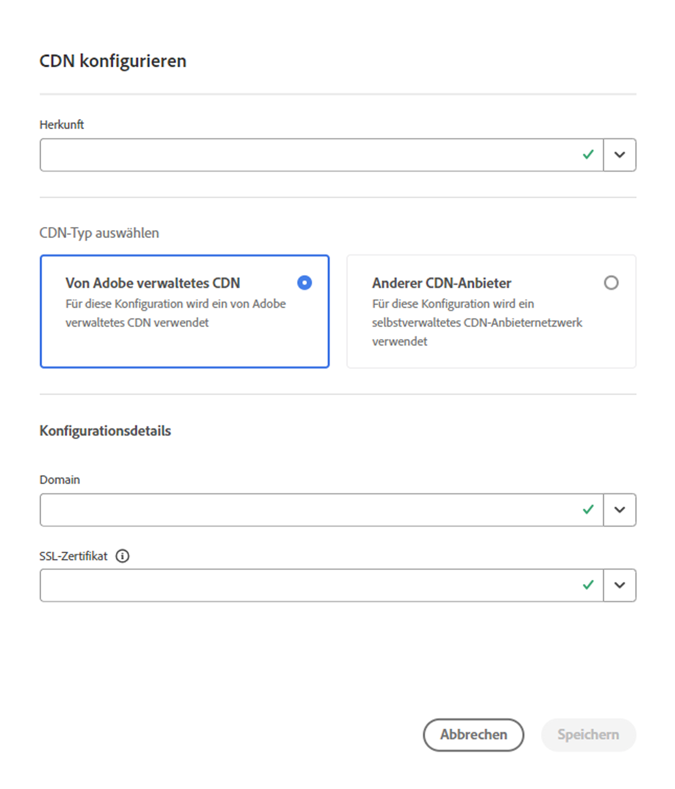

# DV-Zertifikate (Domain Validated) {#domain-validated-certificates}

Erfahren Sie, wie Sie in Cloud Manager DV-Zertifikate (Domain Validation) verwalten.

>[!NOTE]
>
>Diese Funktion ist nur für das [Early-Adopter-Programm](/help/implementing/cloud-manager/release-notes/current.md#early-adoption) verfügbar.

## Einführung {#introduction}

Mit Cloud Manager können Sie mithilfe des Self-Service ein DV-SSL-Zertifikat (Domain validierten) generieren und verwalten. Dadurch erhalten Sie die schnellste, einfachste und kostengünstigste Lösung, um eine sichere Website für Ihr Online-Geschäft zu erstellen.

Domänenvalidierte Zertifikate sind für beide verfügbar [Produktions- und Sandbox-Programme.](/help/implementing/cloud-manager/getting-access-to-aem-in-cloud/program-types.md)

## Hinzufügen einer benutzerdefinierten Domäne {#adding-domain}

Um ein DV-Zertifikat (domain validation) hinzuzufügen, müssen Sie zunächst Ihre benutzerdefinierte Domäne konfigurieren. Der Prozess entspricht weitgehend dem im Dokument beschriebenen [Einführung in benutzerdefinierte Domänennamen.](/help/implementing/cloud-manager/custom-domain-names/introduction.md) Diese Funktion wurde jedoch etwas erweitert.

1. Beim Überprüfen der Domäne können Sie zwischen der Verwendung von Adobe-verwalteten oder selbst verwalteten Zertifikaten für die Domäne wählen. Auswählen **Adobe-verwaltetes Zertifikat** , um später ein DV-Zertifikat hinzuzufügen.

   

1. Um ein von Adobe verwaltetes Zertifikat zu verwenden, müssen Sie Ihrem DNS einen CNAME-Eintrag hinzufügen, wie im Abschnitt **Domäne verifizieren** angezeigt.

   

1. Nachdem die Domäne erstellt wurde, tippen oder klicken Sie in der Liste der Domänen auf die Suchschaltfläche und wählen Sie **Überprüfen** , um die Domäne zu überprüfen.

   

## Hinzufügen eines DV-Zertifikats {#adding}

Nachdem Sie Ihre Domäne richtig konfiguriert haben, tippen oder klicken Sie auf das **SSL-Zertifikat hinzufügen** im Fenster &quot;SSL Certificates&quot;.

1. Wählen Sie die Option **Adobe verwaltet (DV)**.
1. Geben Sie den Domänennamen in der **Domänen auswählen** angezeigt.
1. Tippen oder klicken Sie auf **Speichern**.

Nachdem das Zertifikat erfolgreich hinzugefügt wurde, weist das Zertifikat den Status &quot;Ausstehend&quot;mit einem gelben Warnzeichen zu seinem Namen im **SSL-Zertifikate** Fenster.

Sobald das Zertifikat erfolgreich ausgestellt wurde, wird in der **SSL-Zertifikate** Fenster.

Weitere Informationen zum Hinzufügen von SSL-Zertifikaten und zum Fenster SSL-Zertifikate finden Sie im Dokument [Hinzufügen eines SSL-Zertifikats.](add-ssl-certificate.md)

## CDN-Konfiguration hinzufügen {#add-cdn}

Dieser Schritt muss abgeschlossen sein, um eine Domäne mit SSL mithilfe von Fastly CDN zu konfigurieren.

Führen Sie diese Schritte aus, um eine CDN-Konfiguration mit Cloud Manager hinzuzufügen.

1. Melden Sie sich unter [my.cloudmanager.adobe.com](https://my.cloudmanager.adobe.com/) bei Cloud Manager an und wählen Sie die entsprechende Organisation aus.

1. Wählen Sie die **CDN-Konfigurationen** Registerkarte und klicken oder tippen Sie **Hinzufügen** in der Symbolleiste.

1. Im **CDN konfigurieren** Dialogfeld die erforderlichen Informationen angeben.

   * Wählen Sie die **Origin**. Dabei kann es sich um Folgendes handeln:
      * Eine Cloud Service-Umgebung
      * Eine Edge Delivery Services-Site
   * Wählen Sie Ihren CDN-Typ aus.
   * Wählen Sie die Domäne aus.
   * Wählen Sie das SSL-Zertifikat aus.
      * Nur für Adobe-verwaltete CDNs erforderlich.

   

>
>
>Bei Adobe-verwalteten CDNs sind bei Verwendung von DV-Zertifikaten nur Sites mit ACME-Validierung zulässig.
