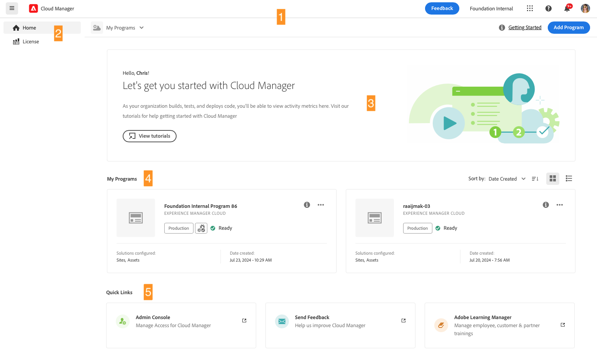

# Navigation durch die Cloud Manager-Benutzeroberfläche {#navigation}

Erfahren Sie, wie die Benutzeroberfläche von Cloud Manager aufgebaut ist und wie Sie Ihre Programme und Umgebungen verwalten.

Die Benutzeroberfläche für die Cloud-Verwaltung besteht in erster Linie aus zwei grafischen Schnittstellen:

* [Die Konsole „Meine Programme“](#my-programs), in der Sie alle Ihre Programme anzeigen und verwalten können.
* [Das Fenster „Programmübersicht“](#program-overview), in dem Sie die Details eines einzelnen Programms sehen und verwalten können.

>[!TIP]
>
>Sehen Sie sich auch die [Onboarding-Dokumentation Journey](/help/journey-onboarding/overview.md) an, um einen vollständigen Überblick darüber zu erhalten, wie Sie mit AEM as a Cloud Service mit Cloud Manager arbeiten können.

## Konsole „Meine Programme“ {#my-programs}

Wenn Sie sich bei Cloud Manager unter [my.cloudmanager.adobe.com](https://my.cloudmanager.adobe.com/) anmelden und die entsprechende Organisation auswählen, gelangen Sie in die Konsole **Meine Programme**.

Die Konsole „Meine Programme“ bietet einen Überblick über alle Programme, auf die Sie in der ausgewählten Organisation Zugriff haben. Sie besteht aus mehreren Teilen.

1. [Symbolleisten](#toolbars-my-programs-toolbars) für die Auswahl von Organisationen, Warnmeldungen und Kontoeinstellungen
1. [Statistiken und Aktionsaufrufe](#statistics) für einen Überblick über Ihre aktuellen Aktivitäten
1. [Programme und Lizenz](#programs-license), um Ihren aktuellen Lizenzstatus zu erfahren und Ihre Programme zu verwalten
1. [Schnell-Links](#quick-links) für den einfachen Zugriff auf verwandte Ressourcen

>[!TIP]
>
>Einzelheiten zu den Programmen sind dem Dokument [Programme und Programmarten](/help/implementing/cloud-manager/getting-access-to-aem-in-cloud/program-types.md) zu entnehmen.

### Symbolleisten {#my-programs-toolbars}

Es gibt zwei Symbolleisten übereinander.

#### Cloud Manager-Header {#cloud-manager-header}

Die erste ist der Header von Cloud Manager, der bestehen bleibt, wenn Sie in Cloud Manager navigieren. Er ist ein Anker, der Ihnen Zugriff auf Einstellungen und Informationen bietet, die für alle Cloud Manager-Programme gelten.

1. Über die Schaltfläche „Cloud Manager“ gelangen Sie zurück zur Konsole „Meine Programme“ von Cloud Manager, unabhängig davon, wo Sie sich in Cloud Manager befinden.
1. Tippen oder klicken Sie auf die Schaltfläche „Feedback“, um Adobe Feedback zu Cloud Manager zu geben.
1. Der Organisationsselektor zeigt die Organisation an, bei der Sie sich derzeit angemeldet haben (in diesem Beispiel „Foundation Intern“). Tippen oder klicken Sie, um zu einer anderen Organisation zu wechseln, wenn Ihre Adobe ID mit mehreren Organisationen verknüpft ist.
1. Durch Tippen oder Klicken auf den Lösungsumschalter können Sie schnell zu anderen Experience Cloud-Lösungen wechseln.
1. Das Hilfesymbol bietet schnellen Zugriff auf Lern- und Support-Ressourcen.
1. Dieses Benachrichtigungssymbol wird mit der Anzahl der aktuell zugewiesenen unvollständigen [Benachrichtigungen](/help/implementing/cloud-manager/notifications.md) gekennzeichnet.
1. Wählen Sie das Symbol für Ihre Benutzerin bzw. Ihren Benutzer aus, um auf Ihre Benutzereinstellungen zuzugreifen. Wenn Sie kein Benutzerbild konfiguriert haben, wird ein zufälliges Symbol zugewiesen.

#### Programmsymbolleiste {#program-toolbar}

Die Programmsymbolleiste enthält Links zum Wechseln zwischen Cloud Manager-Programmen und -Aktionen, die dem Kontext entsprechen.

1. Die Programmauswahl wird in einer Dropdown-Liste geöffnet, in der Sie schnell andere Programme auswählen oder kontextbezogene Aktionen ausführen können, z. B. die Erstellung eines neuen Programms.
1. Über den Link „Erste Schritte“ erhalten Sie Zugriff auf die [Journey zur Onboarding-Dokumentation](/help/journey-onboarding/overview.md), die Ihnen den Einstieg in Cloud Manager erleichtert.
1. Die Aktionsschaltfläche bietet kontextbezogene Aktionen, z. B. die Erstellung eines neuen Programms.

### Statistiken {#statistics}

Im Bereich „Statistiken“ finden Sie zusammengefasste Daten zu Ihrer Organisation. Wenn Sie z. B. Ihre Programme erfolgreich eingerichtet haben, können Sie hier Statistiken über Ihre Aktivitäten der letzten 90 Tage einsehen:

* Anzahl der [Bereitstellungen](/help/implementing/cloud-manager/deploy-code.md)
* Anzahl der identifizierten [Code-Qualitätsprobleme](/help/implementing/cloud-manager/code-quality-testing.md)
* Anzahl der Builds

Oder wenn Sie gerade mit der Einrichtung Ihrer Organisation beginnen, gibt es Tipps zu den nächsten Schritten oder Dokumentationsressourcen.

### Programme und Lizenzen {#programs-license}

Der Hauptinhalt der Konsole „Meine Programme“ ist die Liste der Programme und der Status Ihrer Lizenz.

#### Registerkarte „Programme“ {#programs}

Auf der Registerkarte **Programme** finden Sie Karten für jedes Programm, auf das Sie Zugriff haben. Tippen oder klicken Sie auf eine Karte, um die Seite **Programmübersicht** des Programms aufzurufen, auf der Sie Details zum Programm finden.

Verwenden Sie die Sortieroptionen, um das benötigte Programm leichter zu finden.

* Sortieren nach
   * Erstellungsdatum (Standard)
   * Programmname
   * Status
* Aufsteigend (Standard)/Absteigend
* Rasteransicht (Standard)
* Listenansicht

Jedes Programm wird durch eine Karte (oder eine Zeile in einer Tabelle) dargestellt, die einen Überblick über das Programm und Schnell-Links bietet, um Maßnahmen zu ergreifen.

* Programmbild (falls konfiguriert)
* Programmname
* Diensttyp: **Experience Manager Cloud** für AEM as a * Cloud Service-Programme oder [**Experience Manager** für AMS-Programme](https://experienceleague.adobe.com/en/docs/experience-manager-cloud-manager/content/introduction)
* [Programmtyp](/help/implementing/cloud-manager/getting-access-to-aem-in-cloud/program-types.md): Sandbox oder Produktion
* Status
* Konfigurierte Lösungen
* Erstellungsdatum

Abhängig von den bei der Erstellung des Programms ausgewählten Optionen kann ein Produktionsprogramm mit einem Abzeichen versehen werden, um zusätzliche Funktionen anzuzeigen.

* [HIPAA](/help/implementing/cloud-manager/getting-access-to-aem-in-cloud/creating-production-programs.md#security)

  

* [WAF-DDOS-Schutz](/help/implementing/cloud-manager/getting-access-to-aem-in-cloud/creating-production-programs.md#security)

  

* [99,99 % SLA](/help/implementing/cloud-manager/getting-access-to-aem-in-cloud/creating-production-programs.md#sla)

  

Über das Informationssymbol erhalten Sie auch Schnellzugriff auf zusätzliche Informationen zum Programm (nützlich in der Listenansicht).

Über das Symbol mit Auslassungspunkten gelangen Sie zu weiteren Aktionen, die Sie im Programm ausführen können.

* Navigieren zu einer bestimmten [Umgebung](/help/implementing/cloud-manager/manage-environments.md) des Programms
* Öffnen der [Programmübersicht](#program-overview)
* [Bearbeiten des Programms](/help/implementing/cloud-manager/getting-access-to-aem-in-cloud/editing-programs.md#editing)
* [Sandbox-Programm löschen](/help/implementing/cloud-manager/getting-access-to-aem-in-cloud/editing-programs.md#delete-sandbox-program)

>[!TIP]
>
>Weitere Informationen zu Programmen sowie zur Erstellung und Verwaltung von Programmen finden Sie in den folgenden Dokumenten.
>
>* [Programme und Programmtypen](/help/implementing/cloud-manager/getting-access-to-aem-in-cloud/program-types.md)
>* [Erstellen von Sandbox-Programmen](/help/implementing/cloud-manager/getting-access-to-aem-in-cloud/creating-sandbox-programs.md)
>* [Erstellen von Produktionsprogrammen](/help/implementing/cloud-manager/getting-access-to-aem-in-cloud/creating-production-programs.md)

#### Registerkarte „Lizenz“ {#license-tab}

Die Registerkarte **Lizenz** bietet Ihnen schnellen Zugriff auf das [Lizenz-Dashboard.](/help/implementing/cloud-manager/license-dashboard.md)

### Schnell-Links {#quick-links}

Über den Abschnitt „Schnell-Links“ erhalten Sie Zugriff auf häufig verwendete, zugehörige Ressourcen.

## Fenster „Programmübersicht“ {#program-overview}

Nachdem Sie ein Programm in der Konsole „Meine Programme“ ausgewählt haben, gelangen Sie zur Programmübersicht.

Die Programmübersicht bietet Zugriff auf alle Details eines Cloud Manager-Programms. Wie die Konsole „Meine Programme“ besteht sie aus mehreren Teilen.

1. [Symbolleisten](#program-overview-toolbar), um schnell zur Konsole „Meine Programme“ zurückzukehren und durch das Programm zu navigieren.
1. [Registerkarten](#program-tabs), um zwischen den verschiedenen Aspekten des Programms zu wechseln
1. Ein [Aktionsaufruf](#cta) basierend auf den letzten Aktionen des Programms
1. Eine [Übersicht über die Umgebungen](#environments) des Programms
1. Eine [Übersicht über die Pipelines](#pipelines) des Programms
1. Überblick über die Leistung des Programms ](#performance)[
1. Links zu [nützlichen Ressourcen](#useful-resources)

### Symbolleisten {#program-overview-toolbar}

Die Symbolleisten für die Programmübersicht sind denen der Konsole [Meine Programme](#my-programs-toolbars) sehr ähnlich. Hier werden nur die Unterschiede veranschaulicht.

#### Cloud Manager-Header {#cloud-manager-header-2}

Der Header von Cloud Manager verfügt über ein Hamburger-Menü, das automatisch geöffnet wird, um die navigierbaren Registerkarten der Programmübersicht anzuzeigen.

Tippen oder klicken Sie auf das Hamburger-Menüsymbol, um die Registerkarten auszublenden.

#### Programmsymbolleiste {#program-toolbar-2}

Die Programmsymbolleiste ermöglicht weiterhin den schnellen Wechsel zu anderen Programmen, bietet aber auch Zugriff auf kontextbezogene Aktionen wie das Hinzufügen und Bearbeiten des Programms.

Außerdem zeigt die Symbolleiste jederzeit an, auf welcher Registerkarte Sie sich befinden, wenn Sie die Registerkarten über das Hamburger-Menü ausgeblendet haben.

### Programmregisterkarten {#program-tabs}

Jedem Programm sind zahlreiche Optionen und Daten zugeordnet. Diese Daten werden in Registerkarten zusammengefasst, um die Navigation im Programm zu vereinfachen. Die Registerkarten bieten Zugriff auf:

* Übersicht: Die im aktuellen Dokument beschriebene Programmübersicht
* [Aktivität](/help/implementing/cloud-manager/configuring-pipelines/managing-pipelines.md#activity): Verlauf der Pipeline-Ausführungen des Programms
* [Pipelines](/help/implementing/cloud-manager/configuring-pipelines/managing-pipelines.md#pipelines): Alle für das Programm konfigurierten Pipelines
* [Repositorys](/help/implementing/cloud-manager/managing-code/managing-repositories.md): Alle für das Programm konfigurierten Repositorys
* [Berichte](/help/implementing/cloud-manager/sla-reporting.md): Metriken wie SLA-Daten
* [Umgebungen](/help/implementing/cloud-manager/manage-environments.md): Alle für das Programm konfigurierten Umgebungen
* [Content-Sets](/help/implementing/developing/tools/content-copy.md): Sätze von Inhalten, die zu Kopierzwecken festgelegt wurden
* [Aktivität „Inhalt kopieren“](/help/implementing/developing/tools/content-copy.md): Aktivitäten zur Inhaltskopie
* Lernpfade: Zusätzliche Lernressourcen zu Cloud Manager

Wenn Sie ein Programm öffnen, gelangen Sie standardmäßig zur Registerkarte **Übersicht**. Die aktuelle Registerkarte ist hervorgehoben. Wählen Sie eine andere Registerkarte aus, um deren Details anzuzeigen.

Verwenden Sie das Hamburger-Menü im [Cloud Manager-Header](#cloud-manager-header-2), um die Registerkarten auszublenden.

### Aktionsaufruf {#cta}

Der Aktionsaufrufs-Abschnitt gibt Ihnen je nach Status Ihres Programms hilfreiche Informationen. Für ein neues Programm werden Ihnen möglicherweise die nächsten Schritte angeboten sowie eine Erinnerung an das Startdatum, [das bei der Programmerstellung festgelegt wurde.](/help/implementing/cloud-manager/getting-access-to-aem-in-cloud/editing-programs.md)

Bei einem Live-Programm den Status Ihrer letzten Bereitstellung mit Links zu Details und zum Beginn einer neuen Bereitstellung.

### Umgebungskarte {#environments}

Die Karte **Umgebungen** gibt Ihnen einen Überblick über Ihre Umgebungen sowie Links für Schnellaktionen.

Die Karte **Umgebungen** listet nur drei Umgebungen auf. Klicken Sie auf **Alle anzeigen**, um alle Umgebungen des Programms zu sehen.

Bitte lesen Sie das Dokument [Verwaltung von Umgebungen](/help/implementing/cloud-manager/manage-environments.md), um zu erfahren, wie Sie Ihre Umgebungen verwalten können.

### Pipelines-Karte {#pipelines}

Die Karte **Pipelines** gibt Ihnen einen Überblick über Ihre Pipelines sowie Links für Schnellaktionen.

Auf der Karte **Pipelines** sind nur drei Pipelines aufgeführt. Klicken Sie auf **Alle anzeigen**, um alle Pipelines des Programms zu sehen.

Bitte lesen Sie das Dokument [Verwaltung von Pipelines](/help/implementing/cloud-manager/configuring-pipelines/managing-pipelines.md), um zu erfahren, wie Sie Ihre Pipelines verwalten können.

### Leistungskarte {#performance}

Die Karte **Leistung** gibt einen Überblick über das **[CDN-Dashboard.](/help/implementing/cloud-manager/cdn-performance.md)**

### Nützliche Ressourcen {#useful-resources}

Der Abschnitt **Nützliche Ressourcen** enthält Links zu weiteren Lernressourcen für Cloud Manager.
