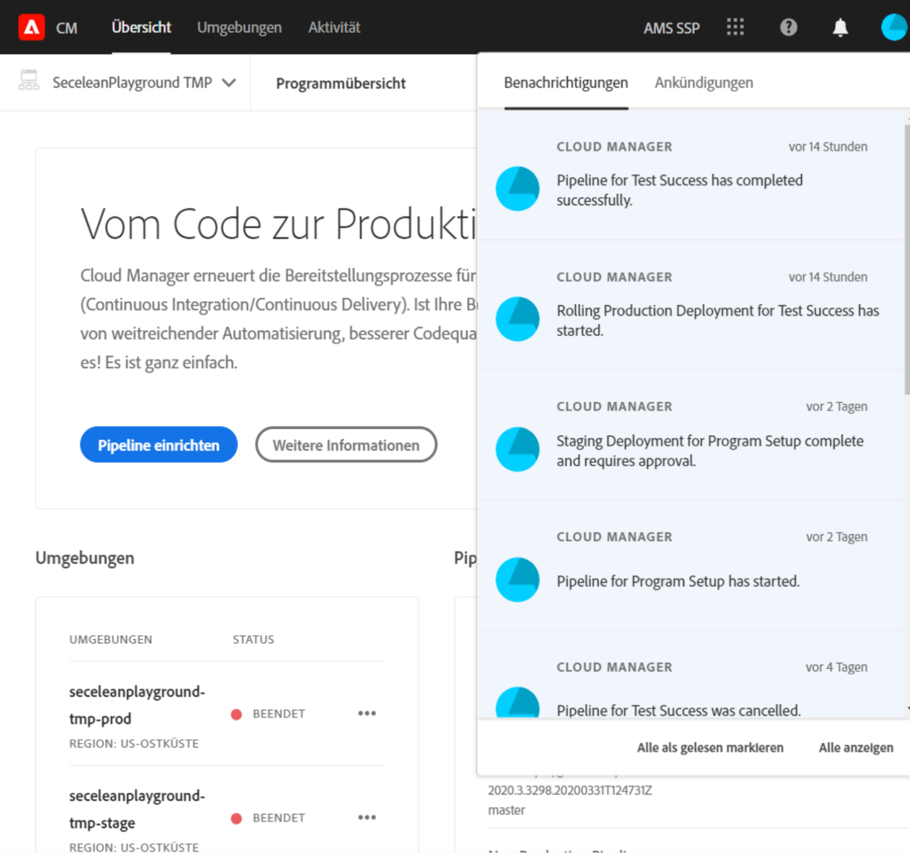

# Benachrichtigungen {#notifications}

[!UICONTROL Cloud Manager] ermöglicht es dem Benutzer, während einer Produktionsbereitstellung Benachrichtigungen beim Starten und Fertigstellen der Produktions-Pipeline (ob erfolgreich oder nicht) zu erhalten.

Diese Benachrichtigungen werden über die Adobe gesendet [!UICONTROL Experience Cloud] Benachrichtigungssystem für Benutzer mit Rollen **Business Owner**, **Programm-Manager** und **Bereitstellungsmanager**.

Die Benachrichtigungen werden rechts in der Menüleiste im [!UICONTROL Cloud Manager] Benutzeroberfläche und Adobe [!UICONTROL Experience Cloud].

Das Glockensymbol wird bei neuen Benachrichtigungen mit einem Abzeichen versehen. Klicken Sie darauf, um ein Bedienfeld zum Anzeigen der Benachrichtigungen zu öffnen.

Im Bereich werden nur die neuesten Benachrichtigungen aufgelistet. Klicken **Alle anzeigen** unten im Bedienfeld, um alle Ihre Benachrichtigungen anzuzeigen.

## E-Mail-Benachrichtigungen {#email-notifications}

Standardmäßig sind Benachrichtigungen in der Adobe in der Benutzeroberfläche verfügbar [!UICONTROL Experience Cloud] Lösungen. Einzelne Benutzer können sich auch dafür entscheiden, diese Benachrichtigungen per E-Mail zu versenden, indem sie die folgenden Schritte ausführen.

1. Klicken Sie auf das Glockensymbol, um die Benachrichtigungen anzuzeigen.
1. Klicken Sie auf **Voreinstellungen bearbeiten** -Symbol (in Form eines Fanggeräts) am oberen Rand des Benachrichtigungsfelds.
1. Klicken Sie im sich öffnenden Fenster auf **Benachrichtigungen** in der linken Navigation.
   
1. Scrollen Sie nach unten zum **Email** -Überschrift.
   
1. Wählen Sie aus, wie Sie Ihre E-Mails erhalten möchten.
   * E-Mails nicht senden (Standard)
   * Sofortige Benachrichtigungen
   * Tägliche Zusammenfassung
   * Wöchentliche Digest

Nachdem Sie Ihre Auswahl getroffen haben, wird Ihre Auswahl automatisch gespeichert, ohne dass Sie auf eine Schaltfläche zum Speichern oder Anwenden klicken müssen.
