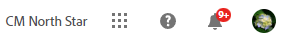
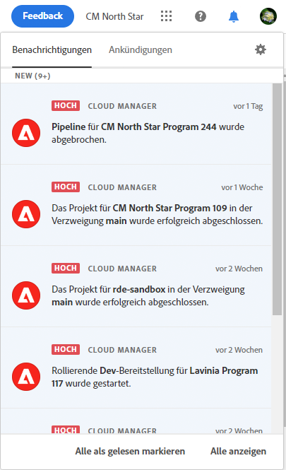
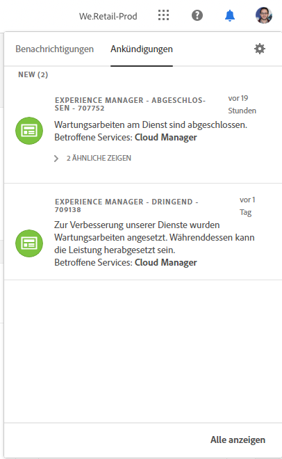
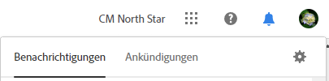
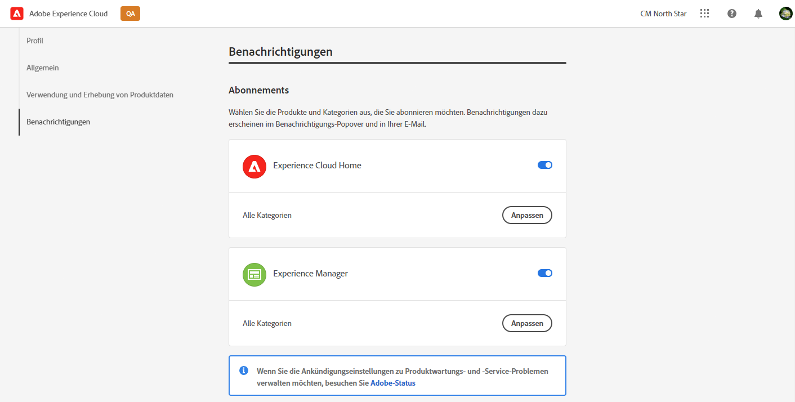
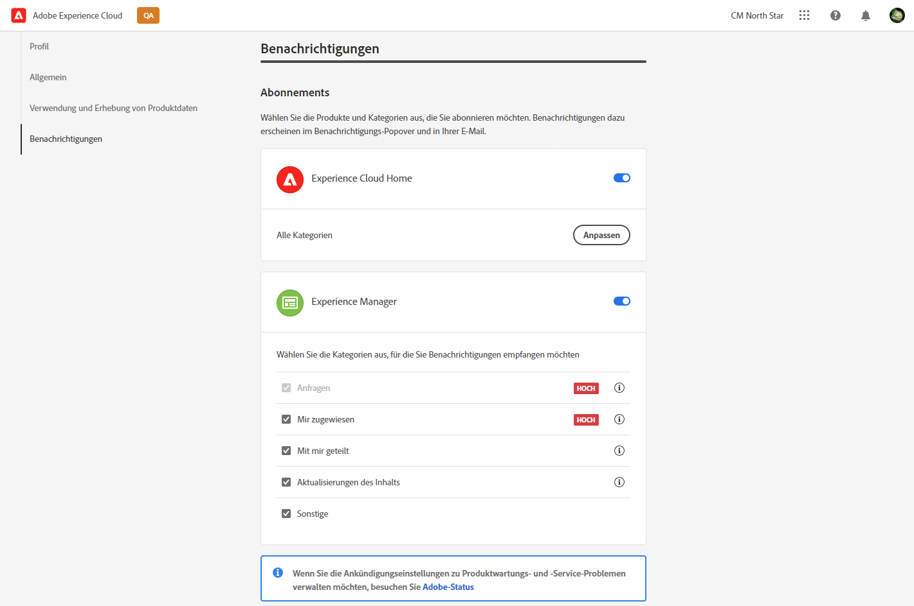
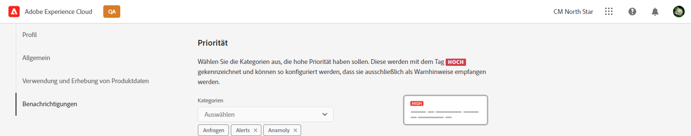
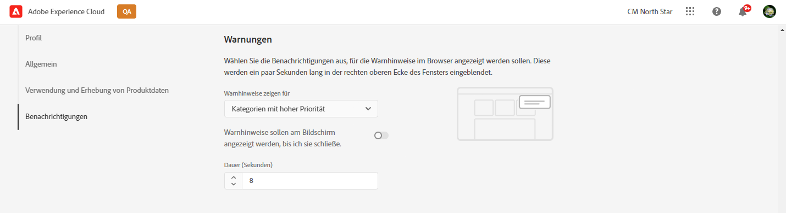
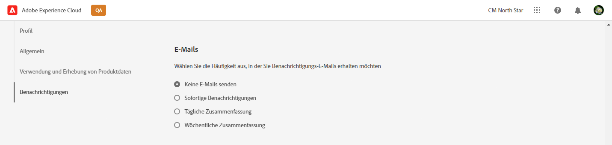

# Benachrichtigungen {#notifications}

Erfahren Sie, wie Sie von Cloud Manager über wichtige Ereignisse benachrichtigt werden.

## Benachrichtigungen in Cloud Manager {#cloud-manager-notifications}

[!UICONTROL Cloud Manager] sendet Ihnen zu Beginn einer Produktionsbereitstellung beim Start und beim Abschluss der Produktions-Pipeline (erfolgreich oder nicht erfolgreich) Benachrichtigungen.

Diese Benachrichtigungen werden über das [!UICONTROL Experience Cloud]-Benachrichtigungssystem an Benutzer mit den Rollen **Geschäftsinhaber**, **Programm-Manager** und **Bereitstellungs-Manager** gesendet.

Die Benachrichtigungen werden in einer Seitenleiste der [!UICONTROL Cloud Manager]-Benutzeroberfläche und überall in Adobe [!UICONTROL Experience Cloud] angezeigt. Das Glockensymbol in der Kopfzeile zeigt ein Badge, wenn es neue Benachrichtigungen für Sie gibt.

Klicken Sie auf das Glockensymbol, um die Seitenleiste zu öffnen und die Benachrichtigungen anzuzeigen. Die Registerkarte **Benachrichtigungen** in der Seitenleiste listet die neuesten Benachrichtigungen wie beispielsweise Bereitstellungsbestätigungen auf. Benachrichtigungen beziehen sich auf Ihre Umgebungen.

Die Registerkarte **Ankündigungen** enthält Ankündigungen zu Adobe-Produkten. Ankündigungen beziehen sich auf das Produkt.

Klicken Sie auf eine Benachrichtigung oder Mitteilung, um deren Details anzuzeigen. Benachrichtigungen, die mit Aktivitäten wie Pipeline-Bereitstellungen verknüpft sind, führen Sie zu den Details dieser Aktivität, beispielsweise dem Pipeline-Ausführungsfenster.

Klicken Sie auf die Option **Alles anzeigen** am Ende des Bedienfelds, um alle Benachrichtigungen in Ihrem Posteingang anzuzeigen.

Klicken Sie auf die Option **Alle als gelesen markieren** am Ende des Bedienfelds, um alle ungelesenen Benachrichtigungen als gelesen zu markieren und das aktivierte Glockensymbol wieder zu deaktivieren.

## Konfiguration von Benachrichtigungen {#configuration}

Sie können einstellen, wie Sie welche Benachrichtigungen erhalten möchten.

Klicken Sie auf das Zahnradsymbol oben in der Benachrichtigungsseitenleiste, um das Fenster **Experience Cloud-Einstellungen** zu öffnen. Hier können Sie Ihre Benachrichtigungsabonnements und den Empfang Ihrer Benachrichtigungen definieren.

### Abonnements {#subscriptions}

Mit den Abonnements legen Sie fest, welche Benachrichtigungen Sie für welche Produkte erhalten.

Standardmäßig erhalten Sie alle Benachrichtigungen für alle Produkte sowohl in der Anwendung als auch per E-Mail. Klicken Sie auf den Pfeil neben einem Produktnamen, um die detaillierten Optionen anzuzeigen und die Arten von Benachrichtigungen festzulegen, die Sie für dieses Produkt erhalten möchten. Oder aktivieren oder deaktivieren Sie die Optionen auf Produktebene, um alle Optionen für das Produkt auszuwählen/abzuwählen.

### Priorität {#priority}

Prioritätswarnungen werden mit einem **HOCH**-Tag gekennzeichnet. Sie können sie so konfigurieren, dass sie ausschließlich als Warnhinweise empfangen werden. Im Abschnitt **Priorität** können Sie festlegen, welche Kategorien als Prioritätsbenachrichtigungen eingestuft werden.

Verwenden Sie die Dropdown-Liste, um die Liste der Kategorien zu erweitern, die als prioritär eingestuft werden. Klicken Sie auf das X neben den Kategorienamen, um sie zu entfernen.

### Warnhinweise {#alerts}

Warnhinweise werden für einige Sekunden in der oberen rechten Ecke des Fensters angezeigt. Im Abschnitt **Warnhinweise** können Sie festlegen, für welche Benachrichtigungen Sie Warnhinweise erhalten möchten.

Sie können das Verhalten der Warnhinweise definieren.

* **Warnhinweise anzeigen für**: Definiert die Arten von Benachrichtigungen, die Warnhinweise auslösen.
* **Warnhinweise sollen am Bildschirm angezeigt werden, bis ich sie schließe**: Legt fest, ob die Warnhinweise bestehen bleiben sollen, bis Sie sie aktiv deaktivieren.
* **Dauer**: Legt fest, wie lange ein Warnhinweis auf dem Bildschirm eingeblendet werden soll, außer Sie haben ausgewählt, dass ein Warnhinweis auf dem Bildschirm verbleiben soll.

### E-Mails {#emails}

Benachrichtigungen sind in der Web-Benutzeroberfläche aller Adobe [!UICONTROL Experience Cloud]-Lösungen verfügbar. Sie können auch im Abschnitt **E-Mails** festlegen, dass diese Benachrichtigungen per E-Mai gesendet werden sollen.

Standardmäßig werden keine E-Mails versendet. Sie haben für den E-Mail-Empfang folgende Wahlmöglichkeiten:

* Sofort
* Täglich
* Wöchentlich

Wenn Sie **Sofortige Benachrichtigungen** auswählen, werden für jede Benachrichtigung sofort E-Mails gesendet. Bei einer **täglichen Zusammenfassung** können Sie die Uhrzeit und bei einer **wöchentlichen Zusammenfassung** können Sie den Tag und die Uhrzeit des Versands auswählen.