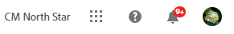
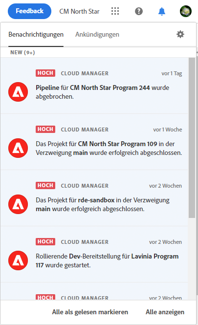
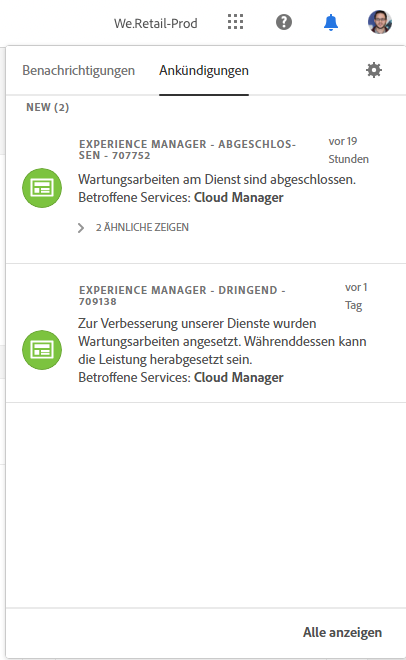
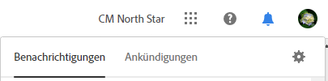
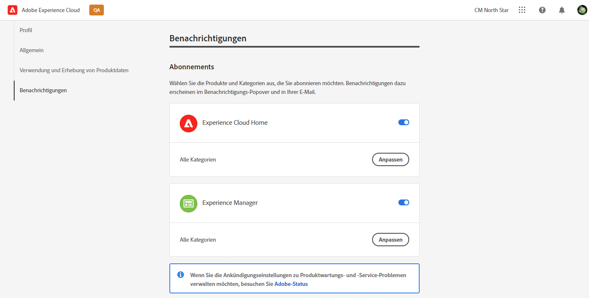
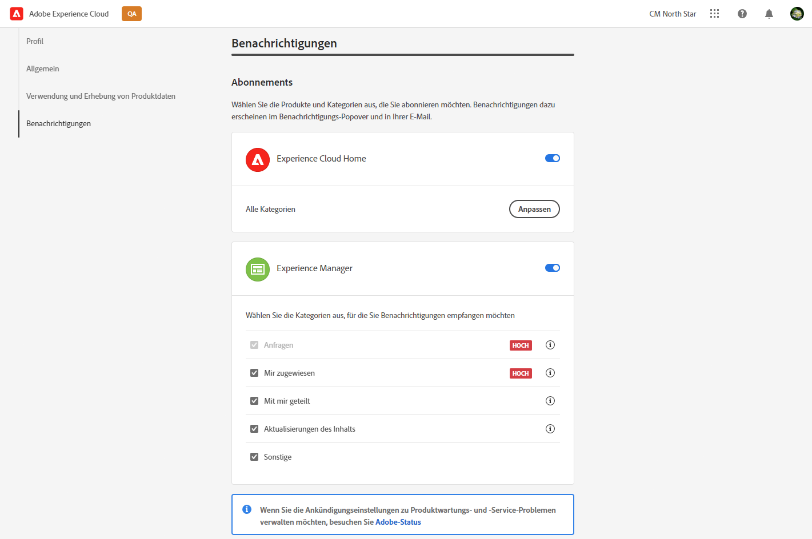
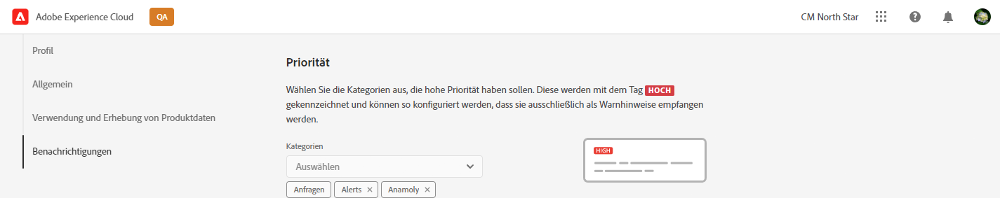
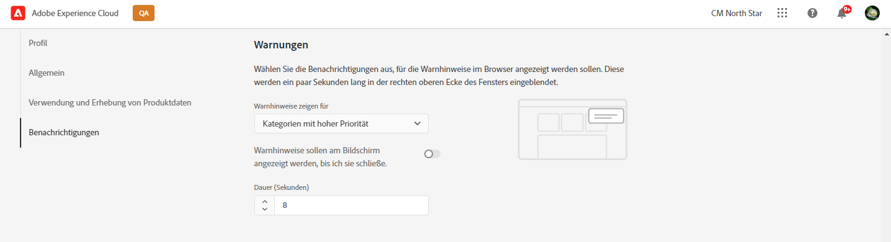
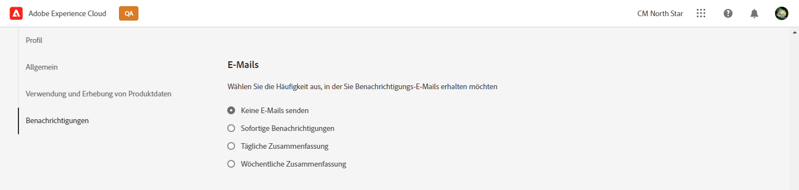

# Benachrichtigungen {#notifications}

Erfahren Sie, wie Sie von Cloud Manager über wichtige Ereignisse benachrichtigt werden.

## Benachrichtigungen in Cloud Manager {#cloud-manager-notifications}

[!UICONTROL Cloud Manager] Stellt Benachrichtigungen bereit, wenn eine Produktions-Pipeline während einer Produktionsbereitstellung gestartet und abgeschlossen wird (erfolgreich oder nicht erfolgreich).

Diese Benachrichtigungen werden über das [!UICONTROL CX Enterprise]-Benachrichtigungssystem an Benutzer mit den Rollen **Geschäftsinhaber**, **Programm-Manager** und **Bereitstellungs-Manager** gesendet.

Die Benachrichtigungen werden in einer Seitenleiste der [!UICONTROL Cloud Manager] und überall in Adobe [!UICONTROL CX Enterprise] angezeigt. Das Glockensymbol in der Kopfzeile zeigt ein Abzeichen, wenn Sie neue Benachrichtigungen erhalten.

Klicken Sie auf das Glockensymbol, um die Seitenleiste zu öffnen und die Benachrichtigungen anzuzeigen. Die Registerkarte **Benachrichtigungen** in der Seitenleiste listet die neuesten Benachrichtigungen wie beispielsweise Bereitstellungsbestätigungen auf. Benachrichtigungen beziehen sich auf Ihre Umgebungen.

Die Registerkarte **Ankündigungen** enthält Ankündigungen zu Adobe-Produkten. Ankündigungen beziehen sich auf das Produkt.

Klicken Sie auf eine Benachrichtigung oder Mitteilung, um deren Details anzuzeigen. Benachrichtigungen, die mit Aktivitäten wie Pipeline-Bereitstellungen verknüpft sind, führen Sie zu den Details dieser Aktivität, z. B. dem Pipeline-Ausführungsfenster.

Klicken Sie auf die Option **Alles anzeigen** am Ende des Bedienfelds, um alle Benachrichtigungen in Ihrem Posteingang anzuzeigen.

Klicken Sie auf die Option **Alle als gelesen markieren** am Ende des Bedienfelds, um alle ungelesenen Benachrichtigungen als gelesen zu markieren und das aktivierte Glockensymbol wieder zu deaktivieren.

## Konfiguration von Benachrichtigungen {#configuration}

Sie können einstellen, wie Sie welche Benachrichtigungen erhalten möchten.

Klicken Sie auf das Einstellungssymbol oben in der Benachrichtigungsseitenleiste, um das Fenster **CX Enterprise-**&quot; zu öffnen. Hier können Sie Ihre Benachrichtigungsabonnements und den Empfang von Benachrichtigungen definieren.

### Abonnements {#subscriptions}

Abonnements definieren, für welche Produkte Sie Benachrichtigungen erhalten und welche Arten von Benachrichtigungen Sie erhalten.

Standardmäßig erhalten Sie alle Benachrichtigungen für alle Produkte sowohl in der Anwendung als auch per E-Mail. Klicken Sie auf den Pfeil neben einem Produktnamen, um die detaillierten Optionen anzuzeigen und die Arten von Benachrichtigungen festzulegen, die Sie für dieses Produkt erhalten möchten. Oder aktivieren oder deaktivieren Sie die Optionen auf Produktebene, um alle Optionen für das Produkt auszuwählen/abzuwählen.

### Priorität {#priority}

Prioritätswarnhinweise sind mit einer **HIGH**-Kennzeichnung gekennzeichnet. Sie können den Empfang als Warnhinweise konfigurieren. Im Abschnitt **Priorität** können Sie festlegen, welche Kategorien als Prioritätsbenachrichtigungen eingestuft werden.

Verwenden Sie das Dropdown-Menü, um die Liste der Kategorien zu erweitern, die als prioritär eingestuft werden. Klicken Sie auf das Löschsymbol neben den Kategorienamen, um sie zu entfernen.

### Warnhinweise {#alerts}

Warnhinweise werden für einige Sekunden in der oberen rechten Ecke des Fensters angezeigt. Im Abschnitt **Warnhinweise** können Sie festlegen, für welche Benachrichtigungen Sie Warnhinweise erhalten möchten.

Sie können das Verhalten der Warnhinweise definieren.

* **Warnhinweise anzeigen für** - Definiert die Arten von Benachrichtigungen, bei denen ein Trigger Warnhinweise ausgibt.
* **Warnhinweise bleiben auf dem Bildschirm, bis Sie sie schließen** - Legt fest, ob die Warnhinweise bestehen bleiben, bis Sie sie aktiv deaktivieren.
* **Dauer** - Legt fest, wie lange der Warnhinweis auf dem Bildschirm eingeblendet wird, solange er nicht für die Beibehaltung konfiguriert wurde.

### E-Mails {#emails}

Benachrichtigungen sind in der Web-Benutzeroberfläche aller Adobe [!UICONTROL CX Enterprise]-Lösungen verfügbar. Um sich für den Versand dieser Benachrichtigungen per E-Mail zu entscheiden, verwenden Sie den Abschnitt **E-Mails**.

Standardmäßig werden keine E-Mails gesendet. Sie haben für den E-Mail-Empfang folgende Wahlmöglichkeiten:

* Sofort
* Täglich
* Wöchentlich

Wenn Sie **Sofortige Benachrichtigungen** auswählen, werden für jede Benachrichtigung sofort E-Mails gesendet. Für **Tägliche Zusammenfassung** und **Wöchentliche Zusammenfassung** können Sie auswählen, wann Ihre tägliche Zusammenfassung gesendet wird und an welchem Tag und wann Ihre wöchentliche Zusammenfassung gesendet wird.