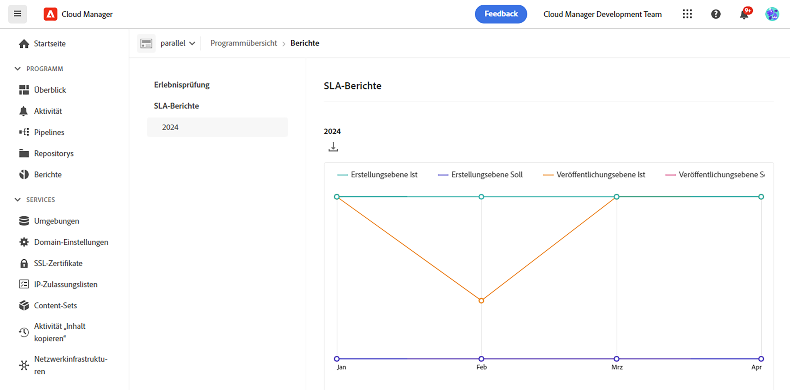
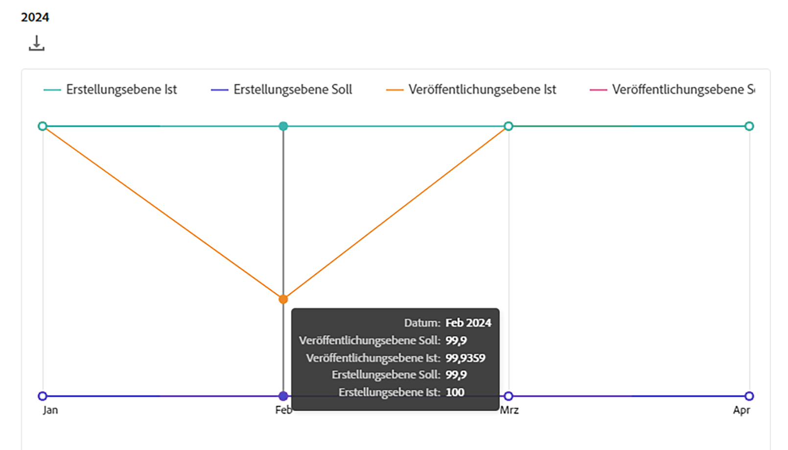

# SLA-Berichte {#sla-reporting}

Gehen Sie wie folgt vor, um mehr über SLA-Berichte in AEM as a Cloud Service zu erfahren.

## Einführung {#introduction}

Die Leistungsdaten einer AEM-Umgebung können mit dem vertraglich vereinbarten Service Level Agreement (SLA) verglichen werden. Dies ist über ein Menü auf der Registerkarte „Berichte“ verfügbar, auf das über die Hauptkopfzeile zugegriffen werden kann.

Im folgenden Beispiel handelt es sich um ein Diagramm, das die monatliche SLA-Leistung für 2021 anzeigt.

Wenn Sie den Mauszeiger über einen Datenpunkt bewegen, werden die spezifischen Werte für diesen Monat angezeigt.

>[!NOTE]
>Diese Berichte werden den Kunden schrittweise zur Verfügung gestellt. Wenn die Option „Berichte“ im Hauptnavigationsmenü nicht angezeigt wird, wenden Sie sich an Ihren Adobe-Support-Mitarbeiter, um zu erfahren, wann Ihnen Berichte zur Verfügung gestellt werden.

Der Abschnitt „Ereignisanalyse“ unter diesem Diagramm zeigt die Anzahl von Vorfällen, die im aktuell ausgewählten Jahr beim Programm aufgetreten sind.

Jeder Vorfall hat einen Zeitraum, eine Ursache und eine Reihe von Kommentaren, wie in der folgenden Abbildung dargestellt.

## SLA-Metriken {#sla-metrics}

* **Veröffentlichungsebene – Vertrag**: Dies ist das SLA, das in Ihrem Vertrag mit Adobe für die Veröffentlichungsebene definiert ist.

* **Veröffentlichungsebene – Tatsächlich**: Dies ist die gemessene Produktionszeit im Hinblick auf Factoring-Vorfälle in der Produktions-Veröffentlichungsebene, die von Adobe oder unseren Anbietern verursacht wurden.

* **Autorenebene – Vertrag**: Dies ist das SLA, das in Ihrem Vertrag mit Adobe für die Autorenebene definiert ist.

* **Autorenebene – Tatsächlich**: Dies ist die gemessene Produktionszeit im Hinblick auf Factoring-Vorfälle in der Produktions-Autorenebene, die von Adobe oder unseren Anbietern verursacht wurden.

