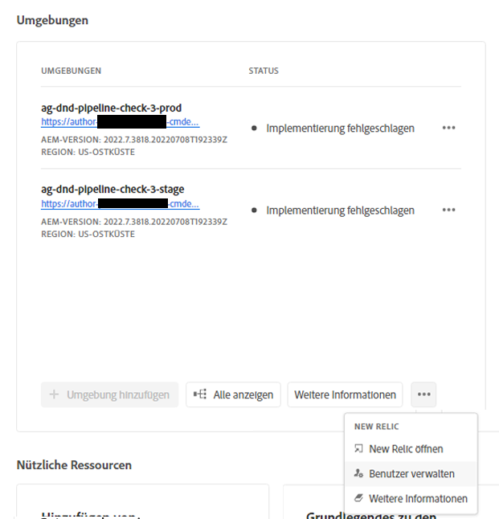
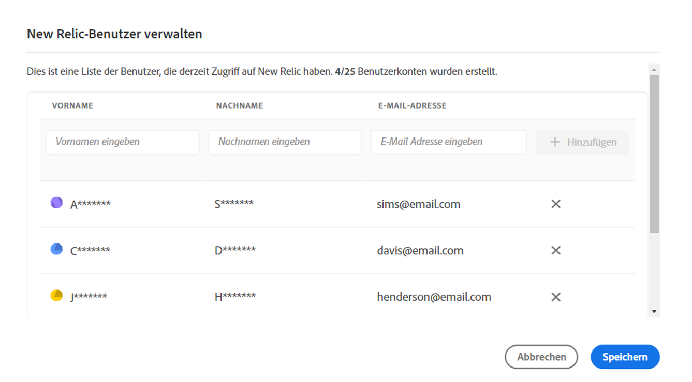
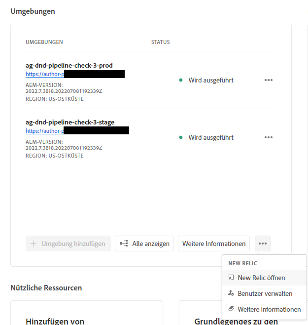

# New Relic One {#user-access}

Erfahren Sie mehr über den APM-Service (Application Performance Monitoring) von New Relic One für AEM as a Cloud Service und wie Sie darauf zugreifen können.

## Über New Relic One {#introduction}

Adobe erachtet die Überwachbarkeit, Verfügbarkeit und Leistungsfähigkeit Ihrer Anwendung als außerordentlich wichtig. AEM as a Cloud Service bietet Zugriff auf die New Relic One-Überwachung, sodass Teams im Rahmen des Standardproduktangebots umfassende Einblicke in Metriken zur System- und Umgebungsleistung erhalten.

In diesem Dokument wird beschrieben, wie Sie den Zugriff auf Funktionen zur Leistungsüberwachung von New Relic One-Anwendungen (APM) in AEM as a Cloud Service-Umgebungen verwalten. Die effektive Verwaltung dieser Funktionen unterstützt eine optimale Leistung und maximiert die Vorteile von AEM as a Cloud Service.

Wenn ein neues Produktionsprogramm erstellt wird, wird automatisch ein mit Ihrem AEM as a Cloud Service-Programm verknüpftes New Relic One-Unterkonto erstellt. [Dieses Unterkonto muss aktiviert werden](#activate-sub-account), damit die Aufnahme von Daten beginnen kann.

## Funktionen {#transaction-monitoring}

New Relic One APM für AEM as a Cloud Service hat viele Funktionen.

* Direkter Zugriff auf das dedizierte Konto „New Relic One“

* Instrumentierter New Relic One APM-Agent, der exakte Methodenaufrufe mit Zeilennummern anzeigt, einschließlich externer Abhängigkeiten und Datenbanken

* Ganzheitliche Leistungsoptimierung durch die Kombination von Schlüsselmetriken aus der Überwachung auf Infrastruktur- und Anwendungsebene (Adobe Experience Manager).

* AEM as a Cloud Service stellt Java Management Extensions(JMX)-MBeans und Konsistenzprüfungen direkt in New Relic Insights bereit, sodass Sie die Anwendungsleistung und Konsistenzmetriken eingehend überprüfen können.

## Aktivieren Ihres New Relic One-Unterkontos {#activate-sub-account}

Für ein neu erstelltes Programm wird ein New Relic One-Unterkonto für Sie erstellt. Sie müssen es jedoch aktivieren, damit es Daten aufnehmen kann. Diese Aktivierung erfolgt nicht automatisch. Führen Sie die folgenden Schritte aus, um Ihr Unterkonto zu aktivieren.

>[!NOTE]
>
>Eine Person muss mit der Rolle **Geschäftsinhaber** oder **Bereitstellungs-Manager** angemeldet sein, um ein New Relic One-Unterkonto verwalten zu können.

1. Melden Sie sich unter [my.cloudmanager.adobe.com](https://my.cloudmanager.adobe.com/) bei Cloud Manager an und wählen Sie die entsprechende Organisation aus.

1. Klicken Sie in der Konsole **[Meine Programme](/help/implementing/cloud-manager/navigation.md#my-programs)** auf das Programm, für das die New Relic One-Benutzenden verwaltet werden sollen.

1. Klicken Sie auf der Seite „Programmübersicht“ unten auf der Karte **Umgebungen** auf  und wählen Sie **New Relic aktivieren** aus.

   

   * Sie können auch auf die Option **Benutzer verwalten** zugreifen. Klicken Sie oben auf dem Bildschirm **Umgebungen** Ihres Programms auf das Symbol .

1. [Führen Sie eine Pipeline](/help/implementing/cloud-manager/configuring-pipelines/managing-pipelines.md#running-pipelines) für dieselbe Umgebung bis zum erfolgreichen Abschluss aus, um die Aktivierung des Unterkontos abzuschließen.

Wenn das Unterkonto deaktiviert ist, werden keine Daten aufgenommen.

## Verwalten von New Relic One-Benutzenden {#manage-users}

Führen Sie diese Schritte aus, um die Benutzenden Ihres New Relic One-Unterkontos, das mit Ihrem AEM as a Cloud Service-Programm verbunden ist, zu definieren.

>[!NOTE]
>
>Eine Person muss mit der Rolle **Geschäftsinhaber** oder **Bereitstellungs-Manager** angemeldet sein, um New Relic One-Benutzende verwalten zu können.

1. Melden Sie sich unter [my.cloudmanager.adobe.com](https://my.cloudmanager.adobe.com/) bei Cloud Manager an und wählen Sie die entsprechende Organisation aus.

1. Klicken Sie auf das Programm, für das Sie Ihre New Relic One-Benutzenden verwalten möchten.

1. Klicken Sie auf der Seite „Programmübersicht“ unten auf der Karte **Umgebungen** auf  und wählen Sie **Benutzer verwalten** aus.

   

   * Sie können auch auf die Option **Benutzer verwalten** zugreifen. Klicken Sie oben auf dem Bildschirm **Umgebungen** Ihres Programms auf das Symbol .

1. Geben Sie im Dialogfeld **New Relic-Benutzer verwalten** den Vor- und Nachnamen der Person ein, die Sie hinzufügen möchten, und klicken Sie auf die Schaltfläche **Hinzufügen**. Wiederholen Sie diesen Schritt für alle Benutzenden, die Sie hinzufügen möchten.

   

1. Um New Relic One-Benutzende zu entfernen, klicken Sie am rechten Ende der Zeile für die jeweilige Person auf die Schaltfläche „Löschen“.

1. Klicken Sie auf **Speichern**, um die-Benutzenden zu erstellen.

Sobald die Benutzenden definiert sind, sendet New Relic eine Bestätigungs-E-Mail an jede Person, der Sie Zugriff gewährt haben, damit sie den Einrichtungsprozess abschließen und sich anmelden kann.

>[!NOTE]
>
>Wenn Sie die Benutzenden von New Relic One verwalten, müssen Sie sich auch selbst als Benutzerin bzw. Benutzer hinzufügen, um ebenfalls Zugriff zu haben. Die Rolle als **Geschäftsinhaber** oder **Bereitstellungs-Manager** reicht nicht aus, um Zugriff auf New Relic One zu erhalten. Sie müssen auch sich selbst als Benutzerin bzw. Benutzer erstellen.

## Aktivieren Ihres New Relic One-Benutzerkontos {#activate-user-account}

Nachdem ein New Relic One-Benutzerkonto, wie im vorigen Abschnitt [Verwalten von New Relic One-Benutzenden](#manage-users) beschrieben, erstellt wurde, sendet New Relic diesen Benutzenden eine Bestätigungs-E-Mail an die angegebene Adresse. Um diese Konten verwenden zu können, müssen Benutzende zunächst ihre Konten bei New Relic aktivieren, indem sie ihre Kennwörter zurücksetzen.

**Aktivieren Ihres New Relic One-Benutzerkontos**

1. Klicken Sie auf den Link in der E-Mail von New Relic.

1. Wählen Sie auf der Anmeldeseite von New Relic die Option **Kennwort vergessen?**.

   

1. Geben Sie die E-Mail-Adresse ein, an die Sie die Bestätigungs-E-Mail erhalten haben, und klicken Sie auf **Link zum Zurücksetzen senden**.

   

1. New Relic sendet Ihnen eine E-Mail mit einem Link zur Kontobestätigung.

Wenn Sie keine Bestätigungs-E-Mail von New Relic erhalten, finden Sie weitere Informationen im Abschnitt [Fehlerbehebung](#troubshooting).

## Zugriff auf New Relic One {#accessing-new-relic}

Nachdem Sie [Ihr New Relic-Konto aktiviert haben](#activate-account), können Sie über Cloud Manager oder direkt auf New Relic One zugreifen.

**Zugriff auf New Relic One über Cloud Manager**

1. Melden Sie sich unter [my.cloudmanager.adobe.com](https://my.cloudmanager.adobe.com/) bei Cloud Manager an und wählen Sie die entsprechende Organisation aus.

1. Klicken Sie auf das Programm, für das Sie auf New Relic One zugreifen möchten.

1. Klicken Sie auf der Seite „Programmübersicht“ unten auf der Karte **Umgebungen** auf  und wählen Sie **New Relic öffnen** aus.

   

   * Sie können auch auf New Relic zugreifen. Klicken Sie oben auf dem Bildschirm **Umgebungen** Ihres Programms auf das Symbol .

1. Melden Sie sich in der sich öffnenden neuen Browser-Registerkarte bei New Relic One an.

**So greifen Sie direkt auf New Relic One zu:**

1. Navigieren Sie zur Anmeldeseite von New Relic unter [`https://login.newrelic.com/login`](https://login.newrelic.com/login)

1. Melden Sie sich bei New Relic One an.

### Verifizieren Ihrer E-Mail-Adresse {#verify-email}

Wenn Sie während der Anmeldung bei New Relic One aufgefordert werden, Ihre E-Mail-Adresse zu verifizieren, bedeutet dies, dass sie mit mehreren Konten verknüpft ist. Sie können auswählen, auf welches Konto zugegriffen werden soll.

Wenn Sie Ihre E-Mail-Adresse nicht verifizieren, versucht New Relic, Sie mit dem zuletzt erstellten Benutzerdatensatz anzumelden, der mit Ihrer E-Mail-Adresse verknüpft ist. Um zu vermeiden, dass Ihre E-Mail-Adresse bei jeder Anmeldung überprüft wird, klicken Sie im Anmeldebildschirm auf das Kontrollkästchen **Angaben speichern**.

Um weitere Hilfe zu erhalten, öffnen Sie ein Support-Ticket über das [AEM Support-Portal](https://helpx.adobe.com/de/enterprise/using/support-for-experience-cloud.html).

## Fehlerbehebung beim Benutzerzugriff auf New Relic One {#troubleshooting}

Wenn Sie als New Relic One-Benutzerin bzw. -Benutzer hinzugefügt wurden, wie unter [Verwalten von New Relic One-Benutzenden](#manage-users) beschrieben, und die ursprüngliche E-Mail zur Kontobestätigung nicht mehr finden können, führen Sie zur Fehlerbehebung die folgenden Schritte aus.

**Fehlerbehebung beim Benutzerzugriff auf New Relic One**

1. Navigieren Sie zur Anmeldeseite von New Relic unter [`login.newrelic.com/login`](https://login.newrelic.com/login).

1. Klicken Sie auf **[!UICONTROL Kennwort vergessen?]**.

   

1. Geben Sie die E-Mail-Adresse ein, mit der Ihr Konto erstellt wurde, und wählen Sie **Link zum Zurücksetzen senden**.

   

1. New Relic sendet Ihnen eine E-Mail mit einem Link zur Kontobestätigung.

Wenn Sie den Anmeldevorgang abgeschlossen haben und sich aufgrund von E-Mail- oder Kennwortfehlermeldungen nicht bei Ihrem Konto anmelden können, reichen Sie über die [Admin Console](https://adminconsole.adobe.com/) ein Support-Ticket ein.

Falls Sie keine E-Mail von New Relic erhalten, gehen Sie wie folgt vor:

* Überprüfen Sie Ihre [Spam-Filter](https://docs.newrelic.com/docs/accounts/accounts-billing/account-setup/create-your-new-relic-account/).
* [Fügen Sie New Relic gegebenenfalls zu Ihrer E-Mail-Zulassungsliste hinzu](https://docs.newrelic.com/docs/accounts/accounts/account-maintenance/account-email-settings/#email-whitelist).
* Wenn keiner dieser Vorschläge hilft, geben Sie Feedback zum Support-Ticket.

## Nutzungshinweise {#usage-notes}

* Es können maximal 30 Benutzende hinzugefügt werden. Wenn die maximale Anzahl von Benutzenden erreicht wurde, entfernen Sie Benutzende, um neue Benutzende hinzufügen zu können.
* Benutzende, die zu New Relic hinzugefügt werden, weisen den Typ **Allgemein** auf. Weitere Informationen finden Sie in der [ New Relic-Dokumentation](https://docs.newrelic.com/docs/accounts/accounts-billing/new-relic-one-user-management/user-type/).
* AEM as a Cloud Service bietet nur die New Relic One APM-Lösung, aber keine Unterstützung für Warnhinweise, Protokollierung oder API-Integrationen.

>[!NOTE]
>
>Wenn in Ihrem New Relic One-Unterkonto mindestens 30 Tage lang keine Aktivität einer **Benutzeranmeldung** erkannt wurde, wird der APM-Agent angehalten. Daten werden nicht von AEM Cloud Service an New Relic gesendet. *Daten werden erst dann erneut gesendet, wenn Ihr Unterkonto wieder aktiviert wurde.*
>
>Führen Sie die Schritte aus dem Abschnitt [Aktivieren Ihres New Relic One-Unterkontos](#activate-sub-account) in diesem Dokument aus, um Ihr New Relic One-Unterkonto erneut zu aktivieren.

Um weitere Hilfe oder zusätzliche Anleitungen zu New Relic One-Angeboten für Ihr Programm in AEM as a Cloud Service zu erhalten, öffnen Sie ein Support-Ticket über das [AEM-Support-Portal](https://helpx.adobe.com/de/enterprise/using/support-for-experience-cloud.html).

## Häufig gestellte Fragen {#faqs}

+++**Was überwacht Adobe mit New Relic One?**

Über das Java-Plug-in von New Relic One überwacht Adobe die Autoren-, Veröffentlichungs- und Vorschau-Services (sofern verfügbar) von AEM as a Cloud Service. Adobe ermöglicht benutzerspezifische Telemetrie und Überwachung mit New Relic One APM in Nicht-Produktions- und Produktionsumgebungen in AEM as a Cloud Service.

Ihr New Relic One-Konto ist mit einem primären, von Adobe bereitgestellten Konto verknüpft und erhält von mehreren Anwendungen Daten; je drei Anwendungen pro Umgebung in AEM as a Cloud Service.

* Ein Programm für den Autoren-Service pro Umgebung
* Eine Anwendung für den `Publish`-Service pro Umgebung (einschließlich „Golden Publish“)
* Ein Programm für den Vorschau-Service pro Umgebung

Hinweis:

* Pro Anwendung wird ein Lizenzschlüssel verwendet.
* Umgebungen in AEM as a Cloud Service senden Berichte nur an ein einziges New Relic One-Konto.
* Vollständige Überwachungsmetriken und Ereignisse für New Relic One werden drei Monate lang gespeichert. 

+++

+++**Sendet Adobe Warnhinweise über New Relic One?**

Adobe bietet Zugriff auf New Relic One nur zu Beobachtungszwecken und nutzt ihn nicht für Kundenwarnungen oder interne betriebliche Warnungen. Benachrichtigungen über Vorfälle werden über [Benutzerbenachrichtigungsprofile](/help/journey-onboarding/notification-profiles.md) gesendet.
+++

+++**Wer kann auf die Daten des Cloud-Service von New Relic One zugreifen?**

Bis zu 30 Mitgliedern Ihres Teams wird vollständiger Lesezugriff gewährt. Sie erhalten für alle APM-Metriken, die vom New Relic One-Agenten erfasst werden, Lesezugriff.
+++

+++**Wird eine benutzerdefinierte SSO-Konfiguration unterstützt?**

Das von Adobe bereitgestellte New Relic One-Konto unterstützt keine benutzerdefinierte SSO-Konfiguration.
+++

+++**Was ist, wenn ich bereits über ein lokales New Relic-Abonnement verfüge?**

New Relic One ist die neue Beobachtungsplattform von New Relic und ermöglicht es dem Support von Adobe und Ihren Teams, Metriken und Ereignisse an einem zentralen Ort zu beobachten, zu überwachen und anzuzeigen.

New Relic One bietet Benutzenden die Möglichkeit, alle Konten zu durchsuchen, zu denen sie Zugriff haben, und die Daten von allen Services und Hosts in einer Ansicht zu visualisieren.

Der Adobe-Support überwacht AEM as a Cloud Service mit New Relic One und anderen Tools, während Ihre Teams New Relic weiterhin für On-Premise-Dienste und -Infrastruktur verwenden können. Die Visualisierung der Daten ist sowohl über das Adobe New Relic One-Konto als auch über kundenseitig verwaltete New Relic-Konten möglich.

>[!NOTE]
>
>Um beide Datensätze in New Relic One anzuzeigen, müssen Benutzende über die entsprechenden Berechtigungen verfügen und für beide Konten (das Adobe New Relic One- und das kundenseitig verwaltete New Relic-Konto) dieselbe Anmeldemethode verwenden.

+++

+++**Der APM-Agent für mein New Relic One-Konto wurde angehalten. Was ist passiert?**

[APM-Agents werden angehalten](#limitations), wenn mindestens 30 Tage lang keine Aktivität erkannt wurde. Führen Sie die Schritte aus dem Abschnitt [Aktivieren Ihres New Relic One-Unterkontos](#activate-sub-account) in diesem Dokument aus, um Ihr New Relic One-Unterkonto erneut zu aktivieren.
+++
