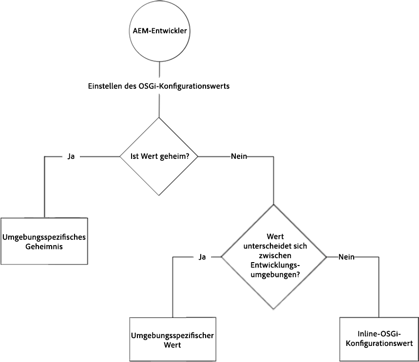

# OSGi Configurations {#osgi-configurations}

[OSGi ist ein wesentlicher Bestandteil der Technologien von Adobe Experience Manager (AEM). ](https://www.osgi.org/) Es wird zur Steuerung der Composite-Bundles von AEM und seinen Konfigurationen verwendet.

OSGi bietet die standardisierten Primitive, mit denen Anwendungen aus kleinen, wiederverwendbaren und kollaborativen Komponenten aufgebaut werden können. Diese Komponenten können in einer Anwendung zusammengestellt und bereitgestellt werden. Dies ermöglicht eine einfache Verwaltung der OSGi-Pakete, da diese einzeln angehalten, installiert und gestartet werden können. Die gegenseitigen Abhängigkeiten werden automatisch verwaltet. Jede OSGi-Komponente ist in einem der verschiedenen Pakete enthalten. Weitere Informationen finden Sie in der [OSGi-Spezifikation](https://www.osgi.org/Specifications/HomePage).

Sie können die Konfigurationseinstellungen für OSGi-Komponenten mithilfe von Konfigurationsdateien verwalten, die Teil eines AEM-Codeprojekts sind.

## OSGi-Konfigurationsdateien {#osgi-configuration-files}

Konfigurationsänderungen werden in den Codepaketen (`ui.apps`) des AEM-Projekts als Konfigurationsdateien (`.cfg.json`) unter runmode-spezifischen Konfigurationsordnern definiert:

`/apps/example/config.<runmode>`

Das Format der OSGi-Konfigurationsdateien ist JSON-basiert und verwendet das vom Apache Sling-Projekt definierte `.cfg.json` Format.

OSGi-Konfigurationen Zielgruppe OSGi-Komponenten über ihre Persistent Idenity (PID), die standardmäßig den Java-Klassennamen der OSGi-Komponente verwendet. So stellen Sie beispielsweise die OSGi-Konfiguration für einen OSGi-Dienst bereit, der implementiert wird von:

`com.example.workflow.impl.ApprovalWorkflow.java`

Eine OSGi-Konfigurationsdatei wird definiert unter:

`/apps/example/config/com.example.workflow.impl.ApprovalWorkflow.cfg.json`

entsprechend dem Konfigurationsformat [&quot;]cfg.json OSGi&quot;(entsprechend dem Konfigurationsformat &quot;cfg.json OSGi&quot;).

> [!NOTE]
>
> Frühere Versionen von AEM unterstützten OSGi-Konfigurationsdateien unter Verwendung verschiedener Dateiformate wie .cfg., .config und als XML sling:OsgiConfig-Ressourcendefinitionen. Diese Formate werden durch das Konfigurationsformat cfg.json OSGi ersetzt.

## Runmode-Auflösung {#runmode-resolution}

Spezifische OSGi-Konfigurationen können mithilfe von Runmodi auf bestimmte AEM-Instanzen ausgerichtet werden. Um den Ausführungsmodus zu verwenden, erstellen Sie Konfigurationsordner im folgenden Format unter `/apps/example` (wo beispielsweise Ihr Projektname steht):

`/apps/example/config.<author|publish>.<dev|stage|prod>/`

Alle OSGi-Konfigurationen in diesen Ordnern werden verwendet, wenn die im Konfigurationsordnernamen definierten Ausführungsmodi mit den von AEM verwendeten Ausführungsmodi übereinstimmen.

Wenn AEM beispielsweise den Parameter &quot;author&quot;und &quot;dev&quot;verwendet, werden Konfigurationsknoten in `/apps/example/config.author/` und `/apps/example/config.author.dev/` angewendet, während Konfigurationsknoten in `/apps/example/config.publish/` `/apps/example/config.author.stage/` und nicht angewendet werden.

Wenn mehrere Konfigurationen für dieselbe PID anwendbar sind, wird die Konfiguration mit der höchsten Anzahl an passenden Ausführungsmodi angewendet.

Die Granularität dieser Regel liegt auf PID-Ebene. This means you cannot define some properties for the same PID in `/apps/example/config.author/` and more specific ones in `/apps/example/config.author.dev/` for the same PID.  Die Konfiguration mit der höchsten Anzahl übereinstimmender Ausführungsmodi ist für die gesamte PID wirksam.

Bei der lokalen Entwicklung kann ein Runmode-Startparameter übergeben werden, um anzugeben, welche Runmode-OSGI-Konfiguration verwendet werden soll.

## Typen von OSGi-Konfigurationswerten {#types-of-osgi-configuration-values}

Es gibt drei verschiedene OSGi-Konfigurationswerte, die mit AEM als Cloud-Dienst verwendet werden können.

1. **Inline-Werte**, d. h. Werte, die in der OSGi-Konfiguration fest codiert und in Git gespeichert werden. Beispiel:

   ```json
   {
      "connection.timeout": 1000
   }
   ```

1. **Geheime Werte**, die Werte sind, die aus Sicherheitsgründen nicht in Git gespeichert werden sollten. Beispiel:

   ```json
   {
   "api-key": "$[secret:server-api-key]"
   } 
   ```

1. **Umgebung-spezifische Werte**, die sich von Umgebung zu  unterscheiden und daher nicht genau auf den Ausführungsmodus ausgerichtet werden können (da es in AEM als Cloud-Dienst einen einzelnen `dev` Ausführungsmodus gibt). Beispiel:

   ```json
   {
    "url": "$[env:server-url]"
   }
   ```

   Beachten Sie, dass eine einzelne OSGi-Konfigurationsdatei eine beliebige Kombination dieser Konfigurationswerttypen zusammen verwenden kann. Beispiel:

   ```json
   {
   "connection.timeout": 1000,
   "api-key": "$[secret:server-api-key]",
   "url": "$[env:server-url]"
   }
   ```

## Auswählen des entsprechenden OSGi-Konfigurationswerttyps {#how-to-choose-the-appropriate-osgi-configuration-value-type}

Der gängige Fall für OSGi verwendet Inline-OSGi-Konfigurationswerte. Umgebung-spezifische Konfigurationen werden nur für spezifische Anwendungsfälle verwendet, bei denen sich ein Wert zwischen dev-Umgebung unterscheidet.



Umgebung-spezifische Konfigurationen erweitern die herkömmlichen, statisch definierten OSGi-Konfigurationen, die Inline-Werte enthalten, und ermöglichen so die externe Verwaltung der OSGi-Konfigurationswerte über die Cloud Manager-API. Es ist wichtig zu verstehen, wann der gängige und herkömmliche Ansatz der Definition von Inline-Werten und deren Speicherung in Git verwendet werden sollte, anstatt die Werte in Umgebung-spezifische Konfigurationen abzustrahieren.

In den folgenden Leitlinien wird beschrieben, wann nicht geheime und geheime Umgebung-spezifische Konfigurationen verwendet werden sollen:

### Verwendung von Inline-Konfigurationswerten {#when-to-use-inline-configuration-values}

Inline-Konfigurationswerte werden als Standardansatz betrachtet und sollten nach Möglichkeit verwendet werden. Inline-Konfigurationen bieten folgende Vorteile:

* Sie bleiben erhalten, mit Governance und Versionsgeschichte in Git
* Werte sind implizit an Codebereitstellungen gebunden.
* Sie erfordern keine zusätzlichen Überlegungen zur Bereitstellung oder Koordinierung

Beim Definieren eines OSGi-Konfigurationswerts, Beginn mit Inline-Werten, wählen Sie nur geheime oder Umgebung-spezifische Konfigurationen aus, wenn dies für den Anwendungsfall erforderlich ist.

### Verwenden von nicht geheimen Konfigurationswerten für Umgebung {#when-to-use-non-secret-environment-specific-configuration-values}

Verwenden Sie für nicht geheime Konfigurationswerte nur Umgebung-spezifische Konfigurationen (`$[env:ENV_VAR_NAME]`), wenn die Werte je nach Umgebung variieren. Dazu gehören lokale Entwicklungsinstanzen und alle AEM als Cloud Service Development-Umgebung. Vermeiden Sie die Verwendung von nicht geheimen Umgebung-spezifischen Konfigurationen für AEM als Cloud-Service-Phase oder Produktions-Umgebung.

* Verwenden Sie für Konfigurationswerte, die sich zwischen Entwicklungs-Umgebung, einschließlich lokaler Entwicklungsinstanzen, unterscheiden, nur nicht geheime Umgebung.
* Verwenden Sie stattdessen die standardmäßigen Inline-Werte in den OSGi-Konfigurationen für nicht geheime Werte für &quot;Stage&quot;und &quot;Production&quot;.  Es wird daher nicht empfohlen, Umgebung-spezifische Konfigurationen zu verwenden, um Konfigurationsänderungen zur Laufzeit zu Stage- und Production-Umgebung zu erleichtern. Diese Änderungen sollten über das Quellcode-Management eingeführt werden.

### Verwendung geheimer Konfigurationswerte für die Umgebung {#when-to-use-secret-environment-specific-configuration-values}

AEM als Cloud-Dienst erfordert die Verwendung von Umgebung-spezifischen Konfigurationen (`$[secret:SECRET_VAR_NAME]`) für alle geheimen OSGi-Konfigurationswerte, wie z. B. Kennwörter, private API-Schlüssel oder andere Werte, die aus Sicherheitsgründen nicht in Git gespeichert werden können.

Verwenden Sie für geheime Umgebung spezifische Konfigurationen, um den Wert für Geheimnisse in allen AEM-Umgebung als Cloud-Dienst zu speichern, einschließlich Stage und Produktion.

### Hinzufügen einer neuen Konfiguration zum Repository {#adding-a-new-configuration-to-the-repository}

#### Informationen, die Sie dafür benötigen {#what-you-need-to-know}

Um eine neue Konfiguration zum Repository hinzuzufügen, benötigen Sie folgende Informationen:

1. The **Persistent Identity** (PID) of the service.

   Reference the **Configurations** field in the Web console. The name is shown in brackets after the bundle name (or in the **Configuration Information** towards the bottom of the page).

   Erstellen Sie beispielsweise einen Knoten, `com.day.cq.wcm.core.impl.VersionManagerImpl.` um **AEM WCM Version Manager** zu konfigurieren.

   

1. Ob ein bestimmter Ausführungsmodus erforderlich ist. Erstellen Sie den Ordner:

   * `config` - für alle Ausführungsmodi
   * `config.author` - für die Umgebung des Verfassers
   * `config.publish` - Umgebung zur Veröffentlichung
   * `config.<run-mode>` - gegebenenfalls

1. Whether a **Configuration** or **Factory Configuration** is necessary.
1. Die einzelnen Parameter, die konfiguriert werden müssen, einschließlich etwaiger vorhandener Parameterdefinitionen, die neu erstellt werden müssen.

   Referenzieren Sie das einzelne Parameterfeld in der Web-Konsole. Der Name wird für jeden Parameter in Klammern angezeigt.

   Erstellen Sie beispielsweise eine Eigenschaft
   `versionmanager.createVersionOnActivation` , um Version **auf Aktivierung** erstellen zu konfigurieren.

   

1. Does a configuration already exist in `/libs`? To list all configurations in your instance, use the **Query** tool in CRXDE Lite to submit the following SQL query:

   `select * from sling:OsgiConfig`

   In diesem Fall kann diese Konfiguration kopiert ` /apps/<yourProject>/`und dann am neuen Speicherort angepasst werden.

## Erstellen der Konfiguration im Repository {#creating-the-configuration-in-the-repository}

Um die neue Konfiguration zum Repository hinzuzufügen, gehen Sie folgendermaßen vor:

1. Navigieren Sie mit CRXDE Lite zu:

   ` /apps/<yourProject>`

1. If not already existing, create the `config` folder ( `sling:Folder`):

   * `config` – anwendbar auf alle Ausführungsmodi
   * `config.<run-mode>` - spezifisch für einen bestimmten Ausführungsmodus

1. Erstellen Sie unter diesem Ordner einen Knoten:

   * Typ: `sling:OsgiConfig`
   * Name: die beständige Identität (PID);

      zum Beispiel Verwendung von AEM WCM Version Manager `com.day.cq.wcm.core.impl.VersionManagerImpl`
   >[!NOTE]
   >
   >When making a Factory Configuration append `-<identifier>` to the name.
   >
   >Wie in: `org.apache.sling.commons.log.LogManager.factory.config-<identifier>`
   >
   >Where `<identifier>` is replaced by free text that you (must) enter to identify the instance (you cannot omit this information); for example:
   >
   >`org.apache.sling.commons.log.LogManager.factory.config-MINE`

1. Erstellen Sie für jeden Parameter, den Sie konfigurieren möchten, eine Eigenschaft auf diesem Knoten:

   * Name: der Parametername, wie er in der Web-Konsole gezeigt wird. Der Name erscheint in Klammern am Ende der Feldbeschreibung. Zum `Create Version on Activation` Einsatz `versionmanager.createVersionOnActivation`
   * Typ: entsprechend 
   * Wert: nach Bedarf
   Sie müssen nur Eigenschaften für die Parameter erstellen, die Sie konfigurieren möchten. Die anderen übernehmen die Standardwerte von AEM.

1. Speichern Sie alle Änderungen.

   Die Änderungen werden angewendet, wenn der Knoten durch den Neustart des Dienstes aktualisiert wird (ebenso wie die in der Web-Konsole vorgenommenen Änderungen).

>[!CAUTION]
>
>Sie dürfen keinerlei Änderungen im Pfad `/libs` vornehmen,

>[!CAUTION]
>
>Der vollständige Pfad einer Konfiguration muss korrekt sein, damit er beim Start gelesen werden kann.


## Konfigurationseigenschaftsformat in Quellcodeverwaltung {#configuration-property-format-in-source-control}

Das Erstellen einer neuen OSGI-Konfigurationseigenschaft wird im Abschnitt zum [Hinzufügen einer neuen Konfiguration zum Repository](#creating-the-configuration-in-the-repository) oben beschrieben. Führen Sie die folgenden Schritte aus und ändern Sie die Syntax wie in den Unterabschnitten unten beschrieben:

### Inline-Werte {#inline-values}

Inline-Werte werden wie erwartet als Standard-Name/Wert-Paare gemäß der JSON-Standardsyntax formatiert. Beispiel:

```json
 {

 "my_var1": "val",
 "my_var2": "abc",
 "my_var3": 500

}
```

### Umgebung-spezifische Konfigurationswerte {#environment-specific-configuration-values}

Die OSGi-Konfiguration sollte einen Platzhalter für die Variable zuweisen, die pro Umgebung definiert werden soll:

```
use $[env:ENV_VAR_NAME]
```

Kunden sollten diese Technik nur für OSGI-Konfigurationseigenschaften im Zusammenhang mit ihrem benutzerspezifischen Code verwenden. Es sollte nicht verwendet werden, um die von Adobe definierte OSGI-Konfiguration zu überschreiben.

### Geheime Konfigurationswerte {#secret-configuration-values}

Die OSGi-Konfiguration sollte einen Platzhalter für das Geheimnis zuweisen, das pro Umgebung definiert werden soll:

```
use $[secret:SECRET_VAR_NAME]
```

### Variablenbenennung {#variable-naming}

Folgendes gilt sowohl für die Konfigurationswerte für Umgebung als auch für geheime Werte.

Variablennamen sollten die folgenden Regeln befolgen:

* Mindestlänge: 2
* maximale Länge: 100
* muss mit regex übereinstimmen: `[a-zA-Z_][a-zA-Z_0-9]*`

Die Werte für die Variablen dürfen 2048 Zeichen nicht überschreiten.

### Standardwerte {#default-values}

Folgendes gilt sowohl für die Konfigurationswerte für Umgebung als auch für geheime Werte.

Wenn kein Wert pro Umgebung festgelegt ist, wird der Platzhalter zur Laufzeit nicht ersetzt und an seiner Stelle gelassen, da keine Interpolation stattgefunden hat. Um dies zu vermeiden, kann ein Standardwert als Teil des Platzhalters mit der folgenden Syntax bereitgestellt werden:

```
$[env:ENV_VAR_NAME;default=<value>]
```

Wenn ein Standardwert angegeben ist, wird der Platzhalter entweder durch den pro Umgebung angegebenen Wert oder durch den bereitgestellten Standardwert ersetzt.

### Lokale Entwicklung {#local-development}

Folgendes gilt sowohl für die Konfigurationswerte für Umgebung als auch für geheime Werte.

Variablen können in der lokalen Umgebung definiert werden, damit sie zur Laufzeit von dem lokalen AEM abgerufen werden. Beispiel: unter Linux:

```bash
export ENV_VAR_NAME=my_value
```

Es wird empfohlen, ein einfaches Bash-Skript zu erstellen, das die in den Konfigurationen verwendeten Umgebung festlegt und vor dem Starten von AEM ausführt. Tools wie [https://direnv.net/](https://direnv.net/) helfen bei der Vereinfachung dieses Ansatzes. Abhängig vom Typ der Werte können sie bei der Quellcodeverwaltung überprüft werden, wenn sie für alle freigegeben werden können.

Die Werte für Geheimnisse werden aus Dateien gelesen. Daher muss für jeden Platzhalter, der einen geheimen Schlüssel verwendet, eine Textdatei mit dem geheimen Wert erstellt werden.

Wenn beispielsweise `$[secret:server_password]` eine Textdatei mit dem Namen **server_password** verwendet wird, muss sie erstellt werden. Alle diese geheimen Dateien müssen im selben Ordner gespeichert werden und die Framework-Eigenschaft muss mit diesem lokalen Ordner konfiguriert werden. `org.apache.felix.configadmin.plugin.interpolation.secretsdir`

### Konfiguration &quot;Autor&quot;oder &quot;Veröffentlichungskonfiguration&quot; {#author-vs-publish-configuration}

Wenn für eine OSGI-Eigenschaft unterschiedliche Werte für &quot;author&quot;und &quot;publish&quot;erforderlich sind:

* Es sollten separate `config.author` und `config.publish` OSGi-Ordner verwendet werden, wie im Abschnitt [Runmode Resolution beschrieben](#runmode-resolution).
* Es sollten unabhängige Variablennamen verwendet werden. Es wird empfohlen, ein Präfix wie author_ zu verwenden<variablename> und publish_<variablename> wobei die Variablennamen identisch sind

### Konfigurationsbeispiele {#configuration-examples}

Gehen Sie in den folgenden Beispielen davon aus, dass es neben der stage- und prod-Umgebung 3 dev-Umgebung gibt.

**Beispiel 1**

Der Wert der OSGI-Eigenschaft muss für stage und prod gleich sein, jedoch für jede der 3 dev-Umgebung unterschiedlich sein. `my_var1`

<table>
<tr>
<td>
<b>Folder</b>
</td>
<td>
<b>Inhalt von "myfile.cfg.json"</b>
</td>
</tr>
<tr>
<td>
config
</td>
<td>
<pre>
{ "my_var1": "val", "my_var2": "abc", "my_var3": 500}
</pre>
</td>
</tr>
<tr>
<td>
config.dev
</td>
<td>
<pre>
{ "my_var1" : "$[env:my_var1]" "my_var2": "abc", "my_var3": 500}
</pre>
</td>
</tr>
</table>

**Beispiel 2**

Der Zweck besteht darin, dass sich der Wert der OSGI-Eigenschaft für &quot;stage&quot;, &quot;prod&quot;und für jede der 3 dev-Umgebung `my_var1` unterscheidet. Daher muss die Cloud Manager-API aufgerufen werden, um den Wert für `my_var1` jedes dev-env festzulegen.

