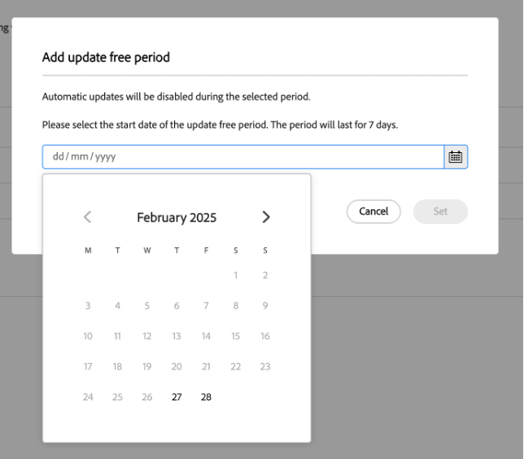

# Ruhezeiten und Freie Zeiträume aktualisieren {#quiet-hours-update-free-periods}

>[!NOTE]
>Diese Funktion wird ab dem 25 **September als Funktion** Eingeschränkte Verfügbarkeit“ verfügbar sein. Senden Sie eine E-Mail an [0&rbrace;aemcs-update-free@adobe.com&quot;, um die Funktion in Ihren Programmen aktivieren zu lassen.](mailto:aemcs-update-free@adobe.com)

>[!WARNING]
>Sie können die Funktionen Ruhige Stunden und Freie Zeiträume aktualisieren erst verwenden, nachdem Sie in die [automatischen Wartungsaktualisierungen“ &#x200B;](/help/implementing/deploying/aem-version-updates.md) sind.

Die [automatischen Wartungs-Updates](/help/implementing/deploying/aem-version-updates.md) von AEM as a Cloud Service stellen sicher, dass Ihre Instanzen sicher sind und mit den neuesten Wartungsversionen auf dem neuesten Stand sind. In einigen Fällen (z. B. bei Go-Live-Ereignissen) müssen Sie diese kritischen Arbeitszeiten jedoch möglicherweise vor potenziellen Unterbrechungen „schützen“. Daher bietet AEM as a Cloud Service die Möglichkeit, einen Zeitrahmen festzulegen, in dem automatische Aktualisierungen für Ihre laufenden Programme nicht vorgenommen werden.

Sie können diese Zeitrahmen mithilfe von zwei Planungsoptionen konfigurieren:

* **Ruhige Stunden** - Sie können ein tägliches Zeitintervall (bis zu 8 Stunden) definieren, in dem keine Aktualisierungen erfolgen.
* **Freie Zeiträume aktualisieren** - Sie können einen Zeitraum von 7 Tagen definieren, in dem keine Aktualisierungen erfolgen. Sie können innerhalb eines Zeitraums von 12 Monaten bis zu drei kostenlose Aktualisierungszeiträume haben.

Die Funktionen „Freie Zeiträume und Ruhezeiten aktualisieren“ werden „pro Programm“ konfiguriert. Denken Sie daran, dass nur Benutzer mit der „Benutzerrolle“ &quot;**Geschäftsinhaber** und **Bereitstellungs-Manager** diese Funktionen anzeigen und verwenden können.

Informationen zu geplanten automatischen AEM as a Cloud Service-Wartungszeiträumen finden Sie auf der Seite [Roadmap für Experience Manager-Versionen](https://experienceleague.adobe.com/de/docs/experience-manager-release-information/aem-release-updates/update-releases-roadmap).

## Ruhige Stunden {#quiet-hours}

Mithilfe der Funktion Ruhige Stunden können Sie ein Zeitfenster während des Tages ohne automatische Aktualisierungen definieren. Alle Wartungsaktualisierungen werden auf einen außerhalb des konfigurierten Zeitfensters liegenden Zeitpunkt verschoben. Wenn beispielsweise eine Aktualisierung während der angegebenen Ruhezeiten geplant wird, wird sie automatisch nach Ablauf des Intervalls für die Ruhezeit gestartet. Das konfigurierte Zeitintervall darf 8 Stunden nicht überschreiten, sodass weiterhin täglich Aktualisierungen vorgenommen werden können.

Sie können diese ruhigen Stunden (**Programm)** Ihrer lokalen Zeitzone definieren.

### Konfigurieren des Intervalls für ruhige Stunden {#configure-quiet-hours}

Das Intervall der ruhigen Stunden kann mithilfe der AEM Cloud Manager-Schnittstelle wie folgt konfiguriert werden:

Navigieren Sie **Aktivitäten > Automatische Aktualisierungen > Aktualisierungsoptionen**.

1. Stellen Sie sicher **dass die Option „Automatische Aktualisierungen während bestimmter Stunden verhindern** umgeschaltet ist.
2. Klicken Sie auf **Bearbeiten**.
3. Legen Sie im Konfigurationsfenster das Intervall für ruhige Stunden fest.

Nach der Einstellung gelten die angegebenen Anfangs- und Endzeiten für jeden Kalendertag in der Zukunft. Sie können den Wert für die Uhrzeit der ruhigen Stunden nach Bedarf deaktivieren oder neu konfigurieren.

## Freie Zeiträume aktualisieren {#update-free-periods}

Mit der Funktion „Freie Zeiträume aktualisieren“ können Sie einen Zeitraum von 7 Tagen definieren, in dem keine Aktualisierungen erfolgen. Nach der Konfiguration werden alle Wartungsaktualisierungen automatisch auf einen außerhalb des festgelegten Zeitraums verschoben. Sie können innerhalb eines 12-monatigen Intervalls bis zu drei kostenlose Aktualisierungszeiträume haben. Darüber hinaus können kostenlose Aktualisierungszeiträume bis zu einem Jahr im Voraus festgelegt werden.

Beachten Sie bei der Konfiguration dieser Option, dass (mindestens) ein einwöchiges Zeitintervall zwischen den Zeiträumen obligatorisch ist, um automatische Aktualisierungen zu ermöglichen. Daher wird dieses einwöchige Zeitintervall automatisch erzwungen und zwischen den von Ihnen konfigurierten Zeiträumen für das Update zum Kalender hinzugefügt. Dies kann dazu führen, dass einige Kalendertage nicht zur Auswahl stehen.

Sie können die Freie Zeiträume für das Update **pro Programm** definieren.

### Konfigurieren der kostenlosen Update-Zeiträume {#configure-update-free-periods}

Die Funktion „Freie Zeiträume aktualisieren“ kann wie folgt über die AEM Cloud Manager-Benutzeroberfläche konfiguriert werden:

Navigieren Sie **Aktivitäten > Automatische Aktualisierungen > Aktualisierungsoptionen**.

1. Navigieren Sie zum Abschnitt Freie Zeiträume aktualisieren .
2. Klicken Sie **Freie Periode für Update hinzufügen**.
3. Wählen Sie aus dem Kalender einen Zeitraum von einer Woche, um ihn kostenlos zu aktualisieren.

Neben dem derzeit aktiven Zeitraum für die **Aktualisierung wird ein** Aktiv **-Symbol und in der Nähe der abgeschlossenen Zeiträume für die Update-Freie Aktualisierung ein Symbol „Abschließen** angezeigt.

## Ausschlusszeiträume für geplante Wartungen {#planned-maintenance}

Für Adobe sind mehrere Ausschlusszeiträume für Wartungsarbeiten geplant. Diese Zeiträume werden von Adobe definiert, um Risiken im Zusammenhang mit kritischen Ereignissen zu minimieren, und treten in der Regel zwei- oder dreimal pro Jahr auf. Sie können den genauen Zeitplan für die Ausschlusszeiträume für die Wartung auf der Seite [Roadmap für Wartungsversionen](https://experienceleague.adobe.com/de/docs/experience-manager-release-information/aem-release-updates/update-releases-roadmap) einsehen.

Damit Sie Ihre Zeiträume ohne Updates genau konfigurieren können, werden die Zeiträume für Wartungsausschlüsse auch in der Benutzeroberfläche „Ruhezeiten“ und „Freie Zeiträume aktualisieren“ angezeigt.

Beachten Sie, dass Sie während der Ausschlusszeiträume keinen kostenlosen Aktualisierungszeitraum erstellen können.
