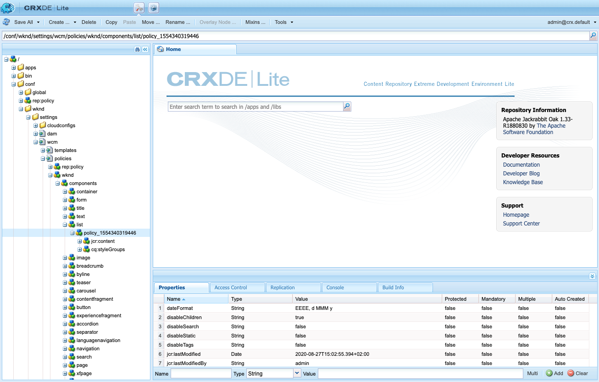

# Verwenden von Bedingungen zum Ausblenden {#using-hide-conditions}

Bedingungen zum Ausblenden können verwendet werden, um festzustellen, ob eine Komponentenressource gerendert wird. Etwa wenn ein Vorlagenautor die Kernkomponente [Listenkomponente](https://docs.adobe.com/content/help/de/experience-manager-core-components/using/components/list.html) im [Vorlagen-Editor](/help/sites-cloud/authoring/features/templates.md) konfiguriert und beschließt, die Optionen zum Erstellen der Liste auf Basis untergeordneter Seiten zu deaktivieren. Durch das Deaktivieren dieser Option im Designdialogfeld wird eine Eigenschaft so festgelegt, dass beim Rendern der Listenkomponente die Bedingung zum Ausblenden ausgewertet und die Option zum Anzeigen untergeordneter Seiten nicht angezeigt wird.

## Überblick{#overview}

Dialoge können sehr komplex werden, mit zahlreichen Optionen für den Benutzer, der nur einen Bruchteil der Optionen nutzen kann, die ihm zur Verfügung stehen. Dies kann dazu führen, dass die Benutzeroberfläche unübersichtlich wird.

Durch die Verwendung von Bedingungen zum Ausblenden haben Administratoren, Entwickler und Superuser die Möglichkeit, Ressourcen anhand von Regeln auszublenden. Mit dieser Funktion können sie entscheiden, welche Ressourcen angezeigt werden sollen, wenn ein Autor Inhalte bearbeitet.

>[!NOTE]
>
>Das Ausblenden einer Ressource auf Grundlage eines Ausdrucks ersetzt nicht die ACL-Berechtigungen. Der Inhalt bleibt bearbeitbar, wird aber einfach nicht angezeigt.

## Implementierung und Nutzungsdetails {#implementation-and-usage-details}

`com.adobe.granite.ui.components.FilteringResourceWrapper` ist verantwortlich für das Filtern der Ressourcen basierend auf dem Vorhandensein und dem Wert der `granite:hide` Eigenschaft, die sich auf dem zu filternden Feld befinden. Die Implementierung `/libs/cq/gui/components/authoring/dialog/dialog.jsp` umfasst eine Instanz von `FilteringResourceWrapper.`

The implementation makes use of the Granite [ELResolver API](https://helpx.adobe.com/experience-manager/6-5/sites/developing/using/reference-materials/granite-ui/api/jcr_root/libs/granite/ui/docs/server/el.html) and adds a `cqDesign` custom variable via the ExpressionCustomizer.

Im Folgenden sind einige Beispiele für Bedingungen zum Ausblenden für einen Design-Knoten aufgeführt, die sich entweder unter `etc/design` befinden oder als Inhaltsrichtlinie vorliegen.

```
${cqDesign.myProperty}
${!cqDesign.myProperty}
${cqDesign.myProperty == 'someText'}
${cqDesign.myProperty != 'someText'}
${cqDesign.myProperty == true}
${cqDesign.myProperty == true}
${cqDesign.property1 == 'someText' && cqDesign.property2 || cqDesign.property3 != 1 || header.myHeader}
```

Beachten Sie beim Definieren Ihrer Bedingung zum Ausblenden Folgendes:

* Damit sie gültig ist, sollte der Bereich, in dem sich die Eigenschaft befindet, ausgedrückt werden (beispielsweise `cqDesign.myProperty`).
* Werte sind schreibgeschützt.
* Funktionen (falls erforderlich) sollten auf eine bestimmte, vom Dienst vorgegebene Auswahl beschränkt sein.

## Beispiel {#example}

Beispiele für Bedingungen zum Ausblenden finden sich überall in AEM und insbesondere in den [Kernkomponenten](https://docs.adobe.com/content/help/de-DE/experience-manager-core-components/using/introduction.html), Betrachten Sie beispielsweise die [Liste-Kernkomponente](https://docs.adobe.com/content/help/de/experience-manager-core-components/using/components/list.html) , die im [WKND-Lernprogramm implementiert ist.](/help/implementing/developing/introduction/develop-wknd-tutorial.md)

[Mithilfe des Vorlageneditors](/help/sites-cloud/authoring/features/templates.md)kann der Vorlagenautor im Entwurfsdialogfeld definieren, welche Optionen der Seitenkomponente dem Seitenautor zur Verfügung stehen. Optionen wie die, ob die Liste eine statische Liste, eine Liste mit untergeordneten Seiten, eine Liste getaggter Seiten usw. sein darf, können aktiviert oder deaktiviert werden.

Wenn Vorlagenautoren die Option für die untergeordneten Seiten deaktivieren, wird eine Designeigenschaft festgelegt und eine Bedingung zum Ausblenden dagegen ausgewertet, was dazu führt, dass die Option für Seitenautoren nicht gerendert wird.

1. Standardmäßig können Seitenautoren die Listenkernkomponente verwenden, um eine Liste mit untergeordneten Seiten zu erstellen, indem sie die Option **Untergeordnete Seiten** auswählen.

   

1. Im Designdialogfeld der Listenkomponente können Vorlagenautoren die Option **Untergeordnete Elemente deaktivieren** auswählen, um zu verhindern, dass Seitenautoren eine Liste mit untergeordneten Seiten angezeigt wird.

   

1. Eine Policy-Node wird unter `/conf/wknd/settings/wcm/policies/wknd/components/list` einer Eigenschaft erstellt, die auf `disableChildren` `true`festgelegt ist.

   

1. Die Ausblenden-Bedingung wird als Wert einer `granite:hide` Eigenschaft auf dem Knoten der dialog-Eigenschaft definiert `/libs/core/wcm/components/list/v2/list/cq:dialog/content/items/tabs/items/listSettings/items/columns/items/column/items/listFrom/items/children`

   

1. The value of `disableChildren` is pulled from the design configuration and the expression `${cdDesign.disableChildren}` evaluates to `false`, meaning the option will not be rendered as part of the component.

1. Die Option **Untergeordnete Seiten** wird für Seitenautoren bei Verwendung der Listenkomponente nicht mehr gerendert.

   
