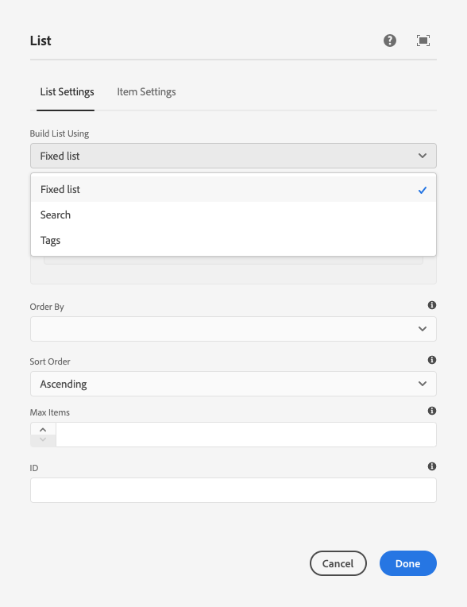

# Verwenden von Bedingungen zum Ausblenden {#using-hide-conditions}

Ausblendungsbedingungen können verwendet werden, um zu bestimmen, ob eine Komponentenressource gerendert wird oder nicht. Etwa wenn eine Vorlagenautorin oder ein Vorlagenautor die Kernkomponente [Listenkomponente](https://experienceleague.adobe.com/docs/experience-manager-core-components/using/components/list.html?lang=de) im [Vorlageneditor](/help/sites-cloud/authoring/page-editor/templates.md) konfiguriert und beschließt, die Optionen zum Erstellen der Liste auf Basis untergeordneter Seiten zu deaktivieren. Durch das Deaktivieren dieser Option im Design-Dialogfeld wird eine Eigenschaft so festgelegt, dass beim Rendern der Listenkomponente die Bedingung zum Ausblenden ausgewertet und die Option zum Anzeigen untergeordneter Seiten nicht angezeigt wird.

## Übersicht {#overview}

Dialogfelder können aufgrund der zahlreichen Optionen sehr komplex für die Benutzer sein, die möglicherweise nur einen kleinen Teil der ihnen zur Verfügung stehenden Optionen nutzen. Dies kann dazu führen, dass Benutzende mit der Benutzeroberfläche überfordert sind.

Durch die Verwendung von Ausblendungsbedingungen können Admins, Entwicklungspersonen und Superuser Ressourcen anhand eines Regelsatzes ausblenden. Mit dieser Funktion können sie entscheiden, welche Ressourcen angezeigt werden sollen, wenn eine Autorin oder ein Autor Inhalte bearbeitet.

>[!NOTE]
>
>Das Ausblenden einer Ressource basierend auf einem Ausdruck ersetzt nicht die ACL-Berechtigungen. Der Inhalt bleibt bearbeitbar, wird jedoch einfach nicht angezeigt.

## Implementierung und Nutzungsdetails {#implementation-and-usage-details}

`com.adobe.granite.ui.components.FilteringResourceWrapper` ist verantwortlich für das Filtern der Ressourcen basierend auf dem Vorhandensein und dem Wert der Eigenschaft `granite:hide` für das zu filternde Feld. Die Implementierung `/libs/cq/gui/components/authoring/dialog/dialog.jsp` umfasst eine Instanz von `FilteringResourceWrapper.`

Die Implementierung greift auf die [ELResolver-API](https://helpx.adobe.com/de/experience-manager/6-5/sites/developing/using/reference-materials/granite-ui/api/jcr_root/libs/granite/ui/docs/server/el.html) von Granite zurück und fügt über den ExpressionCustomizer eine benutzerdefinierte `cqDesign`-Variable hinzu.

Im Folgenden sind einige Beispiele für Bedingungen zum Ausblenden für einen Design-Knoten aufgeführt, die sich entweder unter `etc/design` befinden oder als Inhaltsrichtlinie vorliegen.

```
${cqDesign.myProperty}
${!cqDesign.myProperty}
${cqDesign.myProperty == 'someText'}
${cqDesign.myProperty != 'someText'}
${cqDesign.myProperty == true}
${cqDesign.myProperty == true}
${cqDesign.property1 == 'someText' && cqDesign.property2 || cqDesign.property3 != 1 || header.myHeader}
```

Beachten Sie beim Definieren Ihrer Bedingung zum Ausblenden Folgendes:

* Damit sie gültig ist, sollte der Umfang, in dem sich die Eigenschaft befindet, ausgedrückt werden (beispielsweise `cqDesign.myProperty`).
* Werte sind schreibgeschützt.
* Funktionen (falls erforderlich) sollten auf eine bestimmte, vom Service vorgegebene Auswahl beschränkt sein.

## Beispiel {#example}

Beispiele für Bedingungen zum Ausblenden finden sich überall in AEM und insbesondere in den [Kernkomponenten](https://experienceleague.adobe.com/docs/experience-manager-core-components/using/introduction.html?lang=de). Betrachten wir zum Beispiel die [Listenkernkomponente](https://experienceleague.adobe.com/docs/experience-manager-core-components/using/components/list.html?lang=de), wie sie im [WKND-Tutorial](/help/implementing/developing/introduction/develop-wknd-tutorial.md) implementiert ist.

[Mit dem Vorlageneditor](/help/sites-cloud/authoring/page-editor/templates.md) können Vorlagenautorinnen und -autoren im Design-Dialogfeld festlegen, welche Optionen der Listenkomponente dem Seitenautor zur Verfügung stehen. Optionen wie die Erlaubnis, dass die Liste eine statische Liste, eine Liste untergeordneter Seiten, eine Liste mit getaggten Seiten usw. sein kann, können aktiviert oder deaktiviert werden.

Wenn eine Vorlagenautorin oder ein Vorlagenautor die Option für untergeordnete Seiten deaktiviert, wird eine Design-Eigenschaft festgelegt und eine Ausblendebedingung dafür ausgewertet, wodurch die Option für die Seitenautorin bzw. den Seitenautor nicht gerendert wird.

1. Standardmäßig kann die Seitenautorin bzw. der Seitenautor die Listenkernkomponente verwenden, um mithilfe der Option **Untergeordnete Seiten** eine Liste mit untergeordneten Seiten zu erstellen.

   

1. Im Design-Dialogfeld der Listen-Kernkomponente können Vorlagenautoren die Option **Untergeordnete Elemente deaktivieren** auswählen, um zu verhindern, dass Seitenautoren eine Liste mit untergeordneten Seiten angezeigt wird.

   

1. Ein Richtlinienknoten wird unter `/conf/wknd/settings/wcm/policies/wknd/components/list` erstellt, wobei die Eigenschaft `disableChildren` auf `true` festgelegt wird.

   

1. Die Bedingung zum Ausblenden wird als Wert der Eigenschaft `granite:hide` des Dialogfeldeigenschafts-Knotens `/libs/core/wcm/components/list/v2/list/cq:dialog/content/items/tabs/items/listSettings/items/columns/items/column/items/listFrom/items/children` definiert.

   

1. Der Wert von `disableChildren` wird aus der Design-Konfiguration gezogen und der Ausdruck `${cqDesign.disableChildren}` wird als `false` ausgewertet, was bedeutet, dass die Option nicht als Teil der Komponente gerendert wird.

1. Die Option **Untergeordnete Seiten** wird für Seitenautoren bei Verwendung der Listenkomponente nicht mehr gerendert.

   
