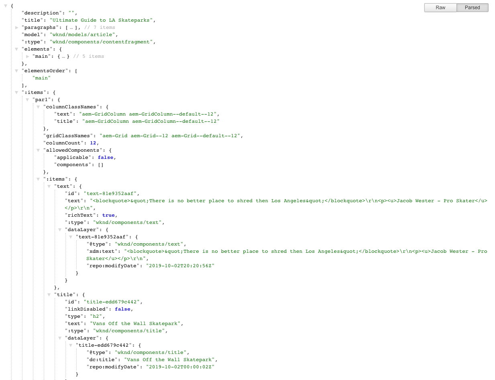

# JSON-Exporter für Content Services   {#json-exporter-for-content-services}

AEM Content Services sollen die Beschreibung und Bereitstellung von Inhalten in/aus AEM über den Fokus von Websites hinaus verallgemeinern.

Sie ermöglichen die Bereitstellung von Inhalten in Kanälen, die keine traditionellen AEM-Web-Seiten sind, und nutzen standardisierte Methoden, die von allen Clients genutzt werden können. Diese Kanäle können Folgendes sein:

* Single Page Applications
* native Mobile Apps
* Andere Kanäle und Touchpoints außerhalb von AEM

Über Inhaltsfragmente, die strukturierte Inhalte verwenden, können Sie Content Services zur Verfügung stellen, indem Sie die Inhalte mit JSON Exporter auf einer (beliebigen) AEM-Seite im JSON-Datenmodellformat bereitstellen. Diese können dann von Ihren eigenen Anwendungen genutzt werden.

## JSON Exporter mit Inhaltsfragment-Kernkomponenten   {#json-exporter-with-content-fragment-core-components}

Mit dem AEM JSON Exporter können Sie die Inhalte auf einer (beliebigen) AEM-Seite im JSON-Datenmodellformat bereitstellen. Diese können dann von Ihren eigenen Anwendungen genutzt werden.

In AEM erfolgt die Bereitstellung mit dem `model`-Selektor und der `.json`-Erweiterung.

`.model.json`

1. Zum Beispiel werden über eine URL wie:

   ```shell
   http://localhost:4502/content/wknd/language-masters/en/magazine/guide-la-skateparks.model.json
   ```

1. Inhalte der folgenden Art bereitgestellt:

   

Alternativ können Sie die Inhalte eines strukturierten Inhaltsfragments bereitstellen, indem Sie dieses spezifisch nachverfolgen.

Verwenden Sie dazu den vollständigen Pfad zum Fragment (über `jcr:content`); beispielsweise mit dem folgenden Suffix:

`.../jcr:content/root/container/container/contentfragment.model.json`

Ihre Seite kann entweder ein einzelnes Inhaltsfragment oder mehrere Komponenten verschiedener Art enthalten. Sie können außerdem Mechanismen wie Listenkomponenten verwenden, um automatisch nach relevantem Inhalt zu suchen.

* Zum Beispiel werden über eine URL wie:

   ```shell
   http://localhost:4502/content/wknd/language-masters/en/magazine/guide-la-skateparks/jcr:content/root/container/container/contentfragment.model.json
   ```

* Inhalte der folgenden Art bereitgestellt:

   

   >[!NOTE]
   >
   >Sie können [Ihre eigenen Komponenten anpassen](enabling-json-exporter.md), um auf diese Daten zuzugreifen und sie zu verwenden.

   >[!NOTE]
   >
   >Obwohl es sich nicht um eine Standardimplementierung handelt, werden [mehrere Selektoren unterstützt,](enabling-json-exporter.md#multiple-selectors) jedoch muss `model` der erste sein.

### Weiterführende Informationen {#further-information}

Siehe auch:

* Assets-HTTP-API
   * [Assets-HTTP-API](/help/assets/developer-reference-material-apis.md)
* Sling-Modelle:
   * [Sling-Modelle – Zuweisung von Modellklassen und Ressourcentypen seit 1.3.0](https://sling.apache.org/documentation/bundles/models.html#associating-a-model-class-with-a-resource-type-since-130)
* AEM mit JSON:
   * [Aktivieren eines JSON-Exports für eine Komponente](enabling-json-exporter.md)

## Verwandte Dokumentation {#related-documentation}

Weitere Informationen finden Sie unter:

* [Inhaltsfragmente im Assets-Benutzerhandbuch](/help/assets/content-fragments/content-fragments.md)
* [Inhaltsfragmentmodelle](/help/assets/content-fragments/content-fragments-models.md)
* [Bearbeitung mit Inhaltsfragmenten](/help/sites-cloud/authoring/fundamentals/content-fragments.md)
* [Kernkomponenten](https://experienceleague.adobe.com/docs/experience-manager-core-components/using/introduction.html?lang=de) und die [Inhaltsfragmentkomponente](https://experienceleague.adobe.com/docs/experience-manager-core-components/using/components/content-fragment-component.html)
