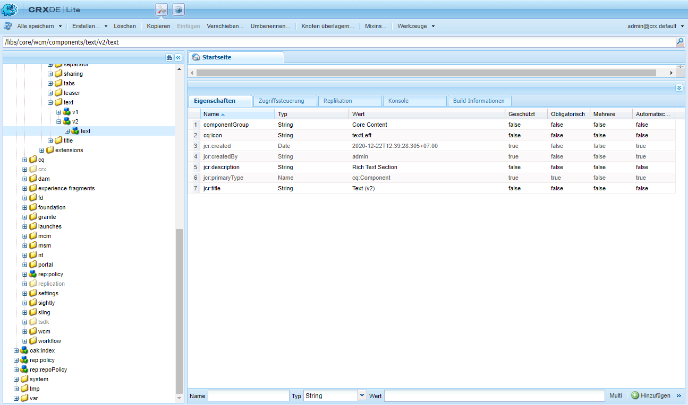

# Komponenten-Referenzhandbuch {#components-reference-guide}

Komponenten bilden den Kern bei der Erstellung eines Erlebnisses in AEM. Die [Kernkomponenten](https://experienceleague.adobe.com/docs/experience-manager-core-components/using/introduction.html?lang=de) und der [AEM-Projektarchetyp](https://experienceleague.adobe.com/docs/experience-manager-core-components/using/developing/archetype/overview.html?lang=de) erleichtern den Einstieg mit einem Toolset aus vorgefertigten, robusten Komponenten. Das [WKND-Tutorial](/help/implementing/developing/introduction/develop-wknd-tutorial.md) führt Entwicklerinnen und Entwickler durch die Verwendung dieser Tools und das Erstellen benutzerdefinierter Komponenten, um eine neue AEM-Site zu erstellen.

>[!TIP]
>
>Bevor Sie sich auf dieses Dokument beziehen, stellen Sie sicher, dass Sie das [WKND-Tutorial](/help/implementing/developing/introduction/develop-wknd-tutorial.md) abgeschlossen haben und somit mit den [Kernkomponenten](https://experienceleague.adobe.com/docs/experience-manager-core-components/using/introduction.html?lang=de) und dem [AEM-Projektarchetyp](https://experienceleague.adobe.com/docs/experience-manager-core-components/using/developing/archetype/overview.html?lang=de) vertraut sind.

Da das WKND-Tutorial die meisten Anwendungsfälle abdeckt, ist dieses Dokument nur als Ergänzung zu diesen Ressourcen gedacht. Es enthält ausführliche technische Details zur Struktur und Konfiguration von Komponenten in AEM und ist nicht als Anleitung für die ersten Schritte gedacht.

## Überblick {#overview}

In diesem Abschnitt werden zentrale Konzepte und Schwierigkeiten erläutert. Er bietet so einen guten Einstieg in die Entwicklung eigener Komponenten.

### Planung {#planning}

Vor dem Konfigurieren bzw. Programmieren einer Komponente sollten Sie die folgenden Fragen beantworten:

* Was genau soll die neue Komponente tun?
* Müssen Sie die Komponente komplett neu entwickeln oder können Sie die Grundlagen von einer vorhandenen Komponente übernehmen?
* Benötigt die Komponente eine Logik zur Auswahl/Bearbeitung des Inhalts?
   * Die Logik sollte getrennt von der Ebene der Benutzeroberfläche aufbewahrt werden. HTL dient dazu, dies sicherzustellen.
* Benötigt Ihre Komponente eine CSS-Formatierung?
   * Eine CSS-Formatierung sollte getrennt von den Komponentendefinitionen aufbewahrt werden. Legen Sie Konventionen für die Benennung der HTML-Elemente fest, damit Sie sie über externe CSS-Dateien modifizieren können.
* Welche Auswirkungen auf die Sicherheit kann Ihre neue Komponente haben?

### Wiederverwenden vorhandener Komponenten {#reusing-components}

Bevor Sie Zeit in die Erstellung einer völlig neuen Komponente investieren, sollten Sie die Anpassung oder Erweiterung vorhandener Komponenten in Erwägung ziehen. Die [Kernkomponenten](https://experienceleague.adobe.com/docs/experience-manager-core-components/using/introduction.html?lang=de) bieten eine Reihe flexibler, robuster und bewährter produktionstauglicher Komponenten.

#### Erweitern der Kernkomponenten {#extending-core-components}

Die Kernkomponenten bieten auch [klare Anpassungsmuster](https://experienceleague.adobe.com/docs/experience-manager-core-components/using/developing/customizing.html?lang=de), die Sie verwenden können, um sie an die Bedürfnisse Ihres eigenen Projekts anzupassen.

#### Überlagern von Komponenten {#overlying-components}

Komponenten können mit einer [Überlagerung](/help/implementing/developing/introduction/overlays.md) ebenfalls neu definiert werden, die auf der Suchpfadlogik basiert. In diesem Fall wird der [Sling Resource Merger](/help/implementing/developing/introduction/sling-resource-merger.md) nicht ausgelöst und `/apps` muss die gesamte Überlagerung definieren.

#### Erweitern von Komponentendialogen {#extending-component-dialogs}

Es ist auch möglich, ein Komponentendialogfeld mithilfe des Sling Resource Mergers zu überschreiben und die Eigenschaft `sling:resourceSuperType` zu definieren.

Dies bedeutet, dass Sie nur die erforderlichen Unterschiede neu definieren müssen, anstatt das gesamte Dialogfeld neu zu definieren.

### Inhaltslogik und Rendering-Markup  {#content-logic-and-rendering-markup}

Ihre Komponente wird mit [HTML](https://www.w3schools.com/htmL/html_intro.asp) gerendert. Ihre Komponente muss den HTML-Code definieren, der notwendig ist, um den erforderlichen Inhalt zu übernehmen und anschließend in der Autoren- und Veröffentlichungsumgebung nach Bedarf zu rendern.

Es empfiehlt sich, den für Markup und Rendering zuständigen Code getrennt von dem Code zu halten, der die Logik zur Auswahl des Komponenteninhalts enthält.

Dieser Ansatz wird durch [HTL](https://experienceleague.adobe.com/docs/experience-manager-htl/content/overview.html?lang=de) unterstützt, eine Vorlagensprache, die dazu dient sicherzustellen, dass eine echte Programmiersprache für die Definition der zugrunde liegenden Geschäftslogik genutzt wird. Dieser Mechanismus hebt den Code hervor, der für eine bestimmte Ansicht aufgerufen wird, und lässt bei Bedarf eine spezifische Logik für unterschiedliche Ansichten derselben Komponente zu.

Diese (optionale) Logik kann auf verschiedene Arten implementiert werden und wird von HTL mit bestimmten Befehlen aufgerufen:

* Verwenden von Java – [Die HTL Java Use-API](https://experienceleague.adobe.com/docs/experience-manager-htl/content/java-use-api.html?lang=de) ermöglicht es einer HTL-Datei, auf Hilfsmethoden in einer benutzerdefinierten Java-Klasse zuzugreifen. Dies ermöglicht es Ihnen, Java-Code zu verwenden, um die Logik zum Auswählen und Konfigurieren des Komponenteninhalts zu implementieren.
* Mit JavaScript – [Die HTL JavaScript Use-API](https://experienceleague.adobe.com/docs/experience-manager-htl/using/htl/use-api-javascript.html?lang=de) ermöglicht es einer HTL-Datei, auf den in JavaScript geschriebenen Hilfs-Code zuzugreifen. Dies ermöglicht es Ihnen, JavaScript-Code zu verwenden, um die Logik zum Auswählen und Konfigurieren des Komponenteninhalts zu implementieren.
* Verwenden von Client-seitigen Bibliotheken – Moderne Websites beruhen in hohem Maße auf der Client-seitigen Verarbeitung durch einen komplexen JavaScript- und CSS-Code. Weitere Informationen finden Sie im Dokument [Verwenden Client-seitiger Bibliotheken in AEM as a Cloud Service](/help/implementing/developing/introduction/clientlibs.md).

## Komponentenstruktur {#structure}

Die Struktur einer AEM-Komponente ist leistungsstark und flexibel. Die Hauptbestandteile sind:

* [Ressourcentyp](#resource-type)
* [Komponentendefinition](#component-definition)
* [Eigenschaften und untergeordnete Knoten einer Komponente](#properties-and-child-nodes-of-a-component)
* [Dialogfelder](#dialogs)
* [Design-Dialogfelder](#design-dialogs)

### Ressourcentyp {#resource-type}

Ein zentrales Element der Struktur ist der Ressourcentyp.

* Die Inhaltsstruktur deklariert Absichten.
* Der Ressourcentyp implementiert sie.

Dies ist eine Abstraktion, die sicherstellen soll, dass die Absicht unverändert bleibt, auch wenn sich das Erscheinungsbild ändert.

### Komponentendefinition {#component-definition}

Die Definition einer Komponente lässt sich wie folgt aufschlüsseln:

* AEM-Komponenten basieren auf [Sling](https://sling.apache.org/documentation.html).
* AEM-Komponenten befinden sich unter `/libs/core/wcm/components`.
* Projekt- bzw. Website-spezifische Komponenten befinden sich unter `/apps/<myApp>/components`.
* AEM-Standardkomponenten sind als `cq:Component` definiert und haben die folgenden zentralen Elemente:
   * JCR-Eigenschaften – Eine Liste von JCR-Eigenschaften. Diese sind variabel und einige von ihnen können optional sein, obwohl die grundlegende Struktur eines Komponentenknotens, seiner Eigenschaften und untergeordneten Knoten in der `cq:Component`-Definition festgelegt ist.
   * Ressourcen – Sie definieren statische Elemente, die von der Komponente genutzt werden.
   * Skripte – Sie werden verwendet, um das Verhalten der entstandenen Instanz der Komponente zu implementieren.

#### Wichtige Eigenschaften {#vital-properties}

* **Stammknoten**:
   * `<mycomponent> (cq:Component)` – Hierarchieknoten der Komponente.
* **Wichtige Eigenschaften**:
   * `jcr:title` – Komponententitel; wird beispielsweise als Titel genutzt, wenn die Komponente im [Komponenten-Browser](/help/sites-cloud/authoring/page-editor/editor-side-panel.md#components-browser) oder in der [Komponentenkonsole](/help/sites-cloud/authoring/components-console.md) aufgeführt wird.
   * `jcr:description` – Beschreibung der Komponente; wird als Mouseover-Hinweis im Komponenten-Browser oder in der Komponentenkonsole genutzt.
   * Weitere Informationen finden Sie im Abschnitt [Komponentensymbol](#component-icon).
* **Wichtige untergeordnete Knoten**:
   * `cq:editConfig (cq:EditConfig)` – Definiert die Bearbeitungseigenschaften der Komponente und ermöglicht es, dass die Komponente im Komponenten-Browser aufgeführt wird.
      * Wenn die Komponente über ein Dialogfeld verfügt, wird sie automatisch im Komponenten-Browser oder Sidekick aufgeführt, selbst wenn die cq:editConfig nicht vorhanden ist.
   * `cq:childEditConfig (cq:EditConfig)` – Steuert Aspekte der Autoren-Benutzeroberfläche für untergeordnete Komponenten, die keine eigene `cq:editConfig` definieren.
   * `cq:dialog (nt:unstructured)` – Dialogfeld für diese Komponente. Definiert die Oberfläche, über die Benutzer die Komponente konfigurieren und/oder Inhalte bearbeiten können.
   * `cq:design_dialog (nt:unstructured)` – Design-Bearbeitung für diese Komponente.

#### Komponentensymbol {#component-icon}

Das Symbol oder die Abkürzung für die Komponente wird mit JCR-Eigenschaften der Komponente definiert, wenn die Komponente vom Entwickler erstellt wird. Diese Eigenschaften werden in der folgenden Reihenfolge ausgewertet und die erste erkannte gültige Eigenschaft wird verwendet.

1. `cq:icon`: Zeichenfolgeneigenschaft, die auf ein Standardsymbol in der [Bibliothek der Coral-Benutzeroberfläche](https://opensource.adobe.com/coral-spectrum/examples/#icon) verweist, das im Komponenten-Browser angezeigt werden soll.
   * Verwenden Sie den Wert des HTML-Attributs des Coral-Symbols.
1. `abbreviation`: Zeichenfolgeneigenschaft, die die Abkürzung des Komponentennamens im Komponenten-Browser anpasst.
   * Die Abkürzung sollte auf zwei Zeichen beschränkt sein.
   * Bei einer leeren Zeichenfolge wird die Abkürzung aus den ersten beiden Buchstaben der Eigenschaft `jcr:title` gebildet.
      * Beispiel: „Gr“ für „Grafik“.
      * Zum Erstellen der Abkürzung wird der lokalisierte Titel verwendet.
   * Die Abkürzung wird nur übersetzt, wenn die Komponente die Eigenschaft `abbreviation_commentI18n` aufweist, die dann als Anweisung für eine Übersetzung genutzt wird.
1. `cq:icon.png` oder `cq:icon.svg` – Symbol für diese Komponente, das im Komponenten-Browser angezeigt wird.
   * Symbole von Standardkomponenten haben eine Größe von 20 x 20 Pixeln.
      * Größere Symbole werden (Client-seitig) herunterskaliert.
   * Die empfohlene Farbe ist rgb(112, 112, 112) > #707070.
   * Der Hintergrund von Symbolen von Standardkomponenten ist transparent.
   * Es werden nur `.png`- und `.svg`-Dateien unterstützt.
   * Beim Importieren aus dem Dateisystem über das Eclipse-Plug-in müssen die Dateinamen nach folgendem Schema geändert werden: z. B. `_cq_icon.png` oder `_cq_icon.svg`.
   * Wenn beide Formate vorliegen, hat `.png` Vorrang vor `.svg`.

Wenn keine der o. g. Eigenschaften (`cq:icon`, `abbreviation`, `cq:icon.png` oder `cq:icon.svg`) bei der Komponente gefunden wird:

* Das System sucht nach denselben Eigenschaften bei den übergeordneten Komponenten, die der Eigenschaft `sling:resourceSuperType` folgen.
* Wenn auf der Ebene der übergeordneten Komponente nichts oder eine leere Abkürzung gefunden wird, erstellt das System die Abkürzung aus den ersten beiden Zeichen der Eigenschaft `jcr:title` der aktuellen Komponente.

Um die Vererbung von Symbolen von übergeordneten Komponenten zu deaktivieren, legen Sie eine leere Eigenschaft `abbreviation` für die Komponente fest. Das Standardverhalten wird daraufhin erneut aktiviert.

Die [Komponentenkonsole](/help/sites-cloud/authoring/components-console.md#component-details) zeigt an, wie das Symbol für eine bestimmte Komponente definiert ist.

#### Beispiel: SVG-Symbol {#svg-icon-example}

```xml
<?xml version="1.0" encoding="utf-8"?>
<!DOCTYPE svg PUBLIC "-//W3C//DTD SVG 1.1//EN" "https://www.w3.org/Graphics/SVG/1.1/DTD/svg11.dtd">
<svg version="1.1" id="Layer_1" xmlns="https://www.w3.org/2000/svg" xmlns:xlink="https://www.w3.org/1999/xlink" x="0px" y="0px"
     width="20px" height="20px" viewBox="0 0 20 20" enable-background="new 0 0 20 20" xml:space="preserve">
    <ellipse cx="5" cy="5" rx="3" ry="3" fill="#707070"/>
    <ellipse cx="15" cy="5" rx="4" ry="4" fill="#707070"/>
    <ellipse cx="5" cy="15" rx="5" ry="5" fill="#707070"/>
    <ellipse cx="15" cy="15" rx="4" ry="4" fill="#707070"/>
</svg>
```

### Eigenschaften und untergeordnete Knoten einer Komponente {#properties-and-child-nodes-of-a-component}

Viele der Knoten/Eigenschaften, die für die Definition einer Komponente erforderlich sind, sind in beiden Benutzeroberflächen zu finden. Die Unterschiede bleiben unabhängig, sodass Ihre Komponente in beiden Umgebungen funktioniert.

Eine Komponente ist ein Knoten des Typs `cq:Component` mit den folgenden Eigenschaften und untergeordneten Knoten:

| Name | Typ | Beschreibung |
|---|---|---|
| `.` | `cq:Component` | Dies stellt die aktuelle Komponente dar. Eine Komponente weist den Knotentyp `cq:Component` auf. |
| `componentGroup` | `String` | Dies stellt die Gruppe dar, unter der die Komponente im [Komponenten-Browser ausgewählt werden kann](/help/sites-cloud/authoring/page-editor/editor-side-panel.md#components-browser). Ein Wert, der mit `.` beginnt, wird für Komponenten verwendet, die nicht in der Benutzeroberfläche ausgewählt werden können, wie zum Beispiel Basiskomponenten, von denen andere Komponenten erben. |
| `cq:isContainer` | `Boolean` | Dies zeigt an, ob es sich bei der Komponente um eine Containerkomponente handelt, die andere Komponenten wie ein Absatzsystem enthalten kann. |
| `cq:dialog` | `nt:unstructured` | Dies ist die Definition des Bearbeitungsdialogs der Komponente. |
| `cq:design_dialog` | `nt:unstructured` | Dies ist die Definition des Design-Dialogs der Komponente. |
| `cq:editConfig` | `cq:EditConfig` | Dadurch wird die [Bearbeitungskonfiguration der Komponente](#edit-behavior) definiert. |
| `cq:htmlTag` | `nt:unstructured` | Dies gibt zusätzliche Tag-Attribute zurück, die zum umgebenden HTML-Tag hinzugefügt werden. Ermöglicht das Hinzufügen von Attributen zu den automatisch generierten div-Tags. |
| `cq:noDecoration` | `Boolean` | Bei „true“ wird die Komponente nicht mit automatisch erstellten div- und CSS-Klassen gerendert. |
| `cq:template` | `nt:unstructured` | Wenn vorhanden, wird dieser Knoten als Inhaltsvorlage genutzt, wenn die Komponente vom Komponenten-Browser hinzugefügt wird. |
| `jcr:created` | `Date` | Dies ist das Erstellungsdatum der Komponente. |
| `jcr:description` | `String` | Dies ist die Beschreibung der Komponente. |
| `jcr:title` | `String` | Dies ist der Titel der Komponente. |
| `sling:resourceSuperType` | `String` | Wenn dieser Wert festgelegt ist, erbt die Komponente von dieser Komponente. |
| `component.html` | `nt:file` | Dies ist die HTL-Skriptdatei der Komponente. |
| `cq:icon` | `String` | Dieser Wert verweist auf das [Symbol der Komponente](#component-icon) und wird im Komponenten-Browser angezeigt. |

In der **Textkomponente** finden sich die folgenden Elemente:



Zu den wichtigen Eigenschaften gehören:

* `jcr:title` – Dies ist der Titel der Komponente, der zur Identifizierung der Komponente im Komponenten-Browser verwendet wird.
* `jcr:description` – Dies ist die Beschreibung der Komponente.
* `sling:resourceSuperType` – Dies gibt den Pfad der Vererbung bei der Erweiterung einer Komponente an (durch Überschreiben einer Definition).

Zu den wichtigen untergeordneten Knoten gehören:

* `cq:editConfig` – Dies steuert visuelle Aspekte der Komponente beim Bearbeiten.
* `cq:dialog` – Dies definiert den Dialog zum Bearbeiten des Inhalts dieser Komponente.
* `cq:design_dialog` – Dies legt die Design-Bearbeitungsoptionen für diese Komponente fest.

### Dialogfelder {#dialogs}

Dialogfelder sind ein wichtiges Element einer Komponente: Sie stellen den Autoren eine Oberfläche für die Konfiguration der Komponente auf einer Inhaltsseite und für Eingaben für diese Komponente bereit. Weitere Informationen zur Interaktion von Inhaltsautoren mit Komponenten finden Sie in der [Authoring-Dokumentation](/help/sites-cloud/authoring/page-editor/edit-content.md).

Je nach Komplexität der Komponente benötigen Sie eventuell eine oder mehrere Registerkarten.

Dialoge für AEM-Komponenten:

* sind `cq:dialog`-Knoten vom Typ `nt:unstructured`,
* befinden sich unter ihrem `cq:Component`-Knoten und neben ihrer Komponentendefinitionen,
* definieren das Dialogfeld für die Bearbeitung von Inhalten dieser Komponente,
* werden mit Komponenten der Granite-Benutzeroberfläche definiert,
* werden Server-seitig (als Sling-Komponenten) basierend auf ihrer Inhaltsstruktur und der Eigenschaft `sling:resourceType` gerendert,
* enthalten eine Knotenstruktur, die die Felder im Dialogfeld beschreibt.
   * Diese Knoten sind `nt:unstructured` mit der erforderlichen Eigenschaft `sling:resourceType`.


In diesem Dialogfeld werden einzelne Felder definiert:


### Design-Dialogfelder {#design-dialogs}

Design-Dialogfelder ähneln den Dialogfeldern, die zum Bearbeiten und Konfigurieren von Inhalten genutzt werden. Sie stellen die Oberfläche für Vorlagenautoren bereit, um Design-Details für diese Komponente auf einer Seitenvorlage zu konfigurieren und bereitzustellen. Seitenvorlagen werden dann von den Inhaltsautoren verwendet, um Inhaltsseiten zu erstellen. Weitere Informationen zum Erstellen von Vorlagen finden Sie in der [Vorlagendokumentation](/help/sites-cloud/authoring/page-editor/templates.md).

[Design-Dialoge werden beim Bearbeiten einer Seitenvorlage verwendet](/help/sites-cloud/authoring/page-editor/templates.md), obwohl sie nicht für alle Komponenten benötigt werden. Zum Beispiel verfügen die **Titel**- und **Bildkomponente** beide über Design-Dialoge, während die **Komponente für Freigabe in Social Media** keine besitzt.

### Coral- und Granite-Benutzeroberfläche {#coral-and-granite}

Die Coral-Benutzeroberfläche und die Granite-Benutzeroberfläche definieren das Erscheinungsbild von AEM.

* Die [Coral-Benutzeroberfläche](https://opensource.adobe.com/coral-spectrum/documentation/) bietet eine konsistente Benutzeroberfläche für alle Cloud-Lösungen.
* Die [Granite-Benutzeroberfläche](https://helpx.adobe.com/de/experience-manager/6-5/sites/developing/using/reference-materials/granite-ui/api/jcr_root/libs/granite/ui/index.html) bietet ein in Sling-Komponenten eingebettetes Coral-Benutzeroberflächen-Markup zum Erstellen von Konsolen und Dialogen für Benutzeroberflächen.

Die Granite-Benutzeroberfläche bietet einen großen Bereich der grundlegenden Widgets, die zum Erstellen Ihres Dialogfelds in der Authoring-Umgebung benötigt werden. Falls erforderlich, können Sie diese Auswahl erweitern und Ihr eigenes Widget erstellen.

Weitere Informationen finden Sie in den folgenden Ressourcen:

* [Struktur der AEM-UI](/help/implementing/developing/introduction/ui-structure.md)

### Anpassen von Dialogfeldern {#customizing-dialog-fields}

<!--
Content not found

>[!TIP]
>
>See the [AEM Gems session](https://docs.adobe.com/content/ddc/en/gems/customizing-dialog-fields-in-touch-ui.html) on customizing dialog fields.
-->

Um ein Widget zur Verwendung in einem Komponentendialogfeld zu erstellen, müssen Sie eine Granite-Benutzeroberflächenfeldkomponente erstellen.

Wenn Sie das Dialogfeld für einen einfachen Container für ein Formularelement halten, können Sie den Primärinhalt Ihres Dialogfeldinhalts auch als Formularfelder sehen. Um ein neues Formularfeld zu erstellen, müssen Sie einen Ressourcentyp erstellen. Dies entspricht dem Erstellen einer Komponente. Um Ihnen bei dieser Aufgabe zu helfen, bietet die Granite-Benutzeroberfläche eine generische Feldkomponente, von der eine Vererbung möglich ist (mithilfe von `sling:resourceSuperType`):

`/libs/granite/ui/components/coral/foundation/form/field`

Genauer gesagt bietet die Granite-Benutzeroberfläche eine Reihe von Feldkomponenten, die für die Verwendung in Dialogfeldern, oder allgemeiner gesagt in [Formularen](https://helpx.adobe.com/de/experience-manager/6-5/sites/developing/using/reference-materials/granite-ui/api/jcr_root/libs/granite/ui/components/foundation/form/index.html), geeignet sind.

Sobald Sie Ihren Ressourcentyp erstellt haben, können Sie Ihr Feld instanziieren, indem Sie in Ihrem Dialogfeld einen neuen Knoten hinzufügen, wobei die Eigenschaft `sling:resourceType` auf den Ressourcentyp verweist, den Sie gerade eingeführt haben.

#### Zugriff auf Dialogfelder {#access-to-dialog-fields}

Sie können auch Render-Bedingungen (`rendercondition`) verwenden, um festzulegen, wer Zugriff auf bestimmte Registerkarten/Felder in Ihrem Dialogfeld hat. Beispielsweise:

```text
+ mybutton
  - sling:resourceType = granite/ui/components/coral/foundation/button
  + rendercondition
    - sling:resourceType = myapp/components/renderconditions/group
    - groups = ["administrators"]
```

## Verwenden von Komponenten {#using-components}

Nachdem Sie eine Komponente erstellt haben, müssen Sie sie aktivieren, um sie zu verwenden. Bei der Verwendung zeigt sich, wie sich die Struktur der Komponente auf die Struktur des resultierenden Inhalts im Repository bezieht.

### Hinzufügen einer Komponente zur Vorlage {#adding-your-component-to-the-template}

Nachdem eine Komponente definiert wurde, muss sie zur Verwendung bereitgestellt werden. Um eine Komponente für die Verwendung in einer Vorlage verfügbar zu machen, müssen Sie die Komponente in der Richtlinie des Layout-Containers der Vorlage aktivieren.

Weitere Informationen zum Erstellen von Vorlagen finden Sie in der [Vorlagendokumentation](/help/sites-cloud/authoring/page-editor/templates.md).

### Komponenten und die von ihnen erstellten Inhalte {#components-and-the-content-they-create}

Wir erstellen und konfigurieren eine Instanz der **Titelkomponente** auf der Seite: `/content/wknd/language-masters/en/adventures/extreme-ironing.html`


Dann sehen wir die Struktur des Inhalts, der innerhalb des Repositorys erstellt wurde:


Insbesondere, wenn Sie sich den tatsächlichen Text einer **Titelkomponente** ansehen:

* Der Inhalt enthält eine `jcr:title`-Eigenschaft, die den tatsächlichen Text des vom Autor eingegebenen Titels enthält.
* Er enthält auch eine `sling:resourceType`-Referenz auf die Komponentendefinition.

Die definierten Eigenschaften sind von den einzelnen Definitionen abhängig. Zwar können sie komplexer als oben dargestellt sein, folgen aber dennoch denselben grundlegenden Prinzipien.

## Komponentenhierarchie und Vererbung {#component-hierarchy-and-inheritance}

Komponenten in AEM unterliegen der **Ressourcentyphierarchie**. Diese wird verwendet, um Komponenten mit der `sling:resourceSuperType`-Eigenschaft zu erweitern. Dies ermöglicht es der Komponente, von einer anderen Komponente zu erben.

Weitere Informationen finden Sie im Abschnitt [Wiederverwenden von Komponenten](#reusing-components).

## Bearbeitungsverhalten {#edit-behavior}

In diesem Abschnitt wird beschrieben, wie Sie das Bearbeitungsverhalten einer Komponente konfigurieren. Dies umfasst Attribute wie für die Komponente verfügbare Aktionen, Merkmale des Kontext-Editors und die Listener, die sich auf Ereignisse in der Komponente beziehen.

Um das Bearbeitungsverhalten einer Komponente zu konfigurieren, fügen Sie einen `cq:editConfig`-Knoten des Typs `cq:EditConfig` unter dem Komponentenknoten (des Typs `cq:Component`) hinzu sowie spezifische Eigenschaften und untergeordnete Knoten. Die folgenden Funktionen und untergeordneten Knoten sind verfügbar:

* `cq:editConfig`-Knoteneigenschaften
* Untergeordnete [`cq:editConfig`-Knoten](#configuring-with-cq-editconfig-child-nodes):
   * `cq:dropTargets` (Knotentyp `nt:unstructured`): Legt eine Liste von Ablagezielen fest, die eine Ablage von einem Asset aus dem Content Finder akzeptieren können (ein einzelnes Ablageziel ist zulässig)
   * `cq:inplaceEditing` (Knotentyp `cq:InplaceEditingConfig`): Legt eine Kontextbearbeitungsfunktion für die Komponente fest
   * `cq:listeners` (Knotentyp `cq:EditListenersConfig`): Legt fest, was geschieht, bevor oder nachdem eine Aktion auf der Komponente stattfindet

In AEM sind viele Konfigurationen vorhanden. Sie können mit dem Abfrage-Tool in **CRXDE Lite** einfach nach bestimmten Eigenschaften oder untergeordneten Knoten suchen.

### Komponenten-Platzhalter {#component-placeholders}

Komponenten müssen immer HTML-Inhalte wiedergeben, die für den Autor sichtbar sind, auch wenn die Komponente keinen Inhalt hat. Andernfalls könnte sie visuell aus der Benutzeroberfläche des Editors verschwinden, sodass sie zwar technisch vorhanden, aber auf der Seite und im Editor unsichtbar ist. In einem solchen Fall sind die Autoren nicht in der Lage, die leere Komponente auszuwählen und mit ihr zu interagieren.

Aus diesem Grund sollten Komponenten einen Platzhalter darstellen, solange sie beim Rendern der Seite im Seiteneditor (wenn der WCM-Modus `edit` oder `preview` ist) keine sichtbare Ausgabe erzeugen.
Das typische HTML-Markup für einen Platzhalter sieht wie folgt aus:

```HTML
<div class="cq-placeholder" data-emptytext="Component Name"></div>
```

Das typische HTL-Skript, das den obigen Platzhalter-HTML-Code rendert, lautet wie folgt:

```HTML
<div class="cq-placeholder" data-emptytext="${component.properties.jcr:title}"
     data-sly-test="${(wcmmode.edit || wcmmode.preview) && isEmpty}"></div>
```

Im vorherigen Beispiel ist `isEmpty` eine Variable, die nur dann wahr ist, wenn die Komponente keinen Inhalt hat und für den Autor unsichtbar ist.

Um Wiederholungen zu vermeiden, empfiehlt Adobe den Implementierenden von Komponenten, eine HTL-Vorlage für diese Platzhalter zu verwenden, [wie sie von den Kernkomponenten bereitgestellt wird](https://github.com/adobe/aem-core-wcm-components/blob/master/content/src/content/jcr_root/apps/core/wcm/components/commons/v1/templates.html).

Die Verwendung der Vorlage im vorherigen Link erfolgt dann mit der folgenden HTL-Zeile:

```HTML
<sly data-sly-use.template="core/wcm/components/commons/v1/templates.html"
     data-sly-call="${template.placeholder @ isEmpty=!model.text}"></sly>
```

Im vorherigen Beispiel ist `model.text` die Variable, die nur dann wahr ist, wenn die Komponente einen Inhalt hat und sichtbar ist.

Eine beispielhafte Verwendung dieser Vorlage ist in den Kernkomponenten zu sehen, [wie z. B. in der Titelkomponente](https://github.com/adobe/aem-core-wcm-components/blob/master/content/src/content/jcr_root/apps/core/wcm/components/title/v2/title/title.html#L27).

### Konfigurieren mit untergeordneten cq:EditConfig-Knoten {#configuring-with-cq-editconfig-child-nodes}

#### Ablegen von Assets in einem Dialogfeld – cq:dropTargets {#cq-droptargets}

Der Knoten `cq:dropTargets` (Knotentyp `nt:unstructured`) legt die Ablageziele fest, die eine Ablage von einem Asset aus dem Content Finder akzeptieren können. Er ist ein Knoten vom Typ `cq:DropTargetConfig`.

Der untergeordnete Knoten vom Typ `cq:DropTargetConfig` definiert ein Ablageziel in der Komponente.

### Bearbeitung im Kontext – cq:inplaceEditing {#cq-inplaceediting}

Ein Editor für die Bearbeitung im Kontext ermöglicht es dem Benutzer, Inhalte direkt im Inhaltsfluss zu bearbeiten, ohne dass ein Dialogfeld geöffnet werden muss. Zum Beispiel haben die Standardkomponenten für **Text** und **Titel** beide einen Editor für die Bearbeitung im Kontext.

Ein Editor für die Bearbeitung im Kontext ist nicht für jeden Komponententyp notwendig/sinnvoll.

Der Knoten `cq:inplaceEditing` (Knotentyp `cq:InplaceEditingConfig`) legt eine Kontextbearbeitungsfunktion für die Komponente fest. Er kann die folgenden Eigenschaften aufweisen:

| Eigenschaftsname | Eigenschaftstyp | Eigenschaftswert |
|---|---|---|
| `active` | `Boolean` | `true`, um die Bearbeitung im Kontext zu aktivieren. |
| `configPath` | `String` | Pfad der Editor-Konfiguration, der von einem Konfigurationsknoten angegeben werden kann. |
| `editorType` | `String` | Die verfügbaren Typen sind: `plaintext` für Nicht-HTML-Inhalte, `title` wandelt grafische Titel in einen Klartext um, bevor die Bearbeitung beginnt, und `text` verwendet den Rich-Text-Editor. |

Die folgende Konfiguration aktiviert die Bearbeitung der Komponente im Kontext und legt `plaintext` als Editor-Typ fest:

```text
    <cq:inplaceEditing
        jcr:primaryType="cq:InplaceEditingConfig"
        active="{Boolean}true"
        editorType="plaintext"/>
```

### Handhabung von Feldereignissen – cq:listeners {#cq-listeners}

Die Methode zur Handhabung von Ereignissen in Dialogfeldern wird jetzt mit Listenern in einer benutzerdefinierten [Client-Bibliothek](/help/implementing/developing/introduction/clientlibs.md) ausgeführt.

Um Logik in Ihr Feld zu injizieren, sollten Sie Folgendes beachten:

* Lassen Sie Ihr Feld mit einer bestimmten CSS-Klasse (dem Hook) markieren.
* Definieren Sie in Ihrer Client-Bibliothek einen JS-Listener, der mit diesem CSS-Klassennamen verknüpft ist (dadurch wird sichergestellt, dass Ihre benutzerdefinierte Logik nur für Ihr Feld gilt und andere Felder desselben Typs nicht betroffen sind).

Um dies zu erreichen, müssen Sie die zugrunde liegende Widget-Bibliothek kennen, mit der Sie interagieren möchten. Informationen darüber, auf welches Ereignis Sie reagieren möchten, finden Sie in der [Dokumentation zur Coral-Benutzeroberfläche](https://opensource.adobe.com/coral-spectrum/documentation/).

Der Knoten `cq:listeners` (Knotentyp `cq:EditListenersConfig`) legt fest, was geschieht, bevor oder nachdem eine Aktion auf der Komponente stattfindet. In der folgenden Tabelle sind die möglichen Eigenschaften aufgeführt.

| Eigenschaftsname | Eigenschaftswert |
|---|---|
| `beforedelete` | Der Handler wird ausgelöst, bevor die Komponente entfernt wird. |
| `beforeedit` | Der Handler wird ausgelöst, bevor die Komponente bearbeitet wird. |
| `beforecopy` | Der Handler wird ausgelöst, bevor die Komponente kopiert wird. |
| `beforeremove` | Der Handler wird ausgelöst, bevor die Komponente verschoben wird. |
| `beforeinsert` | Der Handler wird ausgelöst, bevor die Komponente eingefügt wird. |
| `beforechildinsert` | Der Handler wird ausgelöst, bevor die Komponente in eine andere Komponente eingefügt wird (nur Container). |
| `afterdelete` | Der Handler wird ausgelöst, nachdem die Komponente entfernt wurde. |
| `afteredit` | Der Handler wird ausgelöst, nachdem die Komponente bearbeitet wurde. |
| `aftercopy` | Der Handler wird ausgelöst, nachdem die Komponente kopiert wurde. |
| `afterinsert` | Der Handler wird ausgelöst, nachdem die Komponente eingefügt wurde. |
| `aftermove` | Der Handler wird ausgelöst, nachdem die Komponente verschoben wurde. |
| `afterchildinsert` | Der Handler wird ausgelöst, nachdem die Komponente in eine andere Komponente eingefügt wurde (nur Container). |

>[!NOTE]
>
>Bei verschachtelten Komponenten gibt es bestimmte Einschränkungen bezüglich der Aktionen, die als Eigenschaften auf dem Knoten `cq:listeners` definiert werden. Bei verschachtelten Komponenten **müssen** die Werte der folgenden Eigenschaften `REFRESH_PAGE` sein:
>
>* `aftermove`
>* `aftercopy`

Der Ereignis-Handler kann mit einer benutzerdefinierten Implementierung implementiert werden. Zum Beispiel (hier ist `project.customerAction` eine statische Methode):

`afteredit = "project.customerAction"`

Das folgende Beispiel entspricht der Konfiguration `REFRESH_INSERTED`:

`afterinsert="function(path, definition) { this.refreshCreated(path, definition); }"`

Mit der folgenden Konfiguration wird die Seite aktualisiert, nachdem die Komponente gelöscht, bearbeitet, eingefügt oder verschoben wurde:

```text
    <cq:listeners
        jcr:primaryType="cq:EditListenersConfig"
        afterdelete="REFRESH_PAGE"
        afteredit="REFRESH_PAGE"
        afterinsert="REFRESH_PAGE"
        afterMove="REFRESH_PAGE"/>
```

### Feldüberprüfung {#field-validation}

Die Feldüberprüfung in der Granite-Benutzeroberfläche und den Granite-Benutzeroberflächen-Widgets erfolgt mithilfe der `foundation-validation`-API. Weitere Informationen finden Sie in der [`foundation-valdiation` Granite-Dokumentation](https://helpx.adobe.com/de/experience-manager/6-5/sites/developing/using/reference-materials/granite-ui/api/jcr_root/libs/granite/ui/components/coral/foundation/clientlibs/foundation/js/validation/index.html).

### Erkennen der Verfügbarkeit des Dialogfelds {#dialog-ready}

Wenn Sie über ein benutzerdefiniertes JavaScript verfügen, das nur ausgeführt werden muss, wenn das Dialogfeld verfügbar und bereit ist, sollten Sie auf das `dialog-ready`-Ereignis lauschen.

Dieses Ereignis wird ausgelöst, wenn das Dialogfeld geladen (oder erneut geladen) wird und einsatzbereit ist, d. h., wenn eine Änderung (Erstellen/Aktualisieren) im DOM des Dialogfelds erfolgt.

`dialog-ready` kann verwendet werden, um in JavaScript benutzerdefinierten Code einzubinden, der Anpassungen an den Feldern in einem Dialogfeld oder ähnliche Aufgaben durchführt.

## Vorschauverhalten {#preview-behavior}

Der [WCM-Modus](https://www.adobe.io/experience-manager/reference-materials/cloud-service/javadoc/com/day/cq/wcm/api/WCMMode.html)-Cookie wird beim Wechsel in den Vorschaumodus gesetzt, auch wenn die Seite nicht aktualisiert wird.

Komponenten mit einem Rendering, die für den WCM-Modus empfindlich sind, müssen so definiert werden, dass sie sich selbst aktualisieren und sich dann auf den Wert des Cookies verlassen.

## Dokumentieren von Komponenten {#documenting-components}

Als Entwickler möchten Sie einfachen Zugriff auf die Komponentendokumentation, damit Sie Folgendes der Komponente schnell verstehen können:

* Beschreibung
* Beabsichtigter Verwendungszweck
* Inhaltstruktur und Eigenschaften
* Ausgesetzte APIs und Erweiterungspunkte
* usw.

Aus diesem Grund ist es sehr einfach, einen vorhandenen Dokumentations-Markdown innerhalb der Komponente selbst vorzunehmen.

Sie müssen lediglich eine `README.md`-Datei in der Komponentenstruktur platzieren.


Dieser Markdown wird dann in der [Komponentenkonsole](/help/sites-cloud/authoring/components-console.md) angezeigt.


Der unterstützte Markdown ist derselbe wie der für [Inhaltsfragmente](/help/sites-cloud/administering/content-fragments/overview.md).
