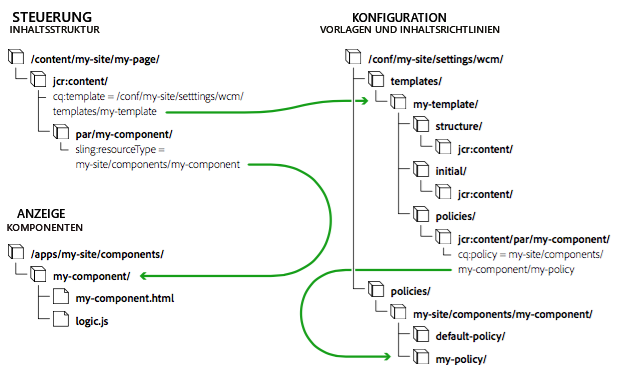
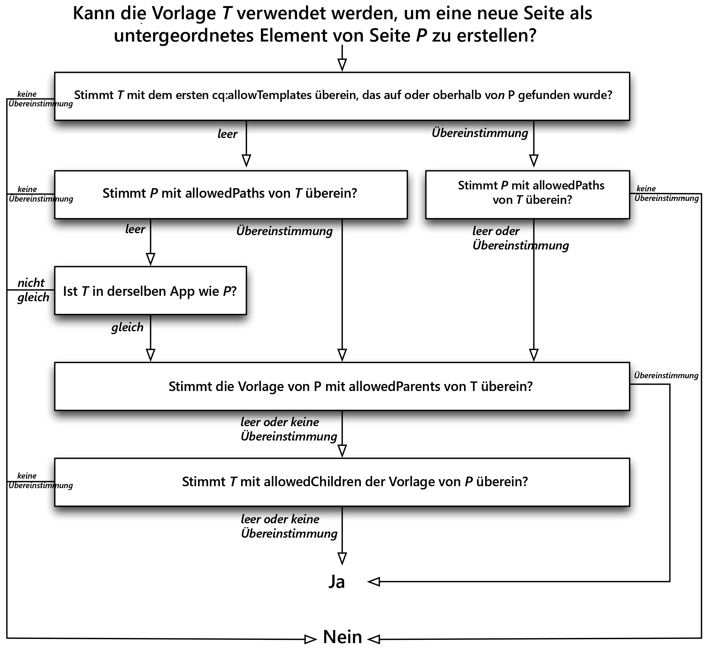

# Bearbeitbare Vorlagen {#editable-templates}

Erfahren Sie, wie bearbeitbare Vorlagen beim Erstellen einer Seite sowie beim Definieren des anfänglichen Inhalts, des strukturierten Inhalts, der Authoring-Richtlinien und des Layouts verwendet werden.

## Überblick {#overview}

Beim Erstellen einer Seite müssen Sie eine Vorlage auswählen. Die Seitenvorlage wird als Basis für die neue Seite genutzt. Die Vorlage definiert die Struktur der Seite, anfängliche Inhalte und die Komponenten, die verwendet werden können (Design-Eigenschaften).

* Mit editierbaren Vorlagen können Autorinnen und Autoren Vorlagen erstellen und verwenden.
* Mit editierbaren Vorlagen können Seiten erstellt werden sowohl mit dem
   * [Seiteneditor](/help/sites-cloud/authoring/page-editor/templates.md) als auch mit dem
   * [universellen Editor](/help/sites-cloud/authoring/universal-editor/templates.md)

Seitenvorlagen zum Erstellen von Seiten, die mit dem universellen Editor bearbeitbar sind, verwenden eine begrenzte Untergruppe bearbeitbarer Vorlagenfunktionen. Daher konzentriert sich der Rest dieses Dokuments auf bearbeitbare Vorlagen, die zum Erstellen von Seiten verwendet werden, die mit dem Seiteneditor bearbeitet werden können.

## Bearbeitbare Vorlagen und Seiten, die mit dem Seiteneditor bearbeitet wurden {#page-editor}

Beim Erstellen von Vorlagen zum Erstellen von Seiten, die mit dem Seiteneditor bearbeitet werden können, werden normalerweise spezialisierte Autorinnen und Autoren identifiziert.

* Diese spezialisierten Autoren werden als **Vorlagenautoren** bezeichnet.
* Vorlagenautoren müssen Mitglieder der Gruppe `template-authors` sein.
* Editierbare Vorlagen behalten eine dynamische Verbindung zu allen Seiten, die daraus erstellt werden. Dadurch wird sichergestellt, dass alle Änderungen an der Vorlage auf den Seiten widergespiegelt werden.
* Durch editierbare Vorlagen wird die Seitenkomponente allgemeiner, sodass die Kernseitenkomponente ohne Anpassung verwendet werden kann.

Mit bearbeitbaren Vorlagen werden die Aspekte, die eine Seite ausmachen, innerhalb von Komponenten isoliert. Sie können die erforderlichen Komponentenkombinationen über eine Benutzeroberfläche konfigurieren. Damit entfällt die Notwendigkeit, für jede Seitenvariante eine neue Seitenkomponente zu entwickeln.

Dieses Dokument:

* Gibt einen Überblick über die Erstellung einer editierbaren Vorlage
* Beschreibt die zum Erstellen bearbeitbarer Vorlagen erforderlichen Aufgaben für Admin-/Entwicklerpersonal
* Beschreibt die technischen Grundlagen bearbeitbarer Vorlagen
* beschreibt, wie AEM die Verfügbarkeit einer Vorlage bewertet.

>[!NOTE]
>
>Bei den in diesem Dokument beschriebenen Schritten wird vorausgesetzt, dass Sie bereits mit dem Erstellen und Bearbeiten von Vorlagen vertraut sind. Weitere Informationen finden Sie im Dokument [Vorlagen zum Erstellen von Seiten, die mit dem Seiteneditor bearbeitet werden können](/help/sites-cloud/authoring/page-editor/templates.md), in dem die Funktionen bearbeitbarer Vorlagen für Vorlagenautorinnen und -autoren ausführlich beschrieben werden.

>[!TIP]
>
>[Das WKND-Tutorial](/help/implementing/developing/introduction/develop-wknd-tutorial.md) erläutert die Verwendung von bearbeitbarer Vorlagen durch Implementierung eines Beispiels und ist sehr nützlich, um zu verstehen, wie eine Vorlage in einem neuen Projekt eingerichtet wird.

## Erstellen einer neuen editierbaren Vorlage {#creating-a-new-template}

Bearbeitbare Vorlagen werden von Vorlagenautoren in erster Linie mit der [Vorlagenkonsole und dem Vorlagen-Editor](/help/sites-cloud/authoring/page-editor/templates.md) erstellt. In diesem Abschnitt finden Sie einen Überblick über diesen Prozess, der anschließend aus technischer Perspektive beleuchtet wird.

Gehen Sie zum Erstellen einer bearbeitbaren Vorlage wie folgt vor:

1. Erstellen Sie einen [Ordner für die Vorlagen](#template-folders). Dieser Ordner ist nicht obligatorisch, wird jedoch als Best Practice empfohlen.
1. Wählen Sie einen [Vorlagentyp](#template-type) aus. Dieser wird kopiert, um die [Vorlagendefinition](#template-definitions) zu erstellen.

   >[!NOTE]
   >
   >Eine Auswahl von Vorlagentypen ist standardmäßig verfügbar. Sie können auch [eigene Site-spezifische Vorlagentypen erstellen](#creating-template-types), falls erforderlich.

1. Konfigurieren Sie die Struktur, die Inhaltsrichtlinien, den anfänglichen Inhalt und das Layout der neuen Vorlage.

   **Struktur**

   * Die Struktur ermöglicht die Definition von Komponenten und Inhalten für Ihre Vorlage.
   * Komponenten, die in der Vorlagenstruktur definiert sind, können nicht auf einer resultierenden Seite verschoben oder von resultierenden Seiten gelöscht werden.
   * Wenn Sie möchten, dass Seitenautorinnen und -autoren Komponenten hinzufügen und entfernen können, fügen Sie der Vorlage ein Absatzsystem hinzu.
   * Komponenten lassen sich entsperren und erneut sperren, damit Sie den anfänglichen Inhalt definieren können.

   Weitere Informationen darüber, wie eine Vorlagenautorin oder ein Vorlagenautor die Struktur definiert, finden Sie unter [Vorlagen zum Erstellen von Seiten, die mit dem Seiteneditor bearbeitet werden können](/help/sites-cloud/authoring/page-editor/templates.md#editing-a-template-structure-template-author).

   Technische Details zur Struktur werden in diesem Dokument unter [Struktur](#structure) erläutert.

   **Richtlinien**

   * Die Richtlinien für Inhalte definieren die Design-Eigenschaften einer Komponente.

      * Zum Beispiel die verfügbaren Komponenten oder minimale/maximale Abmessungen.

   * Diese sind auf die Vorlage anwendbar (und auf Seiten, die mit der Vorlage erstellt wurden).

   Weitere Informationen darüber, wie eine Vorlagenautorin oder ein Vorlagenautor Richtlinien definiert, finden Sie unter [Vorlagen zum Erstellen von Seiten, die mit dem Seiteneditor bearbeitet werden können](/help/sites-cloud/authoring/page-editor/templates.md#editing-a-template-structure-template-author).

   Technische Details zu Richtlinien werden in diesem Dokument unter [Inhaltsrichtlinien](#content-policies) erläutert.

   **Anfänglicher Inhalt**

   * Der anfängliche Inhalt definiert den Inhalt, der angezeigt wird, wenn eine Seite anfänglich auf Grundlage einer Vorlage erstellt wird.
   * Der anfängliche Inhalt kann dann von Seitenautorinnen bzw. -autoren bearbeitet werden.

   Weitere Informationen darüber, wie eine Vorlagenautorin oder ein Vorlagenautor die Struktur definiert, finden Sie unter [Vorlagen zum Erstellen von Seiten, die mit dem Seiteneditor bearbeitet werden können](/help/sites-cloud/authoring/page-editor/templates.md#editing-a-template-initial-content-author).

   Technische Details zum anfänglichen Inhalt finden Sie unter [Anfänglicher Inhalt](#initial-content) in diesem Dokument.

   **Layout**

   * Sie können das Vorlagen-Layout für verschiedene Geräte definieren.
   * Responsives Layout funktioniert für Vorlagen ebenso wie für die Seitenbearbeitung.

   Weitere Informationen darüber, wie eine Vorlagenautorin oder ein Vorlagenautor das Vorlagen-Layout definiert, finden Sie unter [Vorlagen zum Erstellen von Seiten, die mit dem Seiteneditor bearbeitet werden können](/help/sites-cloud/authoring/page-editor/templates.md#editing-a-template-layout-template-author).

   Technische Details zum Vorlagen-Layout finden Sie unter [Layout](#layout) in diesem Dokument.

1. Aktivieren Sie die Vorlage und lassen Sie sie dann für bestimmte Inhaltsstrukturen zu.

   * Eine Vorlage kann aktiviert oder deaktiviert werden, um sie für Vorlagenautorinnen und -autoren verfügbar bzw. nicht verfügbar zu machen.
   * Eine Vorlage kann für bestimmte Seitenverzweigungen verfügbar oder nicht verfügbar gemacht werden.

   Weitere Informationen darüber, wie eine Vorlagenautorin oder ein Vorlagenautor eine Vorlage aktiviert, finden Sie unter [Vorlagen zum Erstellen von Seiten, die mit dem Seiteneditor bearbeitet werden können](/help/sites-cloud/authoring/page-editor/templates.md#enabling-and-allowing-a-template-template-author).

   Technische Details zum Aktivieren von Vorlagen werden in diesem Dokument unter [Aktivieren und Zulassen von Vorlagen](#enabling-and-allowing-a-template-for-use) erläutert.

1. Verwenden Sie sie, um Inhaltsseiten zu erstellen.

   * Wenn Sie eine Vorlage zum Erstellen einer Seite verwenden, ist kein Unterschied zwischen statischen und bearbeitbaren Vorlagen ersichtlich.
   * Für die Seitenautoren ist der Prozess transparent.

   Einzelheiten dazu, wie Seitenautoren Vorlagen zum Erstellen von Seiten verwenden können, finden Sie unter [Erstellen und Organisieren von Seiten](/help/sites-cloud/authoring/sites-console/organizing-pages.md#templates).

   Technische Details zu den Richtlinien werden in diesem Dokument unter [Resultierende Inhaltsseiten](#resultant-content-pages) erläutert.

>[!TIP]
>
>Geben Sie in eine Vorlage nie Informationen ein, die internationalisiert werden müssen. Für die Internationalisierung werden die [Lokalisierungsfunktionen der Hauptkomponenten](https://experienceleague.adobe.com/docs/experience-manager-core-components/using/get-started/localization.html?lang=de) empfohlen.

>[!NOTE]
>
>Vorlagen sind leistungsstarke Tools zur Optimierung des Seitenerstellungs-Workflows. Allerdings können zu viele Vorlagen die Autoren überwältigen und das Erstellen von Seiten unübersichtlich machen. Eine gute Faustregel ist, die Anzahl der Vorlagen unter 100 zu halten.
>
>Adobe empfiehlt, aufgrund möglicher Leistungsauswirkungen nicht mehr als 1.000 Vorlagen zu verwenden.

>[!NOTE]
>
>Die Client-Bibliothek des Editors setzt voraus, dass der Namespace `cq.shared` in den Inhaltsseiten vorhanden ist. Wenn er nicht vorhanden ist, wird der JavaScript-Fehler `Uncaught TypeError: Cannot read property 'shared' of undefined` gemeldet.
>
>Alle Beispielinhaltsseiten enthalten `cq.shared`, sodass jeglicher darauf basierender Inhalt automatisch `cq.shared` umfasst. Wenn Sie sich jedoch ganz neue eigene Inhaltsseiten erstellen möchten, die nicht auf Beispielinhalt basieren, müssen Sie sicherstellen, dass Sie den Namespace `cq.shared` einbinden.
>
>Weitere Informationen finden Sie unter [Verwendung Client-seitiger Bibliotheken](/help/implementing/developing/introduction/clientlibs.md).

## Vorlagenordner {#template-folders}

Zum Organisieren Ihrer Vorlagen können Sie die folgenden Ordner verwenden:

* `global`
* Site-spezifisch

>[!NOTE]
>
>Obwohl Sie Ihre Ordner verschachteln können, werden sie den Benutzern in der **Vorlagenkonsole** als flache Struktur angezeigt.

In einer Standard-AEM-Instanz ist der Ordner `global` bereits in der Vorlagenkonsole vorhanden. Er enthält Standardvorlagen und dient als Ausweichlösung, wenn keine Richtlinien und/oder Vorlagentypen im aktuellen Ordner gefunden werden. Sie können Ihre Standardvorlagen entweder zu diesem Ordner hinzufügen oder aber einen Ordner erstellen (empfohlen).

>[!NOTE]
>
>Als Best Practice wird empfohlen, einen Ordner für Ihre benutzerdefinierten Vorlagen zu erstellen und nicht den `global`-Ordner zu verwenden.

>[!CAUTION]
>
>Ordner müssen von einem Benutzer mit `admin`-Rechten erstellt werden.

Arten von Vorlagen und Richtlinien werden gemäß der folgenden Rangordnung in allen Ordnern übernommen:

1. der aktuelle Ordner
1. dem aktuellen Ordner übergeordnete Elemente
1. `/conf/global`
1. `/apps`
1. `/libs`

Eine Liste aller zulässigen Einträge wird erstellt. Wenn sich Konfigurationen (`path`/`label`) überschneiden, wird den Benutzern nur die Instanz angezeigt, die dem aktuellen Ordner am nächsten ist.

Zum Erstellen eines Ordners stehen Ihnen die folgenden Optionen zur Auswahl:

* Programmierbar oder mit CRXDE Lite
* Verwenden des [Konfigurations-Browsers ](/help/implementing/developing/introduction/configurations.md#using-configuration-browser)

## Verwenden von CRXDE Lite {#using-crxde-lite}

1. Ein neuer Ordner (unter „/conf“) kann für Ihre Instanz entweder programmgesteuert oder mit CRXDE Lite erstellt werden.

   Die folgende Struktur muss verwendet werden:

   ```xml
   /conf
       <your-folder-name> [sling:Folder]
           settings [sling:Folder]
               wcm [cq:Page]
                   templates [cq:Page]
                   policies [cq:Page]
   ```

1. Sie können die folgenden Eigenschaften des Ordnerstammknotens definieren:

   `<your-folder-name> [sling:Folder]`

   * Name: `jcr:title`
   * Typ: `String`
   * Wert: Der Titel (für den Ordner), der in der **Vorlagen**-Konsole angezeigt werden soll

1. Zusätzlich zu den standardmäßigen Autorenberechtigungen (z. B. `content-authors`) müssen Sie jetzt eine oder mehrere Gruppen zuweisen und die erforderlichen Zugriffsrechte (ACLs) definieren, damit Ihre Autoren in der Lage sind, Vorlagen im neuen Ordner zu erstellen.

   Die Gruppe `template-authors` ist die Standardgruppe, die zugewiesen werden muss. Weitere Informationen finden Sie im Abschnitt [ACLs und Gruppen](#acls-and-groups).

   <!--See [Access Right Management](/help/sites-administering/user-group-ac-admin.md#access-right-management) for full details on managing and assigning access rights.-->

### Verwenden des Konfigurations-Browsers {#using-the-configuration-browser}

1. Wechseln Sie zu **Globale Navigation** > **Tools** > [**Konfigurations-Browser**](/help/implementing/developing/introduction/configurations.md#using-configuration-browser).

   Die vorhandenen Ordner werden links aufgelistet, einschließlich des Ordners `global`.

1. Klicken Sie auf **Erstellen**.
1. Im Dialogfeld **Konfiguration erstellen** müssen die folgenden Felder konfiguriert werden:

   * **Titel**: Geben Sie einen Titel für den Konfigurationsordner an.
   * **Bearbeitbare Vorlagen**: Aktivieren Sie diese Option, um bearbeitbare Vorlagen in diesem Ordner zuzulassen.

1. Klicken Sie auf **Erstellen**.

>[!NOTE]
>
>Im [Konfigurations-Browser](/help/implementing/developing/introduction/configurations.md#using-configuration-browser) können Sie den globalen Ordner bearbeiten und die Option **Bearbeitbare Vorlagen** aktivieren, wenn Sie in diesem Ordner Vorlagen erstellen möchten. Davon ist jedoch abzuraten.

### ACLs und Gruppen {#acls-and-groups}

Sobald Ihre Vorlagenordner erstellt sind (entweder über CRXDE oder den Konfigurations-Browser), müssen ACLs für die entsprechenden Gruppen für die Vorlagenordner definiert werden, um ein angemessenes Maß an Sicherheit zu gewährleisten.

Die Vorlagenordner für das [WKND-Tutorial](/help/implementing/developing/introduction/develop-wknd-tutorial.md) können als Beispiel herangezogen werden.

#### Die Gruppe „template-authors“  {#the-template-authors-group}

Die Gruppe `template-authors` ist die Gruppe zum Verwalten des Zugriffs auf Vorlagen und standardmäßig in AEM integriert. Sie ist aber leer. Benutzer müssen der Gruppe für das Projekt bzw. die Site hinzugefügt werden.

>[!CAUTION]
>
>Die Gruppe `template-authors` ist nur für Benutzer, die die Möglichkeit haben müssen, neue Vorlagen zu erstellen.
>
>Das Bearbeiten von Vorlagen hat weitreichende Auswirkungen und bei nicht ordnungsgemäßem Vorgehen können vorhandene Vorlagen beschädigt werden. Daher sollte diese Rolle zielgerichtet und nur qualifizierten Benutzerinnen und Benutzern zugewiesen werden.

In der folgenden Tabelle sind die erforderlichen Berechtigungen für die Bearbeitung von Vorlagen aufgeführt.

<table>
 <tbody>
  <tr>
   <th>Pfad</th>
   <th>Rolle/Gruppe</th>
   <th>Berechtigungen<br /> </th>
   <th>Beschreibung</th>
  </tr>
  <tr>
   <td rowspan="3"><code>/conf/&lt;<i>your-folder</i>&gt;/settings/wcm/templates</code></td>
   <td>Vorlagenautoren<br /> </td>
   <td>lesen, schreiben, replizieren</td>
   <td>Vorlagenautoren, die Vorlagen im Site-spezifischen <code>/conf</code>-Raum erstellen, lesen, aktualisieren, löschen und replizieren</td>
  </tr>
  <tr>
   <td>Anonymer Web-Anwender</td>
   <td>lesen</td>
   <td>Anonymer Web-Anwender muss Vorlagen beim Rendern einer Seite lesen</td>
  </tr>
  <tr>
   <td>Autoren von Inhalten</td>
   <td>replizieren</td>
   <td>replicateContent-Autoren müssen beim Aktivieren einer Seite die Vorlagen einer Seite aktivieren</td>
  </tr>
  <tr>
   <td rowspan="3"><code>/conf/&lt;<i>your-folder</i>&gt;/settings/wcm/policies</code></td>
   <td><code>Template Author</code></td>
   <td>lesen, schreiben, replizieren</td>
   <td>Vorlagenautoren, die Vorlagen im Site-spezifischen <code>/conf</code>-Raum erstellen, lesen, aktualisieren, löschen und replizieren</td>
  </tr>
  <tr>
   <td>Anonymer Web-Anwender</td>
   <td>lesen</td>
   <td>Anonymer Web-Anwender muss beim Rendern einer Seite Richtlinien lesen</td>
  </tr>
  <tr>
   <td>Autoren von Inhalten</td>
   <td>replizieren</td>
   <td>Inhaltsautoren müssen beim Aktivieren einer Seite die Richtlinien einer Vorlage aktivieren</td>
  </tr>
  <tr>
   <td rowspan="2"><code>/conf/&lt;site&gt;/settings/template-types</code></td>
   <td>Vorlagenautor</td>
   <td>lesen</td>
   <td>Der Vorlagenautor erstellt eine neue Vorlage basierend auf einem der vordefinierten Vorlagentypen.</td>
  </tr>
  <tr>
   <td>Anonymer Web-Anwender</td>
   <td>keine</td>
   <td>Anonymer Web-Anwender darf nicht auf die Vorlagentypen zugreifen</td>
  </tr>
 </tbody>
</table>

Diese standardmäßige `template-authors`-Gruppe umfasst nur die Projekteinstellungen, bei denen alle Mitglieder von `template-authors` auf alle Vorlagen zugreifen und diese erstellen dürfen. Für komplexere Setups, bei denen mehrere Vorlagenautorengruppen benötigt werden, um einen getrennten Zugriff auf Vorlagen zu ermöglichen, müssen weitere benutzerdefinierte Vorlagenautorengruppen erstellt werden. Die Berechtigungen für die Vorlagenautorengruppen bleiben dabei jedoch dieselben.

## Vorlagentyp {#template-type}

Beim Erstellen einer Vorlage müssen Sie einen Vorlagentyp angeben:

* Vorlagentypen stellen effektiv Vorlagen für eine Vorlage bereit. Beim Erstellen einer Vorlage wird die Struktur und der anfängliche Inhalt des gewählten Vorlagentyps verwendet, um die neue Vorlage zu erstellen.

   * Der Vorlagentyp wird kopiert, um die Vorlage zu erstellen.
   * Nach dem Kopieren besteht die einzige Verbindung zwischen der Vorlage und dem Vorlagentyp in einer statischen Referenz zu Informationszwecken.

* Mit Vorlagentypen können Sie Folgendes definieren:

   * Den Ressourcentyp der Seitenkomponente.
   * Die Richtlinie des Stammknotens, die die im Vorlageneditor zulässigen Komponenten definiert.
   * Es wird empfohlen, die Haltepunkte für das responsive Raster und das Setup des Emulators für mobile Geräte über den Vorlagentyp zu definieren.

* AEM stellt einige vordefinierte Vorlagentypen wie HTML5-Seiten und Seiten mit adaptivem Formular bereit.

   * Weitere Beispiele finden Sie im [WKND-Tutorial](/help/implementing/developing/introduction/develop-wknd-tutorial.md).

* Vorlagentypen werden normalerweise von Entwicklerinnen und Entwicklern definiert.

Die vordefinierten Vorlagentypen werden unter folgendem Pfad gespeichert:

* `/libs/settings/wcm/template-types`

>[!CAUTION]
>
>Sie dürfen keinerlei Änderungen im Pfad `/libs` vornehmen. Dies liegt daran, dass der Inhalt von `/libs` jederzeit durch ein Update in AEM überschrieben werden kann.

Ihre Site-spezifischen Vorlagentypen sollten an einer mit dem folgenden Pfad vergleichbaren Stelle gespeichert werden:

* `/apps/settings/wcm/template-types`

Definitionen für Ihre benutzerdefinierten Vorlagentypen sollten in benutzerdefinierten Ordnern (empfohlen) oder alternativ im Ordner `global` gespeichert werden. Zum Beispiel:

* `/conf/<my-folder-01>/<my-folder-02>/settings/wcm/template-types`
* `/conf/<my-folder>/settings/wcm/template-types`
* `/conf/global/settings/wcm/template-types`

>[!CAUTION]
>
>Die Vorlagentypen müssen die korrekte Ordnerstruktur aufweisen (also `/settings/wcm/...`), sonst werden die Vorlagentypen nicht gefunden.

<!--
### Template Type and Mobile Device Groups {#template-type-and-mobile-device-groups-br}

The [device groups](/help/sites-developing/mobile.md#device-groups) used for an editable template (set as relative path of the property `cq:deviceGroups`) define which mobile devices are available as emulators in the [layout mode](/help/sites-authoring/responsive-layout.md) of page authoring. This value can be set in two places:

* On the editable template type
* On the editable template

When creating an editable template, the value is copied from the template type to the individual template. If the value is not set on the type, it can be set on the template. Once a template is created, there is no inheritance from the type to the template.

>[!CAUTION]
>
>The value of `cq:deviceGroups` must be set as a relative path such as `mobile/groups/responsive` and not as an absolute path such as `/etc/mobile/groups/responsive`.

>[!NOTE]
>
>With static templates /help/sites-developing/page-templates-static.md, the value of `cq:deviceGroups` could be set at the root of the site.
>
>With editable templates, this value is now stored at the template level and is not supported at the page root level.
-->

### Erstellen von Vorlagentypen {#creating-template-types}

Wenn Sie eine Vorlage erstellt haben, die als Grundlage für andere Vorlagen dienen kann, können Sie diese Vorlage als Vorlagentyp kopieren.

1. Erstellen Sie eine Vorlage so wie jede andere Seitenvorlage. Weitere Informationen finden Sie unter [Vorlagen zum Erstellen von Seiten, die mit dem Seiteneditor bearbeitbar sind](/help/sites-cloud/authoring/page-editor/templates.md#creating-a-new-template-template-author). Diese wird als Grundlage für Ihren Vorlagentyp dienen.
1. Kopieren Sie mit CRXDE Lite die erstellte Vorlage aus dem Knoten `templates` in den Knoten `template-types` unter dem [Vorlagenordner](#template-folders).
1. Löschen Sie die Vorlage aus dem Knoten `templates` unter dem [Vorlagenordner](#template-folders).
1. Löschen Sie in der Kopie der Vorlage, die sich unter dem `template-types`-Knoten befindet, alle `cq:template`- und `cq:templateType`-Eigenschaften aus allen `jcr:content`-Knoten.

Sie können auch Ihren eigenen Vorlagentyp entwickeln, indem Sie eine bearbeitbare Beispielvorlage von GitHub als Grundlage verwenden.

CODE AUF GITHUB

Den Code dieser Seite finden Sie auf GitHub.

* [Öffnen Sie das Projekt aem-sites-example-custom-template-type auf GitHub](https://github.com/Adobe-Marketing-Cloud/aem-sites-example-custom-template-type).
* Laden Sie das Projekt als [ZIP-Datei](https://github.com/Adobe-Marketing-Cloud/aem-sites-example-custom-template-type/archive/master.zip) herunter.

## Vorlagendefinitionen {#template-definitions}

Definitionen für bearbeitbare Vorlagen werden in [benutzerdefinierten Ordnern](#template-folders) (empfohlen) oder alternativ im Ordner `global` gespeichert. Zum Beispiel:

* `/conf/<my-folder>/settings/wcm/templates`
* `/conf/<my-folder-01>/<my-folder-02>/settings/wcm/templates`
* `/conf/global/settings/wcm/templates`

Der Stammknoten der Vorlage weist den Typ `cq:Template` und das folgende Strukturgerüst auf:

```xml
<template-name>
  initial
    jcr:content
      root
        <component>
        ...
        <component>
  jcr:content
    @property status
  policies
    jcr:content
      root
        @property cq:policy
        <component>
          @property cq:policy
        ...
        <component>
          @property cq:policy
  structure
    jcr:content
      root
        <component>
        ...
        <component>
      cq:responsive
        breakpoints
  thumbnail.png
```

Die Hauptelemente sind:

* `<template-name>`

   * ` [initial](#initial-content)`
   * `jcr:content`
   * ` [structure](#structure)`
   * ` [policies](#policies)`
   * `thumbnail.png`

### jcr:content {#jcr-content}

Dieser Knoten enthält Eigenschaften für die Vorlage:

* **Name**: `jcr:title`
* **Name**: `status`
   * **Typ**: `String`
   * **Wert**: `draft`, `enabled` oder `disabled`

### Struktur {#structure}

Definiert die Struktur der resultierenden Seite:

* Sie wird beim Erstellen einer Seite mit dem anfänglichen Inhalt (`/initial`) zusammengeführt.
* Änderungen an der Struktur spiegeln sich in allen Seiten wider, die mit der Vorlage erstellt wurden.
* Der Knoten `root` (`structure/jcr:content/root`) definiert die Liste der Komponenten, die auf der resultierenden Seite verfügbar sind.
   * Komponenten, die in der Vorlagenstruktur definiert sind, können nicht auf einer resultierenden Seite verschoben oder von resultierenden Seiten gelöscht werden.
   * Nachdem eine Komponente entsperrt wurde, wird die Eigenschaft `editable` auf `true` gesetzt.
   * Nachdem eine Komponente, die bereits Inhalt enthält, entsperrt wurde, wird dieser Inhalt in die Verzweigung `initial` verschoben.

* Der Knoten `cq:responsive` enthält Definitionen für das responsive Layout.

### Anfänglicher Inhalt {#initial-content}

Definiert den anfänglichen Inhalt, den eine neue Seite bei Erstellung enthält:

* Er enthält einen Knoten `jcr:content`, der auf alle neue Seiten kopiert wird.
* Er wird beim Erstellen einer Seite mit der Struktur (`/structure`) zusammengeführt.
* Vorhandene Seiten werden nicht aktualisiert, wenn der anfängliche Inhalt nach der Erstellung geändert wird.
* Der Knoten `root` enthält eine Liste von Komponenten, die definieren, was auf der resultierenden Seite verfügbar ist.
* Wird einer Komponente im Strukturmodus Inhalt hinzugefügt und wird diese Komponente anschließend entsperrt (oder umgekehrt), so wird dieser Inhalt als anfänglicher Inhalt verwendet.

### Layout {#layout}

Beim [Bearbeiten einer Vorlage, in der Sie das Layout definieren können](/help/sites-cloud/authoring/page-editor/templates.md), wird das [standardmäßige responsive Layout](/help/sites-cloud/administering/responsive-layout.md) verwendet, das [auf der Seite von der Autorin bzw. vom Autor des Inhalts konfiguriert werden kann](/help/sites-cloud/authoring/page-editor/responsive-layout.md).

### Inhaltsrichtlinien {#content-policies}

Die Richtlinien für Inhalte definieren die Design-Eigenschaften einer Komponente. Zum Beispiel die verfügbaren Komponenten oder minimale/maximale Abmessungen. Diese sind auf die Vorlage anwendbar (und auf Seiten, die mit der Vorlage erstellt wurden). Inhaltsrichtlinien können mit dem Vorlageneditor erstellt und ausgewählt werden.

* Die Eigenschaft `cq:policy` im Knoten `root`
  `/conf/<your-folder>/settings/wcm/templates/<your-template>/policies/jcr:content/root`
Stellt einen relativen Verweis auf die Inhaltsrichtlinie für das Absatzsystem der Seite bereit.

* Die Eigenschaft `cq:policy` der komponentenexpliziten Knoten unter `root` stellt Links zu den Richtlinien für die einzelnen Komponenten bereit.

* Die tatsächlichen Richtliniendefinitionen werden gespeichert unter:
  `/conf/<your-folder>/settings/wcm/policies/wcm/foundation/components`

>[!NOTE]
>
>Die Pfade der Richtliniendefinitionen sind vom Pfad der Komponente abhängig. `cq:policy` enthält einen relativen Verweis auf die Konfiguration selbst.

### Seitenrichtlinien {#page-policies}

Seitenrichtlinien ermöglichen es, die [Inhaltsrichtlinie](#content-policies) für die Seite (Hauptabsatzsystem) entweder in der Vorlage oder den resultierenden Seiten zu definieren.

### Aktivieren und Zulassen einer Vorlage {#enabling-and-allowing-a-template-for-use}

1. **Aktivieren der Vorlage**

   Bevor eine Vorlage verwendet werden kann, muss sie wie folgt aktiviert werden:

   * Durch [Aktivieren der Vorlage](/help/sites-cloud/authoring/page-editor/templates.md) über die **Vorlagen**-Konsole.

   * Durch Festlegen der Statuseigenschaft des Knotens `jcr:content`

      * Zum Beispiel unter:
        `/conf/<your-folder>/settings/wcm/templates/<your-template>/jcr:content`

      * Definieren Sie die Eigenschaft:

         * Name: Status
         * Typ: String
         * Wert: `enabled`

1. **Zugelassene Vorlagen**

   * [Definieren Sie die Pfade zugelassener Vorlagen über die **Seiteneigenschaften**](/help/sites-cloud/authoring/page-editor/templates.md#allowing-a-template-author) der entsprechenden Seite oder Stammseite einer Unterverzweigung.
   * Legen Sie die folgende Eigenschaft fest:
     `cq:allowedTemplates`
Auf dem `jcr:content`-Knoten der erforderlichen Verzweigung.

   Beispielsweise mit dem Wert:

   `/conf/<your-folder>/settings/wcm/templates/.*`

## Resultierende Inhaltsseiten {#resultant-content-pages}

Für Seiten, die anhand bearbeitbarer Vorlagen erstellt wurden, gilt Folgendes:

* Sie werden mit einer Unterbaumstruktur erstellt, die aus `structure` und `initial` in der Vorlage zusammengeführt wird.

* Sie enthalten Verweise auf Informationen, die in der Vorlage und im Vorlagentyp enthalten sind. Dies wird mithilfe des Knotens `jcr:content` mit den folgenden Eigenschaften erreicht:

   * `cq:template` – Stellt den dynamischen Verweis auf die aktuelle Vorlage bereit und ermöglicht es, Änderungen an der Vorlage auf den aktuellen Seiten widerzuspiegeln.

   * `cq:templateType` – Stellt einen Verweis auf den Vorlagentyp bereit.



Das obige Diagramm veranschaulicht, wie Vorlagen, Inhalte und Komponenten zusammenhängen:

* Controller – `/content/<my-site>/<my-page>` – Die resultierende Seite, die auf die Vorlage verweist. Der Inhalt steuert den gesamten Prozess. Gemäß den Definitionen greift er auf die entsprechenden Vorlagen und Komponenten zu.
* Konfiguration – `/conf/<my-folder>/settings/wcm/templates/<my-template>` – Die [Vorlage und zugehörigen Inhaltsrichtlinien](#template-definitions) definieren die Seitenkonfiguration.
* Modell – OSGi-Bundles – Die [OSGi-Bundles](/help/implementing/deploying/configuring-osgi.md) implementieren die Funktionalität.
* Ansicht – `/apps/<my-site>/components` – Sowohl in der Autoren- als auch in der Veröffentlichungsumgebung wird der Inhalt durch Komponenten gerendert.

Beim Rendern einer Seite:

* **Vorlagen**:

   * Die `cq:template`-Eigenschaft des Knotens `jcr:content` wird referenziert, um auf die Vorlage zuzugreifen, die dieser Seite entspricht.

* **Komponenten**:

   * Die Seitenkomponente führt die Baumstruktur `structure/jcr:content` der Vorlage mit der Baumstruktur `jcr:content` der Seite zusammen.
      * Die Seitenkomponente gestattet es der Autorin bzw. dem Autor nur, die Knoten der Vorlagenstruktur zu bearbeiten, die als bearbeitbar gekennzeichnet wurden (sowie jegliche untergeordneten Elemente).
      * Beim Rendern einer Komponente auf einer Seite wird der relative Pfad dieser Komponente vom Knoten `jcr:content` übernommen. Derselbe Pfad unter dem Knoten `policies/jcr:content` der Vorlage wird dann durchsucht.
         * Die Eigenschaft `cq:policy` dieses Knotens verweist auf die eigentliche Inhaltsrichtlinie (d. h. sie enthält die Design-Konfiguration für diese Komponente).
            * Auf diese Weise können Sie mehrere Vorlagen verwenden, die dieselben Inhaltsrichtlinienkonfigurationen wiederverwenden.

### Verfügbarkeit von Vorlagen {#template-availability}

Beim Erstellen einer neuen Seite in der Site-Admin-Oberfläche hängt die Liste der verfügbaren Vorlagen vom Speicherort der neuen Seite und den in den einzelnen Vorlagen angegebenen Platzierungsbeschränkungen ab.

Die folgenden Eigenschaften bestimmen, ob eine Vorlage `T` für eine neue Seite verwendet werden darf, die der Seite `P` untergeordnet platziert werden kann. Jede dieser Eigenschaften ist eine mehrwertige Zeichenfolge, welche null oder mehrere reguläre Ausdrücke enthält, die für die Übereinstimmung mit Pfaden verwendet werden:

* Die Eigenschaft `cq:allowedTemplates` des Unterknotens `jcr:content` von `P` oder ein Vorgänger von `P`.

* Die `allowedPaths`-Eigenschaft von `T`.

* Die `allowedParents`-Eigenschaft von `T`.

* Die `allowedChildren`-Eigenschaft der Vorlage von `P`.

Die Bewertung funktioniert wie folgt:

* Die erste nicht leere Eigenschaft `cq:allowedTemplates`, die beim Aufrufen der mit `P` beginnenden Seitenhierarchie gefunden wird, wird mit dem Pfad von `T` abgeglichen. Wenn keiner der Werte übereinstimmt, wird `T` abgelehnt.

* Wenn `T` eine nicht leere `allowedPaths`-Eigenschaft hat, aber keiner der Werte mit dem Pfad von `P` übereinstimmt, wird `T` zurückgewiesen.

* Wenn beide oben genannten Eigenschaften entweder leer oder nicht vorhanden sind, wird `T` abgelehnt, es sei denn, es gehört zum selben Programm wie `P`. `T` gehört genau dann zum selben Programm wie `P`, wenn der Name der zweiten Ebene des Pfades von `T` mit dem Namen der zweiten Ebene des Pfades von `P` übereinstimmt. Zum Beispiel gehört die Vorlage `/apps/wknd/templates/foo` zum selben Programm wie die Seite `/content/wknd`.

* Wenn `T` eine nicht leere `allowedParents`-Eigenschaft hat, aber keiner der Werte mit dem Pfad von `P` übereinstimmt, wird `T` zurückgewiesen.

* Wenn die Vorlage von `P` eine nicht leere `allowedChildren`-Eigenschaft hat, aber keiner der Werte mit dem Pfad von `T` übereinstimmt, wird `T` zurückgewiesen.

* In allen anderen Fällen ist `T` zulässig.

Das folgende Diagramm zeigt den Vorlagenauswertungsprozess:



>[!CAUTION]
>
>AEM bietet verschiedene Eigenschaften zur Steuerung der unter **Sites** zulässigen Vorlagen. Eine Kombination daraus kann jedoch zu komplexen Regeln führen, die sich nur schwer verfolgen und verwalten lassen.
>
>Daher empfiehlt Adobe, einfach anzufangen, indem Sie Folgendes definieren:
>
>* nur die `cq:allowedTemplates`-Eigenschaft
>
>* nur im Site-Stamm
>
>Ein Beispiel finden Sie im Inhalt des [WKND-Tutorials](/help/implementing/developing/introduction/develop-wknd-tutorial.md): `/content/wknd/jcr:content`
>
>Außerdem können die Eigenschaften `allowedPaths`, `allowedParents` und `allowedChildren` in den Vorlagen platziert werden, um komplexere Regeln zu definieren. Es ist jedoch nach Möglichkeit *deutlich* einfacher, in Unterabschnitten der Site weitere `cq:allowedTemplates`-Eigenschaften zu definieren, wenn die zulässigen Vorlagen weiter eingeschränkt werden sollen.
>
>Ein weiterer Vorteil besteht darin, dass die `cq:allowedTemplates`-Eigenschaften von einem Autor auf der Registerkarte **Erweitert** der **Seiteneigenschaften** aktualisiert werden können. Die anderen Vorlageneigenschaften können nicht über die (standardmäßige) Benutzeroberfläche aktualisiert werden. Dafür wird ein Entwickler benötigt, der die Regeln und Code-Bereitstellung für jede Änderung pflegt.

#### Einschränkende Vorlagen in untergeordneten Seiten {#limiting-templates-used-in-child-pages}

Um zu begrenzen, welche Vorlagen zum Erstellen von untergeordneten Seiten unter einer bestimmten Seite verwendet werden können, verwenden Sie die Eigenschaft `cq:allowedTemplates` des Knotens `jcr:content` auf der Seite. Damit lässt sich die Liste der Vorlagen angeben, die als untergeordnete Seiten zulässig sein sollen. Jeder Wert in der Liste muss ein absoluter Pfad zu einer Vorlage für eine zulässige untergeordnete Seite sein, zum Beispiel `/apps/wknd/templates/page-content`.

Sie können die Eigenschaft `cq:allowedTemplates` im Knoten `jcr:content` der Vorlage verwenden, damit diese Konfiguration auf alle erstellten Seiten angewendet wird, die diese Vorlage nutzen.

Wenn Sie mehrere Einschränkungen hinzufügen möchten, z. B. bezüglich der Vorlagenhierarchie, können Sie die Eigenschaften `allowedParents/allowedChildren` der Vorlage verwenden. Sie können dann explizit angeben, dass Seiten, die aus einer Vorlage T erstellt wurden, übergeordnet/untergeordnet von Seiten sein müssen, die aus einer Vorlage T erstellt wurden.
