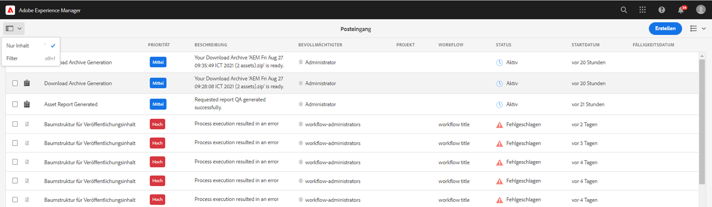

# Konfigurieren von Suchfiltern für den Posteingang {#configure-search-filters-inbox}

Sie können Suchfilter für Elemente im Posteingang konfigurieren. Beziehen Sie Ihre Suchkriterien auf eine bestimmte Spalte im Posteingang, um die Ergebnisse zu filtern.

Um beispielsweise die Elemente im Posteingang auf der Basis eines Spaltenbereichs für das Geburtsdatum zu filtern, können Sie die Datumsbereich-Eigenschaft verwenden, um den Datumsbereich zu definieren.

Im Folgenden finden Sie die verfügbaren Eigenschaftstypen für den Posteingang:

* Eigenschaft für Bereich

* Texteigenschaft

* Datumsbereich-Eigenschaft

* Options-Eigenschaftsprädikat

>[!NOTE]
>
>Stellen Sie sicher, dass Sie Mitglied der Gruppe `workflow-administrators` sind, um Suchfilter für den Posteingang zu konfigurieren.

## Erstellen oder Öffnen einer benutzerdefinierten Konfiguration {#creating-opening-customized-configuration}

1. Navigieren Sie zu **[!UICONTROL Tools]** > **[!UICONTROL Allgemein]** > **[!UICONTROL Suchformulare]**.

1. Wählen Sie die Konfiguration **[!UICONTROL Posteingangssuchleiste]** und wählen Sie **[!UICONTROL Bearbeiten]**.
1. Integrieren Sie die Änderungen der Eigenschaftskonfiguration mithilfe von **[!UICONTROL Suchformulare bearbeiten]**.
1. Wählen Sie **[!UICONTROL Fertig]** aus, um die Konfiguration zu speichern.

## Löschen einer anwenderdefinierten Konfiguration {#delete-customized-configuration}

So löschen Sie eine anwenderdefinierte Konfiguration:

1. Navigieren Sie zu **[!UICONTROL Tools]** > **[!UICONTROL Allgemein]** > **[!UICONTROL Suchformulare]**.

1. Wählen Sie die Konfiguration **[!UICONTROL Posteingangssuchleiste]** und wählen Sie **[!UICONTROL Löschen]**.

## Konfigurieren der Bereichseigenschaft {#range-predicate}

Sie können Elemente im Posteingang filtern, um mithilfe der Bereichseigenschaft innerhalb einer Spalte im Posteingang nach einem Zahlenbereich zu suchen. Sie können auch Dezimalwerte für Zahlen angeben.

So konfigurieren Sie eine Bereichseigenschaft:

1. Öffnen Sie das [Formular für die Konfiguration](#creating-opening-customized-configuration).
1. Wählen Sie die Registerkarte **[!UICONTROL Prädikat auswählen]** und ziehen Sie **[!UICONTROL Bereichsprädikat]** in das Formular.
1. Wählen Sie auf der Registerkarte **[!UICONTROL Einstellungen]** im Feld **[!UICONTROL Spaltenname]** den Namen der Spalte des Posteingangs aus, auf dem die Suche basieren soll.
1. Geben Sie im Feld **[!UICONTROL Filterbezeichnung]** die Bezeichnung des Filters an. Aktivieren Sie das Kontrollkästchen **[!UICONTROL Dezimalwerte aktivieren]**, um Dezimalwerte für Zahlen zuzulassen, während Sie den Bereich definieren.
1. Geben Sie eine optionale Beschreibung für die Konfiguration ein und wählen Sie **[!UICONTROL Fertig]**, um die Änderungen zu speichern.

Die Konfigurationsänderungen werden beim Öffnen der Seite „Filter“ übernommen. Die in Schritt 4 angegebene Filterbezeichnung wird als Bezeichnung mit einer Option zum Definieren der Mindest- und Höchstwerte angezeigt. Wenn Sie die Eingabetaste drücken, wendet [!DNL Experience Manager] die Suchkriterien auf den in Schritt 3 angegebenen Spaltennamen an und gibt die entsprechenden Elemente im Posteingang zurück.

>[!NOTE]
>
>In diesem Artikel werden die neuesten Optionen der Benutzeroberfläche aufgeführt. Die Optionsnamen werden mit der kommenden Version in der Benutzeroberfläche aktualisiert.

## Konfigurieren der Texteigenschaft {#text-predicate}

Filtern Sie die Elemente im Posteingang, um mithilfe der Texteigenschaft innerhalb einer Spalte im Posteingang nach einer Textzeichenfolge zu suchen.

So konfigurieren Sie eine Texteigenschaft:

1. Öffnen Sie das [Formular für die Konfiguration](#creating-opening-customized-configuration).
1. Wählen Sie die Registerkarte **[!UICONTROL Prädikat auswählen]** und ziehen Sie die **[!UICONTROL Texteigenschaft]** in das Formular.
1. Wählen Sie auf der Registerkarte **[!UICONTROL Einstellungen]** im Feld **[!UICONTROL Spaltenname]** den Namen der Spalte des Posteingangs aus, auf dem die Suche basieren soll.
1. Geben Sie den Text an, der im Textfeld Suchen als Platzhaltertext im Feld **[!UICONTROL Suchtextfeld-Platzhalter]** angezeigt wird.
1. Geben Sie eine optionale Beschreibung für die Konfiguration ein und wählen Sie **[!UICONTROL Fertig]**, um die Änderungen zu speichern.

Die Konfigurationsänderungen werden beim Öffnen der Seite „Filter“ übernommen. Wenn Sie die Eingabetaste drücken, wendet [!DNL Experience Manager] den in Schritt 4 angegebenen Suchtext auf den in Schritt 3 angegebenen Spaltennamen an und gibt die entsprechenden Elemente im Posteingang zurück.

## Konfigurieren der Datumsbereich-Eigenschaft {#date-range-predicate}

Sie können Elemente im Posteingang filtern, um mithilfe der Datumsbereich-Eigenschaft innerhalb einer Spalte im Posteingang nach einem Datumsbereich zu suchen.

So konfigurieren Sie eine Datumsbereich-Eigenschaft:

1. Öffnen Sie das [Formular für die Konfiguration](#creating-opening-customized-configuration).
1. Wählen Sie die Registerkarte **[!UICONTROL Prädikat auswählen]** und ziehen Sie **[!UICONTROL Datumsbereichsprädikat]** in das Formular.
1. Wählen Sie auf der Registerkarte **[!UICONTROL Einstellungen]** im Feld **[!UICONTROL Spaltenname]** den Namen der Spalte des Posteingangs aus, auf dem die Suche basieren soll.
1. Geben Sie im Feld **[!UICONTROL Filterbezeichnung]** die Bezeichnung des Filters für die Datumsbereich-Eigenschaft an.
1. Geben Sie die Bezeichnungen für das Start- und Enddatum für den Filter an.
1. Geben Sie eine optionale Beschreibung für die Konfiguration ein und wählen Sie **[!UICONTROL Fertig]**, um die Änderungen zu speichern.

Die Konfigurationsänderungen werden beim Öffnen der Seite „Filter“ übernommen. Die in Schritt 4 angegebene Filterbezeichnung wird zusammen mit den in Schritt 5 angegebenen Bezeichnungen für das Start- und Enddatum für den Datumsbereichs-Filter angezeigt. [!DNL Experience Manager] wendet die Suchkriterien auf den in Schritt 3 angegebenen Spaltennamen an und gibt die entsprechenden Elemente im Posteingang zurück.

## Konfigurieren der Eigenschaft für anwenderdefinierte Spaltenoptionen {#custom-column-options-predicate}

Sie können Elemente im Posteingang filtern, um mithilfe der Eigenschaft für anwenderdefinierte Spaltenoptionen innerhalb einer Spalte im Posteingang nach einer anwenderdefinierten Option zu suchen.

So konfigurieren Sie eine Eigenschaft für anwenderdefinierte Spaltenoptionen:

1. Öffnen Sie das [Formular für die Konfiguration](#creating-opening-customized-configuration).
1. Wählen Sie die Registerkarte **[!UICONTROL Prädikat auswählen]** und ziehen Sie **[!UICONTROL Prädikat für benutzerdefinierte Spaltenoptionen]** in das Formular.
1. Wählen Sie auf der Registerkarte **[!UICONTROL Einstellungen]** im Feld **[!UICONTROL Spaltenname]** den Namen der Spalte des Posteingangs aus, auf dem die Suche basieren soll.
1. Geben Sie im Feld **[!UICONTROL Filterbezeichnung]** die Bezeichnung des Filters für die Eigenschaft für anwenderdefinierte Spaltenoptionen an.
1. Aktivieren Sie das Kontrollkästchen **[!UICONTROL Einzelauswahl]**, um die Auswahl nur einer Option zu aktivieren, während Sie den Filter auf eine Spalte im Posteingang anwenden.
1. Gehen Sie im Abschnitt **[!UICONTROL Optionen hinzufügen]** folgendermaßen vor:
   1. Wählen Sie **[!UICONTROL Manuell]** aus, um die Filtersuchoptionen manuell zu definieren. Wählen Sie **[!UICONTROL Filteroptionen hinzufügen]**, um die erste Option zu definieren. Geben Sie die Bezeichnung für die Spaltenoption und den Text für den Optionswert an, nach dem gesucht werden soll. Wenn Sie beispielsweise **Female** als Wert in einer Spalte im Posteingang suchen möchten, können Sie **F** als Bezeichnung für die Spaltenoption angeben und **Female** als Text für den Optionswert hinzufügen. Ebenso können Sie weitere Filteroptionen hinzufügen.
   1. Wählen Sie **[!UICONTROL JSON-Pfad]** aus, um Optionen mithilfe eines JSON-Dateipfads zu definieren. Im Folgenden finden Sie eine JSON-Beispieldatei zum Definieren von Filteroptionen:

      ```JSON
          {
         "options":[
            {
            "text":"Female",
            "value":"F"
            },
            {
            "text":"Male",
            "value":"M"
            }
          ]
        }
      ```

   1. Wählen Sie **[!UICONTROL CRX-Options-Pfad]** aus, um Optionen mithilfe der CRX-Repository-Pfade zu definieren. Wählen Sie **[!UICONTROL Optionspfade hinzufügen]**, um mehrere Pfade hinzuzufügen. Im Folgenden finden Sie eine JSON-Beispieldatei zum Definieren von `Male`- und `Female`-Filteroptionen:

      ```JSON
         <gender jcr:primaryType="sling:OrderedFolder">
                        <male
                            jcr:primaryType="nt:unstructured"
                            jcr:title="Male"
                            value="M"/>
                        <female
                            jcr:primaryType="nt:unstructured"
                            jcr:title="Female"
                            value="F"/>
                    </gender>
      ```

1. Geben Sie eine optionale Beschreibung für die Konfiguration ein und wählen Sie **[!UICONTROL Fertig]**, um die Änderungen zu speichern.

Die Konfigurationsänderungen werden beim Öffnen der Seite „Filter“ übernommen. Die in Schritt 4 angegebene Filterbezeichnung wird als Bezeichnung für die Eigenschaft für anwenderdefinierte Spaltenoptionen angezeigt. [!DNL Experience Manager] wendet die in Schritt 6 angegebenen Suchkriterien auf den in Schritt 3 angegebenen Spaltennamen an und gibt die entsprechenden Elemente im Posteingang zurück.

Das folgende Video zeigt die Schritte zum Filtern einer Spalte anhand der Optionswerte `true` und `false`.

>[!VIDEO](https://video.tv.adobe.com/v/335679)

## Anzeigen von Suchfiltern basierend auf Eigenschaften {#view-search-filters-for-predicates}

Sie können Suchfilter basierend auf Eigenschaften anzeigen. Wählen Sie auf der Seite „Posteingang“ die Option **[!UICONTROL Filter]** aus. Die Filter werden im linken Bereich angezeigt. Anschließend können Sie die Suchkriterien zum Filtern von Elementen im Posteingang angeben.



Weitere Informationen zum Verwalten von Eigenschaftenkonfigurationen finden Sie unter [Konfigurieren von Suchformularen](search-forms.md).
