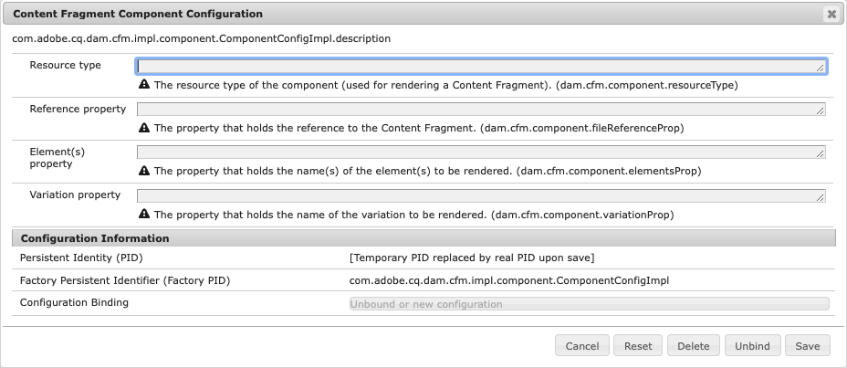

# Inhaltsfragmente, die Komponenten für die Wiedergabe konfigurieren{#content-fragments-configuring-components-for-rendering}

Es gibt mehrere [erweiterte Services](#definition-of-advanced-services-that-need-configuration) zum Rendern von Inhaltsfragmenten. Um diese Services zu verwenden, müssen sich die Ressourcentypen dieser Komponenten dem Inhaltsfragmente-Framework bekannt machen.

Dies erfolgt durch die Konfiguration von [OSGi-Service – Konfiguration der Inhaltsfragment-Komponente](#osgi-service-content-fragment-component-configuration).

Diese Informationen sind erforderlich, wenn Sie:

* Ihre eigene auf einem Inhaltsfragment basierende Komponente bereitstellen
* und die erweiterten Services verwenden müssen.

Adobe empfiehlt, die Kernkomponenten zu verwenden.

>[!CAUTION]
>
>* **Wenn Sie die unten beschriebenen [erweiterten Services](#definition-of-advanced-services-that-need-configuration)** nicht benötigen, können Sie diese Konfiguration ignorieren.
>
>* **Wenn Sie die vordefinierte(n) Komponente(n) erweitern oder verwenden**, wird eine Änderung der OSGi-Konfiguration nicht empfohlen.
>
>* **Sie können eine Komponente von Grund auf neu schreiben, die nur die Inhaltsfragmente-API verwendet, ohne die erweiterten Services zu nutzen**. In einem solchen Fall müssen Sie Ihre Komponente jedoch so entwickeln, dass sie die entsprechende Verarbeitung übernimmt.
>
>Es wird daher empfohlen, die Kernkomponenten zu verwenden.

## Definition erweiterter Services, die konfiguriert werden müssen {#definition-of-advanced-services-that-need-configuration}

Die Services, die die Registrierung einer Komponente erfordern:

* das korrekte Bestimmen von Abhängigkeiten während der Veröffentlichung (d. h. sicherstellen, dass Fragmente und Modelle automatisch mit einer Seite veröffentlicht werden können, wenn sie sich seit der letzten Veröffentlichung geändert haben)
* unterstützen Inhaltsfragmente in der Volltextsuche,
* verwalten/bearbeiten *Zwischeninhalte*,
* verwalten/bearbeiten *gemischte Medien-Assets*,
* Dispatcher-Flush für referenzierte Fragmente (wenn eine Seite, die ein Fragment enthält, erneut veröffentlicht wird),
* verwenden absatzbasiertes Rendering.

Wenn Sie eine oder mehrere dieser Funktionen benötigen, ist es (in der Regel) einfacher, die vordefinierten erweiterten Services zu verwenden, anstatt sie von Grund auf neu zu entwickeln.

## OSGi-Service – Konfiguration der Inhaltsfragment-Komponente {#osgi-service-content-fragment-component-configuration}

Die Konfiguration muss an den OSGi-Service zur **Konfiguration der Inhaltsfragment-Komponente** gebunden sein:

`com.adobe.cq.dam.cfm.impl.component.ComponentConfigImpl`

>[!NOTE]
>
>Weitere Informationen finden Sie unter [OSGi-Konfiguration](/help/implementing/deploying/overview.md#osgi-configuration).

Zum Beispiel:



Die OSGi-Konfiguration lautet:

<table>
 <thead>
  <tr>
   <td>Bezeichnung</td>
   <td>OSGi-Konfiguration<br /> </td>
   <td>Beschreibung</td>
  </tr>
 </thead>
 <tbody>
  <tr>
   <td><strong>Ressourcentyp</strong></td>
   <td><code>dam.cfm.component.resourceType</code></td>
   <td>Der zu registrierende Ressourcentyp; z. B. <br /> <p><span class="cmp-examples-demo__property-value"><code>core/wcm/components/contentfragment/v1/contentfragment</code></code></p> </td>
  </tr>
  <tr>
   <td><strong>Verweiseigenschaft</strong></td>
   <td><code>dam.cfm.component.fileReferenceProp</code></td>
   <td>Der Name der Eigenschaft, die den Verweis auf das Fragment enthält; z. B. <code>fragmentPath</code> oder <code>fileReference</code></td>
  </tr>
  <tr>
   <td><strong>Elementeigenschaft</strong></td>
   <td><code>dam.cfm.component.elementsProp</code></td>
   <td>Der Name der Eigenschaft, die die Namen der zu rendernden Elemente enthält; z. B.<code>elementName</code></td>
  </tr>
  <tr>
   <td><strong>Varianteneigenschaft</strong><br /> </td>
   <td><code>dam.cfm.component.variationProp</code></td>
   <td>Der Name der Eigenschaft, die den Namen der zu rendernden Variante enthält; z. B.<code>variationName</code></td>
  </tr>
 </tbody>
</table>

Für einige Funktionen muss Ihre Komponente vordefinierte Konventionen einhalten. In der folgenden Tabelle sind die Eigenschaften aufgeführt, die für jeden Absatz (d. h. `jcr:paragraph` für jede Komponenteninstanz) durch Ihre Komponente definiert werden müssen, damit die Services sie korrekt erkennen und verarbeiten können.

<table>
 <thead>
  <tr>
   <td>Eigenschaftsname</td>
   <td>Beschreibung</td>
  </tr>
 </thead>
 <tbody>
  <tr>
   <td><code>paragraphScope</code></td>
   <td><p>Eine Zeichenfolgeneigenschaft, die definiert, wie Absätze ausgegeben werden sollen, wenn sie sich im <em>Rendermodus für einzelne Elemente</em> befinden.</p> <p>Werte:</p>
    <ul>
     <li><code>all</code> : zum Rendern aller Absätze</li>
     <li><code>range</code> : zum Rendern des Bereichs der Absätze, die hier angegeben sind: <code>paragraphRange</code></li>
    </ul> </td>
  </tr>
  <tr>
   <td><code>paragraphRange</code></td>
   <td><p>Eine Zeichenfolgeneigenschaft, die den Bereich der Absätze definiert, die ausgegeben werden sollen, wenn sie sich im <em>Rendermodus für einzelne Elemente</em> befinden.</p> <p>Format:</p>
    <ul>
     <li><code>1</code> oder <code>1-3</code> oder <code>1-3;6;7-8</code> oder <code>*-3;5-*</code>
     <ul>
       <li><code>-</code> Bereichsanzeige</li>
       <li><code>;</code> Listentrennzeichen</li>
       <li><code>*</code> Platzhalter</li>
     </ul>
     </li>
     <li>nur ausgewertet, wenn <code>paragraphScope</code> = <code>range</code></li>
    </ul> </td>
  </tr>
  <tr>
   <td><code>paragraphHeadings</code></td>
   <td>Eine boolesche Eigenschaft, die definiert, ob Überschriften (z. B. <code>h1</code>, <code>h2</code>, <code>h3</code>) als Absätze (<code>true</code>) oder nicht als Absätze (<code>false</code>) gezählt werden sollen</td>
  </tr>
 </tbody>
</table>

## Beispiel {#example}

Sehen Sie sich folgendes Beispiel (in einer vordefinierten AEM-Instanz) an:

```
/apps/core/wcm/config/com.adobe.cq.dam.cfm.impl.component.ComponentConfigImpl-core-comp-v1.config
```

Es umfasst:

```
dam.cfm.component.resourceType="core/wcm/components/contentfragment/v1/contentfragment"
dam.cfm.component.fileReferenceProp="fragmentPath"
dam.cfm.component.elementsProp="elementName"
dam.cfm.component.variationProp="variationName"
```
