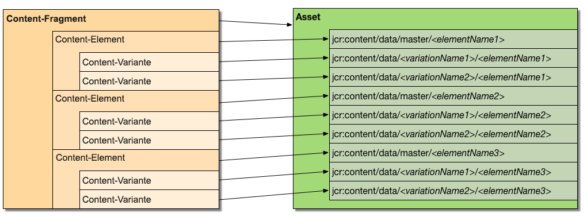

# Anpassen und Erweitern von Inhaltsfragmenten{#customizing-and-extending-content-fragments}

In Adobe Experience Manager as a Cloud Service erweitert ein Inhaltsfragment ein Standard-Asset. Siehe:

* [Erstellen und Verwalten von Inhaltsfragmenten](/help/sites-cloud/administering/content-fragments/overview.md) und [Seitenbearbeitung mit Inhaltsfragmenten](/help/sites-cloud/authoring/fragments/content-fragments.md).

* [Verwalten von Assets](/help/assets/manage-digital-assets.md) für weitere Informationen zu Standard-Assets.

## Architektur {#architecture}

Ein Inhaltsfragment umfasst die folgenden grundlegenden [Bestandteile](/help/sites-cloud/administering/content-fragments/overview.md#constituent-parts-of-a-content-fragment):

* Ein *Inhaltsfragment*,
* das ein oder mehrere *Inhaltselemente* enthält und
* das eine oder mehrere *Inhaltsvarianten* aufweisen kann.

Die einzelnen Inhaltsfragmente basieren auf Inhaltsfragmentmodellen:

* Inhaltsfragmentmodelle definieren die Struktur eines Inhaltsfragments, wenn dieses erstellt wird.
* Ein Fragment verweist auf das Modell. Änderungen am Modell können sich daher auf alle abhängigen Fragmente auswirken.
* Modelle werden anhand von Datentypen erstellt.
* Funktionen zum Hinzufügen neuer Varianten müssen das Fragment entsprechend aktualisieren.

  >[!NOTE]
  >
  >Damit Sie ein Inhaltsfragment anzeigen/rendern können, muss Ihr Konto über `read`-Rechte für das Modell verfügen.

  >[!CAUTION]
  >
  >Alle Änderungen an einem vorhandenen Inhaltsfragmentmodell können sich auf abhängige Fragmente auswirken. Daher kann es zu verwaisten Eigenschaften in diesen Fragmenten kommen.

### Integration von Sites mit Assets {#integration-of-sites-with-assets}

Die Inhaltsfragmentverwaltung (Content Fragment Management, CFM) ist Teil von Adobe Experience Manager (AEM) Assets:

* Inhaltsfragmente sind Assets.
* Sie verwenden vorhandene Assets-Funktionen.
* Sie sind vollständig in Assets integriert (Admin Consoles usw.).

Inhaltsfragmente werden als AEM Sites-Funktion betrachtet, da:

* sie beim Authoring von Seiten verwendet werden.

#### Zuordnen von Inhaltsfragmenten zu Assets {#mapping-content-fragments-to-assets}



Inhaltsfragmente, die auf einem Inhaltsfragmentmodell basieren, werden einem einzelnen Asset zugeordnet:

* Alle Inhalte werden im Knoten `jcr:content/data` des Assets gespeichert:

   * Die Elementdaten werden im primären Unterknoten gespeichert:
     `jcr:content/data/master`

   * Varianten werden in einem Unterknoten gespeichert, der den Namen der Variante hat:
z. B. `jcr:content/data/myvariation`

   * Die Daten der einzelnen Elemente werden im entsprechenden Unterknoten als Eigenschaft mit dem Elementnamen gespeichert:
Das Inhaltselement `text` wird beispielsweise mit der Eigenschaft `text` in `jcr:content/data/master` gespeichert.

* Metadaten und verknüpfte Inhalte werden unter `jcr:content/metadata` gespeichert.
Eine Ausnahme bilden der Titel und die Beschreibung, die nicht als Metadaten im herkömmlichen Sinne gelten und in `jcr:content` gespeichert werden.

#### Asset-Speicherort {#asset-location}

Wie bei Standard-Assets wird das Inhaltsfragment gespeichert in:

`/content/dam`

#### Asset-Berechtigungen {#asset-permissions}

Siehe [Inhaltsfragment – Überlegungen zum Löschen](/help/sites-cloud/administering/content-fragments/delete-considerations.md).

#### Funktionsintegration {#feature-integration}

Integration mit dem Assets-Kern:

* Die Funktion „Inhaltsfragmentverwaltung“ (Content Fragment Management, CFM) baut auf dem Asset-Kern auf.

* CFM stellt eigene Implementierungen für Elemente in der Karten-, Spalten- und Listenansicht bereit. Diese sind mit den Ausgabeformatimplementierungen vorhandener Asset-Inhalte verknüpft.

* Einige Asset-Komponenten wurden für Inhaltsfragmente erweitert.

### Verwenden von Inhaltsfragmenten in Seiten {#using-content-fragments-in-pages}

>[!CAUTION]
>
>Die [Inhaltsfragment-Komponente als Teil der Kernkomponenten](https://experienceleague.adobe.com/docs/experience-manager-core-components/using/wcm-components/content-fragment-component.html?lang=de). Weitere Informationen finden Sie unter [Entwickeln von Kernkomponenten](https://experienceleague.adobe.com/docs/experience-manager-core-components/using/developing/overview.html?lang=de).

AEM-Seiten können auf Inhaltsfragmente verweisen, ähnlich wie bei allen anderen Asset-Typen. AEM stellt die **[Kernkomponente für Inhaltsfragmente](https://experienceleague.adobe.com/docs/experience-manager-core-components/using/wcm-components/content-fragment-component.html?lang=de)** bereit, eine [Komponente, mit der Sie Inhaltsfragmente in Seiten einfügen können](/help/sites-cloud/authoring/fragments/content-fragments.md#adding-a-content-fragment-to-your-page). Sie können die Kernkomponente für **[Inhaltsfragmente](https://experienceleague.adobe.com/docs/experience-manager-core-components/using/developing/overview.html?lang=de)** auch erweitern.

* Die Komponente verwendet die `fragmentPath`-Eigenschaft für Verweise auf das tatsächliche Inhaltsfragment. Die `fragmentPath`-Eigenschaft wird wie ähnliche Eigenschaften anderer Asset-Typen gehandhabt, beispielsweise wenn das Inhaltsfragment zu einem anderen Speicherort verschoben wird.

* Mit der Komponente können Sie die Variante auswählen, die angezeigt werden soll.

* Außerdem kann eine Reihe von Absätzen ausgewählt werden, um die Ausgabe zu beschränken, z. B. für die Ausgabe in mehreren Spalten.

* Die Komponente lässt auch Zwischeninhalte zu:

   * Hier können Sie mit der Komponente andere Assets (z. B. Bilder) zwischen den Absätzen des referenzierten Fragments platzieren.

   * Für Übergangsinhalte:

      * Beachten Sie die Möglichkeit instabiler Verweise. Übergangsinhalte (die beim Erstellen einer Seite hinzugefügt werden) haben keine feste Beziehung zum Absatz, der daneben platziert wird. Durch das Einfügen eines neuen Absatzes (im Inhaltsfragmenteditor) vor der Position des Zwischeninhalts kann die relative Position verloren gehen.

      * Berücksichtigen Sie die zusätzlichen Parameter (wie Varianten- und Absatzfilter), um zu konfigurieren, was auf der Seite gerendert wird.

>[!NOTE]
>
>**Inhaltsfragmentmodell:**
>
>Wenn ein Inhaltsfragment auf einer Seite verwendet wird, wird auf das Inhaltsfragmentmodell verwiesen, auf dem es basiert.
>
>Falls das Modell also zum Zeitpunkt der Seitenveröffentlichung nicht veröffentlicht wurde, wird dies gekennzeichnet und das Modell zu den Ressourcen hinzugefügt, die mit der Seite veröffentlicht werden sollen.

### Integration mit anderen Frameworks {#integration-with-other-frameworks}

Inhaltsfragmente können mit folgenden Frameworks integriert werden:

* **Übersetzungen**

  Inhaltsfragmente sind vollständig mit dem [AEM-Übersetzungs-Workflow](/help/sites-cloud/administering/translation/overview.md) integriert. Auf Architekturebene bedeutet dies:

   * Die einzelnen Übersetzungen eines Inhaltsfragments sind separate Fragmente, z. B.

      * befinden sie sich unter verschiedenen Sprachstämmen, verwenden aber genau denselben relativen Pfad unterhalb des entsprechenden Sprachstamms:

        `/content/dam/<path>/en/<to>/<fragment>`

        im Vergleich zu

        `/content/dam/<path>/de/<to>/<fragment>`

   * Neben den regelbasierten Pfaden besteht keine andere Verbindung zwischen den verschiedenen Sprachversionen eines Inhaltsfragments. Sie werden als zwei separate Fragmente behandelt, obwohl die Benutzeroberfläche die Möglichkeit bietet, zwischen den Sprachvarianten zu navigieren.

  >[!NOTE]
  >
  >Der AEM-Übersetzungs-Workflow arbeitet mit `/content`:
  >
  >* Da sich die Inhaltsfragmentmodelle in `/conf` befinden, sind sie nicht in diesen Übersetzungen beinhaltet. Sie können die Strings der Benutzeroberfläche internationalisieren.

* **Metadatenschemas**

   * Inhaltsfragmente verwenden und wiederverwenden [Metadatenschemata](/help/assets/metadata-schemas.md), die mit Standard-Assets definiert werden können.

   * CFM bietet ein eigenes, spezifisches Schema:

     `/libs/dam/content/schemaeditors/forms/contentfragment`

     dieses kann bei Bedarf erweitert werden.

   * Das entsprechende Schemaformular ist mit dem Fragmenteditor integriert.

## Server-seitige API für die Inhaltsfragmentverwaltung {#the-content-fragment-management-api-server-side}

Sie können die Server-seitige API für den Zugriff auf Inhaltsfragmente verwenden, siehe:

[com.adobe.cq.dam.cfm](https://developer.adobe.com/experience-manager/reference-materials/cloud-service/javadoc/com/adobe/cq/dam/cfm/package-summary.html#package.description)

>[!CAUTION]
>
>Adobe empfiehlt die Verwendung der Server-seitigen API, anstatt direkt auf die Inhaltsstruktur zuzugreifen.

### Hauptschnittstellen {#key-interfaces}

Die folgenden drei Schnittstellen können als Einstiegspunkte dienen:

* **Inhaltsfragment** ([ContentFragment](https://developer.adobe.com/experience-manager/reference-materials/cloud-service/javadoc/com/adobe/cq/dam/cfm/ContentFragment.html))

  Mit dieser Schnittstelle können Sie abstrakt mit einem Inhaltsfragment arbeiten.

  Die Schnittstelle bietet folgende Möglichkeiten:

   * Verwalten grundlegender Daten (z. B. Abrufen von Namen, Abrufen/Festlegen von Titel/Beschreibung)
   * Zugriff auf Metadaten
   * Zugriff auf Elemente:

      * Auflisten von Elementen
      * Abrufen von Elementen nach Name
      * Erstellen neuer Elemente (siehe [Einschränkungen](#caveats))

      * Zugriff auf Elementdaten (siehe `ContentElement`)

   * Auflisten der für das Fragment definierten Varianten
   * Globales Erstellen neuer Varianten
   * Verwalten zugeordneter Inhalte:

      * Auflisten von Sammlungen
      * Hinzufügen von Sammlungen
      * Entfernen von Sammlungen

   * Zugreifen auf das Fragmentmodell

  Folgende Schnittstellen stehen für die Hauptelemente eines Fragments:

   * **Inhaltselement** ([ContentElement](https://developer.adobe.com/experience-manager/reference-materials/cloud-service/javadoc/com/adobe/cq/dam/cfm/ContentElement.html))

      * Abrufen grundlegender Daten (Name, Titel, Beschreibung)
      * Abrufen/Festlegen von Inhalten
      * Zugriff auf Varianten eines Elements:

         * Auflisten von Varianten
         * Abrufen von Varianten nach Name
         * Erstellen von Varianten (siehe [Einschränkungen](#caveats))
         * Entfernen von Varianten (siehe [Einschränkungen](#caveats))
         * Zugriff auf Variantendaten (siehe `ContentVariation`)

      * Tastaturbefehl zum Auflösen von Varianten (Anwenden zusätzlicher implementierungsspezifischer Ausweich-Logik, falls die angegebene Variante für ein Element nicht verfügbar ist)

   * **Inhaltsvariante** ([ContentVariation](https://developer.adobe.com/experience-manager/reference-materials/cloud-service/javadoc/com/adobe/cq/dam/cfm/ContentVariation.html))

      * Abrufen grundlegender Daten (Name, Titel, Beschreibung)
      * Abrufen/Festlegen von Inhalten
      * Einfache Synchronisierung basierend auf den zuletzt geänderten Informationen

  Alle drei Schnittstellen (`ContentFragment`, `ContentElement`, `ContentVariation`) erweitern die `Versionable`-Schnittstelle durch zusätzliche, für Inhaltsfragmente erforderliche Versionierungsfunktionen:

   * Erstellen einer Version des Elements
   * Auflisten der Versionen des Elements
   * Abrufen des Inhalts einer spezifischen Version des versionierten Elements

### Anpassen mit adaptTo() {#adapting-using-adaptto}

Folgendes kann angepasst werden:

* `ContentFragment` kann angepasst werden an:

   * `Resource`: die zugrunde liegende Sling-Ressource. Um die zugrunde liegende `Resource` direkt zu aktualisieren, muss das `ContentFragment`-Objekt neu erstellt werden.

   * `Asset`: die DAM`Asset`-Abstrahierung, die für das Inhaltsfragment steht. Um das zugrunde liegende `Asset` direkt zu aktualisieren, muss das `ContentFragment`-Objekt neu erstellt werden.

* `ContentElement` kann angepasst werden an:

   * [`ElementTemplate`](https://developer.adobe.com/experience-manager/reference-materials/cloud-service/javadoc/com/adobe/cq/dam/cfm/ElementTemplate.html) – für den Zugriff auf die Strukturdaten des Elements.

* [`FragmentTemplate`](https://developer.adobe.com/experience-manager/reference-materials/cloud-service/javadoc/com/adobe/cq/dam/cfm/FragmentTemplate.html)

* `Resource` kann angepasst werden an:

   * `ContentFragment`

### Einschränkungen {#caveats}

Beachten Sie Folgendes:

* Die gesamte API ist so konzipiert, dass Änderungen **nicht** automatisch persistent gespeichert werden (es sei denn, dies ist anders in der Java-Dokumentation der API angegeben). Daher müssen Sie immer den Ressourcenkonfliktlöser der entsprechenden Anfrage (oder den tatsächlich verwendeten Konfliktlöser) festlegen.

* Aufgaben, für die möglicherweise zusätzliche Arbeitsschritte erforderlich sind:

   * Adobe empfiehlt, Varianten von einem `ContentFragment` zu erstellen. Auf diese Weise wird sichergestellt, dass alle Elemente diese Variante gemeinsam nutzen und dass geeignete globale Datenstrukturen bei Bedarf aktualisiert werden, um die neue Variante in der Inhaltsstruktur widerzuspiegeln.

   * Durch das Entfernen vorhandener Varianten eines Elements mithilfe von `ContentElement.removeVariation()` werden die der Variante zugewiesenen globalen Datenstrukturen nicht aktualisiert. Verwenden Sie stattdessen `ContentFragment.removeVariation()`, um sicherzustellen, dass diese Datenstrukturen synchron bleiben, wodurch eine Variante global entfernt wird.

## Client-seitige API für die Inhaltsfragmentverwaltung {#the-content-fragment-management-api-client-side}

>[!CAUTION]
>
>Die Client-seitige API ist intern.

### Zusätzliche Informationen {#additional-information}

Beachten Sie Folgendes:

* `filter.xml`

  `filter.xml` für die Inhaltsfragmentverwaltung ist so konfiguriert, dass es sich nicht mit dem Hauptinhaltspaket für Assets überschneidet.

## Bearbeitungssitzungen {#edit-sessions}

>[!CAUTION]
>
>Beachten Sie diese Hintergrundinformationen. Sie sollten hier nichts ändern (da dies im Repository als *privater Bereich* gekennzeichnet ist). Es kann aber manchmal hilfreich sein, die internen Prozesses zu verstehen.

Das Bearbeiten eines Inhaltsfragments, das mehrere Ansichten (d. h. HTML-Seiten) umspannen kann, ist atomisch. Da die atomischen Bearbeitungsfunktionen für mehrere Ansichten kein typisches AEM-Konzept sind, verwenden Inhaltsfragmente eine sogenannte *Bearbeitungssitzung*.

Eine Bearbeitungssitzung wird gestartet, wenn der Benutzer ein Inhaltsfragment im Editor öffnet. Die Bearbeitungssitzung ist beendet, wenn der Benutzer den Editor durch Auswählen von **Speichern** oder **Abbrechen** verlässt.

Technisch gesehen werden alle Änderungen an *Live*-Inhalten wie bei allen anderen AEM-Bearbeitungen vorgenommen. Beim Starten der Bearbeitungssitzung wird eine Version des aktuellen, nicht bearbeiteten Status erstellt. Wenn ein Benutzer eine Bearbeitung abbricht, wird diese Version wiederhergestellt. Beim Klicken auf **Speichern** wird nichts Bestimmtes ausgeführt, da die Bearbeitung an *Live*-Inhalten ausgeführt wurde. Daher bleiben alle Änderungen bereits erhalten. Durch das Klicken auf **Speichern** wird auch eine Hintergrundverarbeitung ausgelöst, z. B. das Erstellen von Volltextsuchinformationen und/oder das Bearbeiten von gemischten Medien-Assets.

Es gibt einige Sicherheitsmaßnahmen für Randfälle, beispielsweise, wenn jemand versucht, den Editor zu verlassen, ohne die Bearbeitungssitzung zu speichern oder abzubrechen. Außerdem ist eine regelmäßige automatische Speicherung verfügbar, um Datenverluste zu vermeiden.
Zwei Benutzende könnten gleichzeitig dasselbe Inhaltsfragment bearbeiten und daher die Änderungen gegenseitig überschreiben. Um dies zu verhindern, muss das Inhaltsfragment gesperrt werden, indem die Aktion *Checkout* der DAM-Administration auf das Fragment angewendet wird.

## Beispiele {#examples}

### Beispiel: Zugreifen auf ein vorhandenes Inhaltsfragment {#example-accessing-an-existing-content-fragment}

Dazu können Sie die Ressource, die für die API steht, wie folgt anpassen:

`com.adobe.cq.dam.cfm.ContentFragment`

Zum Beispiel:

```java
// first, get the resource
Resource fragmentResource = resourceResolver.getResource("/content/dam/fragments/my-fragment");
// then adapt it
if (fragmentResource != null) {
    ContentFragment fragment = fragmentResource.adaptTo(ContentFragment.class);
    // the resource is now accessible through the API
}
```

### Beispiel: Erstellen eines Inhaltsfragments {#example-creating-a-new-content-fragment}

Um ein Inhaltsfragment programmgesteuert zu erstellen, müssen Sie ein `FragmentTemplate` verwenden, die von einer Modellressource angepasst wurde.

Zum Beispiel:

```java
Resource modelRsc = resourceResolver.getResource("...");
FragmentTemplate tpl = modelRsc.adaptTo(FragmentTemplate.class);
ContentFragment newFragment = tpl.createFragment(parentRsc, "A fragment name", "A fragment description.");
```

### Beispiel: Angeben des Intervalls für das automatische Speichern {#example-specifying-the-auto-save-interval}

Das [Intervall für das automatische Speichern](/help/sites-cloud/administering/content-fragments/managing.md#save-close-and-versions) (gemessen in Sekunden) kann mit dem Konfigurations-Manager (ConfMgr) definiert werden:

* Knoten: `<conf-root>/settings/dam/cfm/jcr:content`
* Eigenschaftsname: `autoSaveInterval`
* Typ: `Long`

* Standard: `600` (10 Minuten); wird definiert in `/libs/settings/dam/cfm/jcr:content`

Wenn Sie ein Intervall von 5 Minuten für das automatische Speichern festlegen möchten, definieren Sie die Eigenschaft auf dem Knoten.

Zum Beispiel:

* Knoten: `/conf/global/settings/dam/cfm/jcr:content`
* Eigenschaftsname: `autoSaveInterval`

* Typ: `Long`

* Wert: `300` (5 Minuten entsprechen 300 Sekunden)

## Komponenten für die Seitenbearbeitung {#components-for-page-authoring}

Weitere Informationen finden Sie unter

* [Kernkomponenten – Inhaltsfragmentkomponente](https://experienceleague.adobe.com/docs/experience-manager-core-components/using/wcm-components/content-fragment-component.html?lang=de) (empfohlen)
