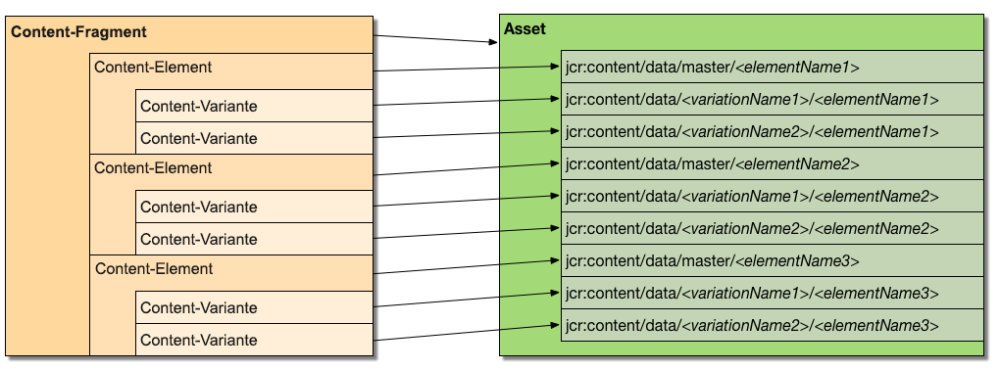
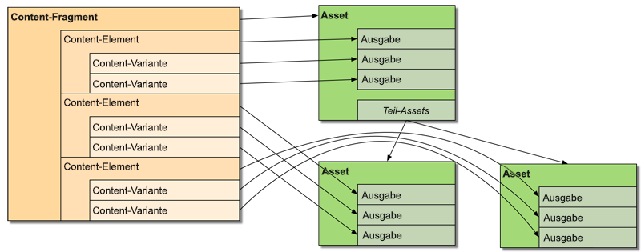

# Anpassen und Erweitern von Inhaltsfragmenten{#customizing-and-extending-content-fragments}

In Adobe Experience Manager als Cloud-Dienst erweitert ein Inhaltsfragment ein Standard-Asset. siehe:

* [Erstellen und Verwalten von Inhaltsfragmenten](/help/assets/content-fragments/content-fragments.md) und [Seitenbearbeitung mit Inhaltsfragmenten](/help/sites-cloud/authoring/fundamentals/content-fragments.md).

* [Verwalten von Assets](/help/assets/manage-digital-assets.md) und [Anpassen und Erweitern des Asset-Editors](/help/assets/extend-asset-editor.md) .

## Architektur {#architecture}

Ein Inhaltsfragment umfasst die folgenden grundlegenden[Bestandteile](/help/assets/content-fragments/content-fragments.md#constituent-parts-of-a-content-fragment):

* A *Content Fragment*,
* consisting of one or more *Content Elements*,
* and which can have one or more *Content Variations*.

Je nach Fragment-Typ werden auch Modelle oder die **Vorlage &quot;Einfaches Fragment** &quot;verwendet:

>[!CAUTION]
>
>Es werden derzeit [Inhaltsfragmentmodelle](/help/assets/content-fragments/content-fragments-models.md) zum Erstellen aller Fragmente empfohlen.
>
>Inhaltsfragmentmodelle werden für alle Beispiele in WKND verwendet.

* Inhaltsfragmentmodelle:

   * werden zum Definieren von Inhaltsfragmenten verwendet, die strukturierte Inhalte enthalten.
   * Inhaltsfragmentmodelle definieren die Struktur eines Inhaltsfragments, wenn dieses erstellt wird.
   * Ein Fragment verweist auf das Modell. Änderungen am Modell können sich daher auf alle abhängigen Fragmente auswirken.
   * Modelle werden anhand von Datentypen erstellt.
   * Funktionen zum Hinzufügen neuer Varianten und dergleichen müssen das Fragment entsprechend aktualisieren.
   >[!NOTE]
   >
   >Damit Sie ein Inhaltsfragment anzeigen/rendern können, muss Ihr Konto über Leserechte für das Modell verfügen.

   >[!CAUTION]
   >
   >Alle Änderungen an einem vorhandenen Inhaltsfragmentmodell können sich auf abhängige Fragmente auswirken. Daher kann es zu verwaisten Eigenschaften in diesen Fragmenten kommen.

* Inhaltsfragmentvorlage - **Einfaches Fragment**:

   * werden zum Definieren von einfachen Inhaltsfragmenten verwendet.

   * Diese Vorlage definiert die (einfache, schreibgeschützte) Struktur eines Inhaltsfragments, wenn dieses erstellt wird.

   * Die Vorlage wird beim Erstellen in das Fragment kopiert.

   * Funktionen zum Hinzufügen neuer Varianten und dergleichen müssen das Fragment entsprechend aktualisieren.

   * The Content fragment template (**Simple Fragment**) operates in a different manner to that of other templating mechanisms within the AEM ecosystem (e.g. page templates, etc.). Daher sollte sie gesondert betrachtet werden.

   * When based on the **Simple Fragment** template the MIME type of the content is managed on the actual content; this means that each element and variation can have a different MIME type.

### Integration von Sites mit Assets {#integration-of-sites-with-assets}

Die Inhaltsfragmentverwaltung (Content Fragment Management, CFM) ist Teil von AEM Assets:

* Inhaltsfragmente sind Assets.
* Sie verwenden vorhandene Assets-Funktionen.
* Sie sind vollständig mit Assets integriert (Admin-Konsole usw.).

Inhaltsfragmente werden als Sites-Funktion wie folgt betrachtet:

* Sie werden beim Authoring Ihrer Seiten verwendet.

#### Zuordnen von strukturierten Inhaltsfragmenten zu Assets {#mapping-structured-content-fragments-to-assets}



Inhaltsfragmente mit strukturierten Inhalten (d. h. basierend auf einem Inhaltsfragmentmodell) werden einem einzelnen Asset zugeordnet:

* All content is stored under the `jcr:content/data` node of the asset:

   * Die Elementdaten werden unter dem Master-Unterknoten gespeichert:
      `jcr:content/data/master`

   * Variations are stored under a sub-node that carries the name of the variation:
e.g. `jcr:content/data/myvariation`

   * The data of each element is stored in the respective sub-node as a property with the element name:
e.g. the content of element `text` is stored as property `text` on `jcr:content/data/master`

* Metadata and associated content is stored below `jcr:content/metadata`
Except for the title and description, which are not considered traditional metadata and stored on `jcr:content`

#### Zuordnen von einfachen Inhaltsfragmenten zu Assets {#mapping-simple-content-fragments-to-assets}



Simple content fragments (based on the **Simple Fragment** template) are mapped to a composite consisting of a main asset and (optional) sub-assets:

* Alle nicht inhaltsbezogenen Daten in einem Fragment (wie Titel, Beschreibung, Metadaten, Struktur) werden nur im Haupt-Asset verwaltet.
* Der Inhalt des ersten Elements eines Fragments wird dem ursprünglichen Ausgabeformat des Haupt-Assets zugeordnet.

   * Die Varianten (falls vorhanden) des ersten Elements werden anderen Ausgabeformaten des Haupt-Assets zugeordnet.

* Zusätzliche Elemente (falls vorhanden) werden Unter-Assets des Haupt-Assets zugeordnet.

   * Der Hauptinhalt dieser zusätzlichen Elemente wird der ursprünglichen Darstellung des jeweiligen Unterassets zugeordnet.
   * Andere Varianten (falls zutreffend) zusätzlicher Elemente werden anderen Ausgabeformaten der jeweiligen Unter-Assets zugeordnet.

#### Asset-Speicherort {#asset-location}

Wie bei Standard-Assets wird das Inhaltsfragment gespeichert in:

`/content/dam`

#### Asset-Berechtigungen {#asset-permissions}

Weitere Informationen finden Sie unter [Inhaltsfragment - Überlegungen](/help/assets/content-fragments/content-fragments-delete.md)löschen.

#### Funktionsintegration {#feature-integration}

Integration mit Assets core:

* Die Funktion &quot;Inhaltsfragment-Management (CFM)&quot;baut auf dem Asset-Kern auf.

* CFM stellt eigene Implementierungen für Elemente in den Ansichten &quot;card/column/Liste&quot;bereit. diese Plug-ins in die vorhandenen Asset Content Rendering-Implementierungen.

* Mehrere Assets-Komponenten wurden erweitert, um Inhaltsfragmente zu berücksichtigen.

### Verwenden von Inhaltsfragmenten in Seiten {#using-content-fragments-in-pages}

>[!CAUTION]
>
>Die Komponente [Inhaltsfragment ist Teil der Kernkomponenten](https://docs.adobe.com/content/help/en/experience-manager-core-components/using/components/content-fragment-component.html). Weitere Informationen finden Sie unter [Entwickeln von Kernkomponenten](https://docs.adobe.com/content/help/en/experience-manager-core-components/using/developing/developing.html).

AEM-Seiten können auf Inhaltsfragmente verweisen, ähnlich wie bei allen anderen Asset-Typen. AEM stellt die Kernkomponente für **[Inhaltsfragmente](https://docs.adobe.com/content/help/en/experience-manager-core-components/using/components/content-fragment-component.html)**bereit, eine[Komponente, mit der Sie Inhaltsfragmente in Seiten einfügen können](/help/sites-cloud/authoring/fundamentals/content-fragments.md#adding-a-content-fragment-to-your-page). You can also extend this**[ Content Fragment](https://docs.adobe.com/content/help/en/experience-manager-core-components/using/developing/developing.html)** core component.

* Die Komponente verwendet die `fragmentPath`-Eigenschaft für Verweise auf das tatsächliche Inhaltsfragment. The `fragmentPath` property is handled in the same manner as similar properties of other asset types; for example, when the content fragment is moved to another location.

* Mit der Komponente können Sie die Variante auswählen, die angezeigt werden soll.

* Außerdem kann eine Reihe von Absätzen ausgewählt werden, um die Ausgabe zu beschränken, z. B. für die Ausgabe in mehreren Spalten.

* Die Komponente lässt auch Zwischeninhalte zu:

   * Die Komponente ermöglicht es Ihnen, andere Assets (Bilder usw.) zwischen den Absätzen des Fragments zu platzieren, auf das verwiesen wird.

   * Bei Zwischeninhalten müssen Sie:

      * Kenntnis der Möglichkeit instabiler Verweise; Zwischen-Inhalt (der beim Authoring einer Seite hinzugefügt wird) hat keine feste Beziehung zu dem Absatz, neben dem er positioniert wird, und fügt einen neuen Absatz (im Inhaltsfragmenteditor) ein, bevor die Position des dazwischen liegenden Inhalts die relative Position verlieren kann

      * Berücksichtigen Sie die zusätzlichen Parameter (z. B. Variation und Absatz-Filter), um zu konfigurieren, was auf der Seite wiedergegeben wird.

>[!NOTE]
>
>**Inhaltsfragmentmodell:**
>
>Bei Verwendung eines auf einem Inhaltsfragmentmodell basierenden Inhaltsfragments auf einer Seite wird auf das Modell verwiesen. Falls das Modell also zum Zeitpunkt der Seitenveröffentlichung nicht veröffentlicht wurde, wird dies gekennzeichnet und das Modell zu den Ressourcen hinzugefügt, die mit der Seite veröffentlicht werden sollen.
>
>**Inhaltsfragment-Vorlage - Einfaches Fragment:**
>
>When using a content fragment that has been based on the content fragment template **Simple Fragment** on a page, there is no reference as the template was copied when creating the fragment.

### Integration mit anderen Frameworks {#integration-with-other-frameworks}

Inhaltsfragmente können mit folgenden Frameworks integriert werden:

* **Übersetzungen**

   Inhaltsfragmente sind vollständig in den AEM-Übersetzungs-Workflow integriert. Auf Architekturebene bedeutet dies:

   * Die einzelnen Übersetzungen eines Inhaltsfragments sind separate Fragmente, z. B.:

      * sie befinden sich unter verschiedenen sprachlichen Wurzeln; aber verwenden Sie genau denselben relativen Pfad unterhalb des entsprechenden Sprachstamms:

         `/content/dam/<path>/en/<to>/<fragment>`

         vs.

         `/content/dam/<path>/de/<to>/<fragment>`
   * Außer den regelbasierten Pfaden besteht keinerlei Verbindung zwischen den unterschiedlichen Sprachversionen von Inhaltsfragmenten. Sie werden als zwei separate Fragmente behandelt, obwohl die Benutzeroberfläche Funktionen zum Navigieren zwischen den Sprachvarianten beinhaltet.
   >[!NOTE]
   >
   >Der AEM-Übersetzungs-Workflow arbeitet mit `/content`:
   >
   >* As the content fragment models reside in `/conf`, these are not included in such translations. Sie können die Strings der Benutzeroberfläche internationalisieren.


* **Metadatenschemata**

   * Inhaltsfragmente verwenden [Metadatenschemata](/help/assets/metadata-schemas.md) (wieder), die mit Standard-Assets definiert werden können.

   * CFM bietet ein eigenes, spezifisches Schema:

      `/libs/dam/content/schemaeditors/forms/contentfragment`

      kann bei Bedarf erweitert werden.

   * Das entsprechende Schemaformular ist mit dem Fragment-Editor integriert.

## Serverseitige API für die Inhaltsfragmentverwaltung {#the-content-fragment-management-api-server-side}

Sie können die serverseitige API für den Zugriff auf Inhaltsfragmente verwenden, siehe:

[com.adobe.cq.dam.cfm](https://docs.adobe.com/content/help/en/experience-manager-cloud-service/implementing/developing/ref/javadoc/com/adobe/cq/dam/cfm/package-frame.html)

>[!CAUTION]
>
>Es wird dringend empfohlen, die serverseitige API zu verwenden, anstatt direkt auf die Inhaltsstruktur zuzugreifen.

### Hauptschnittstellen {#key-interfaces}

Die folgenden drei Schnittstellen können als Einstiegspunkte dienen:

* **Inhaltsfragment** ([ContentFragment](https://docs.adobe.com/content/help/en/experience-manager-cloud-service/implementing/developing/ref/javadoc/com/adobe/cq/dam/cfm/ContentFragment.html))

   In dieser Schnittstelle können Sie abstrakt mit einem Inhaltsfragment arbeiten.

   Die Schnittstelle bietet folgende Möglichkeiten:

   * Verwalten grundlegender Daten (z. B. Abrufen von Namen, Abrufen/Festlegen von Titel, Beschreibung)
   * Zugriff auf Metadaten
   * Zugriff auf Elemente:

      * Auflisten von Elementen
      * Abrufen von Elementen nach Name
      * Create new elements (see [Caveats](#caveats))

      * Access element data (see `ContentElement`)
   * Auflisten der für das Fragment definierten Varianten
   * Globales Erstellen neuer Varianten
   * Verwalten zugeordneter Inhalte:

      * Auflisten von Sammlungen
      * Hinzufügen von Sammlungen
      * Entfernen von Sammlungen
   * Zugriff auf das Modell oder die Vorlage des Fragments
   Folgende Schnittstellen stehen für die Hauptelemente eines Fragments:

   * **Inhaltselement** ([ContentElement](https://docs.adobe.com/content/help/en/experience-manager-cloud-service/implementing/developing/ref/javadoc/com/adobe/cq/dam/cfm/ContentElement.html))

      * Abrufen grundlegender Daten (Name, Titel, Beschreibung)
      * Abrufen/Festlegen von Inhalten
      * Zugriff auf Varianten eines Elements:

         * Auflisten von Varianten
         * Abrufen von Varianten nach Name
         * Erstellen neuer Varianten (siehe [Einschränkungen](#caveats))
         * Remove variations (see [Caveats](#caveats))
         * Access variation data (see `ContentVariation`)
      * Tastaturbefehl zum Auflösen von Varianten (Anwenden zusätzlicher implementierungsspezifischer Ausweich-Logik, falls die angegebene Variante für ein Element nicht verfügbar ist)
   * **Inhaltsvariante** ([ContentVariation](https://docs.adobe.com/content/help/en/experience-manager-cloud-service/implementing/developing/ref/javadoc/com/adobe/cq/dam/cfm/ContentVariation.html))

      * Abrufen grundlegender Daten (Name, Titel, Beschreibung)
      * Abrufen/Festlegen von Inhalten
      * Einfache Synchronisierung basierend auf den zuletzt geänderten Informationen
   All three interfaces ( `ContentFragment`, `ContentElement`, `ContentVariation`) extend the `Versionable` interface, which adds versioning capabilities, required for content fragments:

   * Erstellen neuer Versionen des Elements
   * Auflisten der Versionen des Elements
   * Abrufen des Inhalts einer spezifischen Version des versionierten Elements


### Anpassen mit adaptTo () {#adapting-using-adaptto}

Folgendes kann angepasst werden:

* `ContentFragment` können angepasst werden an:

   * `Resource` - die zugrunde liegende Sling - Ressource; Um das zugrunde liegende Objekt `Resource` direkt zu aktualisieren, muss das `ContentFragment` Objekt neu erstellt werden.

   * `Asset` - die DAM- `Asset` Abstraktion, die das Inhaltsfragment darstellt; Das `Asset` direkte Aktualisieren des Objekts erfordert eine erneute Erstellung des `ContentFragment` Objekts.

* `ContentElement` können angepasst werden an:

   * `ElementTemplate` – für den Zugriff auf die Strukturdaten des Elements.

* `Resource` können angepasst werden an:

   * `ContentFragment`

### Einschränkungen {#caveats}

Bitte beachten Sie Folgendes:

* Die gesamte API ist so konzipiert, dass Änderungen **nicht** automatisch persistent gespeichert werden (es sei denn, dies ist anders in der Java-Dokumentation der API angegeben). Daher müssen Sie immer den Ressourcenkonfliktlöser der entsprechenden Anfrage (oder den tatsächlich verwendeten Konfliktlöser) festlegen.

* Aufgaben, für die möglicherweise zusätzliche Arbeitsschritte erforderlich sind:

   * Creating/removing new elements will not update the data structure of simple fragments (based on the **Simple Fragment** template).

   * Erstellen Sie neue Varianten von `ContentFragment` zur Aktualisierung der Datenstruktur.

   * Beim Entfernen vorhandener Varianten wird die Datenstruktur nicht aktualisiert.

## Clientseitige API für die Inhaltsfragmentverwaltung {#the-content-fragment-management-api-client-side}

>[!CAUTION]
>
>Die clientseitige API ist intern.

### Zusätzliche Informationen {#additional-information}

Beachten Sie Folgendes

* `filter.xml`

   The `filter.xml` for content fragment management is configured so that it does not overlap with the Assets core content package.

## Bearbeitungssitzungen {#edit-sessions}

Eine Bearbeitungssitzung wird gestartet, wenn der Benutzer ein Inhaltsfragment in einer der Editor-Seiten öffnet. Die Bearbeitungssitzung ist beendet, wenn der Benutzer den Editor durch Auswählen von **Speichern** oder **Abbrechen** verlässt.

### Voraussetzungen {#requirements}

Für das Steuern einer Bearbeitungssitzung gelten folgende Voraussetzungen:

* Die Bearbeitung eines Inhaltsfragments, das mehrere Ansichten umfassen kann (= HTML-Seiten), sollte atomar sein.

* Das Bearbeiten sollte außerdem *transaktional* sein. Am Ende der Bearbeitungssitzung müssen die Änderungen entweder übergeben (gespeichert) oder zurückgesetzt (abgebrochen) werden.

* Grenzfälle müssen richtig gehandhabt werden, z. B. wenn ein Benutzer eine Seite durch manuelle Eingabe einer URL oder globale Navigation verlässt.

* Eine regelmäßige automatische Speicherung (alle x Minuten) sollte verfügbar sein, um den Verlust von Daten zu vermeiden.

* Falls ein Inhaltsfragment von zwei Benutzern gleichzeitig bearbeitet wird, sollten diese die jeweiligen Änderungen nicht gegenseitig überschreiben.

<!--
#### Processes {#processes}

The processes involved are:

* Starting a session

  * A new version of the content fragment is created.

  * Auto save is started.

  * Cookies are set; these define the currently edited fragment and that there is an edit session open.

* Finishing a session

  * Auto save is stopped.

  * Upon commit:

    * The last modified information is updated.

    * Cookies are removed.

  * Upon rollback:

    * The version of the content fragment that was created when the edit session was started is restored.

    * Cookies are removed.

* Editing

  * All changes (auto save included) are done on the active content fragment - not in a separated, protected area.

  * Therefore, those changes are reflected immediately on AEM pages that reference the respective content fragment

#### Actions {#actions}

The possible actions are:

* Entering a page

  * Check if an editing session is already present; by checking the respective cookie.

    * If one exists, verify that the editing session was started for the content fragment that is currently being edited

      * If the current fragment, reestablish the session.

      * If not, try to cancel editing for the previously edited content fragment and remove cookies (no editing session present afterwards).

    * If no edit session exists, wait for the first change made by the user (see below).

  * Check if the content fragment is already referenced on a page and display appropriate information if so.

* Content change

  * Whenever the user changes content and there is no edit session present, a new edit session is created (see [Starting a session](#processes)).

-->

* Verlassen einer Seite

   * Falls eine Bearbeitungssitzung vorhanden ist und die Änderungen nicht persistent gespeichert wurden, wird ein Modal-Bestätigungsdialogfeld angezeigt, um den Benutzer über potenziell verloren gegangene Daten zu benachrichtigen und ihm zu ermöglichen, auf der Seite zu bleiben.

## Beispiele {#examples}

### Beispiel: Zugreifen auf ein vorhandenes Inhaltsfragment {#example-accessing-an-existing-content-fragment}

Dazu können Sie die Ressource, die für die API steht, wie folgt anpassen:

`com.adobe.cq.dam.cfm.ContentFragment`

Beispiel:

```java
// first, get the resource
Resource fragmentResource = resourceResolver.getResource("/content/dam/fragments/my-fragment");
// then adapt it
if (fragmentResource != null) {
    ContentFragment fragment = fragmentResource.adaptTo(ContentFragment.class);
    // the resource is now accessible through the API
}
```

### Beispiel: Erstellen eines neuen Inhaltsfragments {#example-creating-a-new-content-fragment}

Um ein neues Inhaltsfragment programmgesteuert zu erstellen, müssen Sie ein`FragmentTemplate` adaptives Modell oder eine Vorlagenressource verwenden.

Beispiel:

```java
Resource templateOrModelRsc = resourceResolver.getResource("...");
FragmentTemplate tpl = templateOrModelRsc.adaptTo(FragmentTemplate.class);
ContentFragment newFragment = tpl.createFragment(parentRsc, "A fragment name", "A fragment description.");
```

### Beispiel: Angeben des Intervalls für das automatische Speichern {#example-specifying-the-auto-save-interval}

The [auto save interval](/help/assets/content-fragments/content-fragments-managing.md#save-cancel-and-versions) (measured in seconds) can be defined using the configuration manager (ConfMgr):

* Node: `<conf-root>/settings/dam/cfm/jcr:content`
* Eigenschaftsname: `autoSaveInterval`
* Typ: `Long`

* Default: `600` (10 minutes); this is defined on `/libs/settings/dam/cfm/jcr:content`

Wenn Sie ein Intervall von 5 Minuten für das automatische Speichern festlegen möchten, müssen Sie die Eigenschaft auf dem Knoten definieren. Beispiel:

* Node: `/conf/global/settings/dam/cfm/jcr:content`
* Eigenschaftsname: `autoSaveInterval`

* Typ: `Long`

* Wert: `300` (5 Minuten entsprechen 300 Sekunden)

## Komponenten für die Seitenbearbeitung {#components-for-page-authoring}

Weitere Informationen finden Sie unter

* [Kernkomponenten – Inhaltsfragmentkomponente](https://docs.adobe.com/content/help/en/experience-manager-core-components/using/components/content-fragment-component.html) (empfohlen)
