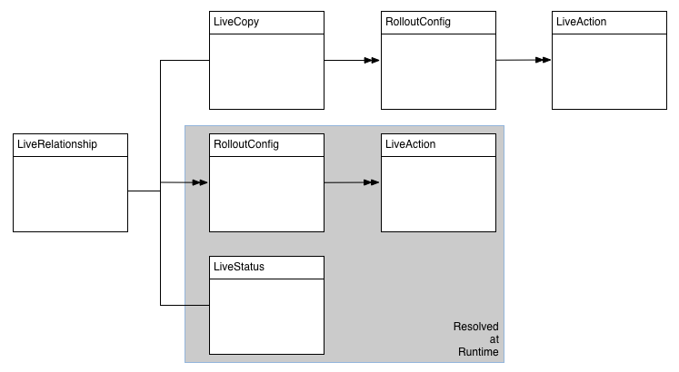

# Erweitern des Multi-Site-Managers {#extending-the-multi-site-manager}

In diesem Dokument erfahren Sie, wie Sie die Funktionen des Multi-Site-Managers erweitern können. Es werden die folgenden Themen behandelt.

* Erfahren Sie mehr über die wichtigsten MSM-Java-APIs
* Erstellen Sie eine neue Synchronisierungsaktion, die in einer Rollout-Konfiguration verwendet werden kann
* Ändern Sie die Standardsprache und die Länder-Codes

>[!TIP]
>
>Diese Seite ist im Kontext des Dokuments [Wiederverwenden von Inhalten: Multi Site Manager](/help/sites-cloud/administering/msm/overview.md) leichter zu verstehen.

>[!CAUTION]
>
>Der Multi-Site-Manager und die dazugehörige API werden beim Erstellen einer Website verwendet und sind daher ausschließlich für die Nutzung in einer Autorenumgebung gedacht.

## Überblick über die Java-API {#overview-of-the-java-api}

Multi Site Manager umfasst die folgenden Pakete:

* [com.day.cq.wcm.msm.api](https://developer.adobe.com/experience-manager/reference-materials/6-5/javadoc/com/day/cq/wcm/msm/api/package-frame.html)
* [com.day.cq.wcm.msm.commons](https://developer.adobe.com/experience-manager/reference-materials/6-5/javadoc/com/day/cq/wcm/msm/commons/package-frame.html)

Die wichtigsten MSM-API-Objekte interagieren wie folgt (siehe auch den Abschnitt [Verwendete Begriffe](/help/sites-cloud/administering/msm/overview.md#terms-used)):



* **`Blueprint`** - Ein `Blueprint` (wie in der [Blueprint-Konfiguration](/help/sites-cloud/administering/msm/overview.md#source-blueprints-and-blueprint-configurations)) legt die Seiten fest, von denen eine Live Copy Inhalte erben kann.

  

   * Die Verwendung einer Blueprint-Konfiguration (`Blueprint`) ist optional, aber:

      * Sie ermöglicht es Autorinnen und Autoren, die **Rollout**-Option auf der Quelle zu nutzen, um Änderungen explizit an Live Copies zu pushen, die Inhalte von dieser Quelle erben.
      * Sie ermöglicht es Autorinnen und Autoren, **Site erstellen** zu nutzen, wodurch Benutzende einfach Sprachen auswählen und die Struktur der Live Copy konfigurieren können.
      * Sie definiert die standardmäßige Rollout-Konfiguration für alle resultierenden Live Copies.

* **`LiveRelationship`** - Die `LiveRelationship` legt die Verbindung (Beziehung) zwischen einer Ressource im Live Copy-Zweig und der entsprechenden Quelle/Blueprint-Ressource fest.

   * Die Beziehungen werden bei der Umsetzung der Vererbung und des Rollouts genutzt.
   * `LiveRelationship`-Objekte bieten Zugriff (Verweise) auf die Rollout-Konfigurationen (`RolloutConfig`), `LiveCopy` und `LiveStatus`-Objekte, die mit der Beziehung zusammenhängen.

   * Beispiel: Eine Live Copy wird unter `/content/copy/us` von der Quelle / dem Blueprint unter `/content/wknd/language-masters` erstellt. Die Ressourcen `/content/wknd/language-masters/en/jcr:content` und `/content/copy/us/en/jcr:content` bilden eine Beziehung.

* **`LiveCopy`**: Eine `LiveCopy` speichert die Konfigurationsdaten für die Beziehungen (`LiveRelationship`) zwischen den Live Copy-Ressourcen und ihren Quell-/Blueprint-Ressourcen.

   * Über die Klasse `LiveCopy` können Sie auf den Pfad der Seite, den Pfad der Quell-/Blueprint-Seite und die Rollout-Konfigurationen zugreifen und festlegen, ob die untergeordneten Seiten ebenfalls in der `LiveCopy` enthalten sind.

   * Ein `LiveCopy`-Knoten wird immer erstellt, wenn **Website erstellen** oder **Live Copy erstellen** genutzt wird.

* **`LiveStatus`**: `LiveStatus`-Objekte bieten Zugriff auf den Laufzeitstatus einer `LiveRelationship`. Sie können damit den Synchronisierungsstatus einer Live Copy abfragen.

* **`LiveAction`**: Eine `LiveAction` ist eine Aktion, die auf jeder Ressource ausgeführt wird, die am Rollout beteiligt ist.

   * `LiveAction`s werden nur von `RolloutConfig`s generiert.

* **`LiveActionFactory`**: Eine `LiveActionFactory` erstellt `LiveAction`-Objekte mit einer `LiveAction`-Konfiguration. Konfigurationen werden als Ressourcen im Repository gespeichert.

* **`RolloutConfig`**: Die `RolloutConfig` enthält eine Liste der `LiveActions`, die nach der Auslösung zum Einsatz kommen sollen. Die `LiveCopy` erbt die `RolloutConfig` und das Ergebnis befindet sich in der `LiveRelationship`.

   * Beim erstmaligen Einrichten einer Live Copy wird auch eine „`RolloutConfig`“ verwendet (die die `LiveAction`s auslöst).

## Erstellen einer neuen Synchronisierungsaktion {#creating-a-new-synchronization-action}

Sie können benutzerdefinierte Synchronisierungsaktionen zur Verwendung mit Ihren Rollout-Konfigurationen erstellen. Dies kann nützlich sein, wenn die [installierten Aktionen](/help/sites-cloud/administering/msm/live-copy-sync-config.md#installed-synchronization-actions) Ihre spezifischen Anwendungsanforderungen nicht erfüllen.

Erstellen Sie dazu zwei Klassen:

* eine Implementierung der Schnittstelle [`com.day.cq.wcm.msm.api.LiveAction`](https://developer.adobe.com/experience-manager/reference-materials/6-5/javadoc/com/day/cq/wcm/msm/api/LiveAction.html), die die Aktion ausführt
* eine OSGi-Komponente, die die [`com.day.cq.wcm.msm.api.LiveActionFactory`-](https://developer.adobe.com/experience-manager/reference-materials/6-5/javadoc/com/day/cq/wcm/msm/api/LiveActionFactory.html)-Schnittstelle implementiert und Instanzen der Klasse `LiveAction` erstellt

`LiveActionFactory` erstellt Instanzen der Klasse `LiveAction` für eine bestimmte Konfiguration:

* `LiveAction`-Klassen umfassen die folgenden Methoden:

   * `getName`: Gibt den Namen der Aktion zurück

      * Der Name wird verwendet, um auf die Aktion zu verweisen, z. B. in Rollout-Konfigurationen.

   * `execute`: Führt die Aufgabe der Aktion aus

* `LiveActionFactory`-Klassen umfassen die folgenden Mitglieder:

   * `LIVE_ACTION_NAME`: Ein Feld, das den Namen der zugehörigen `LiveAction` enthält.

      * Dieser Name muss mit dem Wert übereinstimmen, der von der Methode `getName` der `LiveAction`-Klasse zurückgegeben wird.

   * `createAction`: Erstellt eine Instanz der `LiveAction`

      * Der optionale Parameter `Resource` kann verwendet werden, um Konfigurationsdaten bereitzustellen.

   * `createsAction`: Gibt den Namen der zugehörigen `LiveAction` zurück.

### Zugreifen auf den LiveAction-Konfigurationsknoten {#accessing-the-liveaction-configuration-node}

Mit dem `LiveAction`-Konfigurationsknoten im Repository können Sie Informationen speichern, die das Laufzeitverhalten der `LiveAction`-Instanz beeinflussen. Der Knoten im Repository, in dem die `LiveAction`-Konfiguration gespeichert ist, steht dem `LiveActionFactory`-Objekt zur Laufzeit zur Verfügung. Somit können Sie Eigenschaften zum Konfigurationsknoten hinzufügen und sie bei Bedarf in Ihrer `LiveActionFactory`-Implementierung nutzen.

Beispielsweise muss eine `LiveAction` den Namen der Blueprint-Autorinnen und -autoren speichern. Eine Eigenschaft des Konfigurationsknotens umfasst den Eigenschaftsnamen der Blueprint-Seite, in der die Informationen gespeichert werden. Zur Laufzeit ruft die `LiveAction` den Eigenschaftsnamen von der Konfiguration ab und erhält dann den Eigenschaftswert.

Der Parameter der Methode [`LiveActionFactory.createAction`](https://developer.adobe.com/experience-manager/reference-materials/6-5/javadoc/com/day/cq/wcm/msm/api/LiveActionFactory.html) ist ein `Resource`-Objekt. Dieses `Resource`-Objekt dient als `cq:LiveSyncAction`-Knoten für diese Live-Aktion bei der Rollout-Konfiguration.

Siehe [Erstellen einer Rollout-Konfiguration](/help/sites-cloud/administering/msm/live-copy-sync-config.md#creating-a-rollout-configuration) für weitere Informationen.

Wie bei Konfigurationsknoten gewohnt, sollten Sie ihn an ein `ValueMap`-Objekt anpassen:

```java
public LiveAction createAction(Resource resource) throws WCMException {
        ValueMap config;
        if (resource == null || resource.adaptTo(ValueMap.class) == null) {
            config = new ValueMapDecorator(Collections.<String, Object>emptyMap());
        } else {
            config = resource.adaptTo(ValueMap.class);
        }
        return new MyLiveAction(config, this);
}
```

### Zugreifen auf Zielknoten, Quellknoten und die LiveRelationship {#accessing-target-nodes-source-nodes-and-the-liverelationship}

Die folgenden Objekte sind als Parameter der `execute`-Methode vom `LiveAction`-Objekt verfügbar:

* ein [`Resource`-](https://developer.adobe.com/experience-manager/reference-materials/cloud-service/javadoc/org/apache/sling/api/resource/Resource.html)-Objekt, das die Quelle der Live Copy repräsentiert
* ein `Resource`-Objekt, das das Ziel der Live Copy repräsentiert.
* das [`LiveRelationship`-](https://developer.adobe.com/experience-manager/reference-materials/cloud-service/javadoc/com/day/cq/wcm/msm/api/LiveRelationship.html)-Objekt für die Live Copy
   * Der Wert `autoSave` gibt an, ob die `LiveAction` am Repository vorgenommene Änderungen speichern soll
   * Der `reset`-Wert legt den Rollout-Modus für das Zurücksetzen fest.

Über diese Objekte können Sie alle Daten zur `LiveCopy` abrufen. Mit den `Resource`-Objekten können Sie auch die `ResourceResolver`-, `Session`- und `Node`-Objekte abrufen. Diese Objekte sind bei der Bearbeitung der Repository-Inhalte hilfreich:

In der ersten Zeile des folgenden Codes ist das `Resource`-Objekt der Quellseite die Quelle:

```java
ResourceResolver resolver = source.getResourceResolver();
Session session = resolver.adaptTo(javax.jcr.Session.class);
Node sourcenode = source.adaptTo(javax.jcr.Node.class);
```

>[!NOTE]
>
>Die `Resource`-Argumente können `null`- oder `Resources`-Objekte sein, die sich nicht an `Node`-Objekte anpassen, z. B. [`NonExistingResource`](https://developer.adobe.com/experience-manager/reference-materials/cloud-service/javadoc/org/apache/sling/api/resource/NonExistingResource.html)-Objekte.

## Erstellen einer neuen Rollout-Konfiguration {#creating-a-new-rollout-configuration}

Sie können eine Rollout-Konfiguration erstellen, wenn die installierten Rollout-Konfigurationen Ihren Anwendungsanforderungen nicht entsprechen. Führen Sie dazu die folgenden zwei Schritte aus:

* [Erstellen Sie die Rollout-Konfiguration](#create-the-rollout-configuration)
* [Fügen Sie Synchronisierungsaktionen zur Rollout-Konfiguration hinzu](#add-synchronization-actions-to-the-rollout-configuration)

Die neue Rollout-Konfiguration steht dann zur Verfügung, wenn Sie die Rollout-Konfigurationen auf einer Blueprint oder einer Live Copy-Seite festlegen.

>[!TIP]
>
>Informationen hierzu finden Sie auch unter [Best Practices zum Anpassen von Rollouts](/help/sites-cloud/administering/msm/best-practices.md#customizing-rollouts).

### Erstellen der Rollout-Konfiguration {#create-the-rollout-configuration}

So erstellen Sie eine Rollout-Konfiguration:

1. Öffnen Sie CRXDE Lite unter `https://<host>:<port>/crx/de`.

1. Navigieren Sie zu `/apps/msm/<your-project>/rolloutconfigs`, der benutzerdefinierten Version von `/libs/msm/wcm/rolloutconfigs` Ihres Projekts.

   * Wenn dies Ihre erste Konfiguration ist, muss die Verzweigung `/libs` als Vorlage verwendet werden, die neue Verzweigung unter `/apps` zu erstellen.

1. Erstellen Sie an diesem Speicherort einen Knoten mit den folgenden Eigenschaften:

   * **Name**: Der Knotenname der Rollout-Konfiguration, beispielsweise `contentCopy` oder `workflow`
   * **Typ**: `cq:RolloutConfig`

1. Fügen Sie diesem Knoten die folgenden Eigenschaften hinzu:

   * **Name**: `jcr:title`
     **Typ**: `String`
     **Wert**: Ein bezeichnender Titel, der in der Benutzeroberfläche angezeigt wird

   * **Name**: `jcr:description`
     **Typ**: `String`
     **Wert**: Eine optionale Beschreibung.

   * **Name**: `cq:trigger`
     **Typ**: `String`
     **Wert**: Der zu verwendende [Rollout-Trigger](/help/sites-cloud/administering/msm/live-copy-sync-config.md#rollout-triggers)
      * `rollout`
      * `modification`
      * `publish`
      * `deactivate`

1. Klicken Sie auf **Alle speichern**.

### Hinzufügen von Synchronisierungsaktionen zur Rollout-Konfiguration {#add-synchronization-actions-to-the-rollout-configuration}

Rollout-Konfigurationen werden unter dem [Rollout-Konfigurationsknoten](#create-the-rollout-configuration) gespeichert, den Sie unter dem `/apps/msm/<your-project>/rolloutconfigs`-Knoten erstellt haben.

Fügen Sie untergeordnete Knoten des Typs `cq:LiveSyncAction` hinzu, um Synchronisierungsaktionen zur Rollout-Konfiguration hinzuzufügen. Die Reihenfolge der Synchronisierungsaktionsknoten bestimmt die Reihenfolge, in der die Aktionen durchgeführt werden.

1. Wählen Sie in CRXDE Lite Ihren [Rollout-Konfigurationsknoten](#create-the-rollout-configuration) aus, z. B. `/apps/msm/myproject/rolloutconfigs/myrolloutconfig`.

1. Erstellen Sie einen Knoten mit den folgenden Knoteneigenschaften:

   * **Name**: Der Knotenname der Synchronisierungsaktion
      * Der Name muss dem **Aktionsnamen** in der Tabelle unter [Synchronisierungsaktionen](/help/sites-cloud/administering/msm/live-copy-sync-config.md#installed-synchronization-actions) entsprechen, z. B. `contentCopy` oder `workflow`.
   * **Typ**: `cq:LiveSyncAction`

1. Fügen Sie so viele Synchronisierungsaktionsknoten hinzu wie erforderlich und konfigurieren Sie sie.

1. Ordnen Sie die Aktionsknoten in der Reihenfolge an, in der sie ausgeführt werden sollen.
   * Der oberste Aktionsknoten wird zuerst ausgeführt.

## Erstellen und Verwenden einer einfachen LiveActionFactory-Klasse {#creating-and-using-a-simple-liveactionfactory-class}

Mit den Verfahren, die in diesem Abschnitt erläutert werden, können Sie eine `LiveActionFactory` entwickeln und in einer Rollout-Konfiguration verwenden. Für die Entwicklung und Bereitstellung der `LiveActionFactory` werden Maven und Eclipse verwendet:

1. [Erstellen Sie das Maven-Projekt](#create-the-maven-project) und importieren Sie es in Eclipse.
1. [Fügen Sie Abhängigkeiten](#add-dependencies-to-the-pom-file) zur POM-Datei hinzu.
1. [Implementieren Sie die `LiveActionFactory`-Schnittstelle](#implement-liveactionfactory) und stellen Sie das OSGi-Bundle bereit.
1. [Erstellen Sie die Rollout-Konfiguration](#create-the-example-rollout-configuration).
1. [Erstellen Sie die Live Copy](#create-the-live-copy).

[Das Maven-Projekt und der Quell-Code der Java-Klasse sind im öffentlichen Git-Repository verfügbar.](https://github.com/Adobe-Marketing-Cloud/experiencemanager-java-msmrollout)

### Erstellen des Maven-Projekts {#create-the-maven-project}

Das folgende Verfahren setzt voraus, dass Sie das `adobe-public`-Profil zu Ihrer Maven-Einstellungsdatei hinzugefügt haben.

* Weitere Informationen zum Profil „adobe-public“ finden Sie unter [Abrufen des Inhaltspaket-Maven-Plug-ins](/help/implementing/developing/tools/maven-plugin.md#obtaining-the-content-package-maven-plugin)
* Weitere Informationen zur Maven-Einstellungsdatei finden Sie in der [Referenz zu den Einstellungen](https://maven.apache.org/settings.html) für Maven.

1. Öffnen Sie eine Terminal- oder Befehlszeilensitzung und ändern Sie das Verzeichnis in den Ort, an dem Sie das Projekt erstellen möchten.
1. Geben Sie den folgenden Befehl ein:

   ```text
   mvn archetype:generate -DarchetypeGroupId=com.day.jcr.vault -DarchetypeArtifactId=multimodule-content-package-archetype -DarchetypeVersion=1.0.0 -DarchetypeRepository=adobe-public-releases
   ```

1. Geben Sie in der interaktiven Eingabeaufforderung die folgenden Werte an:

   * **`groupId`**: `com.adobe.example.msm`
   * **`artifactId`**: `MyLiveActionFactory`
   * **`version`**: `1.0-SNAPSHOT`
   * **`package`**: `MyPackage`
   * **`appsFolderName`**: `myapp`
   * **`artifactName`**: `MyLiveActionFactory package`
   * **`packageGroup`**: `myPackages`

1. Starten Sie Eclipse und [importieren Sie das Maven-Projekt](/help/implementing/developing/tools/eclipse.md#import-the-maven-project-into-eclipse).

### Hinzufügen von Abhängigkeiten zur POM-Datei {#add-dependencies-to-the-pom-file}

Fügen Sie Abhängigkeiten hinzu, damit der Eclipse-Compiler auf die Klassen verweisen kann, die im `LiveActionFactory`-Code verwendet werden.

1. Wählen Sie im Projekt-Explorer von Eclipse folgende Datei aus `MyLiveActionFactory/pom.xml`.

1. Klicken Sie im Editor auf die Registerkarte `pom.xml` und suchen Sie den Abschnitt `project/dependencyManagement/dependencies`.

1. Fügen Sie den folgenden XML-Code zum Element `dependencyManagement` hinzu und speichern Sie dann die Datei.

   ```xml
    <dependency>
     <groupId>com.day.cq.wcm</groupId>
     <artifactId>cq-msm-api</artifactId>
     <version>5.6.2</version>
     <scope>provided</scope>
    </dependency>
    <dependency>
     <groupId>org.apache.sling</groupId>
     <artifactId>org.apache.sling.api</artifactId>
     <version>2.4.3-R1488084</version>
     <scope>provided</scope>
    </dependency>
    <dependency>
     <groupId>com.day.cq.wcm</groupId>
     <artifactId>cq-wcm-api</artifactId>
     <version>5.6.6</version>
     <scope>provided</scope>
    </dependency>
    <dependency>
     <groupId>org.apache.sling</groupId>
     <artifactId>org.apache.sling.commons.json</artifactId>
     <version>2.0.6</version>
     <scope>provided</scope>
    </dependency>
    <dependency>
     <groupId>com.day.cq</groupId>
     <artifactId>cq-commons</artifactId>
     <version>5.6.4</version>
     <scope>provided</scope>
    </dependency>
    <dependency>
     <groupId>org.apache.sling</groupId>
     <artifactId>org.apache.sling.jcr.jcr-wrapper</artifactId>
     <version>2.0.0</version>
     <scope>provided</scope>
    </dependency>
    <dependency>
     <groupId>com.day.cq</groupId>
     <artifactId>cq-commons</artifactId>
     <version>5.6.4</version>
     <scope>provided</scope>
    </dependency>
   ```

1. Öffnen Sie im **Projekt-Explorer** unter `MyLiveActionFactory-bundle/pom.xml` die POM-Datei für das Bundle.

1. Klicken Sie im Editor auf die Registerkarte `pom.xml` und suchen Sie den Abschnitt project/dependencies. Fügen Sie den folgenden XML-Code zum Element „dependencies“ hinzu und speichern Sie dann die Datei:

   ```xml
    <dependency>
     <groupId>com.day.cq.wcm</groupId>
     <artifactId>cq-msm-api</artifactId>
    </dependency>
    <dependency>
     <groupId>org.apache.sling</groupId>
     <artifactId>org.apache.sling.api</artifactId>
    </dependency>
    <dependency>
     <groupId>com.day.cq.wcm</groupId>
     <artifactId>cq-wcm-api</artifactId>
    </dependency>
    <dependency>
     <groupId>org.apache.sling</groupId>
     <artifactId>org.apache.sling.commons.json</artifactId>
    </dependency>
    <dependency>
     <groupId>com.day.cq</groupId>
     <artifactId>cq-commons</artifactId>
    </dependency>
    <dependency>
     <groupId>org.apache.sling</groupId>
     <artifactId>org.apache.sling.jcr.jcr-wrapper</artifactId>
    </dependency>
    <dependency>
     <groupId>com.day.cq</groupId>
     <artifactId>cq-commons</artifactId>
    </dependency>
   ```

### Implementieren von LiveActionFactory {#implement-liveactionfactory}

Die folgende `LiveActionFactory`-Klasse implementiert eine `LiveAction`, die Nachrichten zu Quell- und Zielseiten protokolliert und die Eigenschaft `cq:lastModifiedBy` vom Quell- zum Zielknoten kopiert. Der Name der Live-Aktion lautet `exampleLiveAction`.

1. Klicken Sie Projekt-Explorer von Eclipse mit der rechten Maustaste auf das Paket `MyLiveActionFactory-bundle/src/main/java/com.adobe.example.msm` und klicken Sie auf **Neu** > **Klasse**.

1. Geben Sie als **Name** den Wert `ExampleLiveActionFactory` ein und klicken Sie dann auf **Fertig**.

1. Öffnen Sie die Datei `ExampleLiveActionFactory.java`, ersetzen Sie den Inhalt durch den folgenden Code und speichern Sie die Datei.

   ```java
   package com.adobe.example.msm;
   
   import java.util.Collections;
   
   import org.apache.felix.scr.annotations.Component;
   import org.apache.felix.scr.annotations.Property;
   import org.apache.felix.scr.annotations.Service;
   import org.apache.sling.api.resource.Resource;
   import org.apache.sling.api.resource.ResourceResolver;
   import org.apache.sling.api.resource.ValueMap;
   import org.apache.sling.api.wrappers.ValueMapDecorator;
   import org.apache.sling.commons.json.io.JSONWriter;
   import org.apache.sling.commons.json.JSONException;
   
   import org.slf4j.Logger;
   import org.slf4j.LoggerFactory;
   
   import javax.jcr.Node;
   import javax.jcr.RepositoryException;
   import javax.jcr.Session;
   
   import com.day.cq.wcm.msm.api.ActionConfig;
   import com.day.cq.wcm.msm.api.LiveAction;
   import com.day.cq.wcm.msm.api.LiveActionFactory;
   import com.day.cq.wcm.msm.api.LiveRelationship;
   import com.day.cq.wcm.api.WCMException;
   
   @Component(metatype = false)
   @Service
   public class ExampleLiveActionFactory implements LiveActionFactory<LiveAction> {
    @Property(value="exampleLiveAction")
    static final String actionname = LiveActionFactory.LIVE_ACTION_NAME;
   
    public LiveAction createAction(Resource config) {
     ValueMap configs;
     /* Adapt the config resource to a ValueMap */
           if (config == null || config.adaptTo(ValueMap.class) == null) {
               configs = new ValueMapDecorator(Collections.<String, Object>emptyMap());
           } else {
               configs = config.adaptTo(ValueMap.class);
           }
   
     return new ExampleLiveAction(actionname, configs);
    }
    public String createsAction() {
     return actionname;
    }
    /************* LiveAction ****************/
    private static class ExampleLiveAction implements LiveAction {
     private String name;
     private ValueMap configs;
     private static final Logger log = LoggerFactory.getLogger(ExampleLiveAction.class);
   
     public ExampleLiveAction(String nm, ValueMap config){
      name = nm;
      configs = config;
     }
   
     public void execute(Resource source, Resource target,
       LiveRelationship liverel, boolean autoSave, boolean isResetRollout)
         throws WCMException {
   
      String lastMod = null;
   
      log.info(" *** Executing ExampleLiveAction *** ");
   
      /* Determine if the LiveAction is configured to copy the cq:lastModifiedBy property */
      if ((Boolean) configs.get("repLastModBy")){
   
       /* get the source's cq:lastModifiedBy property */
       if (source != null && source.adaptTo(Node.class) !=  null){
        ValueMap sourcevm = source.adaptTo(ValueMap.class);
        lastMod = sourcevm.get(com.day.cq.wcm.msm.api.MSMNameConstants.PN_PAGE_LAST_MOD_BY, String.class);
       }
   
       /* set the target node's la-lastModifiedBy property */
       Session session = null;
       if (target != null && target.adaptTo(Node.class) !=  null){
        ResourceResolver resolver = target.getResourceResolver();
        session = resolver.adaptTo(javax.jcr.Session.class);
        Node targetNode;
        try{
         targetNode=target.adaptTo(javax.jcr.Node.class);
         targetNode.setProperty("la-lastModifiedBy", lastMod);
         log.info(" *** Target node lastModifiedBy property updated: {} ***",lastMod);
        }catch(Exception e){
         log.error(e.getMessage());
        }
       }
       if(autoSave){
        try {
         session.save();
        } catch (Exception e) {
         try {
          session.refresh(true);
         } catch (RepositoryException e1) {
          e1.printStackTrace();
         }
         e.printStackTrace();
        }
       }
      }
     }
     public String getName() {
      return name;
     }
   
     /************* Deprecated *************/
     @Deprecated
     public void execute(ResourceResolver arg0, LiveRelationship arg1,
       ActionConfig arg2, boolean arg3) throws WCMException {
     }
     @Deprecated
     public void execute(ResourceResolver arg0, LiveRelationship arg1,
       ActionConfig arg2, boolean arg3, boolean arg4)
         throws WCMException {
     }
     @Deprecated
     public String getParameterName() {
      return null;
     }
     @Deprecated
     public String[] getPropertiesNames() {
      return null;
     }
     @Deprecated
     public int getRank() {
      return 0;
     }
     @Deprecated
     public String getTitle() {
      return null;
     }
     @Deprecated
     public void write(JSONWriter arg0) throws JSONException {
     }
    }
   }
   ```

1. Ändern Sie über eine Terminal- oder Befehlszeilensitzung das Verzeichnis in das Verzeichnis `MyLiveActionFactory` (das Maven-Projektverzeichnis). Geben Sie dann den folgenden Befehl ein:

   ```shell
   mvn -PautoInstallPackage clean install
   ```

1. Die AEM-Datei `error.log` sollte anzeigen, dass das Bundle gestartet wurde, sichtbar in den Protokollen unter `https://<host>:<port>/system/console/status-slinglogs`.

   ```text
   13.08.2013 14:34:55.450 *INFO* [OsgiInstallerImpl] com.adobe.example.msm.MyLiveActionFactory-bundle BundleEvent RESOLVED
   13.08.2013 14:34:55.451 *INFO* [OsgiInstallerImpl] com.adobe.example.msm.MyLiveActionFactory-bundle BundleEvent STARTING
   13.08.2013 14:34:55.451 *INFO* [OsgiInstallerImpl] com.adobe.example.msm.MyLiveActionFactory-bundle BundleEvent STARTED
   13.08.2013 14:34:55.453 *INFO* [OsgiInstallerImpl] com.adobe.example.msm.MyLiveActionFactory-bundle Service [com.adobe.example.msm.ExampleLiveActionFactory,2188] ServiceEvent REGISTERED
   13.08.2013 14:34:55.454 *INFO* [OsgiInstallerImpl] org.apache.sling.audit.osgi.installer Started bundle com.adobe.example.msm.MyLiveActionFactory-bundle [316]
   ```

### Erstellen der Rollout-Beispielkonfiguration {#create-the-example-rollout-configuration}

Erstellen Sie die MSM-Rollout-Konfiguration, die die von Ihnen erstellte `LiveActionFactory` nutzt:

1. Erstellen und konfigurieren Sie eine [Rollout-Konfiguration über das Standardverfahren](/help/sites-cloud/administering/msm/live-copy-sync-config.md#creating-a-rollout-configuration) mit den folgenden Eigenschaften:

   * **Titel**: Beispiel-Rollout-Konfiguration
   * **Name**: examplerolloutconfig
   * **cq:trigger**: `publish`

### Hinzufügen der Live-Aktion zur Rollout-Beispielkonfiguration {#add-the-live-action-to-the-example-rollout-configuration}

Konfigurieren Sie die beim vorhergehenden Verfahren erstellte Rollout-Konfiguration so, dass sie die Klasse `ExampleLiveActionFactory` verwendet.

1. Öffnen Sie CRXDE Lite.

1. Erstellen Sie den entsprechenden Knoten unter `/apps/msm/rolloutconfigs/examplerolloutconfig/jcr:content`:

   * **Name**: `exampleLiveAction`
   * **Typ**: `cq:LiveSyncAction`

1. Klicken Sie auf **Alle speichern**.

1. Wählen Sie den `exampleLiveAction`-Knoten und fügen Sie eine Eigenschaft hinzu, die der `ExampleLiveAction`-Klasse mitteilt, dass die `cq:LastModifiedBy`-Eigenschaft von der Quelle zum Zielknoten repliziert werden sollte.

   * **Name**: `repLastModBy`
   * **Typ**: `Boolean`
   * **Wert**: `true`

1. Klicken Sie auf **Alle speichern**.

### Erstellen der Live Copy {#create-the-live-copy}

[Erstellen Sie eine Live Copy](/help/sites-cloud/administering/msm/creating-live-copies.md#creating-a-live-copy-of-a-page) des Zweigs „English/Products“ der WKND-Referenz-Site mit Ihrer Rollout-Konfiguration:

* **Quelle**: `/content/wknd/language-masters/en/products`

* **Rollout-Konfiguration**: Rollout-Beispielkonfiguration

Aktivieren Sie die (englische) Seite **Products** des Quellzweigs und beobachten Sie die Protokollnachrichten, die von der Klasse `LiveAction` erzeugt werden:

```xml
16.08.2013 10:53:33.055 *INFO* [Thread-444535] com.adobe.example.msm.ExampleLiveActionFactory$ExampleLiveAction  ***ExampleLiveAction has been executed.***
16.08.2013 10:53:33.055 *INFO* [Thread-444535] com.adobe.example.msm.ExampleLiveActionFactory$ExampleLiveAction  ***Target node lastModifiedBy property updated: admin ***
```

## Ändern von Sprachnamen und Standardländern {#changing-language-names-and-default-countries}

AEM verwendet einen Standardsatz von Sprach- und Länder-Codes.

* Der standardmäßige Sprach-Code ist der aus zwei Buchstaben bestehende Code in Kleinbuchstaben gemäß ISO-639-1.
* Der standardmäßige Länder-Code ist der aus zwei Klein- oder Großbuchstaben bestehende Code gemäß ISO 3166.

MSM bestimmt anhand einer gespeicherten Liste von Sprach- und Ländercodes den Namen des Landes, das mit dem Namen der Sprachversion Ihrer Seite verknüpft ist. Die folgenden Elemente der Liste können Sie bei Bedarf ändern:

* Sprachtitel
* Ländernamen
* Standardländer für Sprachen (bei Codes wie `en`, `de` oder anderen)

Die Sprachliste ist unter dem Knoten `/libs/wcm/core/resources/languages` gespeichert. Jeder untergeordnete Knoten steht für eine Sprache oder ein Sprachland:

* Der Name des Knotens ist der Sprach-Code (z. B. `en` oder `de`) oder der „Sprache_Land“-Code (z. B. `en_us` oder `de_ch`).

* In der Eigenschaft `language` des Knotens wird der volle Name der Sprache für den Code gespeichert.
* In der Eigenschaft `country` des Knotens wird der volle Name des Landes für den Code gespeichert.
* Wenn der Knotenname nur aus einem Sprach-Code besteht (z. B. `en`), ist die Ländereigenschaft `*` und die zusätzliche Eigenschaft `defaultCountry` speichert den Code des Sprachlandes, um das zu verwendende Land anzugeben.


So bearbeiten Sie die Sprachen:

1. Öffnen Sie CRXDE Lite.
1. Wählen Sie den Ordner `/apps` aus und klicken Sie auf **Erstellen** und dann auf **Ordner erstellen**.

1. Geben Sie dem neuen Ordner den Namen `wcm`.

1. Wiederholen Sie diesen Schritt, um die Ordnerstruktur `/apps/wcm/core` zu erstellen. Erstellen Sie in `sling:Folder` einen Knoten des Typs `core` mit dem Namen `resources`.

1. Klicken Sie mit der rechten Maustaste auf den Knoten `/libs/wcm/core/resources/languages` und klicken Sie auf **Kopieren**.
1. Klicken Sie mit der rechten Maustaste auf den Ordner `/apps/wcm/core/resources` und klicken Sie auf **Einfügen**. Ändern Sie die untergeordneten Knoten nach Bedarf.
1. Klicken Sie auf **Alle speichern**.
1. Klicken Sie auf **Tools** > **Vorgänge** > **Web-Konsole**. Klicken Sie in dieser Konsole auf **OSGi** > **Konfiguration**.
1. Suchen Sie **Day CQ WCM Language Manager**, klicken Sie darauf und ändern Sie den Wert von **Language List** in `/apps/wcm/core/resources/languages`. Klicken Sie dann auf **Speichern**.

   

## Konfigurieren von MSM-Sperren für Seiteneigenschaften {#configuring-msm-locks-on-page-properties}

Beim Erstellen einer benutzerdefinierten Seiteneigenschaft müssen Sie ggf. überlegen, ob die neue Eigenschaft für den Rollout auf allen Live Copies qualifiziert sein soll.

Beispiel: Zwei neue Seiteneigenschaften werden hinzugefügt:

* Kontakt-E-Mail:

   * Diese Eigenschaft muss nicht ausgerollt werden, da sie in jedem Land (oder bei jeder Marke usw.) anders ausfällt.

* Wichtigster visueller Stil:

   * Die Projektanforderung gibt das Ausrollen dieser Eigenschaft vor, da sie (in der Regel) in allen Ländern (oder bei allen Marken usw.) gleich ist.

Dann müssen Sie Folgendes sicherstellen:

* Kontakt-E-Mail:

   * ist aus den Rollout-Eigenschaften ausgeschlossen.
   * Siehe [Konfigurieren der Live Copy-Synchronisierung](/help/sites-cloud/administering/msm/live-copy-sync-config.md#excluding-properties-and-node-types-from-synchronization) für weitere Informationen.

* Wichtigster visueller Stil:

   * Stellen Sie sicher, dass diese Eigenschaft nur bearbeitet werden darf, wenn die Vererbung abgebrochen wurde.
   * Stellen Sie außerdem sicher, dass Sie dann die Vererbung erneut aktivieren können. Dies wird gesteuert, indem Sie auf die Links für Ketten/unterbrochene Ketten klicken, die sich umschalten lassen, um den Status der Verbindung anzuzeigen.

Ob für eine Seiteneigenschaft ein Rollout durchgeführt werden muss und daher beim Bearbeiten die Vererbung abgebrochen/reaktiviert werden kann, wird durch die folgende Dialogeigenschaft gesteuert:

* `cq-msm-lockable`

   * Dies erstellt das Ketten-Linksymbol im Dialogfeld.
   * Es lässt die Bearbeitung nur zu, wenn die Vererbung abgebrochen wird (also der Ketten-Link gebrochen ist).
   * Es gilt nur für die erste untergeordnete Ebene der Ressource
      * **Typ**: `String`
      * **Wert**: berücksichtigt den Namen der betroffenen Eigenschaft (und ist vergleichbar mit dem Wert der Eigenschaft `name`)
         * Ein Beispiel finden Sie unter
           `/libs/foundation/components/page/cq:dialog/content/items/tabs/items/basic/items/column/items/title/items/title`

Wenn `cq-msm-lockable` definiert wurde, interagiert das Unterbrechen/Schließen der Kette mit MSM wie folgt:

* Wenn der Wert von `cq-msm-lockable` wie folgt ist:

   * **Relativ** (beispielsweise `myProperty` oder `./myProperty`)

      * Durch Unterbrechen der Kette wird die Eigenschaft aus `cq:propertyInheritanceCancelled` hinzugefügt und entfernt.

   * **Absolut** (beispielsweise `/image`)

      * Dann führt das Unterbrechen der Kette zu einem Abbruch der Vererbung, indem das `cq:LiveSyncCancelled`-Mixin auf `./image` und `cq:isCancelledForChildren` auf `true` gesetzt wird.

      * Das Schließen der Kette führt zu einer Wiederherstellung der Vererbung.

>[!NOTE]
>
>`cq-msm-lockable` gilt für die erste untergeordnete Ebene der Ressource, die bearbeitet werden soll, und funktioniert nicht auf einem Vorläuferelement auf einer tieferen Ebene, unabhängig davon, ob der Wert als absolut oder relativ definiert ist.

>[!NOTE]
>
>Wenn Sie die Vererbung erneut aktivieren, wird die Eigenschaft der Live Copy-Seite nicht automatisch mit der Quelleigenschaft synchronisiert. Sie können ggf. manuell eine Synchronisierung anfordern.
