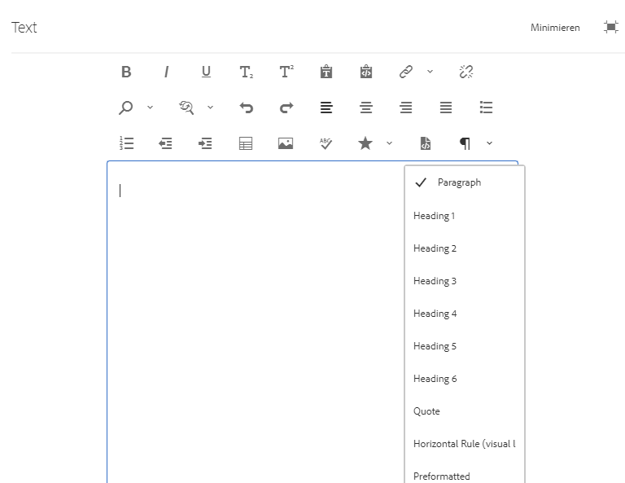
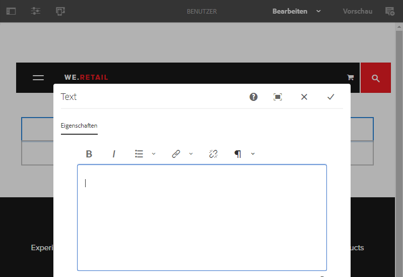

# Konfigurieren des Rich-Text-Editors {#configure-the-rich-text-editor}

Der Rich-Text-Editor (RTE) bietet Autoren eine große Bandbreite an Funktionen zum Bearbeiten von Textinhalten. Symbole, Auswahlfelder, Symbolleiste und Menüs werden für eine WYSIWYG-Textbearbeitung bereitgestellt. Administratoren können den RTE konfigurieren, um die in den Authoring-Komponenten verfügbaren Funktionen zu aktivieren, zu deaktivieren und zu erweitern. Erfahren Sie, wie Autoren [RTE zum Erstellen von Web-Inhalten verwenden](/help/sites-cloud/authoring/page-editor/rich-text-editor.md).

Die RTE-Konzepte und -Schritte, die zur Konfiguration erforderlich sind, sind unten aufgeführt.

| Grundlegendes zu RTE-Konzepten | Aktivieren erforderlicher Funktionen | Konfigurieren einzelner Funktionen |
|---|---|---|
| [Grundlegendes zur Benutzeroberfläche](#understand-rte-ui) | [Grundlegendes zu und Festlegen von Konfigurationsspeicherorten](#understand-the-configuration-paths-and-locations) | [Konfigurieren von Plug-ins](#enable-rte-functionalities-by-activating-plug-ins) |
| [Arten von Bearbeitungsmodi](#editingmodes) | [Aktivieren von Plug-ins](/help/implementing/developing/extending/configure-rich-text-editor-plug-ins.md#activateplugin) | [Festlegen von Funktionseigenschaften](#aboutplugins) |
| [Wissenswertes über Plug-ins](#aboutplugins) | [Konfigurieren der RTE-Symbolleisten](#dialogfullscreen) | [Konfigurieren der Einfügemodi](/help/implementing/developing/extending/configure-rich-text-editor-plug-ins.md#textstyles) |

>[!NOTE]
>
>Der in diesem Dokument beschriebene RTE beschreibt den im Seiteneditor verfügbaren RTE. Wenn Sie den modernen universellen Editor verwenden, finden Sie weitere Informationen im Dokument [Konfigurieren des RTE für den universellen Editor](/help/implementing/universal-editor/configure-rte.md).

## Grundlegendes zur Benutzeroberfläche, die Autoren zur Verfügung steht {#understand-rte-ui}

Die RTE-Benutzeroberfläche bietet ein [responsives Design](/help/sites-cloud/authoring/page-editor/responsive-layout.md) für die Authoring-Umgebung. Die Benutzeroberfläche wurde für die Verwendung auf Touch- und Desktop-Geräten entwickelt.



*Abbildung: Rich-Text-Editor-Symbolleiste mit allen verfügbaren Optionen aktiviert.*

Die Symbolleiste enthält die Optionen für das WYSIWYG-Authoring-Erlebnis. [!DNL Experience Manager]-Administratoren können die in der Symbolleiste auf der Benutzeroberfläche verfügbaren Optionen konfigurieren. In [!DNL Experience Manager] stehen standardmäßig umfassende Bearbeitungsoptionen zur Verfügung. Entwickler können [!DNL Experience Manager] anpassen, um weitere Bearbeitungsoptionen hinzuzufügen.

## Verschiedene Bearbeitungsmodi {#editingmodes}

Autoren können in [!DNL Experience Manager] Textinhalte mithilfe der verschiedenen Komponentenmodi erstellen und bearbeiten. Die Symbolleistenoptionen für das Erstellen und Formatieren von Inhalten und das Anwendererlebnis von RTE-aktivierten Komponenten in verschiedenen Bearbeitungsmodi variieren je nach RTE-Konfiguration.

| Bearbeitungsmodus | Bearbeitungsbereich | Für die Aktivierung empfohlene Funktionen |
|--- |--- |--- |
| Inline | Bearbeitung im Kontext für schnelle, geringfügige Änderungen; Formatieren ohne Öffnen eines Dialogfelds. | Minimale RTE-Funktionen. |
| RTE-Vollbild | Füllt die gesamte Seite aus. | Alle erforderlichen RTE-Funktionen. |
| Dialogfeld | Dialogfeld, das oberhalb des Seiteninhalts angezeigt wird, jedoch nicht die gesamte Seite einnimmt. | Funktionen mit Bedacht aktivieren. |
| Dialogfeld-Vollbild | Wie im Vollbildmodus; enthält Dialogfelder neben dem RTE. | Alle erforderlichen RTE-Funktionen. |

>[!NOTE]
>
>Im Inline-Bearbeitungsmodus ist die Quellbearbeitungsfunktion nicht verfügbar. Im Vollbildmodus können Sie Bilder nicht per Drag-and-Drop verschieben. Alle anderen Funktionen sind in allen Modi verfügbar.

### Inline-Bearbeitung {#inline-editing}

Um den Inhalt auf einer Seite zu bearbeiten, öffnen Sie den Inhalt mit einem langsamen doppelten Klick. Eine kompakte Symbolleiste mit grundlegenden Optionen erscheint.


*Abbildung: Inline-Bearbeitung mit den grundlegenden Optionen in der Symbolleiste*

### Bearbeitung im Vollbildmodus {#full-screen-editing}

[!DNL Experience Manager]-Komponenten können im Vollbildmodus geöffnet werden. Dabei wird der Seiteninhalt ausgeblendet und der gesamte Bildschirm ausgefüllt. Die Bearbeitung im Vollbildmodus ist eine detaillierte Version der Inline-Bearbeitung, da sie die meisten Bearbeitungsmöglichkeiten bietet. Wenn Sie sich im Inline-Bearbeitungsmodus befinden, kann sie durch Klicken auf das Symbol  in der kompakten Symbolleiste geöffnet werden.

Im Dialogfeld-Vollbildmodus stehen neben einer detaillierten RTE-Symbolleiste auch die in einem Dialogfeld verfügbaren Optionen und Komponenten zur Verfügung. Dies gilt nur für ein Dialogfeld, das neben anderen Komponenten einen RTE enthält.


*Abbildung: Die detaillierte RTE-Symbolleiste beim Bearbeiten im Vollbildmodus.*

### Bearbeitung in einem Dialogfeld {#dialog-editing}

Wenn Sie auf eine Komponente doppelklicken, wird ein Dialogfeld zur Bearbeitung des Inhalts geöffnet. Das Dialogfeld wird über der vorhandenen Seite geöffnet. In bestimmten Fällen kann dieses Dialogfeld auch als Popup-Fenster geöffnet werden. Dies ist beispielsweise der Fall, wenn eine Textkomponente Teil einer Spalte in einem mehrspaltigen Seiten-Layout ist und zu wenig Platz für die Anzeige des Dialogfelds vorhanden ist.



*Abbildung: Dialogfeldbearbeitungsmodus.*

## Wissenswertes über RTE-Plug-ins und die zugehörigen Funktionen {#aboutplugins}

Die Funktionen werden über eine Reihe von Plug-ins zur Verfügung gestellt, jeweils mit:

* einer `features`-Eigenschaft, die

   * zur Aktivierung oder Deaktivierung der grundlegenden Funktionalität des jeweiligen Plug-ins verwendet werden kann.
   * mit einem standardisierten Verfahren konfiguriert wurde.

* Gegebenenfalls weitere Eigenschaften und Optionen, die eine spezielle Konfiguration erfordern.

Die grundlegenden RTE-Funktionen werden durch den Wert der Eigenschaft `features` in einem Knoten aktiviert oder deaktiviert, der spezifisch für das entsprechende Plug-in ist.

In der folgenden Tabelle sind die derzeit verfügbaren Plug-ins aufgelistet, mit Angabe von:

* Plug-in-IDs mit einem Link zur API-Dokumentation. Die ID wird beim [Aktivieren eines Plug-ins](/help/implementing/developing/extending/configure-rich-text-editor-plug-ins.md#activateplugin) als Knotenname verwendet.
* Zulässige Werte für die Eigenschaft `features`.
* Eine Beschreibung der vom Plug-in bereitgestellten Funktion.

| Plug-in-ID | Funktionen | Beschreibung |
|--- |--- |--- |
| Bearbeiten | `cut`, `copy`, `paste-default`, `paste-plaintext`, `paste-wordhtml` | [Ausschneiden, Kopieren und die drei Einfügemodi](/help/implementing/developing/extending/configure-rich-text-editor-plug-ins.md#textstyles). |
| findreplace | `find`, `replace` | Suchen und Ersetzen. |
| format | `bold`, `italic`, `underline` | [Grundlegende Textformatierung](configure-rich-text-editor-plug-ins.md#textstyles). |
| image | `image` | Grundlegende Bildunterstützung (aus den Inhalten oder dem Content Finder ziehen). Nutzungsverhalten für Autoren kann je nach verwendetem Browser variieren |
| keys | - | Informationen zum Definieren dieses Werts finden Sie unter [Registerkartengröße](configure-rich-text-editor-plug-ins.md#tabsize). |
| justify | `justifyleft`, `justifycenter`, `justifyright` | Absatzausrichtung. |
| links | `modifylink`, `unlink`, `anchor` | [Hyperlinks und Anker](configure-rich-text-editor-plug-ins.md#linkstyles). |
| lists | `ordered`, `unordered`, `indent`, `outdent` | Über dieses Plug-in werden [Einzüge und Listen](configure-rich-text-editor-plug-ins.md#indentmargin) gesteuert, einschließlich verschachtelter Listen. |
| misctools | `specialchars`, `sourceedit` | Verschiedene Tools gestatten es Autoren, [Sonderzeichen](configure-rich-text-editor-plug-ins.md#spchar) einzugeben oder die HTML-Quelle zu bearbeiten. Außerdem können Sie [zahlreiche Sonderzeichen](configure-rich-text-editor-plug-ins.md#definerangechar) hinzufügen, wenn Sie Ihre eigene Liste definieren möchten. |
| Paraformat | `paraformat` | Folgende Standard-Absatzformate sind verfügbar: „Absatz“, „Überschrift 1“, „Überschrift 2“ und „Überschrift 3“ (`<p>`, `<h1>`, `<h2>` und `<h3>`). Sie können [weitere Absatzformate hinzufügen](configure-rich-text-editor-plug-ins.md#paraformats) oder die Liste erweitern. |
| spellcheck | `checktext` | [Rechtschreibprüfung mit Sprachunterstützung](configure-rich-text-editor-plug-ins.md#adddict). |
| styles | `styles` | Unterstützung für das Styling mithilfe einer CSS-Klasse. [Fügen Sie neue Textstile hinzu](configure-rich-text-editor-plug-ins.md#textstyles), wenn Sie eigene Stile zur Verwendung mit Text hinzufügen oder erweitern möchten. |
| subsuperscript | `subscript`, `superscript` | Erweiterung der grundlegenden Formatierungsoptionen um die Optionen „Hochgestellt“ und „Tiefgestellt“. |
| table | `table`, `removetable`, `insertrow`, `removerow`, `insertcolumn`, `removecolumn`, `cellprops`, `mergecells`, `splitcell`, `selectrow`, `selectcolumns` | Weitere Informationen zum Hinzufügen eigener Stile für komplette Tabellen oder einzelne Zellen finden Sie unter [Konfigurieren von Tabellenstilen](configure-rich-text-editor-plug-ins.md#tablestyles). |
| undo | `undo`, `redo` | Verlaufsgröße zu Vorgängen zum [Rückgängigmachen oder Wiederholen](configure-rich-text-editor-plug-ins.md#undohistory). |

>[!NOTE]
>
>Das Plug-in für den Vollbildmodus wird im Dialogfeldmodus nicht unterstützt. Konfigurieren Sie die Symbolleiste für den Vollbildmodus mithilfe der Einstellung `dialogFullScreen`.

## Grundlegendes zu den Konfigurationspfaden und -speicherorten {#understand-the-configuration-paths-and-locations}

Der [RTE-Bearbeitungsmodus (und die Benutzeroberfläche)](#editingmodes), den Sie Ihren Autoren bereitstellen, legt den Speicherort für die Konfigurationsdetails fest, wenn Sie [die RTE-Plug-ins aktivieren](configure-rich-text-editor-plug-ins.md#activateplugin). Die Speicherorte sind:

* Inline-Modus: `cq:editConfig/cq:inplaceEditing`.
* Vollbildmodus: `cq:editConfig/cq:inplaceEditing`.
* Dialogfeldmodus: `cq:dialog`.
* Vollbildschirm-Dialogfeldmodus: `cq:dialog`.

>[!NOTE]
>
>Benennen Sie den Knoten unter `cq:inplaceEditing` nicht mit `config`. Definieren Sie unter dem Knoten `cq:inplaceEditing` die folgenden Eigenschaften:
>
>* **Name**: `configPath`
>* **Typ**: `String`
>* **Wert**: Pfad des Knotens, der die tatsächliche Konfiguration enthält
>
>Benennen Sie den RTE-Konfigurationsknoten nicht mit `config`. Andernfalls treten die RTE-Konfigurationen nur für die Administratoren und nicht für die Benutzer in der Gruppe `content-author` in Kraft.

Konfigurieren Sie die folgenden Eigenschaften, die nur im Dialogfeldbearbeitungsmodus verfügbar sind:

* `useFixedInlineToolbar`: Sie können die RTE-Symbolleiste fixieren, anstatt sie frei beweglich zu machen. Legen Sie diese auf dem RTE-Knoten definierte boolesche Eigenschaft mit :resourceType= `cq/gui/components/authoring/dialog/richtext` auf `True` fest. Wenn diese Eigenschaft auf `True` festgelegt ist, wird die Bearbeitung von Rich-Text beim Ereignis `foundation-contentloaded` gestartet. Um dies zu verhindern, setzen Sie die Eigenschaft `customStart` auf `True` und lösen Sie das Ereignis `rte-start` zum Starten der RTE-Bearbeitung aus. Wenn diese Eigenschaft `true` ist, startet RTE nicht durch Klicken, und dies ist das Standardverhalten.

* `customStart`: Setzen Sie diese boolesche Eigenschaft, die im RTE-Knoten definiert ist, auf `True`, um den RTE-Startzeitpunkt zu steuern, indem Sie das Ereignis `rte-start` auslösen.

* `rte-start`: Lösen Sie dieses Ereignis bei `contenteditable-div` des RTE aus, wenn die RTE-Bearbeitung gestartet werden soll. Dies funktioniert nur, wenn `customStart` auf `true` gesetzt ist.

Wenn der RTE im Touch-optimierten Dialogfeld verwendet wird, muss die Eigenschaft `useFixedInlineToolbar` auf `true` gesetzt werden, um Probleme zu vermeiden.

## Aktivieren von RTE-Funktionen durch Aktivieren von Plug-ins {#enable-rte-functionalities-by-activating-plug-ins}

RTE-Funktionen werden über eine Reihe von Plug-ins mit jeweils einer Funktionseigenschaft bereitgestellt. Sie können die Funktionen so konfigurieren, dass die verschiedenen Funktionen der einzelnen Plug-ins aktiviert oder deaktiviert werden.

Ausführliche Konfigurationen des RTE-Plug-ins finden Sie unter [Aktivieren und Konfigurieren von RTE-Plug-ins](configure-rich-text-editor-plug-ins.md).

<!-- TBD ENGREVIEW: To confirm if the sample works in CS or not?
**Sample**: Download [this sample configuration](/help/sites-administering/assets/rte-sample-all-features-enabled-10.zip) that illustrates how to configure RTE. In this package all the features are enabled. -->

Die [Text-Kernkomponente](https://experienceleague.adobe.com/docs/experience-manager-core-components/using/components/text.html?lang=de#the-text-component-and-the-rich-text-editor) ermöglicht es den Bearbeitern von Vorlagen, viele RTE-Plug-ins in der Benutzeroberfläche als Content-Richtlinien zu konfigurieren, sodass keine technische Konfiguration mehr erforderlich ist. Content-Richtlinien können mit RTE-Benutzeroberflächenkonfigurationen verwendet werden, wie in diesem Dokument beschrieben ist. Weitere Informationen finden Sie in [Erstellen von Seitenvorlagen](/help/sites-cloud/authoring/page-editor/templates.md) und in der [Entwickler-Dokumentation zu Kernkomponenten](https://experienceleague.adobe.com/docs/experience-manager-core-components/using/developing/developing.html?lang=de).

>Zu Referenzzwecken finden Sie die standardmäßigen Textkomponenten (bereitgestellt im Rahmen einer Standardinstallation) unter:
>
>* `/libs/wcm/foundation/components/text`
>* `/libs/foundation/components/text`
>
>Um eine eigene Textkomponente zu erstellen, kopieren Sie die oben stehende Komponente, anstatt diese Komponenten zu bearbeiten.

## RTE-Symbolleiste konfigurieren {#dialogfullscreen}

Mit [!DNL Experience Manager] können Sie die Benutzeroberfläche für den Rich-Text-Editor für die verschiedenen Bearbeitungsmodi unterschiedlich konfigurieren. Die Standardeinstellungen finden Sie unten. Sie können diese Standardwerte entsprechend Ihren Anforderungen überschreiben. Sie passen nur die Symbolleisteneigenschaften an, die Sie Ihren Autoren zur Verfügung stellen möchten. Sie brauchen nicht alle Symbolleistenkonfigurationen anzugeben.

Um die Symbolleiste für `dialogFullScreen` zu konfigurieren, verwenden Sie die folgende Beispielkonfiguration.

```java
<uiSettings jcr:primaryType="nt:unstructured">
  <cui jcr:primaryType="nt:unstructured">
    <inline
      jcr:primaryType="nt:unstructured"
      toolbar="[format#bold,format#italic,format#underline,#justify,#lists,links#modifylink,links#unlink,#paraformat]">
      <popovers jcr:primaryType="nt:unstructured">
        <justify
          jcr:primaryType="nt:unstructured"
          items="[justify#justifyleft,justify#justifycenter,justify#justifyright,justify#justifyjustify]"
          ref="justify"/>
        <lists
          jcr:primaryType="nt:unstructured"
          items="[lists#unordered,lists#ordered,lists#outdent,lists#indent]"
          ref="lists"/>
        <paraformat
          jcr:primaryType="nt:unstructured"
          items="paraformat:getFormats:paraformat-pulldown"
          ref="paraformat"/>
      </popovers>
    </inline>
    <dialogFullScreen
      jcr:primaryType="nt:unstructured"
      toolbar="[format#bold,format#italic,format#underline,justify#justifyleft,justify#justifycenter,justify#justifyright,justify#justifyjustify,lists#unordered,lists#ordered,lists#outdent,lists#indent,links#modifylink,links#unlink,table#createoredit,#paraformat,image#imageProps]">
      <popovers jcr:primaryType="nt:unstructured">
        <paraformat
          jcr:primaryType="nt:unstructured"
          items="paraformat:getFormats:paraformat-pulldown"
          ref="paraformat"/>
      </popovers>
    </dialogFullScreen>
    <tableEditOptions
      jcr:primaryType="nt:unstructured"
      toolbar="[table#insertcolumn-before,table#insertcolumn-after,table#removecolumn,-,table#insertrow-before,table#insertrow-after,table#removerow,-,table#mergecells-right,table#mergecells-down,table#mergecells,table#splitcell-horizontal,table#splitcell-vertical,-,table#selectrow,table#selectcolumn,-,table#ensureparagraph,-,table#modifytableandcell,table#removetable,-,undo#undo,undo#redo,-,table#exitTableEditing,-]">
    </tableEditOptions>
  </cui>
</uiSettings>
```

Für den Inline-Modus und den Vollbildmodus werden verschiedene Benutzeroberflächeneinstellungen verwendet. Die Eigenschaft „toolbar“ gibt die Option der Symbolleiste an.

Wenn die Option selbst eine Funktion aufweist (z. B. `Bold`), ist sie in folgender Form anzugeben: `PluginName#FeatureName` (z. B. `links#modifylink`).

Wenn es sich bei der Option um ein Popover handelt (sie also einige Funktionen eines Plug-ins aufweist), ist sie in folgender Form anzugeben: `#PluginName` (z. B. `#format`).

Trennzeichen (`|`) zwischen einer Gruppe von Optionen können mit `-` angegeben werden.

Der Knoten „pop-up“ im Inline- oder Vollbildmodus enthält eine Liste der verwendeten Popovers. Jeder untergeordnete Knoten unter dem Knoten `popovers` wird nach dem Plug-in benannt (z. B. „format“). Er verfügt über eine Eigenschaft „items“, die eine Liste der Funktionen des Plug-ins beinhaltet (z. B. „format#bold“).

## Einstellungen für die RTE-Benutzeroberfläche und Content-Richtlinien {#rtecontentpolicies}

Administratoren können die RTE-Optionen mithilfe von Content-Richtlinien steuern, anstatt die Konfiguration wie oben beschrieben durchzuführen. Inhaltsrichtlinien definieren die Designeigenschaften einer Komponente, wenn sie als Teil einer [bearbeitbaren Vorlage](/help/sites-cloud/authoring/page-editor/templates.md) verwendet wird. Wenn zum Beispiel eine Textkomponente, die den RTE verwendet, mit einer bearbeitbaren Vorlage verwendet wird, kann die Content-Richtlinie definieren, dass die fettgedruckte Option und einige Absatzformatierungsoptionen verfügbar sind. Inhaltsrichtlinien sind wiederverwendbar und können auf mehrere Vorlagen angewendet werden.

Die verfügbaren Optionen im RTE werden von der Benutzeroberflächenkonfiguration abwärts zu den Content-Richtlinien übertragen.

* Die Benutzeroberflächen-Konfigurationseinstellungen definieren, welche Optionen für die Content-Richtlinien verfügbar sind.
* Wenn die Benutzeroberflächen-Konfiguration des RTE entfernt oder ein Element nicht aktiviert wird, kann die Inhaltsrichtlinie sie nicht konfigurieren.
* Ein Autor hat nur auf die Funktionen Zugriff, die durch die Benutzeroberflächen-Konfigurationen und Content-Richtlinien zur Verfügung gestellt werden.

Beispielsweise können Sie die [Dokumentation zur Text-Kernkomponente](https://experienceleague.adobe.com/docs/experience-manager-core-components/using/components/text.html?lang=de#the-text-component-and-the-rich-text-editor) sehen.

## Anpassen der Zuordnung zwischen Symbolleistenelementen und Befehlen {#iconstoolbar}

Sie können die Zuordnung zwischen in der RTE-Symbolleiste angezeigten Coral-Symbolen und den verfügbaren Befehlen anpassen. Sie können keine anderen Symbole als Coral-Symbole verwenden.

1. Erstellen Sie einen Knoten namens `icons` unter `uiSettings/cui`.

1. Erstellen Sie Knoten für die einzelnen Symbole darunter.
1. Geben Sie in jedem Knoten ein Coral-Symbol sowie einen Befehl an, den Sie dem Symbol zuordnen möchten.

Unten finden Sie einen Beispielausschnitt zur Zuordnung des Befehls `Bold` zum Coral-Symbol mit dem Namen `textItalic`.

```java
<text jcr:primaryType="nt:unstructured" sling:resourceType="cq/gui/components/authoring/dialog/richtext" name="./text" useFixedInlineToolbar="{Boolean}true">
    <rtePlugins jcr:primaryType="nt:unstructured">
        <format jcr:primaryType="nt:unstructured" features="bold,italic"/>
    </rtePlugins>
    <uiSettings jcr:primaryType="nt:unstructured">
        <cui jcr:primaryType="nt:unstructured">
            <inline jcr:primaryType="nt:unstructured"
                toolbar="[format#bold,format#italic,format#underline,links#modifylink,links#unlink]">
            </inline>
            <icons jcr:primaryType="nt:unstructured">
                <bold jcr:primaryType="nt:unstructured"
                    command="format#bold"
                    icon="textItalic"/>
            </icons>
        </cui>
    </uiSettings>
</text>
```

## Bekannte Einschränkungen {#known-limitations}

[!DNL Experience Manager]Für die RTE-Funktion gelten folgende Einschränkungen:

* RTE-Funktionen werden nur in Komponenten-Dialogfeldern von [!DNL Experience Manager] unterstützt. RTE wird nicht in Assistenten oder Foundation-Formularen unterstützt.

* [!DNL Experience Manager] funktioniert nicht auf Hybrid-Geräten. <!-- TBD: Check. This is not mentioned in Known Issue /help/release-notes/known-issues.md-->

* Benennen Sie den RTE-Konfigurationsknoten nicht mit `config`. Andernfalls treten die RTE-Konfigurationen nur für die Administratoren und nicht für die Benutzer in der Gruppe `content-author` in Kraft.

* RTE unterstützt nicht das Einbetten von Inhalten in Inline-Frames oder iFrames.

## Best Practices und Tipps {#best-practices-and-tips}

* Aktivieren Sie für unverankerte Dialogfelder nur Plug-ins ohne Popup-Fenster. Plug-ins ohne Popup-Fenster sind kleiner und eignen sich am besten für unverankerte Dialogfelder.
* Aktivieren Sie die Plug-ins mit einem größeren Popup-Fenster, beispielsweise das `Paste`-Plug-in, nur im Vollbildschirm-Dialogfeldmodus oder im Vollbildmodus. Plug-ins mit einem größeren Popup-Fenster beanspruchen mehr Platz auf dem Bildschirm, um ein gutes Authoring-Erlebnis zu ermöglichen.
* Wenn Sie benutzerdefinierte Plug-ins für den RTE von CoralUI3 nutzen, verwenden Sie die Bibliothek `rte.coralui3`.

>[!MORELIKETHIS]
>
>* [Konfigurieren von RTE-Plug-ins](configure-rich-text-editor-plug-ins.md)
>* [Verwenden des Rich-Text-Editors für das Authoring](/help/sites-cloud/authoring/page-editor/rich-text-editor.md)
>* [Konfigurieren des RTE für barrierefreie Websites](rte-accessible-content.md)
