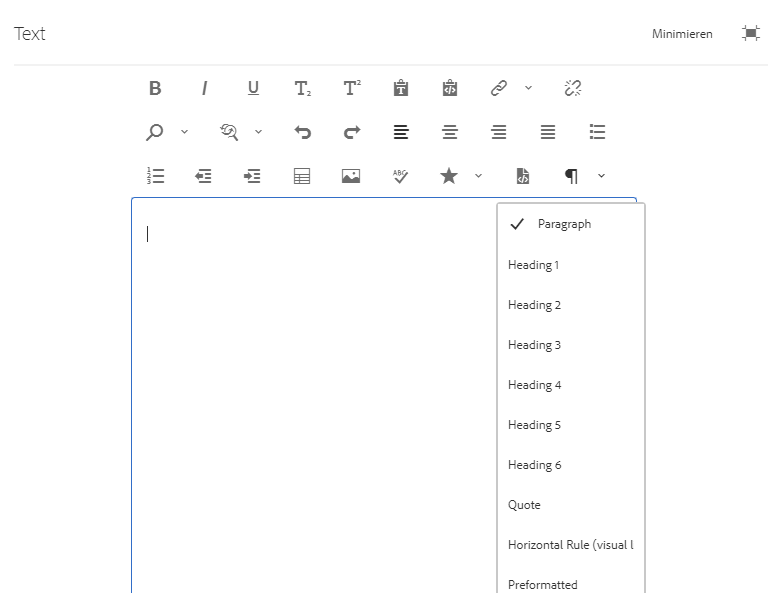

# Konfigurieren des RTE für barrierefreie Websites {#configure-rte-accessible-sites}

[!DNL Adobe Experience Manager] unterstützt standardmäßige Barrierefreiheitsfunktionen wie alternativen Text für Bilder und zusätzliche Funktionen, auf die beim Erstellen von Inhalten zugegriffen werden kann. Inhaltsautoren verwenden diese Funktionen zusammen mit Komponenten, die den Rich-Text-Editor (RTE) verwenden. Dazu gehören alternativer Text, Strukturinformationen über Überschriften und Absatzelemente usw.

Informationen zu den typischen Konfigurationen von RTE finden Sie unter [Konfigurieren von RTE-Plug-ins](rich-text-editor.md) und [Konfigurieren von RTE-Plug-ins für bestimmte Funktionen](configure-rich-text-editor-plug-ins.md).

Verwenden Sie die RTE-Plug-in-Konfiguration, um die Funktionen zur Barrierefreiheit zu konfigurieren und anzupassen. Verwenden Sie zum Beispiel `paraformat`, um semantische Blockebenenelemente hinzuzufügen, einschließlich der Erweiterung der Zahl von Überschriftenebenen, die über die standardmäßigen Ebenen `H1`, `H2` und `H3` hinausgeht. Die Bearbeitung von Rich-Text ist mit vielen Komponenten der Authoring-Benutzeroberfläche möglich. Die am häufigsten verwendeten Komponenten sind Text, Bild, Download usw.

Die RTE-Funktion kann in vielen Komponenten zur Verfügung gestellt werden. Die primäre Komponente ist die `Text`-Komponente.

Für die `Text`-Komponente in [!DNL Experience Manager] zeigt der folgende Screenshot den Rich-Text-Editor mit einer Reihe von aktivierten Plug-ins, darunter `paraformat`:



## Konfigurieren der Plug-in-Funktionen {#configuring-the-plugin-features}

Anweisungen zum Konfigurieren von RTE finden Sie auf der Seite [Konfigurieren des Rich-Text-Editors](rich-text-editor.md). Der Artikel umfasst:

* [Plug-ins und ihre Funktionen](rich-text-editor.md#aboutplugins)
* [Konfigurations-Speicherorte](rich-text-editor.md#understand-the-configuration-paths-and-locations)
* [Aktivieren von Plug-ins und Konfigurieren der Eigenschaft „features“](rich-text-editor.md#enable-rte-functionalities-by-activating-plug-ins)
* [Konfigurieren anderer RTE-Funktionen](rich-text-editor.md#enable-rte-functionalities-by-activating-plug-ins)

Um einige oder alle Funktionen eines Plug-ins zu aktivieren, konfigurieren Sie das Plug-in in der entsprechenden `rtePlugins`-Unterverzweigung in CRXDE Lite.


### Beispiel – Angeben von im RTE-Auswahlfeld verfügbaren Absatzformaten {#example-specifying-paragraph-formats-available-in-rte-selection-field}

Es stehen neue semantische Blockformate als Auswahl zur Verfügung.

1. Legen Sie den [Konfigurationsspeicherort](rich-text-editor.md#understand-the-configuration-paths-and-locations) abhängig von Ihrem RTE fest und navigieren Sie dorthin.
1. [Aktivieren Sie das Absatzauswahlfeld](rich-text-editor.md) durch die [Aktivierung des Plug-ins](rich-text-editor.md#enable-rte-functionalities-by-activating-plug-ins).
1. [Geben Sie die Formate an, die Sie im Absatzauswahlfeld zur Verfügung haben möchten](rich-text-editor.md).
1. Die Absatzformate sind dann für den Autor der Inhalte aus den Auswahlfeldern im RTE verfügbar.

Mit Strukturelementen, die im RTE über die Absatzformatoptionen verfügbar sind, stellt [!DNL Experience Manager] eine gute Grundlage für die Entwicklung barrierefreier Inhalte bereit. Inhaltsautoren können den RTE für die Formatierung der Schriftgröße, der Farben oder anderer verwandter Attribute verwenden und dadurch die Erstellung einer Inline-Formatierung verhindern. Stattdessen können die Autoren die entsprechenden Strukturelemente auswählen, z. B. Überschriften, und globale Stile verwenden, die über die Option „Stile“ ausgewählt wurden, um ein sauberes Markup und bessere Optionen für Benutzer sicherzustellen, die mit ihren eigenen Stylesheets und korrekt strukturierten Inhalten im Internet surfen.

## Verwenden der Funktion „Quellenbearbeitung“ {#use-of-the-source-edit-feature}

In einigen Fällen halten Inhaltsautoren es für erforderlich, den mithilfe des RTE erstellten HTML-Quell-Code zu untersuchen und anzupassen. So kann beispielsweise ein innerhalb des RTE erstellter Inhalt zusätzliches Markup erfordern, um die Befolgung des WCAG 2.0 sicherzustellen. Dies lässt sich mit der Option [Quellenbearbeitung](rich-text-editor.md#aboutplugins) des RTE umsetzen. Sie können die Funktion [`sourceedit` im Plug-in `misctools` angeben](rich-text-editor.md#aboutplugins).

>[!CAUTION]
>
>Gehen Sie beim Verwenden der Funktion `sourceedit` sorgfältig vor. Tippfehler und nicht unterstützte Funktionen können Probleme verursachen.

<!--
TBD ENGREVIEW: Is this only applicable to Classic UI? 

## Adding Support for further HTML Elements and Attributes {#adding-support-for-additional-html-elements-and-attributes}

To further extend the accessibility features of [!DNL Experience Manager], it is possible to extend the existing components based on the RTE (such as the `Text` and `Table` components) with extra elements and attributes.

The following procedure illustrates how to extend the `Table` component with a `Caption` element that provides information about a data table to assistive technology users:

### Example: Add a caption to a table properties dialog {#example-adding-the-caption-to-the-table-properties-dialog}

In the constructor of the `TablePropertiesDialog`, add an extra text input field that is used for editing the caption. Set the `itemId` to `caption` (the DOM attribute’s name) to automatically handle its content.

In a `Table`, set the attribute to the DOM element or or remove it from the DOM element. The dialog in the `config` object passed the value. Set or remove the DOM attributes using the corresponding `CQ.form.rte.Common` methods (`com` is a shortcut for `CQ.form.rte.Common`). Using `CQ.form.rte.Common` methods avoids common pitfalls with browser implementations.

>[!NOTE]
>
>This procedure is only suitable for the classic UI.

### Step-by-step instructions {#step-by-step-instructions}

1. Start CRXDE Lite. For example: [http://localhost:4502/crx/de/](http://localhost:4502/crx/de/)

1. Copy `/libs/cq/ui/widgets/source/widgets/form/rte/commands/Table.js` to `/apps/cq/ui/widgets/source/widgets/form/rte/commands/Table.js`. Create intermediate folders if those do not exist.

1. Copy `/libs/cq/ui/widgets/source/widgets/form/rte/plugins/TablePropertiesDialog.js` to `/apps/cq/ui/widgets/source/widgets/form/rte/plugins/TablePropertiesDialog.js`.

1. Open `/apps/cq/ui/widgets/source/widgets/form/rte/plugins/TablePropertiesDialog.js` file to edit.

1. In the `constructor` method, before the mention of `var dialogRef = this;`, add the following code:

   ```javascript
   editItems.push({
       "itemId": "caption",
       "name": "caption",
       "xtype": "textfield",
       "fieldLabel": CQ.I18n.getMessage("Caption"),
       "value": (this.table && this.table.caption ? this.table.caption.textContent : "")
   });
   ```

1. Open `/apps/cq/ui/widgets/source/widgets/form/rte/commands/Table.js` file.

1. Add the following code at the end of the `transferConfigToTable` method:

   ```javascript
   /**
    * Adds Caption Element
   */
   var captionElement;
   if (dom.firstChild && dom.firstChild.tagName.toLowerCase() == "caption")
   {
      captionElement = dom.firstChild;
   }
   if (config.caption)
   {
       var captionTextNode = document.createTextNode(config.caption)
       if (captionElement)
       {
          dom.replaceNode(captionElement.firstChild,captionTextNode);
       } else
       {
           captionElement = document.createElement("caption");
           captionElement.appendChild(captionTextNode);
           if (dom.childNodes.length>0)
           {
              dom.insertBefore(captionElement, dom.firstChild);
           } else
           {
              dom.appendChild(captionElement);
           }
       }
   } else if (captionElement)
   {
     dom.removeChild(captionElement);
   }
   ```

1. To save your changes, click **[!UICONTROL Save All]**.

## Best practices and limitations {#best-practices-limitations-tips}

* A plain text field is not the only type of input allowed for the value of the caption element. You can use any ExtJS widget, that provides the caption’s value through its `getValue()` method.
* To add editing capabilities for more elements and attributes, ensure that:

  * The `itemId` property for each corresponding field is set to the name of the appropriate DOM attribute (`TablePropertiesDialog`).
  * The attribute is set and/or removed on the DOM element explicitly (`Table`).
-->

>[!MORELIKETHIS]
>
>* [Kurzanleitung zu WCAG-Standards](/help/compliance/accessibility/quick-guide-wcag.md)
>* [Erstellen barrierefreier Inhalte in Experience Manager](/help/sites-cloud/authoring/page-editor/accessible-content.md)
